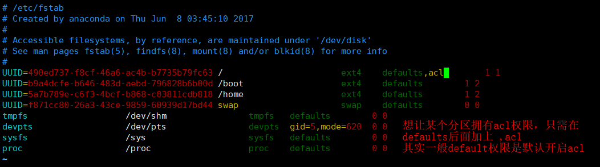

#command/acl

# CL

ACL的全称是 Access Control List (访问控制列表) ，一个针对文件/目录的访问控制列表。它在[UGO权限管理](https://www.wolai.com/o5aapRHJWo4z4hbzJJbexM "UGO权限管理")的基础上为文件系统提供一个额外的、更灵活的权限管理机制。它被设计为UNIX文件权限管理的一个补充。如果希望**对指定用户进行单独的权限控制**，此时我们要使用的就是访问控制列表了，也就是Linux中的ACL。

特别注意的是，如果针对目录设置了ACL，那么目录中的文件会继承其ACL

## 查看acl是否开启

由于ACL绑定在分区上，所以需要查看分区信息。

```bash
# 查看分区类型和信息
df -Th
# 分区类型为ext的调用 dumpe2fs /dev/sda 查看文件系统的详细信息
# 分区类型为xfs的调用 xfs_info /dev/sda (xfs、centOS7都是默认开通ACL的)
# 查看分区是否开启acl (Centos7/xfs分区类型默认启用acl)
dumpe2fs /dev/sda
```

## 开启acl

`vim /etc/fstab`



## 权限设置

```bash
# 查看ACL权限
getfacle [dir]
# 设置ACL权限
setfacle [options] [dir]
setfacle -m u:test:rw /test
- m：设定 ACL 权限。如果是给予用户 ACL 权限，则使用"u:用户名:权限"格式赋予；如果是给予组 ACL 权限，则使用"g:组名:权限" 格式赋予；
- x：删除指定的 ACL 权限；
- b：删除所有的 ACL 权限；
- d：设定默认 ACL 权限。如果给父目录设定了默认的 ACL 权限，那么父目录中所有新建的子文件会继承父目录的 ACL 权限。
- k：删除默认 ACL 权限；
- R：递归设定 ACL 权限。指设定的 ACL 权限会对目录下的所有子文件生效；


```

***

# SUDO

作用：以其他身份来执行命令  【su : 切换到其他用户】

我们知道，使用 su 命令可以让普通用户切换到 root 身份去执行某些特权命令，但存在一些问题，比如说： &#x20;

*   仅仅为了一个特权操作就直接赋予普通用户控制系统的完整权限；

*   当多人使用同一台主机时，如果大家都要使用 su 命令切换到 root 身份，那势必就需要 root 的密码，这就导致很多人都知道 root 的密码；

相对于使用 su 命令还需要新切换用户的密码，sudo 命令的运行只需要知道自己的密码即可，甚至于，我们可以通过手动修改 sudo 的配置文件，使其无需任何密码即可运行。

## visudo命令

sudo：可以让普通用户拥有root权限去执行命令，sudo的配置文件是/etc/sudoers。
visudo：通过visudo编辑/etc/sudoers，可以检查语法。

```bash
# /etc/sudoers的格式
# useralias(用户名) hostalias(可以从哪些机器登陆) = (用户:用户组) "以什么用户，什么组" cmndalias "执行什么命令"
test ALL = (ALL) NOPASSWD:ALL
# test用户可以从任何主机登陆，并且可以用sudo -u 用户 不用输入密码执行任何命令
%test ALL = (ALL) PASSWD:ALL,!/sbin/fdisk
# test组可以从任何主机登陆，并且可以用sudo -u 用户 输入test用户密码执行任何命令，但是不能呢个执行/sbin/fdisk这个命令
# %表示用户组，！表示禁止执行。


```

## sudo命令

```bash
sudo [options] [parameter]
sudo -b -u systemctl stop firewalld
-b：在后台执行指令；
-E：继承当前环境变量
-h：显示帮助；
-H：将HOME环境变量设为新身份的HOME环境变量；
-k：结束密码的有效期限，也就是下次再执行sudo时便需要输入密码；。
-l：列出目前用户可执行与无法执行的指令；
-p：改变询问密码的提示符号；
-s<shell>：执行指定的shell；
-u<用户>：以指定的用户作为新的身份。若不加上此参数，则预设以root作为新的身份；
-v：延长密码有效期限5分钟；
-V ：显示版本信息。
```

sudo 默认在输入一次密码后 15 分钟内不会再次要求密码。15 分钟后，你会再次被要求输入密码。然而，如果你想的话，你能改变这种现象,使用visudo命令。

```bash
# 找到这一行
Defaults    env_reset
# 设置sudo超时时长为5min，设置=0表示每次使用sudo都需要输入当前用户密码。
Defaults    env_reset, timestamp_timeout=5

```


# chattr命令
Linux chattr命令用于改变文件属性。

这项指令可改变存放在ext2文件系统上的文件或目录属性，这些属性共有以下8种模式：

```bash
chattr [-RV][-v<版本编号>][+/-/=<属性>][文件或目录...]

### 参数
-R                     # 递归处理，将指定目录下的所有文件及子目录一并处理。
-v<版本编号>   # 设置文件或目录版本。
-V                    # 显示指令执行过程。
+<属性>          # 开启文件或目录的该项属性。
-<属性>           # 关闭文件或目录的该项属性。
=<属性>          # 指定文件或目录的该项属性。

### 属性
a：    # 让文件或目录仅供附加用途。
b：   # 不更新文件或目录的最后存取时间。
c：    # 将文件或目录压缩后存放。
d：    # 将文件或目录排除在倾倒操作之外。
i：    # 不得任意更动文件或目录。
s：    # 保密性删除文件或目录。
S：   # 即时更新文件或目录。
u：   # 预防意外删除。
```

***

# 粘贴位

## SUID

> 以文件的所属用户执行，而非执行文件的用户，多用于可执行文件，设置suid后，在权限位中，所属用户的最后一个权限为变为s，添加SUID权限可用“+s”表示。

```text
1.SUID只对二进制文件有效
2.调用者对该文件有执行权
3.在执行过程中，调用者会暂时获得该文件的所有者权限
4.该权限只在程序执行的过程中有效
```

**设置suid**

```bash
chmod u+s xxxx
# 测试
cp /usr/bin/mkdir /usr/bin/mkdir2
chmod u+s /opt/mymkdir
su - test
mkdir  test
mkdir2 test2
# 查看结果
drwxrwxr-x 2 test test  6 4月  21 19:13 test
drwxrwxr-x 2 root test  6 4月  21 19:13 test2

```

## SGID

> 与 SUID 不同的是，SGID 既可以对文件进行配置，也可以对目录进行配置。

**SetGID（SGID）对文件的作用**

```text
1.SGID 只对二进制文件有效
2.调用者对该文件有执行权
3.在执行过程中，调用者会暂时获得该文件的所属组的权限
4.该权限只在程序执行的过程中有效
其实，SGID 和 SUID 的不同之处就在于，SUID 赋予用户的是文件所有者的权限，而 SGID 赋予用户的是文件所属组的权限，就这么简单。
```

**设置guid**

```bash
chmod g+s xxxx
# 测试
cp /usr/bin/mkdir /usr/bin/mkdir2
chmod u+s /opt/mymkdir
su - test
mkdir  test
mkdir2 test2
# 查看结果
drwxrwxr-x 2 test test  6 4月  21 19:14 test
drwxrwxr-x 2 test root  6 4月  21 19:14 test2

```

**SetGID（SGID）对目录的作用**

当一个目录被赋予 SGID 权限后，进入此目录的普通用户，其有效群组会变为该目录的所属组，会就使得用户在创建文件（或目录）时，该文件（或目录）的所属组将不再是用户的所属组，而使用的是目录的所属组。 &#x20;

也就是说，只有当普通用户对具有 SGID 权限的目录有 rwx 权限时，SGID 的功能才能完全发挥。比如说，如果**用户对该目录仅有 rx 权限**，则用户进入此目录后，虽然其有效群组变为此目录的所属组，**但由于没有 x 权限，用户无法在目录中创建文件或目录**，**SGID 权限也就无法发挥它的作用**。

## SBIT

**SBIT权限仅对目录有效**，一旦目录设定了 SBIT 权限，则用户在此目录下创建的文件或目录，就只有自己和 root 才有权利修改或删除该文件。

也就是说，当甲用户以目录所属组或其他人的身份进入 A 目录时，如果甲对该目录有 w 权限，则表示对于 A 目录中任何用户创建的文件或子目录，甲都可以进行修改甚至删除等操作。但是，**如果 A 目录设定有 SBIT 权限**，那就大不一样啦，**甲用户只能操作自己创建的文件或目录**，而无法修改甚至删除其他用户创建的文件或目录。

举个例子，Linux 系统中，存储临时文件的 /tmp 目录就设定有 SBIT 权限：

```bash
[root@localhost ~]# ll -d /tmp  
drwxrwxrwt. 4 root root 4096 Apr 19 06:17 /tmp
```

可以看到，在其他人身份的权限设定中，原来的 x 权限位被 t 权限占用了，这就表示此目录拥有 SBIT 权限
