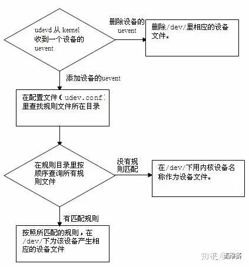

Linux  用户常常会很难鉴别同一类型的设备名，比如 eth0, eth1, sda, sdb  等等。通过观察这些设备的内核设备名称，用户通常能知道这些是什么类型的设备，但是不知道哪一个设备是他们想要的。例如，在一个充斥着本地磁盘和光纤磁盘的设备名清单  (/dev/sd*) 中，用户无法找到一个序列号为“35000c50000a7ef67”的磁盘。在这种情况下，udev 就能动态地在  /dev目录里产生自己想要的、标识性强的设备文件或者设备链接，以此帮助用户方便快捷地找到所需的设备文件。

udev是一个设备管理工具，udev以守护进程的形式运行，通过侦听内核发出来的uevent来管理/dev目录下的设备文件。udev在用户空间运行，而不在内核空间 运行。它能够根据系统中的硬件设备的状态动态更新设备文件，包括设备文件的创建，删除等。设备文件通常放在/dev目录下。使用udev后，在/dev目录下就只包含系统中真正存在的设备。

## udev的配置文件

主要的udev配置文件是/etc/udev/udev.conf文件。

```bash
# udev_root：代表着设备文件添加到哪。
udev_root="/dev/"

# udev_rules：代表着udev的规则存储的目录。这个目录存储的是以.rules结束的文件。每一个文件处理一系列规则来帮助udev分配名字给设备文件以保证能被内核识别。你的/etc/udev/rules.d下面可能有好几个udev规则文件，这些文件一部分是udev包安装的，另外一部分则是可能是别的硬件或者软件包生成的。该目录下有多个文件时，udev读取文件是按照文件名的ASCII字母顺序来读取的，如果udev一旦找到了与新加入的设备匹配的规则，udev 就会根据规则定义的措施对新设备进行配置。同时不再读后续的规则文件。
udev_rules="/etc/udev/rules.d/
"
# udev_log：代表着udev的日志级别，用syslog记录错误信息。
udev_log="err"
```

‍

## udev的工作流程图



## udev的匹配规则

在/etc/udev/rules.d/文件夹下有一系列的.rules文件，在这些文件中有一些匹配规则：  
**udev规则的所有操作符：**

```bash

“==”   比较键、值，若等于，则该条件满足；
“!=”   比较键、值，若不等于，则该条件满足；
“=”    对一个键赋值；
“+=”   为一个表示多个条目的键赋值。
“:=”   对一个键赋值，并拒绝之后所有对该键的改动。目的是防止后面的规则文件对该键赋值。
```

**udev规则的匹配键：**

```bash

ACTION     事件(uevent)的行为，例如：add(添加设备)、remove(删除设备)。
KERNEL     内核设备名称，例如：sda,cdrom。
DEVPATH    设备的devpath路径。
SUBSYSTEM  设备的子系统名称，例如：sda的子系统为block。
BUS        设备在devpath 里的总线名称，例如：usb。
DRIVER     设备在devpath 里的设备驱动名称，例如：ide-cdrom。
ID         设备在devpath 里的识别号。
SYSFS{filename} 设备的devpath 路径下，设备的属性文件“filename”里的内容。
# 例如：SYSFS{model}==“ST936701SS”表示：如果设备的型号为ST936701SS，则该设备匹配该匹配键。
# 在一条规则中，可以设定最多五条SYSFS的匹配键。
ENV{key}   环境变量。在一条规则中，可以设定最多五条环境变量的匹配键。
PROGRAM    调用外部命令。
RESULT     外部命令PROGRAM 的返回结果。例如：
PROGRAM=="/lib/udev/scsi_id-g -s $devpath", RESULT==“35000c50000a7ef67”
#调用外部命令/lib/udev/scsi_id查询设备的SCSIID，如果返回结果为35000c50000a7ef67，则该设备匹配该匹配键。
```

## udev的使用方法

使用udevadm 命令来查看设备的信息

```bash
#语法格式：
udevadm info [参数]

#常用参数：
-p	  查询系统设备的路径
-r	  查询dev目录路径名
-q	  查询指定类型的设备信息


#=================================================
# 查询/dev/sda设备的系统设备路径：
udevadm info -q path -n /dev/sda
# 查询/dev/sda设备的符号链接文件
udevadm info -q sysmlink -n /dev/sda 
# 查询/dev/sda设备的所有的值
udevadm info -q all -n /dev/sda
```

编写.rules文件的规则

```bash
# 进入/etc/udev/rules.d文件夹：
cd /etc/udev/rules.d

# 新建文件10-usb.rules
vi 10-usb.rules

# 在10-usb.rules文件中输入
KERNEL=="sdb",SUBSYSTEM=="block",ACTION=="add",SYMLINK+="USB_link"

```

使得udev文件生效的方法

通常，使得配置后的文件生效，需要采用热插拔的方法更新udev规则，不过有更简单的方法如下：

```bash
udevadm test /sys/class/block/sdb
```
