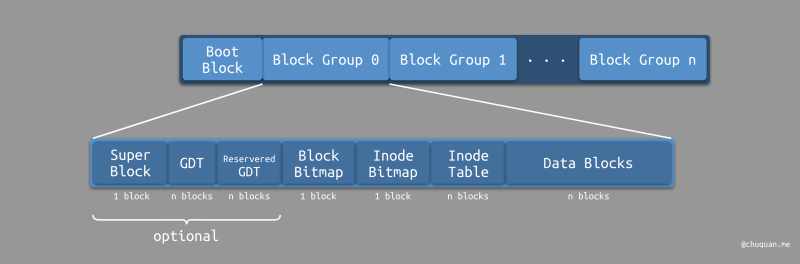
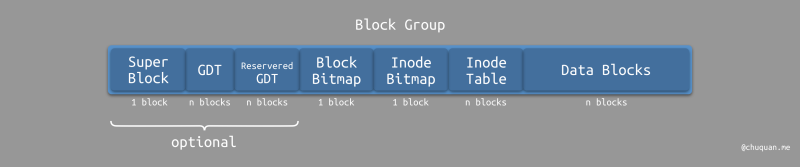
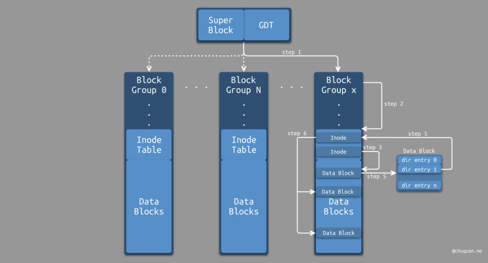

# 硬盘格式化

我们知道，一个硬盘必须要经过格式化之后才能使用。那么，格式化到底做了什么呢？本质上，硬盘格式化可以分为两个步骤，分别是：

- **低级格式化** ，或称 **物理格式化** 。
- **高级格式化** ，或称 **逻辑格式化** 。

## 低级格式化

在[计算机那些事(1)——硬盘](计算机那些事(1)——硬盘.md)一文中，我们介绍了硬盘的两种寻址方式，分别是：

- **CHS寻址方式** ：由柱面数（Cylinders）、磁头数（Headers）、扇区数（Sectors）组成3D 参数，简称 CHS 寻址方式，硬盘容量相对较小。如传统的机械硬盘（HardDisk Drive，HDD）。
- **LBA寻址方式** ：线性寻址，以逻辑区块为单位进行寻址，全称为 LogicBlock Address（即扇区的逻辑块地址），硬盘容量相对较大。如固态硬盘（SolidState Disk，SSD）

对于 CHS硬盘，低级格式化会对硬盘进行划分柱面、磁道、扇区的操作，也称为 **扇区初始化** 。一般由硬盘制造商进行低级格式化。

对于 LBA 硬盘，并不存在低级格式化，因为 LBA寻址的硬盘使用集成电路替代物理旋转磁盘，主要由主控和闪存芯片组成。低级格式化完成后，硬盘控制器即可使用格式化的结果。

## 高级格式化

相对而言，低级格式化是在硬件层面进行初始化，而高级格式化则是在软件层面进行初始化。高级格式化一般会有两个步骤：

- **硬盘分区初始化** ：在硬盘的特定区域写入特定的数据，即重写分区表。关于硬盘分区的细节，可以阅读[计算机那些事(1)——硬盘](计算机那些事(1)——硬盘.md)。
- **文件系统初始化** ：根据用户选定的文件系统（如：FAT、NTFS、EXT2、EXT3等），在特定分区中规划一系列表结构进行逻辑区块管理等。

通常，一个硬盘可以被划分为多个分区。传统的硬盘，每个分区只能初始化一种文件系统。现代的 LVM 与 RAID 技术则能够支持将一个分区格式化为多个文件系统，也支持将多个分区合并成一个文件系统。

## 软硬件映射

在硬件层面，对于 CHS 硬盘，最小的物理存储单元是扇区，大小为 512 byte；对于 LBA 硬盘，最小的物理存储单元是闪存（本质是晶体管），大小为 1bit。

在软件层面，为了与操作系统的页大小对齐，文件系统定义的逻辑区块大小一般为  
1K、2K 或 4K。

下图所示，为文件系统逻辑区块与硬盘物理区块之间的映射关系。对于 CHS 硬盘，一个逻辑区块所对应的物理区块可能由多个扇区组成。对于 LBA硬盘，一个逻辑区块则对应一片集成电路存储单元。在通信时，首先由文件系统的 I/O管理器将逻辑区块转换成物理区块地址，然后由硬盘控制器根据物理区块（扇区）地址，进行数据读写。


# 文件系统类型

常见的文件系统类型非常多，比如：

- CentOS 5/6 默认使用 ext2/ext3/ext4
- CentOS 7 默认使用 xfs
- Windows 默认使用 NTFS
- MacOS、iOS、watchOS 默认使用 APFS（曾经使用 HFS）

虽然文件系统的种类很多，但是它们的底层实现大同小异。本文，我们来聊一聊Linux 系统下的默认文件系统——Ext文件系统族，举一反三，从而来理解文件系统的底层设计。

# 文件系统结构

以 Linux 经典的 Ext2 文件系统进行分析，其整体结构如下图所示。



从宏观角度来看，文件系统将硬盘分为两部分：

- **引导区块（Boot Block）**
- **区块组（Block Groups）**

## Boot Block

引导区块是分区的第一个区块，当然，并不是所有分区都有引导区块，只有安装了操作系统的主分区和逻辑分区才有引导区块。引导区块存储了 Boot Loader，当系统加电启动时，Boot Loader会被引导装载并执行，从而最终启动操作系统。

## Block Groups

文件系统的另一主要组成是区块组，ext2文件系统包含多个区块组，那么为什么要划分那么多区块组呢？事实上，如果直接管理逻辑区块，逻辑区块的数量是非常庞大的，难以管理，因此为了简化，划分出了区块组，从而进行分级管理。



上图所示，区块组内部又可以分成多个部分，分别是：

- **超级区块（Super Block）**
- **组描述符表（Group Descriptor Table，GDT）**
- **区块位图（Block Bitmap）**
- **索引节点位图（Inode Bitmap）**
- **索引节点表（Inode Table）**
- **数据区块（Data Blocks）**

> 注意  
> **区块组的 “区块”对应的文件系统的逻辑区块。区块组中的各个组成部分都使用 “区块”作为载体进行存储** 。

下面，我们将分别介绍区块组的各个组成部分。

# Block & Inode

在介绍区块组的各个组成部分之前，我们先来了解一下 Block 和 Inode。

## Block

Block 主要用于 **存储文件的内容数据** 。不同大小的 Block使得文件系统能够支持的最大容量和最大单一文件大小各不相同，其限制如下所示：

|Block size|1KB|2KB|4KB|
| ------------------| ------| -------| ------|
|最大单一文件限制|16GB|256GB|2TB|
|最大文件系统容量|2TB|8TB|16TB|

Block 有一些基本限制，如下：

- Block 的大小和数量在格式化后无法改变。
- 一个 Block 只能存放一个文件的数据。
- 如果文件大于 Block 的大小，则一个文件会占用多个 Block。
- 如果文件小于 Block 的大小，则 Block中多余的容量将无法再被使用。

## Inode

上述，我们提到了一个大文件会占用多个Block，那么，文件系统是如何判断哪些 Block是属于同一个文件的呢？答案就是索引节点（index node，inode）。

Inode 主要用于 **存储文件的属性元数据** ，其记录的信息包括：

- 文件的类型
- 文件的权限：read/write/execute
- 文件的拥有者：owner
- 文件的群组：group
- 文件的容量
- 文件的创建时间：ctime
- 文件的最近读取时间：atime
- 文件的最近修改时间：mtime
- 文件的内容指针： **即指向属于文件的 Block 的指针**
- ...

> 注意 Inode 并不包含文件名，文件名则存储在 **目录项** 中，详细信息可见下文。

根据 inode 中存储的文件内容指针，文件系统就能找到哪些 Block是属于该文件的。

在高级格式化时，inode 的数量和大小就已经固定下来了，其大小一般为 128byte 或 256 byte。同样，inode 也有一些基本限制，如下：

- 一个文件只会占用一个 inode。
- 文件系统支持的最大文件数量与 inode 的相关。
- 文件系统读取文件时，判断对应 inode  
  的权限与使用者是否符合，如果符合才能读取 Block 的数据。

如下所示为 ext2 中 inode 的数据结构定义。 **注意，inode的定义并没有 inode id，那么这种情况下如何索引 inode呢** ？关于这个问题，我们在 Inode Table 一节进行解释。

```golang
/* linux/fs/ext2/ext2.h */
struct ext2_inode {
	__le16	i_mode;		            /* File mode */
	__le16	i_uid;	            	/* Low 16 bits of Owner Uid */
	__le32	i_size;		            /* Size in bytes */
	__le32	i_atime;	            /* Access time */
	__le32	i_ctime;	            /* Creation time */
	__le32	i_mtime;	            /* Modification time */
	__le32	i_dtime;	            /* Deletion Time */
	__le16	i_gid;		            /* Low 16 bits of Group Id */
	__le16	i_links_count;	        /* Links count */
	__le32	i_blocks;	            /* Blocks count */
	__le32	i_flags;	            /* File flags */
	union {
		struct {
			__le32  l_i_reserved1;
		} linux1;
		struct {
			__le32  h_i_translator;
		} hurd1;
		struct {
			__le32  m_i_reserved1;
		} masix1;
	} osd1;				            /* OS dependent 1 */
	__le32	i_block[EXT2_N_BLOCKS]; /* Pointers to blocks */
	__le32	i_generation;	        /* File version (for NFS) */
	__le32	i_file_acl;	            /* File ACL */
	__le32	i_dir_acl;	            /* Directory ACL */
	__le32	i_faddr;	            /* Fragment address */
	union {
		struct {
			__u8	l_i_frag;	    /* Fragment number */
			__u8	l_i_fsize;	    /* Fragment size */
			__u16	i_pad1;
			__le16	l_i_uid_high;	/* these 2 fields    */
			__le16	l_i_gid_high;	/* were reserved2[0] */
			__u32	l_i_reserved2;
		} linux2;
		struct {
			__u8	h_i_frag;	    /* Fragment number */
			__u8	h_i_fsize;	    /* Fragment size */
			__le16	h_i_mode_high;
			__le16	h_i_uid_high;
			__le16	h_i_gid_high;
			__le32	h_i_author;
		} hurd2;
		struct {
			__u8	m_i_frag;	    /* Fragment number */
			__u8	m_i_fsize;	    /* Fragment size */
			__u16	m_pad1;
			__u32	m_i_reserved2[2];
		} masix2;
	} osd2;				            /* OS dependent 2 */
};
```

### 文件系统预留 Inode

Ext 文件系统预留了一部分 Inode 作为特殊用途，如下所示。

|Inode|用途|
| -------| ----------------------------------------------------|
|0|不存在，可用于标识目录的 Data Block 中已删除的文件|
|1|虚拟文件系统，如：`/proc`​、`/sys`​|
|2|根目录|
|3|ACL 索引|
|4|ACL 数据|
|5|Boot Loader|
|6|未删除的目录|
|7|预留的区块组描述符 Inode|
|8|日志 Inode|
|11|第一个非预留的 Inode，通常是`lost+fount`​目录|

# 区块组结构

## Data Blocks

Data Blocks 包含了区块组中剩余的所有 Block。Block的数量在高级格式化完成后就已经确定下来了。

## Block Bitmap

Block Bitmap 用于标识区块组中所有的 Block 的使用状态，其使用 1 bit来表示：0 表示空闲，1 表示占用。

区块组使用一个 Block 存储 Block Bitmap。如果 Block 的大小为4K，那么其总共有 4 x 1024 x 8 = 32768 个比特位，可用于描述可使用的Block。

注意，Block Bitmap 只在写数据时使用，因为只有写数据才需要找到空闲的Block。

## Inode Table

Inode Table 包含了区块组中所有的 Inode。Inode的数量在高级格式化完成后就已经确定下来了。

如果 Block 的大小为 4K 且 inode 的大小为 256 byte，那么一个 Block可以存储 4 x 1024 / 256 = 16 个 inode。区块组中的 Inode Table通过占用了多个连续的 Block，在逻辑上形成一张表记录了所有inode，如下图所示。


根据上述原理，当给定一个 inode id 时，我们只需要结合 inode数据结构的大小，在这个 Inode Table 中查找到对应项即可找到对应的inode。这也就解释了为什么 inode 没有 inode id 也能找到 inode的原因。

## Inode Bitmap

Inode Bitmap 用于标识区块组中所有的 inode 的使用状态，其使用 1 bit来表示：0 表示空闲，1 表示占用。

区块组使用一个 Block 存储 Inode Bitmap。如果 Block 的大小为4K，那么其总共有 4 x 1024 x 8 = 32768 个比特位，可用于描述可使用的inode。

## Group Descriptor Table

区块组使用组描述符来记录区块组的信息和属性元信息，如：BlockBitmap、Inode Bitmap、Inode Table 等。如下所示为 ext2  
中组描述符的数据结构定义。

```golang
/* linux/fs/ext2/ext2.h */
struct ext2_group_desc {
	__le32	bg_block_bitmap;		/* Blocks bitmap block */
	__le32	bg_inode_bitmap;		/* Inodes bitmap block */
	__le32	bg_inode_table;		    /* Inodes table block */
	__le16	bg_free_blocks_count;	/* Free blocks count */
	__le16	bg_free_inodes_count;	/* Free inodes count */
	__le16	bg_used_dirs_count;	    /* Directories count */
	__le16	bg_pad;
	__le32	bg_reserved[3];
};
```

区块组使用连续的 Block记录了文件系统中所有区块组的组描述符，从而在逻辑上形成一张表，即 Group Descriptor Table（简称 GDT），如下图所示。


这里会有一个疑问，为什么区块组中存储了一个描述整个文件系统区块组的信息？很多区块组都存储了内容重复的GDT，这样是否会造成存储空间的浪费？其实这么做的原因是为了进行 **备份** ，如果只在某片区域存储这部分信息，一旦这片存储区域出现了损坏，那么将导致整个文件系统无法使用并且无法恢复。

## Super Block

类似于 GDT，Super Block也是一个描述文件系统整体的数据结构，其存储在区块组中也是为了备份。

**Super Block 是文件系统的核心** ，其保存了 **文件系统的所有元数据** ，比如：

- Block 和 Inode 的总量
- 空闲/占用的 Block 和 Inode 的数量
- Block 和 Inode 的大小
- 文件系统的挂载时间
- 文件系统的最近写入时间
- ...

如下所示为 ext2 中 Super Block 的数据结构定义。

```golang
/* linux/fs/ext2/ext2.h */
struct ext2_super_block {
	__le32	s_inodes_count;		                /* Inodes count */
	__le32	s_blocks_count;		                /* Blocks count */
	__le32	s_r_blocks_count;	                /* Reserved blocks count */
	__le32	s_free_blocks_count;	            /* Free blocks count */
	__le32	s_free_inodes_count;	            /* Free inodes count */
	__le32	s_first_data_block;	                /* First Data Block */
	__le32	s_log_block_size;	                /* Block size */
	__le32	s_log_frag_size;	                /* Fragment size */
	__le32	s_blocks_per_group;	                /* # Blocks per group */
	__le32	s_frags_per_group;	                /* # Fragments per group */
	__le32	s_inodes_per_group;	                /* # Inodes per group */
	__le32	s_mtime;		                    /* Mount time */
	__le32	s_wtime;		                    /* Write time */
	__le16	s_mnt_count;		                /* Mount count */
	__le16	s_max_mnt_count;	                /* Maximal mount count */
	__le16	s_magic;		                    /* Magic signature */
	__le16	s_state;		                    /* File system state */
	__le16	s_errors;		                    /* Behaviour when detecting errors */
	__le16	s_minor_rev_level; 	                /* minor revision level */
	__le32	s_lastcheck;		                /* time of last check */
	__le32	s_checkinterval;	                /* max. time between checks */
	__le32	s_creator_os;		                /* OS */
	__le32	s_rev_level;		                /* Revision level */
	__le16	s_def_resuid;		                /* Default uid for reserved blocks */
	__le16	s_def_resgid;		                /* Default gid for reserved blocks */
	/*
	 * These fields are for EXT2_DYNAMIC_REV superblocks only.
	 *
	 * Note: the difference between the compatible feature set and
	 * the incompatible feature set is that if there is a bit set
	 * in the incompatible feature set that the kernel doesn't
	 * know about, it should refuse to mount the filesystem.
	 * 
	 * e2fsck's requirements are more strict; if it doesn't know
	 * about a feature in either the compatible or incompatible
	 * feature set, it must abort and not try to meddle with
	 * things it doesn't understand...
	 */
	__le32	s_first_ino; 		                /* First non-reserved inode */
	__le16  s_inode_size; 		                /* size of inode structure */
	__le16	s_block_group_nr; 	                /* block group # of this superblock */
	__le32	s_feature_compat; 	                /* compatible feature set */
	__le32	s_feature_incompat; 	            /* incompatible feature set */
	__le32	s_feature_ro_compat; 	            /* readonly-compatible feature set */
	__u8	s_uuid[16];		                    /* 128-bit uuid for volume */
	char	s_volume_name[16]; 	                /* volume name */
	char	s_last_mounted[64]; 	            /* directory where last mounted */
	__le32	s_algorithm_usage_bitmap;           /* For compression */
	/*
	 * Performance hints.  Directory preallocation should only
	 * happen if the EXT2_COMPAT_PREALLOC flag is on.
	 */
	__u8	s_prealloc_blocks;	                /* Nr of blocks to try to preallocate*/
	__u8	s_prealloc_dir_blocks;	            /* Nr to preallocate for dirs */
	__u16	s_padding1;
	/*
	 * Journaling support valid if EXT3_FEATURE_COMPAT_HAS_JOURNAL set.
	 */
	__u8	s_journal_uuid[16];	                /* uuid of journal superblock */
	__u32	s_journal_inum;		                /* inode number of journal file */
	__u32	s_journal_dev;		                /* device number of journal file */
	__u32	s_last_orphan;		                /* start of list of inodes to delete */
	__u32	s_hash_seed[4];		                /* HTREE hash seed */
	__u8	s_def_hash_version;	                /* Default hash version to use */
	__u8	s_reserved_char_pad;
	__u16	s_reserved_word_pad;
	__le32	s_default_mount_opts;
 	__le32	s_first_meta_bg; 	                /* First metablock block group */
	__u32	s_reserved[190];	                /* Padding to the end of the block */
};
```

# 文件存储

在了解了文件系统的底层结构之后，我们再来看看不同类型的文件在文件系统中是如何存储的。

## 普通文件存储

在讨论普通文件存储时，我们可以根据普通文件大小分为两种类型：

- 小文件存储：占用 Block 数量小于`EXT2_N_BLOCKS`​
- 大文件存储：占用 Block 数量大于`EXT2_N_BLOCKS`​

对于小文件存储，其基本原理是：根据 inode 的`i_block[]`​数组中保存的 Block 指针（Block 序号），找到对应所有的 Block  
即可，如下所示。


对于大文件存储，由于一个 inode 可引用的 Block 数量的上限是`EXT2_N_BLOCKS`​，因此可以使用 Data Block 存储间接的  
inode，从而扩大最终可引用的 Block 数量，如下所示。


## 目录文件存储

目录文件的 **内容数据** 是由一系列 **目录项** 组成。Ext2文件系统中目录项的数据结构定义如下所示：

```golang
// linux/include/linux/ext2_fs.h
#define EXT2_NAME_LEN 255

// linux/fs/ext2/ext2.h
struct ext2_dir_entry_2 {
	__le32	inode;			/* Inode number */
	__le16	rec_len;		/* Directory entry length */
	__u8	name_len;		/* Name length */
	__u8	file_type;
	char	name[];			/* File name, up to EXT2_NAME_LEN */
};
```

每一个目录项定义了一个文件所对应的 inode序号、目录项长度、文件名长度、文件类型等。关于文件类型，ext2  
定义了以下这些文件类型。

|编码|文件类型|
| ------| ------------------|
|0|Unknown|
|1|Regular File|
|2|Director|
|3|Character Device|
|4|Block Device|
|5|Named Pipe|
|6|Socket|
|7|Symbolic Link|

以一个`test`​目录文件为例，其包含以下这些文件。

```golang
$ ls -la test/
total 20
drwxr-xr-x  3 baochuquan staff       4096 Apr 24 12:12 .
drwxrwxrwt 13 baochuquan staff       8192 Apr 24 12:12 ..
brw-r--r--  1 baochuquan staff     3,   0 Apr 24 12:12 harddisk
lrwxrwxrwx  1 baochuquan staff         14 Apr 24 12:12 linux -> /usr/src/linux
-rw-r--r--  1 baochuquan staff         13 Apr 24 12:12 sample
drwxr-xr-x  2 baochuquan staff       4096 Apr 24 12:12 sources
```

​`test`​目录文件在文件系统中的 **内容数据** 的存储如下所示。


这里需要重点注意是`rec_len`​，`rec_len`​表示 **从当前目录项的**​**​`rec_len`​**​**末尾开始，到下一个目录项的**​**​`rec_len`​**​**末尾结束的偏移量字节数** 。当文件系统从目录文件中删除某一个子目录时，比如`deldir`​目录，这时候并不会删除对应的目录项，仅仅是修改删除项之前目录项的`rec_len`​值，从而使得文件系统在扫描目录内容时，跳过`deldir`​目录项。这也是为什么图中`deldir`​之前的目录项的`rec_len`​为 32。

## 软链接存储

软链接，即符号链接，类似于 Windows操作系统中的快捷方式，它的作用是指向原文件或目录。

软链接一般情况下不占用 Data Block，仅仅通过它对应的 inode完成信息记录，只有当目标路径占用的字符数超过 60  
字节时，文件系统才会分配一个 Data Block 来存储目标路径。

注意，软链接的 Data Block 存储的是 **目标文件名** ，比如：`nox -> /Users/baochuquan/Develop/nox/nox.sh`​中`/Users/baochuquan/Develop/nox/nox.sh`​即目标路径。

## 硬链接存储

通过上文，我们知道目录项存储了 inode序号、文件名等信息。假如，有两个目录项存储了不同的文件名，但它们的 inode  
序号却相同，这会是一种什么样的情况呢？事实上，这就是硬链接，即 inode相同的文件。


与编程语言中的引用计数类似，inode 也是用一个字段`i_links_count`​来记录其被引用的数量。

- 当创建一个文件的硬链接时，对应的 inode 的链接数会加 1；
- 当删除一个文件时，如果对应的 inode 的链接数大于 1时，则仅仅对链接数进行减 1 操作；如果对应的 inode 的链接数等于 1时，则会删除 inode 中的 Block 指针。

### 目录的硬链接数量

在创建目录的同时，文件系统会为它创建两个目录：`.`​和`..`​，分别对应当前目录的硬链接、上级目录的硬链接。因此，每一个目录都会包含这两个硬链接，它包含了两个信息：

- 一个不包含子目录的目录文件，其硬链接数量为 2。其一是目录本身，即目录Data Block 中的`.`​；其二是父级目录 Data Block中该目录的目录项。
- 一个包含子目录的目录文件，其硬链接数量为 2 +子目录数。因为每一个子目录都关联一个父级目录的硬链接`..`​。

文件系统会自动为目录创建硬链接，该权限未对用户开放，用户无法对目录创建硬链接。因此，硬链接只能对文件创建。

# 文件操作

## 文件读取

关于文件读取，可以分为两个部分：首先，找到父级目录中关于目标文件的元信息；然后，根据目标文件的元信息找到目标文件的内容数据。整体可以分为如下几个步骤：

- step 1：根据 Super Block 和 GDT 找到目标文件的父级目录的区块组
- step 2：根据区块组描述符找到区块组中的 Inode Table
- step 3：根据 Inode 序号，从 Inode Table 中找到父级目录的 Inode
- step 4：根据 Inode 找到父级目录 Data Block
- step 5：遍历父级目录的 Data Block中的目录项，找到与目标文件名匹配的目录项
- step 6：根据目录项中的 Inode 序号，找到目标文件的 Data Block



下面，我们以`cat /var/log/message`​命令为例，来介绍一下其具体过程。

文件系统在查找`/var/log/message`​时，会将它转换成 4个类似的步骤，逐步完成。这 4 个阶段分别是：

- 查找根目录`/`​
- 查找`/`​目录下的`var`​子目录
- 查找`/var`​目录下的`log`​子目录
- 查找`/var/log`​目录下的`message`​文件

在详细介绍这 4 个阶段之前，我们需要知道一个前提：在操作系统启动后，操作系统会挂载根文件系统，此时 Super Block 和 GDT会被加载至内存之中。

### 查找根目录

上文，我们提到文件系统预留了一些 inode 序号，其中根目录`/`​的 inode 序号为 2。因此，可以根据 Super Block的参数定位到 inode 所在的区块组，结合 GDT获取到区块组的元信息，即区块描述符。

根据区块描述符，找到对应的 Inode Table，从而定位到具体的inode，并根据`i_blocks[]`​数组，找到对应的 Data Block。此时，我们获取到了根目录`/`​的所有信息。

### 查找`var`​目录

获取到了根目录`/`​的 Data Block之后，我们可以遍历其中的目录项`dir entry`​，找到文件名与`var`​匹配的目录项。根据目录项中的 inode 序号，结合 SuperBlock 和 GDT，依次定位到区块组、Inode Table、Inode、Data Block。此时，我们获取到了`/var`​目录的所有信息。

### 查找`log`​目录

获取到了`/var`​目录的 Data Block之后，我们可以遍历其中的目录项，找到文件名与`log`​匹配的目录项。根据目录项中的 inode 序号，结合 Super Block 和 GDT，与查找`var`​目录一样，也能够定位到区块组、Inode Table、Inode、DataBlock。此时，我们获取到了`/var/log`​目录的所有信息。

### 查找`message`​文件

获取到了`/var/log`​目录的 Data Block之后，我们可以遍历其中的目录项，找到文件名与`message`​匹配的目录项。根据目录项中的 inode 序号，结合 Super Block 和GDT，我们最终就能找到文件内存数据所存放的一组 Data Block 中。

## 文件删除

关于文件的删除，我们分别介绍一下 **普通文件** 和 **目录文件** 的删除操作。

### 普通文件删除

对于普通文件删除，其大致可分为以下几个步骤：

- step 1：找到目标文件 Inode 和 Data Block
- step 2：将 Inode Table 中对应 Inode 中的 Data Block 指针删除（位于`i_blocks[]`​中）
- step 3：在 Inode Bitmap 中，将对应 Inode 标记为未使用
- step 4：找到目标文件的父级目录的 DataBlock，将与目标文件匹配的目录项删除。具体做法是：

  修改对应目录项的 inode 序号设置为 0

  修改前一个目录项的`rec_len`​，使文件系统在扫描时能够跳过被删除的目录项
- step 5：在 Block Bitmap 中，将对应的 Block 标记为未使用

### 目录文件删除

对于目录文件删除，其大致可分为以下几个步骤：

- step 1：找到目录及其目录下的所有文件、子目录、子文件的 Inode 和 DataBlock
- step 2：在 Inode Bitmap 中，将所有对应的 Inode 标记为未使用
- step 3：在 Block Bitmap 中，将所有对应的 Block 标记为未使用
- step 4：找到目标目录的父级目录的 DataBlock，将与目标目录匹配的目录项删除。

相比而言，目录文件删除时，需要将子目录和子文件全部删除。

## 文件重命名

关于文件的重命名，我们分别介绍一下 **同目录内** 和 **非同目录内** 的重命名操作。

### 同目录内重命名

同目录内重命名，其仅仅是找到目录的 Data Block中对应的目录项，并将原始文件名修改为目标文件名。

### 非同目录内重命名

非同目录内重命名，本质上就是文件移动操作。具体细节，见下一节。

## 文件移动

文件移动，可分两种情况讨论，分别是 **目标路径下有同名文件** 和 **目标路径下无同名文件** 。

假设，我们要将执行`mv /origin/file /target/file`​操作。如果目标路径下有同名文件，文件移动操作可以分为两部分：

- 找到`/origin`​目录的 Data Block，将`file`​文件的目录项删除。
- 找到`/target`​目录的 Data Block，将同名文件`file`​的目录项的 inode 序号修改为新的 inode 序号。

如果目标路径下无同名文件，文件移动操作也可以分为两部分：

- 找到`/origin`​目录的 Data Block，将`file`​文件的目录项删除。
- 找到`/target`​目录的 Data Block，新增一个`file`​文件的目录项。

文件移动本质上就是修改了文件的目录项中 Inode的指针或新增目录项，因此速度非常快。

# 多文件系统

上文所有的内容的前提都是在一个文件系统内完成的，下面，我们在来讨论一下多文件系统的相关内容。

## 根文件系统

任何一个文件系统要在 Linux中正常使用，必须挂载到一个以挂载的文件系统的某个目录下。

类似于一棵多叉树，操作系统也会有一个根文件系统。根文件系统下某个目录如果挂载了某个文件系统，该目录节点被称为 **一级挂载点** ；如果这个挂载的文件系统下的某个目录又挂载了某个文件系统，该目录节点被称为 **二级挂载点** 。以此类推。

举个例子，如果`/dev/sdb1`​挂载至根文件系统的`/mydata`​目录下，那么`/mydata`​就是 **一级挂载点** ；如果`/dev/cdrom`​又挂载至`/dev/sdb1`​文件系统的`/mydata/cdrom`​目录下，那么`/mydata/cdrom`​就是 **二级挂载点** 。

## 文件系统挂载

关于文件系统挂载，我们以`mount /dev/cdrom /mnt`​为例，进行介绍。

在文件系统`/dev/cdrom`​挂载至挂载点`/mnt`​之前，`/mnt`​是根文件系统的一个目录，其父级目录`/`​的 Data Block 中存储了`/mnt`​文件对应的目录项，其中包含了文件元信息，如：Inode 序号、文件名等。

当文件系统`/dev/cdrom`​挂载至挂载点`/mnt`​之后，`/mnt`​变成了另一个文件系统的入口。对于挂载，操作系统具体做了以下这些内容。

- 在根文件系统的 Inode Table 中，新增一个 Inode 指向文件系统`/dev/cdrom`​中的 Data Block。
- 找到根文件系统的`/`​目录的 Data Block，将`/mnt`​对应的目录项的 Inode 序号修改为新增的 Inode  
  序号。
- 在根文件系统的 Inode Table 中，将原始的`/mnt`​的 Inode  
  标记为暂不可用。

如下所示，为文件系统挂载操作的示意图。 **文件系统挂载完成后，挂载点的元数据和内容数据分别存储在不同的文件系统中** 。


## 文件系统卸载

关于文件系统卸载，其本质就是挂载的还原操作，它会移除新增的Inode，并将指针指向原来的 Data Block。同时挂载点所对应的目录项的 Inode指针也会恢复原来的设置。

# 总结

本文，我们通过 Linux 的 Ext文件系统，介绍了经典文件系统的底层设计原理。由于各种文件系统的设计其实大同小异，通过本文我们能够举一反三，了解文件系统的设计。

文件系统的很多细节设计都采用了分层设计的思想，比如：采用区块组分层管理底层数据，采用Inode 和 Block 分别管理元数据和内容数据等。

此外，文件系统的目录项设计也是能够极大提升性能的，很多文件操作仅仅通过操作目录项就可以实现最终的目的。

后续，我们再来探讨一下具体文件系统的上层——虚拟文件系统的实现。

# 参考

1. [linux](https://github.com/torvalds/linux)
2. [Diskformatting](https://en.wikipedia.org/wiki/Disk_formatting)
3. [Overviewof the Linux Virtual File System](https://github.com/torvalds/linux/blob/master/Documentation/filesystems/vfs.rst)
4. 《Linux 内核设计与实现》
5. 《深入 Linux 内核架构》
6. [5分钟让你明白“软链接”和“硬链接”的区别](https://www.jianshu.com/p/dde6a01c4094)
7. 《鸟哥的 Linux 私房菜：基础学习篇》
8. [Atour of the Linux VFS](https://tldp.org/LDP/khg/HyperNews/get/fs/vfstour.html)
9. [SSD固态硬盘是分区好还是不分区好？](https://www.zhihu.com/question/22479338)
10. [第4章ext文件系统机制原理剖析](https://www.cnblogs.com/f-ck-need-u/p/7016077.html#auto_id_4)
11. 《UNIX 环境高级编程》
