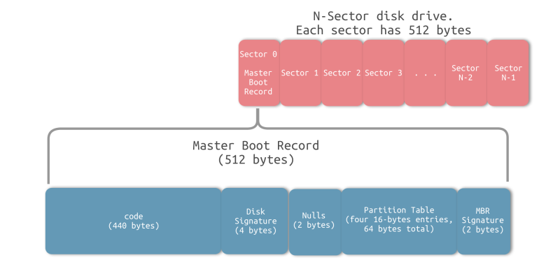

首先用一张图来大致了解一下计算机启动的整个过程。

# 上电

按下主机的电源键后，计算机开始启动，主板上电后开始初始化其固件（firmware）。固件是一些固化在芯片组上的程序，它会试图去启动CPU。如果启动失败（例如 CPU坏了或没插好），计算机就会死机并给出错误提示（如某些版本的主板固件会发出蜂鸣警告）。这种状态称为“zoombie-with-fans”。

如果前一个阶段未出错，就开始加电工作，在多 CPU 或多核 CPU情况下，某一个 CPU 会被随机选取作为启动 CPU（bootstrap processor，BSP）运行 BIOS 内部的程序。其余的 CPU（application processor，AP）保持停机直到操作系统内核显式地使用它们。

> 2000 年以前的计算机主板上均使用[BIOS](https://zh.wikipedia.org/wiki/BIOS)，如今绝大多数计算机采用的是[EFI](https://zh.wikipedia.org/wiki/%E7%B5%B1%E4%B8%80%E5%8F%AF%E5%BB%B6%E4%BC%B8%E9%9F%8C%E9%AB%94%E4%BB%8B%E9%9D%A2)（Mac用的就是 EFI）或[UEFI](https://en.wikipedia.org/wiki/Unified_Extensible_Firmware_Interface)，BIOS正在逐步被淘汰。基于 EFI、UEFI的开机过程与传统的BIOS不尽相同，本文将以传统的 BIOS，Intel CPU为例介绍开机过程。

此时 CPU 工作模式为实模式，该模式下地址总线是 20 位，寻址范围是`0x00000`​~`0xFFFFF`​的 1M 范围。这也就解释了为什么  
BIOS 的容量只有 1MB。

> Intel CPU 用三种运行模式:
>
> 实模式、32 位保护模式、64位保护模式。
>
> 实模式: Intel 8086 的寻址方案，为了商业连续性，兼容了这古老的方案；
>
> 保护模式:采用了虚实地址转换方案。

BIOS 启动之初，内存是空的。此时 CPU处于实模式，内存的地址映射均为硬连接的设备。内存映射图如下图所示:

# 重置向量

CPU启动后其大多数寄存器会被初始化为预定的值，包括指令寄存器（instruction pointer, EIP），它保存着 CPU 将要执行指令的内存地址。此时 CPU会有一个特殊行为，其会对 EIP 的初始值加上一个基址寄存器的值，生成一个 32位的地址`0xFFFFFFF0`​。之所以称为特殊行为，是因为实模式下 CPU只能寻址 1MB 地址空间，而这个 32 位地址已经大于 1MB的内存限制。因此，`0xFFFFFFF0`​也被称为重置向量（reset vector），参考上图`0xFFFFFFF0`​处的标识。

于是，CPU 开始执行`0xFFFFFFF0`​地址处的指令，该地址处是一条`JUMP`​指令，这条指令清空了基址寄存器的值，并让指令跳回到 BIOS开始处（物理地址为`0xF0000`​，参考上图`0xF0000`​处的标识）以执行 BIOS。

> BIOS 内部可以分成两个区块: code block（普通程序）、boot block（引导程序）。上电后，boot block 会先被执行，它会检查 code block 的代码是否正确，如果正确，就会转到 code block 继续执行下去。

# BIOS 初始化

​`0xF0000`​地址实际上是 BIOS 中的 boot block 的开始处。在这个阶段，会初始化部分硬件。系统的 CPU、USB只有部分被初始化。

# BIOS POST（加电自检）

初始化完成后，CPU 跳转到`0xA0000`​地址处（参考上图 640KB处）进行 BIOS 加电自检（power on self test,  
POST）。这个过程会检查计算机的各项组件，如CPU、显卡、内存、鼠标、键盘等。如果找不到内存或者键盘都有可能让BIOS停止工作并且打印一些相关的错误信息，如果找不到显卡BIOS 会发出蜂鸣警告（因为无法显示画面） 当 CPU 执行到`0xC0000`​地址处（参考上图 768KB 处），开始寻找其他设备的ROM，如果找到任何其他设备的 BIOS，它们也会被执行。 下一步，显卡就会显示BIOS 界面，并进行更深入的检查。

# BIOS 记录系统设定值

检查完成后，BIOS会根据自己的“系统资源表”，对系统进行进一步确认，从而确定计算机配有哪些资源或设备。例如  
BIOS 支持随插即用，它会检测并配置随插即用设备。 然后 BIOS会遵循高级配置电源接口（Advanced Configuration Power  
Interface，ACPI）在内存中设置好一系列的数据来描述硬件信息，以便被操作系统内核利用。

# 搜索 MBR

到这一步，BIOS开始尝试加载操作系统。它会从硬盘，光驱，软驱，网络等几个地方依次寻找操作系统（用户可以在  
BIOS 设定中修改查找的优先级）。如果找不到操作系统，BIOS会停机并给出错误信息。

假设在硬盘上找到了操作系统，它会首先读取硬盘上的大小为 512 Bytes 的 **0号扇区** ，这个扇区被称为[主引导记录](https://zh.wikipedia.org/wiki/%E4%B8%BB%E5%BC%95%E5%AF%BC%E8%AE%B0%E5%BD%95)（master  
boot record，MBR），其包含三部分：

1. **引导程序（Boot Loader）**
2. **硬盘分区表（Partition Table）**
3. **结束标志字**

BIOS 读完磁盘上的 MBR 之后会把它拷贝到内存`0x7C00`​地址处，然后 CPU 跳转到该内存地址执行 MBR里的指令。事实上，被复制到物理内存的内容就是 Boot Loader。常见的 Boot Loader 有 grub、lilo、spfdisk。下图可以帮助大家理解 MBR 的结构

关于磁盘、分区表等基础知识，可参见[计算机那些事(1)——](计算机那些事(1)——硬盘.md)磁盘。

# Boot Loader 执行

以常见的 Linux Boot Loader —— grub 为例。Grub 加载后首先进行 **内存盘初始化** 。Boot Loader会将存储介质中的`initrd`​文件加载到内存，内核启动时会在访问真正的根文件系统之前先访问内存中的`initrd`​文件系统。

> 关于 initrd Linux 内核需要适应多种不同的硬件架构，但是将所有的硬件驱动编入内核是不切实际的，而且内核也不可能每新出一种硬件结构，就将该硬件的设备驱动写入内核。实际上，Linux的内核镜像仅包含了基本的硬件驱动，在系统安装过程中检测系统的硬件信息，根据安装信息和系统硬件信息将一部分设备驱动写入initrd（bootloader initialized RAM disk。

内存盘初始化完毕之后， grub 会根据配置文件`/boot/grub/grub.cfg`​设定的内核镜像`vmlinuz`​所在的路径，加载内核镜像，并进行解压缩操作。此时，屏幕一般会出现“Uncompressing Linux” 的提示。当解压缩内核完成后，屏幕一般会输出 “OK,  
booting the kernel”。内核加载至内存完成后，grub 将控制权转交给内核。

# 内核启动

在 Boot Loader 配置了 initrd 的情况下，内核启动被分成了两个阶段：

1. 执行 initrd 的文件系统中的`init`​脚本。此阶段，内核会将控制权交给`init`​文件处理。`init`​主要是加载各种存储介质相关的设备驱动。当所需的驱动程序加载完毕，就会创建一个根设备，然后将根文件系统`rootfs`​以只读的方式挂载。这一步完成后，释放未使用的内存，并转换到真正的根文件系统中，进行第2 阶段的处理。
2. 执行真正的根文件系统中的`/sbin/init`​进程，即系统的 1号进程。此后，系统的控制权就全权交给`/sbin/init`​进程了。

# 系统初始化

​`/sbin/init`​进程是系统其它所有进程的父进程，当它接管了系统控制权后，它会根据`/etc/inittab`​文件来执行相应的脚本，从而完成一系列的系统初始化操作。主要包括以下步骤：

1. 设置运行等级。Linux 有运行等级如下：

- 0：关机
- 1：单用户模式
- 2：无网络支持的多用户模式
- 3：有网络支持的多用户模式
- 4：保留，未使用
- 5：有网络支持、有 X-Window 支持的多用户模式
- 6：重新引导系统，即重启

2. 执行`rc.sysinit`​。运行等级设置完成后，Linux系统执行的第一个用户层文件是`/etc/rc.d/rc.sysinit`​脚本程序，其完成的初始化操作主要包括：设置`PATH`​、设置网络配置`/etc/sysconfig/network`​、启动`swap`​分区、设置`/proc`​等。
3. 执行不同运行级别的脚本程序。根据运行级别的不同，系统会运行`rc0.d`​~`rc6.d`​中对应的脚本，从而完成对应的初始化工作，启动对应的服务。
4. 执行`/etc/rc.d/rc.local`​。`rc.local`​是 Linux运行用户进行个性化设置的脚本。
5. 执行`/bin/login`​。进入登录状态。此时，系统已经进入到等待用户输入`username`​和`password`​的阶段。

# 参考

1. [HowComputers Boot Up](http://duartes.org/gustavo/blog/post/how-computers-boot-up/)
2. [即将换掉传统BIOS的UEFI](http://www.techbang.com/posts/4359)
3. [Linux启动过程详解-《别怕Linux编程》之八](http://roclinux.cn/?p=1301)
4. 《Linux 系统架构与目录解析》
5. [INITRD 详解](http://smilejay.com/2011/10/initrd/)
6. [inux中init.d文件夹的说明](https://www.cnblogs.com/zhaopengcheng/p/5806379.html)
7. Linux启动过程分析与优化，浙江大学硕士毕业论文
8. [深入理解linux启动过程](http://bbs.chinaunix.net/thread-835918-1-1.html)

（完）
