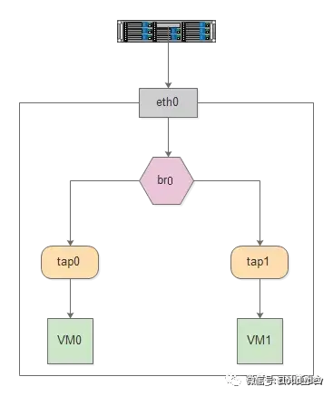

## 什么是bridge？

同 tap/tun、veth-pair 一样，Bridge 也是一种虚拟网络设备，所以具备虚拟网络设备的所有特性，比如可以配置 IP、MAC 等。

除此之外，Bridge 还是一个交换机，具有交换机所有的功能。

对于普通的网络设备，就像一个管道，只有两端，数据从一端进，从另一端出。而 Bridge 有多个端口，数据可以从多个端口进，从多个端口出。

Bridge 的这个特性让它可以接入其他的网络设备，比如物理设备、虚拟设备、VLAN 设备等。Bridge  通常充当主设备，其他设备为从设备，这样的效果就等同于物理交换机的端口连接了一根网线。比如下面这幅图通过 Bridge 连接两个 VM 的 tap  虚拟网卡和物理网卡 eth0。



‍

‍

## **brctl**命令

用于设置、维护和检查linux内核中的以太网网桥配置。

|参数|说明|示例|
| ------| ------------------------| -----------------------------------|
|​`addbr <bridge>`​|创建网桥|**brctl** addbr br10|
|​`delbr <bridge>`​|删除网桥|ifconfig kvmbr1 down **; brctl** delbr kvmbr1|
|​`addif <bridge> <device>`​|将网卡接口接入网桥|**brctl** addif br10 eth0|
|​`delif <bridge> <device>`​|删除网桥接入的网卡接口|**brctl** delif br10 eth0|
|​`show <bridge>`​|查询网桥信息|**brctl** show br10|
|​`stp <bridge> {on\|off}`​|启用禁用 STP|**brctl** stp br10 off/on|
|​`showstp <bridge>`​|查看网桥 STP 信息|**brctl** showstp br10|
|​`setfd <bridge> <time>`​|设置网桥延迟|**brctl** setfd br10 10|
|​`showmacs <bridge>`​|查看 mac 信息|**brctl** showmacs br10|

```bash
#brctl命令安装
yum -y install bridge-utils
# 多网口配置网桥需开启转发。
echo "net.ipv4.ip_forward=1" >> /etc/sysctl.conf
sysctl -p

#查看系统是否存在网桥配置
brctl show
#添加一个新的逻辑网桥接口br0
brctl addbr br0
#将eth1加入逻辑网桥br0
brctl addif br0 eth1/eth2
#配置网桥地址并启动
ifconfig br0 172.168.0.1 up
```
