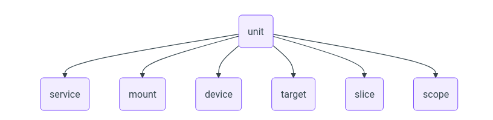

现代的 Linux 发行版都使用 systemd 来管理系统服务，因此本文主要介绍 systemd 环境下的服务与日志管理，~~Gentoo 用户请绕道~~。

早期（2014 年以前）还有 SysVinit 和 Upstart 等，但现在已经很少见了。SysVinit 还有一个现代化的替代品，叫做 OpenRC。

## Init

Init 进程是 Linux 启动时运行的第一个进程，负责启动系统的各种服务并最终启动 shell。传统的 init 程序位于 `/sbin/init`​，而现代发行版中它一般是指向 `/lib/systemd/systemd`​ 的软链接，即由 systemd 作为 PID 1 运行。

PID 1 在 Linux 中有一些特殊的地位：

- 不受 `SIGKILL`​ 或 `SIGSTOP`​ 信号影响，不能被杀死或暂停。类似地，即使收到了其他未注册的信号，默认行为也是忽略，而不是结束进程或挂起。
- 当其他进程退出时，这些进程的子进程会由 PID 1 接管，因此 PID 1 需要负责回收（`wait(2)`​）这些僵尸进程。

## Systemd 与服务

Systemd 是一大坨软件，包括服务管理（PID  1）、日志管理（systemd-journald）、网络管理（systemd-networkd）、本地 DNS  缓存（systemd-resolved）、时间同步（systemd-timesyncd）等，本文主要关心服务管理和日志管理。

在 systemd 中，运行一个完整系统所需的每个部件都作为“单元”（unit）管理。一个 unit 可以是服务（`.service`​）、挂载点（`.mount`​）、设备（`.device`​）、定时器（`.timer`​）以至于目标（`.target`​）等，完整的列表可以在 [`systemd.unit(5)`](https://www.freedesktop.org/software/systemd/man/latest/systemd.unit.html)​ 中找到。



Systemd unit 的配置文件**主要**从以下目录按顺序载入，其中同名的文件只取找到的第一个：

- ​`/etc/systemd/system`​：本地配置文件，优先级最高，这也是唯一一个管理员可以手动修改文件的地方。
- ​`/run/systemd/system`​：运行时目录，存放由 systemd 或其他程序动态创建的 unit。注意 `/run`​ 目录重启后会被清空。
- ​`/usr/lib/systemd/system`​：系统配置文件，优先级最低，一般由发行版（软件包管理器）提供。

‍

## systemctl 命令和参数

### 命令格式

```go
systemctl 命令 服务名称
例如 systemctl start php.service
```

命令

```go
start             开启
stop              关闭
restart           重启
status            查看状态
is-active         查看激活与否
enable            设置开机启动
disable           禁止开机启动
is-enabled        查看是否开机自启
kill              杀死进程
mask              禁止自动和手动启动
unmask            取消禁止
list-dependencies 查看服务的依赖关系
```

### 语法

```go
#语法
systemctl COMMAND name.service
#启动
systemctl start name.service
#停止
systemctl stop name.service
#重启
systemctl restart name.service
#查看状态
systemctl status name.service
#禁止自动和手动启动
systemctl mask name.service
#取消禁止
systemctl unmask name.service
#查看某服务当前激活与否的状态：
systemctl is-active name.service
#查看所有已经激活的服务：
systemctl list-units --type|-t service
#查看所有服务：
systemctl list-units --type service --all
#设定某服务开机自启，相当于chkconfig name on
systemctl enable name.service
#设定某服务开机禁止启动：相当于chkconfig name off
systemctl disable name.service
#查看所有服务的开机自启状态，相当于chkconfig --list
systemctl list-unit-files --type service
#用来列出该服务在哪些运行级别下启用和禁用：chkconfig –list name
ls /etc/systemd/system/*.wants/name.service
#查看服务是否开机自启：
systemctl is-enabled name.service
#列出失败的服务
systemctl --failed --type=service
#开机并立即启动或停止
systemctl enable --now postfix
systemctl disable  --now postfix
#查看服务的依赖关系：
systemctl list-dependencies name.service
#杀掉进程：
systemctl kill unitname
#重新加载配置文件
systemctl daemon-reload
#关机
systemctl halt、systemctl poweroff
#重启：
systemctl reboot
#挂起：
systemctl suspend
#休眠：
systemctl hibernate
#休眠并挂起：
systemctl hybrid-sleep

————————————————
原文作者：PHP_LHF
转自链接：https://learnku.com/articles/72684
版权声明：著作权归作者所有。商业转载请联系作者获得授权，非商业转载请保留以上作者信息和原文链接。
```

### 加载配置文件

### 关机和开机

```go
systemctl poweroff 关机 
systemctl reboot 开机
```

### unit 文件存放位置

```go
本文件一共有三个地方可以存放 
/etc/systemd/system/ 
/usr/lib/systemd/system 
/lib/systemd/system
```

### unit 格式说明

```go
1、以 “#” 开头的行后面的内容会被认为是注释
2、相关布尔值，1、yes、on、true 都是开启，0、no、off、false 都是关闭
3、时间单位默认是秒，所以要用毫秒（ms）分钟（m）等须显式说明
```

### service unit file 文件构成部分

```go
1、[Unit]：定义与Unit类型无关的通用选项；用于提供unit的描述信息、unit行为及依赖关系等
2、[Service]：与特定类型相关的专用选项；此处为Service类型
3、[Install]：定义由“systemctl enable”以及"systemctl disable“命令在实现服务启用或禁用时用到的一些选项
```

### unit 段的常用选项

|描述|可选项|
| -------------| --------------------------------------------------------------------------------------------------------|
|Description|对当前服务的简单描述|
|After|可以指定在哪些服务之后进行启动|
|Before|可以指定在哪些服务之前进行启动|
|Requires|可以指定服务依赖于哪些服务 (这种依赖是” 强依赖”，一旦所依赖的服务异常，当前的服务也随之停止)|
|Wants|可以指定服务依赖于哪些服务 (这种依赖是” 弱依赖”，即使所依赖的服务的启动情况不影响当前的服务是否启动)|
|Conflicts|定义 units 间的冲突关系|

### service 段的常用选项

|可选项|描述|
| -----------------| -----------------------------------------------------------------------------------------|
|EnvironmentFile|环境配置文件，用来指定当前服务启动的环境变量|
|ExecStart|指定服务启动时执行的命令或脚本|
|ExecStartPre|指定服务启动前执行的命令或脚本|
|ExecStartPost|指定服务启动后执行的命令或脚本|
|ExecStop|指明停止服务要运行的命令或脚本|
|ExecStopPost|指定服务停止之后执行的命令或脚本|
|RestartSec|指定服务在重启时等待的时间，单位为秒|
|ExecReload|指明重启服务要运行的命令或脚本|
|Restart|当设定 Restart=1 时，则当次 daemon 服务意外终止后，会再次自动启动此服务，具体看下列类型|
|PrivateTmp|设定为 yes 时，会在生成 /tmp/systemd-private-UUID-NAME.service-XXXXX/tmp/ 目录|
|KillMode|[指定停止的方式，具体见下面](https://learnku.com/articles/72684#restart)|
|Restart|[指定重启时的类型，具体见下面](https://learnku.com/articles/72684#restart)|
|Type|[指定启动类型，具体见下面](https://learnku.com/articles/72684#type)|

**type 选项**

|type 可选项|描述|
| -------------| ------------------------------------------------|
|simple|指定 ExecStart 字段的进程为主进程|
|forking|指定以 fork () 子进程执行 ExecStart 字段的进程|
|oneshot|执行一次|
|notify|启动后发送会发送通知信号通知 systemd|
|idle|等其他任务结束后才运行|
|||

**restart 的可选值**

|restart 可选项|描述|
| ----------------| --------------------------------------------|
|no|退出后不会重启|
|on-success|当进程正常退出时 (退出码为 0) 执行重启|
|on-failure|当进程不正常退出时 (退出码不为 0) 执行重启|
|on-abnormal|当被信号终止和超时执行重启|
|on-abort|当收到没有捕捉到的信号终止时执行重启|
|on-watchdog|当看门狗超时时执行重启|
|always|一直重启|

**killModel**

|KillMode 可选项|描述|
| -----------------| ----------------------------------------------------|
|control-group|杀掉当前进程中所有的进程|
|process|杀掉当前进程的主进程|
|mixed|主进程将收到 SIGTERM 信号，子进程收到 SIGKILL 信号|
|none|不杀掉任何进程|

### install 段的常用选项

|install 段的常用选项|描述|
| ----------------------| ----------------------------------------------|
|Alias|别名，可使用 systemctl command Alias.service|
|RequiredBy|被哪些 units 所依赖，强依赖|
|WantedBy|被哪些 units 所依赖，弱依赖|
|Also|安装本服务的时候还要安装别的相关服务|

Install 一般填为 WantedBy=multi-user.target

```go
注意：对于新创建的unit文件，或者修改了的unit文件，要通知systemd重载此配置文件,而后可以选择重启，使用命令 systemctl daemon-reload
```

### unit 文件的例子

```go
[Unit]
Description=Frp Client Service #指明自己的描述
After=network.target           #指明本服务需要在network服务启动后在启动 

[Service]
Type=simple #指明下面ExecStart字段的进程为主进程
User=nobody#这个可写可不写
Restart=always#当进程正常退出时重启
RestartSec=5s #服务在重启时等待的时间，这里指定为5s
ExecStart=/usr/bin/frpc -c /etc/frp/frpc.ini #指定服务启动时运行的脚本或者命令
ExecReload=/usr/bin/frpc reload -c /etc/frp/frpc.ini #指定服务重启时运行的脚本或者命令
LimitNOFILE=1048576  #进程的文件句柄硬限制

[Install]
WantedBy=multi-user.target

```

将此文件命名为 frps.service 复制到 /lib/systemd/system 里面，然后重新加载 systemctl 配置文件

‍
