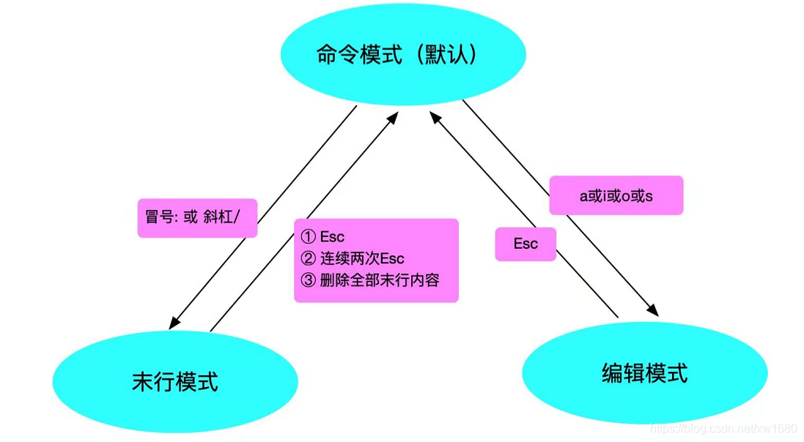

#command/vim

# 三种模式

Vim 中存在三种模式 ：命令模式、编辑模式 (输入/插入模式)、末行模式 (尾行模式)

*   命令模式：在该模式下是不能对文件直接编辑，可以输入快捷键（命令）进行一些操作（复制、粘贴、删除等等）注意：当我们使用 Vim 编辑器，打开某个文件后默认进入的模式就是命令模式。

*   编辑模式：在该模式下可以对文件的内容进行编辑。

*   末行模式：可以在末行输入命令来对文件进行操作（搜索、替换、保存、退出、撤销、高亮等等）

## 三种模式之间的关系




## 命令模式

```bash
x     # 删除字符
dd     # 删除一行
y     # 复制字符
yy    # 复制一行
u      # 撤销
i     # 光标之前插入文本。
I     # 光标所在行首插入。
a     # 光标之后插入文本。
A      # 光标所在行尾插入。
o      # 下一行插入。
O      # 上一行插入。
```

文本的选择，对于编辑器来说，是很基本的东西，也经常被用到，总结如下：

```bash
v          # 从光标当前位置开始，光标所经过的地方会被选中，再按一下v结束。 
V          # 从光标当前行开始，光标经过的行都会被选中，再按一下Ｖ结束。 
Ctrl + v   # 从光标当前位置开始，选中光标起点和终点所构成的矩形区域，再按一下Ｃtrl + v结束。 
ggVG       # 选中全部的文本， 其中gg为跳到行首，V选中整行，G末尾
```

## 编辑模式

输入\[ i,a,I,A,o,O ]进入编辑模式，可以进行编辑操作，修改完成输入ESC返回命令模式

```bash
i         # 在光标所在字符前插入
a         # 在光标所在字符后插入
I         # 在光标所在行最后插入
A         # 在光标所在行最前插入
o         # 在光标所在行上一行插入
O         # 在光标所在行下一行插入
```

## 末行模式

输入\[ / , : ] 进入末行模式，执行之后返回命令模式

```bash
:q              # 不保存，退出
:w              # 保存，不退出
:wq             # 保存，并退出
:1,$s/old/new/g # 将文件中所有的『old』改成『new』
:set paste      # 解决粘贴乱序问题
:set nopaste    # 恢复自动缩进


/ 关键字 # 查找光标之后
%       # 查找光标之前
n       # 往下继续寻找下一个相同的字串。
N       # 往上继续寻找下一个相同的字串

```

修改vimrc配置文件

```bash
set ts=4  # 设置vim中缩进为4个空格
```

debian禁用vim鼠标的visual模式

```bash
vim /usr/share/vim/vim82/defaults.vim 
----------------------------------------
if has('mouse')
  if &term =~ 'xterm'
    set mouse-=a
  else
    set mouse=nvi
  endif
endif
```