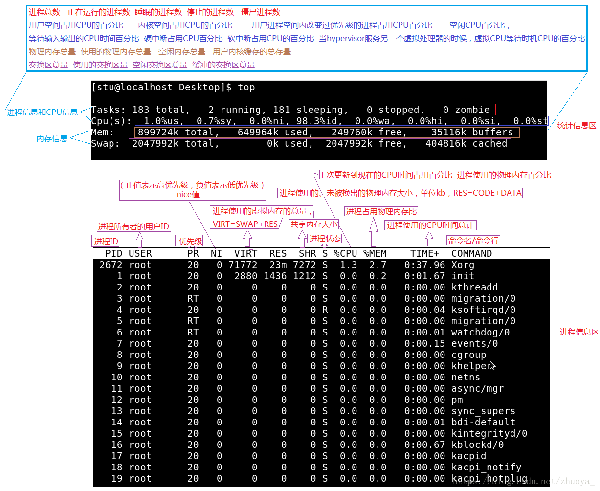
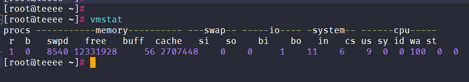

#command/base


## 系统运行状态查询

```bash
hostnamectl # 查看系统信息
hostnamectl set-hostname xxx  # 修改主机名

top         # cpu使用率
cat /proc/cpuinfo  # cpu信息
free -h     # 内存信息
dmidecode | grep 'Product Name'  # 服务器型号
vmstat      # CPU使用率，内存使用,虚拟内存交换情况,IO读写情况
df -h       # 分区信息
df -i       # 显示已使用和空闲的inode
du -sh dir  # 目录大小
du -h --max-depth=1 
uptime      # 查看系统运行时间
last        # 历史登录信息
lastb       # 登录失败信息

########################################

shutdown -h now  # 关闭系统
shutdown -r now  # 重启
shutdown -h hours:minutes & # 按预定时间关闭系统 
shutdown -c      # 取消按预定时间关闭系统 
reboot           # 重启
logout           # 注销
```

### lsof

lsof（list open files）是一个列出当前系统打开文件的工具

```bash
# yum install lsof
-a          # 列出打开文件存在的进程；
-c <进程名> # 列出指定进程所打开的文件；
-g          # 列出GID号进程详情；
-d <文件号> # 列出占用该文件号的进程；
+d <目录>   # 列出目录下被打开的文件；
+D <目录>   # 递归列出目录下被打开的文件；
-n <目录>   # 列出使用NFS的文件；
-i <条件>   # 列出符合条件的进程。（4、6、协议、:端口、 @ip ）
-p <进程号> # 列出指定进程号所打开的文件；
-u          # 列出UID号进程详情；
-h          # 显示帮助信息；
-v          # 显示版本信息

```

## 文件查询与处理

### ls & rm & mv & cp & ln & mkdir & iconv & touch & pwd

```bash
pwd              # 显示当前路径
ls               # 查看目录中的文件 
ls -l            # 显示文件和目录的详细资料 
ls -a            # 显示隐藏文件 
mkdir dir1       # 创建一个叫做 'dir1' 的目录
mkdir -p /tmp/dir1/dir2  # 创建一个目录树 
rm -f file1      # 删除一个叫做 'file1' 的文件
rm -rf dir1      # 删除一个叫做 'dir1' 的目录并同时删除其内容 
rsync --delete-before -d test/ backup/old/bp_data/ # 快速删除
mv dir1 new_dir  # 重命名/移动 一个目录 
cp file1 file2   # 复制一个文件 
cp -a dir1 dir2  # 复制一个目录 
ln -s file1 lnk1 # 源文件 目标文件
ln file1 lnk1    # 创建一个指向文件或目录的物理链接 
touch -t 0712250000 file1 # 修改一个文件或目录的时间戳 - (YYMMDDhhmm) 
#########################
iconv -f gbk -t utf-8 test.txt -o tmp.txt  #将gbk格式的test.txt转换成utf-8的tmp.txt
```

### tree

```bash
# 以树状结构查看目录下的内容（包含子目录下的内容）
tree -L 1 -C G6/   # 只查看当前目录（深度为1）下的内容，并区分目录和文件（显示有高亮）
-p             # 显示文件或目录的权限属性
-s             # 打印每个文件的大小以及名称
-f             # 打印每个文件的完整路径前缀
-d             # 仅列出目录
-i             # tree不会打印缩进线,与-f选项一起使用时很有用
--noreport     # 忽略在tree列表末尾打印文件和目录报告
-o file name   # 将输出发送到文件名


```

### cat & tac & more & less & head & tail

```bash
cat file1     # 从第一个字节开始正向查看文件的内容 
tac file1     # 从最后一行开始反向查看一个文件的内容 
more file1    # 查看一个长文件的内容 
less file1    # 类似于 'more' 命令，但是它允许在文件中和正向操作一样的反向操作 
head -n 2 file1 # 查看一个文件的前两行 
tail -n 2 file1 # 查看一个文件的最后两行 
tail -f /var/log/messages # 实时查看被添加到一个文件中的内容


```

### find  dir  -option  \[-print]

```bash
-option：
  -name   filename     # 查找名为filename的文件
  -iname               # 按照文件名搜索，不区分文件名大小；
  -perm                # 按执行权限来查找
  -user   username     # 按文件属主来查找
  -group  groupname    # 按组来查找
  -mtime  -n +n        # 按文件更改时间来查找文件，-n指n天以内，+n指n天以前
  -atime  -n +n        # 按文件访问时间来查找文件，-n指n天以内，+n指n天以前
  -ctime  -n +n        # 按文件创建时间来查找文件，-n指n天以内，+n指n天以前
  -nogroup             # 查无有效属组的文件，即文件的属组在/etc/groups中不存在
  -nouser              # 查无有效属主的文件，即文件的属主在/etc/passwd中不存
  -type   b/d/c/p/l/f  # 查是块设备、目录、字符设备、管道、符号链接、普通文件
  -size  [+\-]100[k\M\G]   # 按照指定大小搜索文件,默认单位byte,"+"搜索比指定大小大的文件，"-" 搜索比指定大小小的文件。
  -mount               # 查文件时不跨越文件系统mount点
  -follow              # 如果遇到符号链接文件，就跟踪链接所指的文件
  -prune               # 忽略某个目录
find ./ -type d | sed -n '2,$p' | xargs rm -rf {}  # 只删除目录
find ./ -type f -ctime +30 | xargs rm -rf {}       # 删除30天前创建的文件
========================================================

# 其他相似命令
locate         # 先运行 'updatedb' 命令 yum install mlocate
whereis halt   # 显示一个二进制文件、源码或man的位置 
which halt     # 显示一个二进制文件或可执行文件的完整路径
```


### locale

**locate**(locate) 命令用来查找文件或目录。 locate命令要比find -name快得多，原因在于它不搜索具体目录，而是搜索一个数据库/var/lib/mlocate/mlocate.db 。这个数据库中含有本地所有文件信息。Linux系统自动创建这个数据库，并且每天自动更新一次;
因此，我们在用whereis和locate 查找文件时，有时会找到已经被删除的数据，或者刚刚建立文件，却无法查找到，原因就是因为数据库文件没有被更新。为了避免这种情况，可以在使用locate之前，先使用updatedb命令，手动更新数据库。

```bash
locate [OPTION]... [PATTERN]
-b      # 仅匹配路径名的基名称
-c      # 只输出找到的数量
-d      # 使用DBPATH指定的数据库，而不是默认数据库 /var/lib/mlocate/mlocate.db
-e      # 仅打印当前现有文件的条目
-L      # 当文件存在时跟随蔓延的符号链接 (默认)
-h      # 显示帮助
-i      # 忽略大小写
-l      # LIMIT 限制为 LIMIT项目的输出 (或 计数)
-m      # 忽略向后兼容性-P, --nofollow, -H     当检查文件时不跟随蔓延的符号
-       # null 输出时以 NUL 分隔项目
-S      # 不搜索项目,显示有关每个已用数据库的统计信息
-q      # 安静模式，不会显示任何错误讯息
-r      # 使用基本正则表达式
-s      # 忽略向后兼容性-V, --version          显示版本信息
-w      # 匹配整个路径名（默认）
```


### vim  file1 file2       # vim 比较两个文件不同

```bash
在文件的各个差异点之间前后移动：
], c：跳转到下个差异点
[, c：跳转到上个差异点

两个窗口之前的切换
Ctrl-w, l：光标切换到右侧的窗口
Ctrl-w, h：光标切换到左侧的窗口
Ctrl-w, w：光标在两个窗口间彼此切换

内容合并
可以使用 d, p （即 diff put）命令，将当前差异点中的内容覆盖到另一文件中的对应位置。 


```

## 权限相关

### useradd & groupadd

```bash
groupadd group_name    # 创建一个新用户组 
groupdel group_name    # 删除一个用户组 
useradd -m user1       # 创建一个新用户并自动创建/home/user1
userdel -r user1       # 删除一个用户并自动删除/home/user1
passwd user1           # 修改一个用户的口令 (只允许root执行) 
echo "123345" | passwd --stdin username 
chage -E 2005-12-31 user1 # 设置用户口令的失效期限 
```

### chage

```bash
chage [选项] username
选项：
  -d,    # 指定密码最后修改日期
  -E,    # 将帐户过期时间设为“过期日期”
  -h,    # 显示此帮助信息并推出
  -I,    # 密码过期后，锁定账号的天数
  -l,    # 显示帐户年龄信息
  -m,    # 密码可以更改的最小天数。为零代表任何时候都可以更改密码。
  -M,    # 密码保持有效的最大天数。
  -R,    # chroot 到的目录
  -W,    # 密码过期前，提前收到警告信息的天数。

```

### chmod & chown & chgrp & chattr

```bash
ls -lh  # 显示权限 
chown -R user1:group1 directory # 改变一个目录下所有文件的所有人和所属组
chgrp -R group directory        # 改变一个目录下所有文件的所属组
chmod 777 file                  # 修改文件权限

lsattr  # 显示特殊的属性
chattr +a file1   # 只允许以追加方式读写文件 
chattr +c file1   # 允许这个文件能被内核自动压缩/解压 
chattr +d file1   # 在进行文件系统备份时，dump程序将忽略这个文件 
chattr +i file1   # 设置成不可变的文件，不能被删除、修改、重命名或者链接 
chattr +s file1   # 允许一个文件被安全地删除 
chattr +S file1   # 一旦应用程序对这个文件执行了写操作，使系统立刻把修改的结果写到磁盘 
chattr +u file1   # 若文件被删除，系统会允许你在以后恢复这个被删除的文件 

```

## 打包压缩

### tar & zip rar
```bash
tar -jcvf archive.tar.bz2 dir1 # 创建一个bzip2格式的压缩包 
tar -jxvf archive.tar.bz2      # 解压一个bzip2格式的压缩包 
tar -zcvf archive.tar.gz dir1  # 创建一个gzip格式的压缩包 
tar -zxvf archive.tar.gz       # 解压一个gzip格式的压缩包 
#排除application目录下的logs目录
tar -zcvf application.tar.gz --exclude=logs application/ 
#--exclude-from=
# 查看文件
zcat xxx.tar.gz
# 查看目录
tar tvf xxx.tar.gz

zip file1.zip file1               # 创建一个zip格式的压缩包 
zip -r file1.zip file1 file2 dir1 # 将几个文件和目录同时压缩成一个zip格式的压缩包 
unzip file1.zip                   # 解压一个zip格式压缩包 
  -q       # 执行时不显示任何信息
  -d dir   # 解压后存放目录

bunzip2 file1.bz2    # 解压一个叫做 'file1.bz2'的文件 
bzip2 file1          # 压缩一个叫做 'file1' 的文件 
# 安装bzip2
tar -zxvf bzip2-1.0.8.tar.gz
cd bzip2-1.0.8 ; make && make install
ln -s /usr/local/bin/bzip2 /usr/bin/bzip2
ln -s /usr/local/bin/bunzip2 /usr/bin/bunzip2

gunzip file1.gz      # 解压一个叫做 'file1.gz'的文件 
gzip file1           # 压缩一个叫做 'file1'的文件 
gzip -9 file1        # 最大程度压缩 

rar a file1.rar test_file        # 创建一个叫做 'file1.rar' 的包 
rar a file1.rar file1 file2 dir1 # 同时压缩 'file1', 'file2' 以及目录 'dir1' 
unrar x file1.rar                # 解压rar包 

```

## 挂载磁盘

### mount 

```bash
`mount [-t vfstype]  [-o options] devicefile dir`
`mount -t iso9660 -o loop /opt/CentOS-7-x86_64-DVD-2003.iso /media/cdrom`
[-t vfstype] 指定文件系统的类型，通常不必指定，mount 会自动选择正确的类型。
光盘或光盘镜像：iso9660 
DOS fat16文件系统：msdos 
Windows 9x fat32文件系统：vfat 
Windows NT ntfs文件系统：ntfs 
Mount Windows文件网络共享：smbfs 
UNIX(LINUX) 文件网络共享：nfs

[-o options] 主要用来描述设备或档案的挂接方式。
loop：用来把一个文件当成硬盘分区挂接上系统 
ro：采用只读方式挂接设备 
rw：采用读写方式挂接设备 
iocharset：指定访问文件系统所用字符集

```

```bash
# 永久挂载
echo '/opt/CentOS-7-x86_64-DVD-2003.iso /media/cdrom iso9660 defaults,ro,loop 0 0 >> /etc/fstab
mount -a
```

### dd

```bash
# 建立一个swap文件 
dd if=/dev/zero of=/swap bs=2M count=1024
# 将iso镜像写入u盘
dd if=ubuntu-18.04.1-desktop-amd64.iso of=/dev/sda bs=1M

# 写入测试
dd if=/dev/zero of=test bs=64k count=4k oflag=dsync
# 正常写速度：机械磁盘在 50 MB/s~90 MB/s，固态硬盘在 150 MB/s-300 MB/s
# 读取测试
dd if=test of=/dev/zero bs=64k count=4k oflag=dsync


```

### fdisk

```bash
fdisk -l         # 显示当前分区情况
fdisk /dev/sdb   # 选择分区磁盘（进行分区）
# # 菜单命令 # # 
m  # 显示菜单和帮助信息
a  # 活动分区标记/引导分区
d  # 删除分区
l  # 显示分区类型
n  # 新建分区
p  # 显示分区信息
q  # 退出不保存
t  # 设置分区号
v  # 进行分区检查
w  # 保存修改
x  # 扩展应用，高级功能

```

### lsblk

```bash
# lsblk命令来自于英文词组”list block“的缩写，其功能是用于查看系统的磁盘使用情况


```

## 网络排查

### ifconfig

```bash
ip addr 
ifconfig eth0  # 显示一个以太网卡的配置 
ifup eth0      # 启用一个 'eth0' 网络设备 
ifdown eth0    # 禁用一个 'eth0' 网络设备 
traceroute     # 路由跟踪

```

### netstat

```bash
netstat -ant && ss -ant
-a,  # 显示所有连接中的socket
-n,  # 直接使用ip地址，而不通过域名服务器
-p,  # 显示正在使用socket的程序PID和程序名称
-t,  # 显示tcp协议的连接

```

### curl

```bash
curl
-o   # 将服务器的回应保存成文件，等同于wget命令。
-O   # 将服务器回应保存成文件，并将 URL 的最后部分当作文件名。
-x   # 指定 HTTP 请求的代理。curl -x socks5:119.28.77.113:8981 https://www.example.com
-X   # 指定 HTTP 请求的方法。curl -X [GET/POST] http://119.28.77.113:5000/v2/_catalog
-v   # 输出通信的整个过程，用于调试。
-s   # 将不输出错误和进度信息。
-L   # 让 HTTP 请求跟随服务器的重定向。curl 默认不跟随重定向。

```

### arp

```bash
arp
-a     # 显示arp缓冲区的所有条目；
-H     # 指定arp指令使用的地址类型；
-d     # 从arp缓冲区中删除指定主机的arp条目；
-D     # 使用指定接口的硬件地址；
-e     # 以 Linux 的显示风格显示arp缓冲区中的条目；
-i     # 指定要操作arp缓冲区的网络接口；
-s     # 设置指定的主机的IP地址与MAC地址的静态映射；
-n     # 以数字方式显示arp缓冲区中的条目；
-v     # 显示详细的arp缓冲区条目，包括缓冲区条目的统计信息；


```

## 其他

### dirname & basename

```perl
# Bash Shell本身提供了basename命令，可以直接获取路径名最后的文件名
resFile=`basename /tmp/csdn/zhengyi/test/adb.log`


# Bash Shell本身提供了dirname命令，特别方便，可以直接获取路径对应的目录名，实现代码如下
dirPath=`dirname /tmp/csdn/zhengyi/test/adb.log`

```


## 服务器性能查询

### free命令

显示当前系统中的内存使用和空闲情况，也可以显示被内核占用的内存缓冲区

```bash
[root@fmsrvdb ~]# free -h
            total      used    free   shared      buff/cache  available
Mem:         15G       1.4G    11G     1.7G         2G         12G
Swap:       6.0G       8.3M    6.0G
-----      ------     ------  ------  ---------  ----------  ----------
名称   物理内存的总大小  使用的   空闲的 多个进程共享的  磁盘缓存  还可以被进程使用的物理内存  
```
==*Buffer 是对磁盘数据的缓存，而 Cache 是文件数据的缓存，它们既会用在读请求中，也会用在写请求中*==
手动释放内存的命令
```bash
sync;sync;sync
echo 3 > /proc/sys/vm/drop_caches
# 1：释放页缓存
# 2：释放dentries和inodes
# 3：释放所有

# 上述操作是无害的操作，并且智慧释放完全没有使用的内存对象。脏对象（dirty objects）将继续被使用直到它们被写入到磁盘中，
# 所以内存脏对象不会被释放。不过，如果在执行`drop_caches`之前执行`sync`指令，则会将脏对象刷新到磁盘中，这样`drop_caches`操作会释放出更多内存。

```


### top命令

**第一行：top - 06:18:40 up 3:15, 1 user, load average: 0.06, 0.02, 0.00**

含义分别是：系统时间、运行时间、登录终端数、系统负载（三个数值分别为 1 分钟、5 分钟、15 分钟内的平均值，数值越小意味着负载越低）

从第六行开始，就是具体的系统进程的资源使用的详细情况，如下图：



### vmstat命令

虚拟内存性能监控、CPU监控（进程上下文切换、CPU利用率）



```text
process进程;
r:正在执行和等待cpu资源的任务个数。当这个值超过了cpu个数，就会出现cpu瓶颈
b:等待IO的进程数,这列的值如果长时间大于1，则需要进行关注了

memory内存;
swpd:使用虚拟内存大小
free:可用内存大小
buff:用作缓冲的内存大小(即将写入磁盘的缓冲大小)
cache:用作缓存的内存大小(从磁盘中读取的缓存大小)

swap交换内存;
si:每秒从交换区写到内存的大小
so:每秒写入交换区的内存大小

IO;
bi:从块设备读取数据的量（读磁盘）
bo:从块设备写入数据的量（写磁盘）

system;
in:表示在某一时间间隔中观测到的每秒设备中断数
cs:表示每秒产生的上下文切换次数

cpu;
us:us的值比较高时，说明用户进程消耗的cpu时间多，但是如果长期超过50%的使用，那么我们就该考虑优化程序算法或其他措施了
sy:sys的值过高时，说明系统内核消耗的cpu资源多，这个不是良性的表现，我们应该检查原因。
id:空闲时间(包括等待IO时间),中央处理器的空闲时间
wa:等待IO时间,Wa过高时，说明io等待比较严重，这可能是由于磁盘大量随机访问造成的，也有可能是磁盘的带宽出现瓶颈。

```

命令参数

```bash
# vmstat 3 3
-a    # 显示活跃和非活跃内存
-f    # 显示从系统启动至今的fork数量 。
-m    # 显示slabinfo
-n    # 只在开始时显示一次各字段名称。
-s    # 显示内存相关统计信息及多种系统活动数量。
delay # 刷新时间间隔。如果不指定，只显示一条结果。
count # 刷新次数。如果不指定刷新次数，但指定了刷新时间间隔，这时刷新次数为无穷。
-d    # 显示磁盘相关统计信息。
-p    # 显示指定磁盘分区统计信息
-S    # 使用指定单位显示。参数有 k 、K 、m 、M ，分别代表1000、1024、1000000、1048576字节（byte）。默认单位为K（1024 bytes）
-V    # 显示vmstat版本信息
```

### sysstat工具包

Linux 下的性能分析，少不了要使用 sysstat 工具包中的命令。同时 sysstat 服务会自动每个10分钟收集一次系统状态信息，并将它们存储到 /var/log/sa目录下。每天一个文件，文件名分别是sa01, sa02,... sa30..

自动收集系统信息，是通过 /etc/cron.d/sysstat 来实现的

`vim `sysstat 服务的配置文件

```bash
# sysstat-10.1.5 configuration file.

# 保留日志文件的时间（以天为单位）
# 如果值大于28，则日志文件保存在多个目录中，每个月一个
HISTORY=28  

# 压缩（使用 gzip 或 bzip2）早于（天）的 sa 和 sar 文件
COMPRESSAFTER=31

# 系统活动数据收集器的参数（参见 sadc 手册页），用于生成日志文件
SADC_OPTIONS="-S DISK"

# 要使用的压缩程序
ZIP="bzip2"

```

sysstat工具包中有很多的分析命令，常用的有：sar, iostat, mpstat(multi processor stat), pidstat, vmstat等等。

其中的sar命令尤其强大，它一个命令就能够收集系统CPU, 内存，磁盘，网络，进程切换，swap, 甚至文件inode，等个方面的信息。sar 的应用比较多，而且也比较复杂，数据更为精确。

#### sar

```bash
sar -u, sar -u ALL 1 5         # 查看CPU信息(间隔1s,统计5次)
sar -r, sar -R ,sar -R 1 10    # 查看内存信息(间隔1s,统计10次)
sar -S, ssar -W                # 查看的是swap空间的使用情况
sar -b, sar -B                 # I/O和传输速率信息
sar -d                         # 块设备状况
sar -n DEV                     # 查看网络设备上的数据包收发情况
sar -n EDEV                    # 查看网络设备上发生的数据包收发错误的情况
sar -n TCP, sar -n TCP 1 5     # 查看TCP；
sar -n ETCP                    # 查看tcp错误； 
sar -n SOCK, sar -n SOCK 1 5   # 查看socket；
sar -q                         # 系统负载压力统计
# runq-sz 表示在CPU上排队等待执行的任务；plist-sz系统所有任务。
sar -w                         # 每秒进程创建 和 进程切换
sar -W                         # 每秒swap/page

```

#### iostat

查看IO和CPU负载情况

```bash
-c   # 显示CPU使用情况
-d   # 显示磁盘使用情况
-N   # 显示磁盘阵列(LVM) 信息
-n   # 显示NFS 使用情况
-k   # 以 KB 为单位显示
-m   # 以 M 为单位显示
-t   # 报告每秒向终端读取和写入的字符数和CPU的信息
-V   # 显示版本信息
-x   # 显示详细信息
-p   # [磁盘] 显示磁盘和分区的情况
```

#### mpstat

查看多核CPU情况

```bash
mpstat [-P {cpu|ALL}] [internal [count]]
-P       # {cpu l ALL} 表示监控哪个CPU， cpu在[0,cpu个数-1]中取值
internal # 相邻的两次采样的间隔时间
count    # 采样的次数，count只能和delay一起使用

```

#### pidstat

监控全部或指定进程占用系统资源的情况，如CPU，内存、设备IO、任务切换、线程等

```bash
pidstat [ -d ] [ -h ] [ -I ] [ -l ] [ -r ] [ -s ] [ -t ] [ -U [ username ] ] [ -u ] [ -V ] [ -w ] [ -C comm ] [ -p { pid [,...] | SELF | ALL } ] [ -T { TASK | CHILD | ALL } ] [ interval [ count ] ]

-C   # 仅显示命令名包含字符串comm的任务。此字符串可以是正则表达式
-u   # 默认的参数，显示各个进程的cpu使用统计
-r   # 显示各个进程的内存使用统计
-d   # 显示各个进程的IO使用情况
-p   # 指定进程号
-s   # 显示堆栈利用率
-w   # 显示每个进程的上下文切换情况
-t   # 显示选择任务的线程的统计信息外的额外信息
-T { TASK | CHILD | ALL }
     #   这个选项指定了pidstat监控的。TASK表示报告独立的task，CHILD关键字表示报告进程下所有线程统计信息。ALL表示报告独立的task和task下面的所有线程。
     #   注意：task和子线程的全局的统计信息和pidstat选项无关。这些统计信息不会对应到当前的统计间隔，这些统计信息只有在子线程kill或者完成的时候才会被收集。
-V   # 版本号
-h   # 在一行上显示了所有活动，这样其他程序可以容易解析。
-I   # 在SMP环境，表示任务的CPU使用率/内核数量
-l   # 显示命令名和所有参数

```


## linux光标操作

```bash
ctrl+a   # 光标移到行首
ctrl+b   # 光标左移一个字母
ctrl+c   # 杀死当前进程
ctrl+d   # 退出当前 Shell
ctrl+e   # 光标移到行尾
ctrl+k   # 清除光标后至行尾的内容
ctrl+l   # 清屏，相当于clear
ctrl+r   # 搜索之前打过的命令。会有一个提示，根据你输入的关键字进行搜索bash的history
ctrl+u   # 清除光标前至行首间的所有内容
ctrl+w   # 移除光标前的一个单词
ctrl+t   # 交换光标位置前的两个字符
ctrl+y   # 粘贴或者恢复上次的删除
ctrl+d   # 删除光标所在字母;注意和backspace以及ctrl+h的区别，这2个是删除光标前的字符
ctrl+f   # 光标右移
ctrl+z   #把当前进程转到后台运行，使用’ fg ‘命令恢复。比如top -d1 然后ctrl+z ，到后台，然后fg,重新恢复
#esc组合   
esc+d    # 删除光标后的一个词
esc+f    # 往右跳一个词
esc+b    #往左跳一个词
esc+t    #交换光标位置前的两个单

```


## echo 颜色输出

参数： -n 和 -E

```bash
# echo -n  输出不换行
# echo -E  禁用反斜杠的转义(与-e相反)
```

参数：-e

```bash
# 常用的特殊转义符
echo -e "\a"    #发出警告音
echo -e "\b"    #删除前面的一个字符
echo -e "\c"    #结尾不加换行符
echo -e "\f"    #换行，光标扔停留在原来的坐标位置
echo -e "\n"    #换行，光标移至行首
echo -e "\r"    #光标移至行首，但不换行
```

输出带颜色特殊属性的内容

```bash
# 转义符:
#\033、\e、\E 这3个是一样的效果

# 文字颜色代码: 
 黑   红   绿   黄   蓝    紫   青   白
30m  31m  32m  33m  34m  35m  36m  37m

# 背景颜色代码:
 黑   红   绿   黄   蓝    紫   青   白
40m  41m  42m  43m  44m  45m  46m  47m

# 属性代码:
加粗   斜体  下划线   闪烁   反色加背景   删除线
1m     3m     4m     5m        7m        9m

# 文字颜色代码：
echo -e "\e[31mcolor\e[0m" #输出红色字符
# 本机颜色代码：
echo -e "\e[41mcolor\e[0m" #输出红色背景字符
# 单一属性代码:
echo -e "\e[1mcolor\e[0m"  #输出加粗字符

# 混合代码:
echo -e "\e[41;33mcolor\e[0m"    #输出[红色背景 黄色字体]的字符
echo -e "\e[1;4;31mcolor\e[0m"   #输出[红色 加粗 带下划线]的字符
echo -e "\e[1;4;46;31mcolor\e[0m"   #输出[青色背景 红色字体 加粗 带下划线]的字符
```
