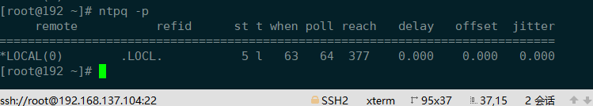
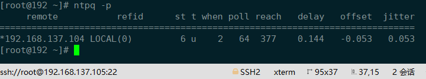
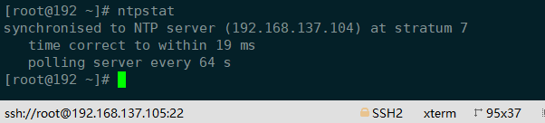

#system


## ntp服务端
`yum install ntp`

编辑配置文件`vim /etc/ntp.conf`
```bash
driftfile /var/lib/ntp/drift

# Permit time synchronization with our time source, but do not
# permit the source to query or modify the service on this system.
restrict default nomodify notrap nopeer noquery # 默认权限

restrict 127.0.0.1  # 本机没有权限限制
restrict ::1

# Hosts on local network are less restricted.
# 允许192.168.1.0这个网段的主机通过本机进行网络校时
#restrict 192.168.1.0 mask 255.255.255.0 nomodify notrap 

# Use public servers from the pool.ntp.org project.
# Please consider joining the pool (http://www.pool.ntp.org/join.html).
########## 把配置文件下面四行注释掉 ####################
# server 0.centos.pool.ntp.org iburst
# server 1.centos.pool.ntp.org iburst
# server 2.centos.pool.ntp.org iburst
# server 3.centos.pool.ntp.org iburst
########## 然后在下面添加这几行 ####################
# 外部时间服务器不可用时，以本地时间作为时间服务
server 127.127.1.0 prefer  
fudge  127.127.1.0 stratum 10

# 设定NTP主机来源（其中prefer表示优先主机）
server 120.25.115.20 prefer     # 阿里云ntp
restrict 120.25.115.20 nomodify notrap noquery # 允许上层时间服务器主动修改本机时间
```

修改完成后保存退出，并重启ntp（ `systemctl restart ntpd`）

## ntp客户端
`yum install ntp`

==方式一：==
`ntpdate ntp.aliyun.com`
立即同步，**在生产环境中慎用ntpdate**。时钟的跃变，对于某些程序会导致很严重的问题。


==方式二：==

ntpd 不仅仅是时间同步服务器，它还可以做客户端与标准时间服务器进行同步时间，而且是平滑同步，并非

编辑配置文件`vim /etc/ntp.conf`，注释掉默认ntp服务，使用我们自己配置的ntp服务器

```bash
driftfile /var/lib/ntp/drift
restrict default nomodify notrap nopeer noquery
restrict 127.0.0.1 
restrict ::1
#ntp服务器端的ip地址
server 192.168.137.104
restrict 192.168.137.104 nomodify notrap noquery # 允许上层时间服务器主动修改本机时间

```

修改完成后保存退出并重启ntp（ `systemctl restart ntpd`）。


## 查看信息

**查看网络中的ntp服务器**`ntpq -p`






**查看时间同步状态**\*\* ：一般需要5-10分钟后才能成功连接和同步\*\*​



```bash
remote           refid      st t when poll reach   delay   offset  jitter
==============================================================================
*192.168.137.104 LOCAL(0)   6  u  2    64   377    0.144   -0.053   0.053

remote # 即NTP主机的IP或主机名称
refid  # 表示提供时间来源的服务器的上层时间来源服务器地址。
st     # 即stratum阶层，值越小表示ntp serve的精准度越高；
t      # 表示类型 (u: unicast（单播） 或 manycast（选播） 客户端, b: broadcast（广播） 或 multicast（多播） 
       # 客户端, l: 本地时钟, s: 对称节点（用于备份）, A: 选播服务器, B: 广播服务器, M: 多播服务器。
when   # 表示最后一次同步距离现在过去了多长时间 (默认单位为秒, “h”表示小时，“d”表示天)。
poll   # 表示同步的频率,根据rfc5905建议在 ntp版本4系列，这个值的范围在 4 (16秒) 至 17 (36小时) 之间（即2的指数次秒）。
reach  # 一个8位的左移移位寄存器值，用来测试能否和服务器连接，每成功连接一次它的值就会增加，以 8 进制显示。
deleay # 表示本地到remote的延迟，即建立通信往返所用的时间,单位是毫秒。
offset # 表示本地与remote的时间偏移量，offset 越接近于0，本地与remote的时间越接近，单位为毫秒。
jitter # 表示本地与remote同步的时间源的平均偏差（多个时间样本中的 offset 的偏差，单位是毫秒），这个数值的绝对值越小，主机的时间就越精确。

```

```bash
# remote字段标识包含 ” “，”x”，”-“，”#”，”+”，”*”，”o”：（参见 Peer Status Word），
” ”   # 无状态
LOCAL # 即本机
x     # 已不再使用
-     # 已不再使用
#     # 良好的远程节点或服务器但是未被使用 （不在按同步距离排序的前六个节点中，作为备用节点使用）
+     # 良好的且优先使用的远程节点或服务器（包含在组合算法中）
*     # 当前作为优先主同步对象的远程节点或服务器

```
