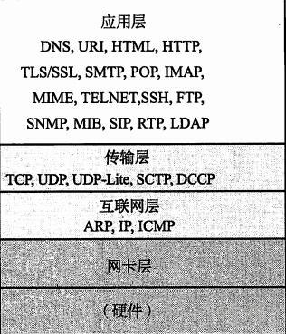

#arp #net
## 虚拟IP

**虚拟IP（Virtual IP Address），是一种不与特定计算机或者特定计算机网卡相对应的IP地址。所有发往这个IP地址的数据包最后都会经过真实的网卡到达目的主机的目的进程。**

虚拟IP主要是用来网络地址转换，网络容错和可移动性。

虚拟IP比较常见的一个用例就是在**系统高可用性（High Availability HA）** 方面的应用，通常一个系统会因为日常维护或者非计划外的情况而发生宕机，为了提高系统对外服务的高可用性，就会采用主备模式进行高可用性的配置。

当提供服务的主机`M`​宕机后，服务会切换到备用主机`S`​继续对外提供服务。而这一切用户是感觉不到的，在这种情况下系统对客户端提供服务的`IP`​地址就会是一个`虚拟IP`​，当主机`M`​宕机后，`虚拟IP`​便会漂浮到备机上，继续提供服务。

在这种情况下，**​`虚拟IP`​**​**就不是与特定计算主机或者特定某个物理网卡对应**，而是一种逻辑的概念。它是可以自由移动（自由漂浮）的，这样既对外屏蔽了系统内部的细节，又为系统内部的**可维护性和扩展性**提供了方便。

## ARP协议

### ARP协议

​`ARP`​协议属于`TCP/IP`​协议族里一种将`IP`​地址解析为`MAC`​地址的协议，位于`TCP/IP`​五层模型中的**网络层**。该协议是用来在局域网内**解析**​**​`IP地址`​**​**对应的物理地址**。



通常一个主机`A`​给另一个主机`B`​通过网络发送一个`IP`​数据报的时候，首先会发送到主机`A`​所在网络的的**路由器**上面，然后**路由器**会判断目的地址是否在本网络内，是则直接转发到本网络内的目的主机；否则会继续传递到下一个路由，直到到达指定的网络的**路由器**，指定网络的路由器会将此数据报发送到**目的主机**。

整个过程最后都会涉及到由某一个网络的**路由器（或者网关）** 将数据发送到网内某一主机的过程。这个过程通常是由**路由器**发送一个**ARP广播请求**，请求`IP`​地址和数据包目的`IP`​地址一致的主机将它自己的`MAC`​地址返回给**路由器**，因为**数据链路层的数据传输是通过物理地址传输的**。

**ARP请求**会广播到所有局域网内的主机，网内其他主机收到这个**ARP请求**后

- 检查发送**ARP请求**的主机的**IP地址**
- 将该**IP地址**和其对应的**MAC**地址存放在**ARP缓存**中
- 检查这个ARP请求中请求的IP地址是否为自己的IP地址，是则发送一个ARP应答，应答包含自己的IP地址和对应的MAC地址。

当网络内的路由器得到了**MAC**地址后，便可以通过数据链路层将数据包正确传输到目的主机上了。

### ARP缓存

**ARP**协议中比较重要的内容之一就是**ARP缓存**，主机操作系统会将**IP地址**与**MAC地址**的映射关系存放在主机的一片高速缓存中。

- 缓存失效：该缓存会在一定时间内失效，失效后，请求该IP地址时需要广播arp请求重新获取IP地址对应的MAC地址
- 缓存更新：当收到ARP请求时，会将发送ARP请求的主机IP地址与MAC地址记录下来，然后去更新本机ARP缓存中对应的记录

## 虚拟IP与ARP协议

#### 什么是虚拟ip

 按照维基百科上面的介绍，虚拟IP（Vrtual IP Address，vip）是一种不与特定计算机或者特定计算机网卡相对应的IP地址。所有发往这个IP地址的数据包最后都会经过真实的网卡到达目的主机的目的进程。主要是用来网络地址转换，网络容错和可移动性。

这种定义确实准确的定义了什么是虚拟IP，不过看完之后还是摸不着头脑。下面通过一个例子来介绍VIP。

虚拟IP比较常见的一个用例就是在系统高可用性（High Availability  HA）方面的应用，通常一个系统会因为日常维护或者非计划外的情况而发生宕机，为了提高系统对外服务的高可用性，就会采用主备模式进行高可用性的配置。当提供服务的主机M宕机后，服务会切换到备用主机S继续对外提供服务。而这一切用户是感觉不到的，在这种情况下系统对客户端提供服务的IP地址就会是一个虚拟IP，当主机M宕机后，虚拟IP便会漂浮到备机上，继续提供服务。在这种情况下，虚拟IP就不是与特定计算主机或者特定某个物理网卡对应的了，而是一种虚拟或者是说逻辑的概念，它是可以自由移动自由漂浮的，这样一来既对外屏蔽了系统内部的细节，又为系统内部的可维护性和扩展性提供了方便。

#### VIP漂移

在主机与主机之间通信的时候，会将IP地址翻译成MAC地址，然后主机之间通过这个mac地址相互通信，也就是ARP协议做的事情，如果不清楚什么是ARP协议，参考这篇文章[ARP，这个隐匿在计网背后的男人](https://mp.weixin.qq.com/s?__biz=MzI0ODk2NDIyMQ==&mid=2247487804&idx=1&sn=f001a24a308053b3723dfb12d36045ee&chksm=e999e42edeee6d383fbb411792e22e4028bb8c2441255786f50cf848443af7b1bd5e382078dc&scene=21#wechat_redirect)。

为了提高通信的效率，操作系统会对IP地址和MAC地址之间的映射进行缓存。但是这和VIP漂移有什么关系呢。可以试想下这种场景，当VIP在主机A上时，主机A的MAC地址为MAC\_A，某主机M的arp缓存中存放着一个映射关系：VIP-a  MAC\_A；当主机A宕机后，VIP漂浮到了主机B，主机B的MAC地址为MAC\_B，那么此时主机M想与VIP\_a通信时，是做不到，因为它的arp高速缓存中的VIP映射还指向主机A的MAC地址。

说了这么多，和VIP漂移有什么关系呢，当VIP进行漂移时，其它主机记录还是之前vip绑定的MAC地址，因此需要刷新其他主机的arp缓存，才能够正确的通信。要解决这个问题，需要引入一个新的概念garp，简称无端arp或者免费arp。主要是用来当某一个主机C开机时，用来确认自己的IP地址没有被人占用而做的一个检测。广播发送这个arp，请求得到本机IP地址的MAC地址，主机C并不希望此次arp请求会有arp应答，因为应答意味着IP地址冲突了。当其他主机收到这个arp请求后，会刷新关于这个arp请求源的主机IP地址的映射。

## 无偿ARP

从前文介绍arp协议里面来看，主机与主机的通信过程都会涉及到一个ip地址转换mac地址的过程，那么虚拟IP的通信也不会例外。因此，IP地址在主机通信的过程中其实就是一个逻辑地址。

我们知道，每一个主机都存放着网络内一些主机的逻辑地址与物理地址（MAC地址）的映射，那么问题来了：

当虚拟`IP`​（简称`VIP`​）在主机A上时，主机`A`​的`MAC`​地址为`MAC_A`​，某主机`M`​的`arp缓存`​中存放着一个映射关系：**VIP &lt;–&gt; MAC_A**；当主机`A`​宕机后, `VIP`​漂浮到了主机`B`​，主机`B`​的`MAC`​地址为`MAC_B`​，那么此时主机`M`​想与虚拟`IP`​通信时，是做不到的；因为它的`arp`​高速缓存中的`VIP`​的映射还指向主机`A`​的`MAC`​地址。这个问题解决的思路就是当`虚拟IP`​漂浮后，刷新所有其他主机的`arp缓存`​。

那么虚拟IP是如何实现漂浮后，是如何刷新所有其他主机的**ARP缓存**的呢？

这里就会引入另一个概念，**GARP(简称无端ARP或者免费ARP)** ，主要是用来当某一个主机`C`​开机时，用来确认自己的`IP`​地址没有被人占用而做的一个检测。广播发送这个`arp`​，请求得到本机`IP`​地址的`MAC`​地址，主机`C`​并不希望此次`arp`​请求会有`arp`​应答，**因为应答意味着IP地址冲突了**。**当其他主机收到这个arp请求后，会刷新关于这个arp请求源的主机IP地址的映射。**

​`GARP`​的作用主要有两个:

1. 检测IP地址是否有冲突
2. 刷新其他主机关于本次IP地址的映射关系

```bash
arping -I ens3  -s ${vip} ${gateway} -c 5
```

参考 [arp](../../../shell/shell%20命令手册/软件安装/arp.md) [arping](../../../shell/shell%20命令手册/网络相关/arping.md) 命令

## VRRP

VRRP是Virtual Router Redundancy Protocol的简称，即虚拟路由冗余协议，协议的具体内容可以参考[虚拟路由冗余协议(VRRP)](https://blog.csdn.net/qq_38265137/article/details/80404440)。这个协议的主要作用通过健康检查决定VIP什么时机进行漂移以及通过ARP协议向外通告VIP对应的MAC地址发生了变化。通过它可以实现VIP的自动漂移。

这里简单介绍下VRRP完整的工作过程

1. 两台机器互相进行健康检查；
2. 主机器对外响应虚拟地址的ARP请求，通告其MAC地址；
3. 虚拟地址网络流量被机器由处理；
4. 备用机器发现主机器故障，开始响应虚拟地址的ARP请求，通告其MAC地址；
5. 虚拟地址网络流量被备用机器处理；
6. 主机器恢复，重新响应ARP请求，夺回流量；
7. 备用机器发现主机器恢复，停止响应ARP请求，释放流量处理权；

常用的HA软件[Keepalived](http://www.keepalived.org/)实现了此协议，可以实现机器的故障隔离及负载均衡器间的失败切换，提高系统的可用性。

## 实践

上面也只是简单的总结了一些内容，要想整正的理解这些，还是需要上手做一些实验。我是按照[使用Docker-compose搭建nginx-keepalived双机热备来实现nginx集群](https://zhuanlan.zhihu.com/p/133085218)这篇文章搭建了基本的实验环境，然后按照[nginx高可用方案](https://www.yuque.com/docs/share/b6db6dd9-e737-4ade-a7dd-335fc84ac458#SGleK)这篇文章实践了主从模式，双主模式，最后一种DNS轮训还没想好怎么在本地实验。

‍

- 📄 [无偿ARP的作用与原理](无偿ARP的作用与原理.md)
