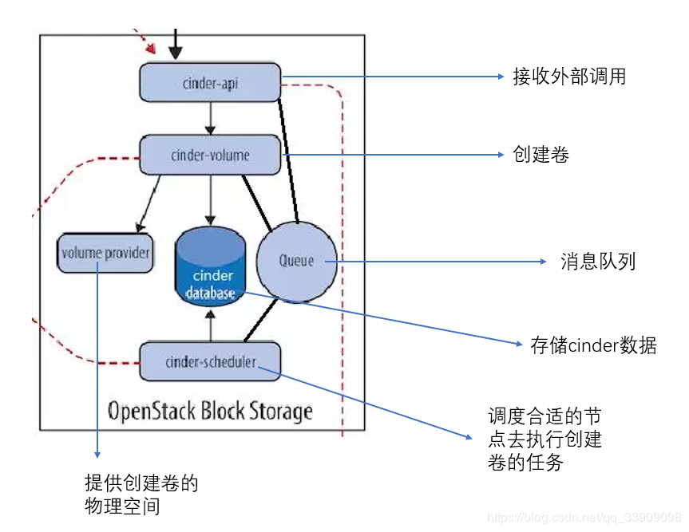
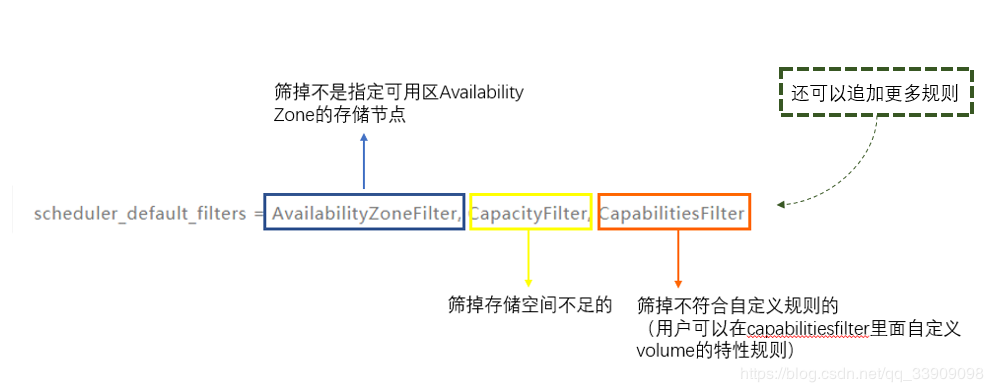
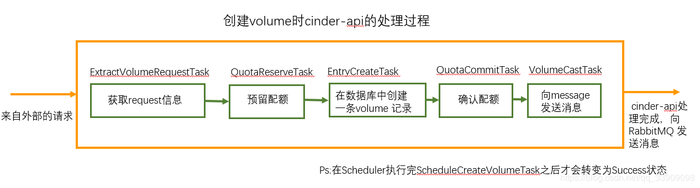
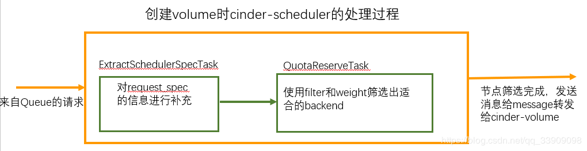
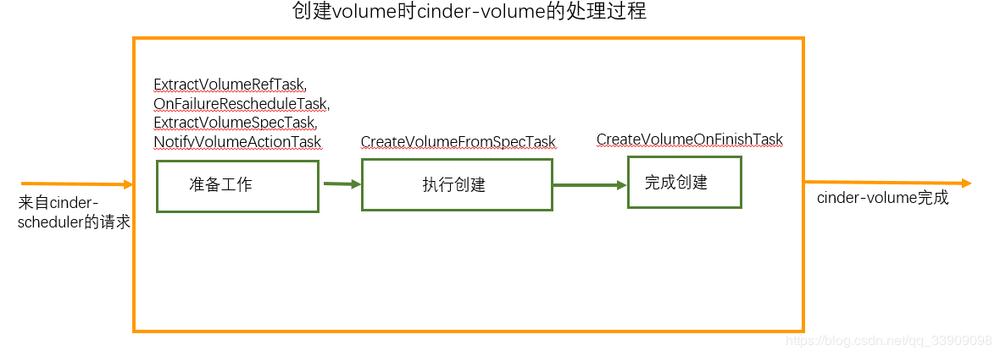
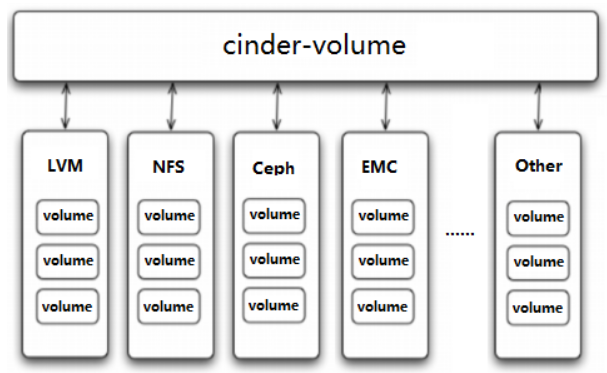
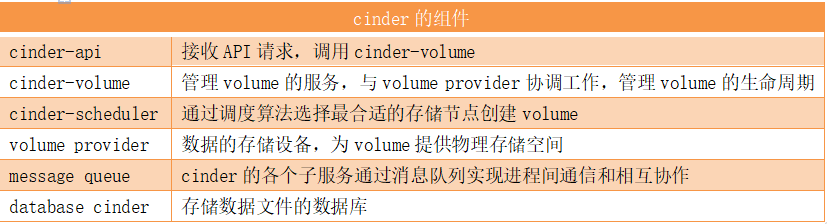
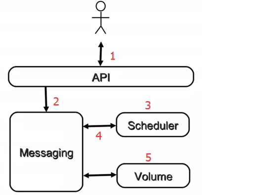
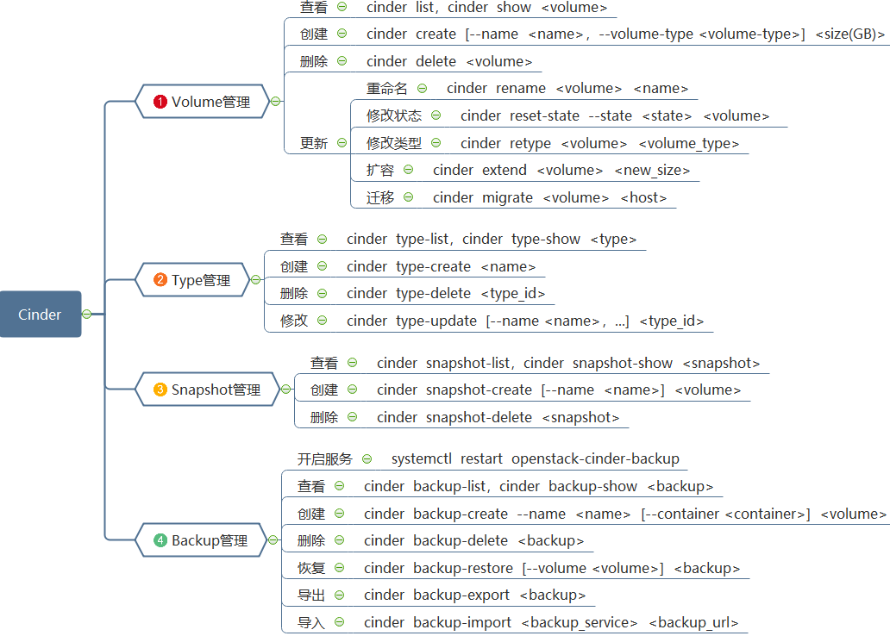
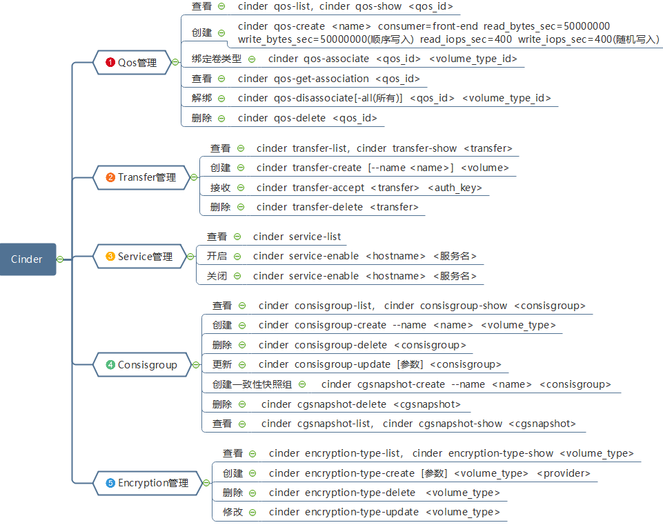

# 一、简介

## 1.作用

1. 块存储服务，为运行实例提供稳定的数据块存储服务。
2. 块存储服务，提供对 volume 从创建到删除整个生命周期的管理。

## 2.Block Storage

1. 操作系统获得存储空间的方式一般有两种：

   - 通过某种协议（SAS,SCSI,SAN,iSCSI 等）挂接裸硬盘，然后分区、格式化、创建文件系统；或者直接使用裸硬盘存储数据（数据库）。
   - 通过 NFS、CIFS 等 协议，mount 远程的文件系统。
2. 第一种裸硬盘的方式叫做 Block Storage（块存储），每个裸硬盘通常也称作 Volume（卷） 第二种叫做文件系统存储。NAS 和 NFS 服务器，以及各种分布式文件系统提供的都是这种存储。

## 3.Block Storage Service

块存储服务提供对 volume 从创建到删除整个生命周期的管理。从 instance 的角度看，挂载的每一个 Volume 都是一块硬盘。OpenStack 提供 Block Storage Service 的是 Cinder，其具体功能是：

1. 提供 REST API 使用户能够查询和管理 volume、volume snapshot 以及 volume type。
2. 提供 scheduler 调度 volume 创建请求，合理优化存储资源的分配
3. 通过 driver 架构支持多种 back-end（后端）存储方式，包括 LVM，NFS，Ceph 和其他诸如 EMC、IBM 等商业存储产品和方案

# 二、架构

## 1.核心架构

1. cinder采用的是松散的架构理念，由cinder-api统一管理外部对cinder的调用，cinder-scheduler负责调度合适的节点去构建volume存储。volume-provider通过driver负责具体的存储空间，然后cinder内部依旧通过消息队列queue沟通，解耦各子服务支持异步调用。

2\. cinder-sheduler通过filter进行删选，允许使用第三方的filter，自定义筛选内容。

## 2.核心组件

- **cinder-api**：接收 API 请求，调用 cinder-volume 执行操作。cinder-api 对接收到的 HTTP API 请求会做如下处理：

  1. 检查客户端传人的参数是否合法有效
  2. 调用 cinder 其他子服务的处理客户端请求
  3. 将 cinder 其他子服务返回的结果序列号并返回给客户端

  
- **cinder-scheduler**：Cinder 可以有多个存储节点，当需要创建 volume 时，cinder-scheduler 会根据存储节点的属性和资源使用情况选择一个最合适的节点来创建 volume。

  
- **cinder-volume**：cinder-volume 在存储节点上运行，OpenStack 对 Volume 的操作，最后都是交给 cinder-volume 来完成的。cinder-volume 自身并不管理真正的存储设备，存储设备是由 volume provider 管理的。cinder-volume 与 volume provider 一起实现 volume 生命周期的管理。

  1. 通过 Driver 架构支持多种 Volume Provider
  2. 定期向 OpenStack 报告计算节点的状态。cinder-volume 会定期向 Cinder 报告存储节点的空闲容量来做筛选启动volume
  3. 实现 volume 生命周期管理。Cinder 对 volume 的生命周期的管理最终都是通过 cinder-volume 完成的，包括 volume 的 create、extend、attach、snapshot、delete 等。

  
- **volume provider**：数据的存储设备，为 volume 提供物理存储空间。 cinder-volume 支持多种 volume provider，每种 volume provider 通过自己的 driver 与cinder-volume 协调工作。

  
- **Message Queue**：Cinder 各个子服务通过消息队列实现进程间通信和相互协作。因为有了消息队列，子服务之间实现了解耦，这种松散的结构也是分布式系统的重要特征。

  

## 3.工作流程

1. 用户向 cinder-api发送创建volume的请求
2. cinder-api对请求做一些必要处理后，通过 Messaging将创建消息发送给cinder-scheduler
3. cinder-scheduler从 Messaging 获取到 cinder-api发给它的消息，然后执行调度算法，从若干计存储点中选出节点 A
4. cinder-scheduler通过 Messaging 将创建消息发送给存储节点A
5. 存储节点 A 的 cinder-volume从 Messaging 中获取到 cinder-scheduler发给它的消息，然后通过 driver 在 volume provider 上创建 volume。

# 三、常用操作

## 1.volume、类型、快照、备份管理

## 2.限速、转移、服务、一致性组、加密管理

