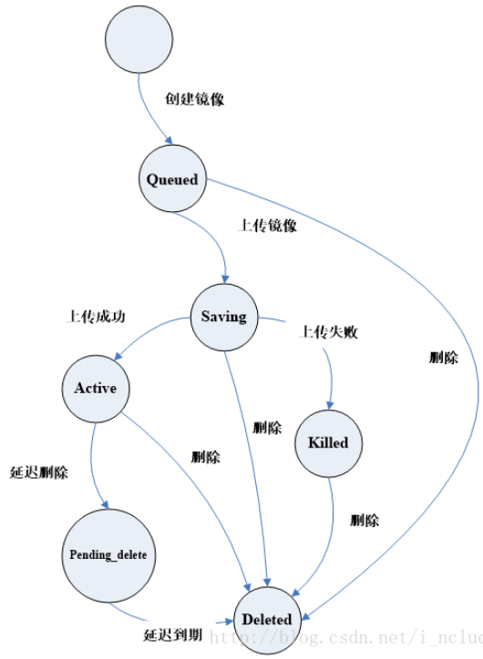
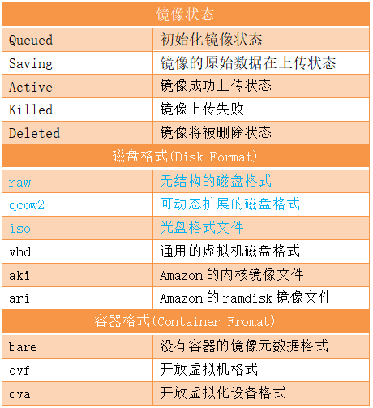
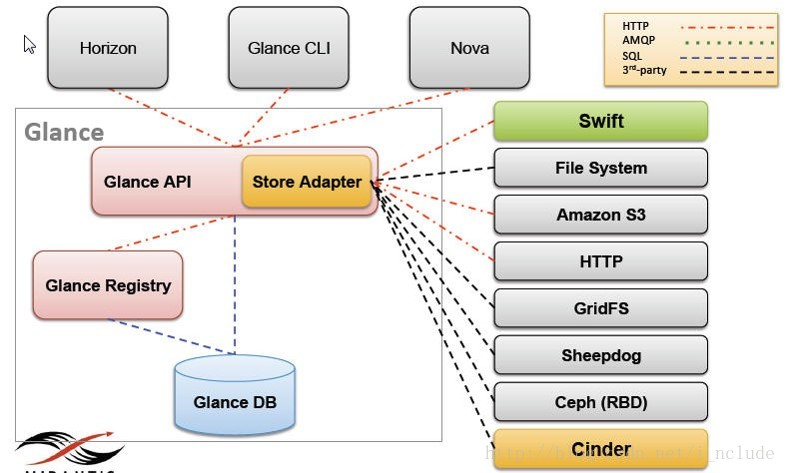
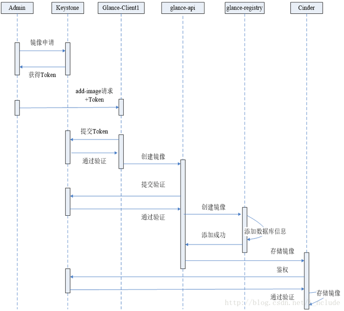
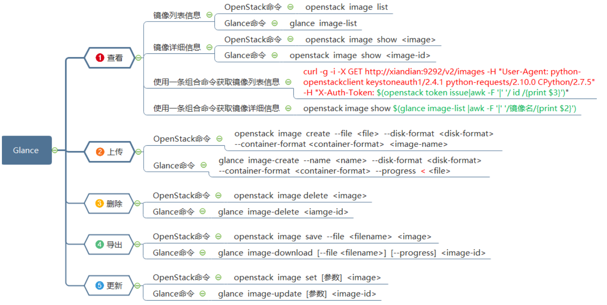

#openstack 

# 一、作用

*   Glance是OpenStack镜像服务，用来注册、登陆和检索虚拟机镜像。

*   Glance服务提供了一个REST API，使你能够查询虚拟机镜像元数据和检索的实际镜像。

*   通过镜像服务提供的虚拟机镜像可以存储在不同的位置，从简单的文件系统对象存储到类似OpenStack对象存储系统。

*   提供了对虚拟机部署的时候所能提供的镜像的管理，包含镜像的导入，格式，以及制作相应的模板

# 二、镜像状态

- **Queued**  初始化镜像状态，在镜像文件刚刚被创建，在glance数据库中已经保存了镜像标示符，但还没有上传至glance中，此时的glance对镜像数据没有任何描述，其存储空间为0。

- **Saving** 镜像的原始数据在上传中的一种过度状态，它产生在镜像数据上传至glance的过程中，一般来讲，glance收到一个image请求后，才将镜像上传给glance。

- **Active** 镜像成功上传完毕以后的一种状态，它表明glance中可用的镜像。

- **Killed**  镜像上传失败或者镜像文件不可读的情况下，glance将镜像状态设置成Killed。

- **Deleted**  镜像文件马上会被删除，只是当前glance这种仍然保留该镜像文件的相关信息和原始镜像数据。

- **Pending_delete**  镜像文件马上会被删除，镜像文件不能恢复。

# 三、磁盘格式

1.  **RAW**：RAW即常说的裸格式，它其实就是没有格式，最大的特点就是简单，数据写入什么就是什么，不做任何修饰，所以再性能方面很不错，甚至不需要启动这个镜像的虚拟机，只需要文件挂载即可直接读写内部数据。并且由于RAW格式简单，因此RAW和其他格式之间的转换也更容易。在KVM的虚拟化环境下，有很多使用RAW格式的虚拟机。

2.  **QCOW2**：它是QEMU的CopyOn Write特性的磁盘格式，主要特性是磁盘文件大小可以随着数据的增长而增长。譬如创建一个10GB的虚拟机，实际虚拟机内部只用了5GB，那么初始的qcow2磁盘文件大小就是5GB。与RAW相比，使用这种格式可以节省一部分空间资源。

3.  **VHD**：VHD也是一种通用的磁盘格式。微软公司的Virtual PC和Hyper-V使用的就是VHD格式。VirtualBox也提供了对VHD的支持。如果要在OpenStack上使用Hyper-V的虚拟化，就应该上传VHD格式的镜像文件。

4.  **VMDK**：VMware创建的一个虚拟机磁盘格式，目前也是一个开放的通用格式，除了VMware自家的产品外，QEMU和VirtualBox也提供了对VMDK格式的支持。

5.  **VDI**：Oracle公司的VirtualBox虚拟软件所使用的格式。

6.  **ISO**：ISO是指一种存档数据文件在光盘上的格式。

7.  **AKI、ARI、AMI**：Amazon公司的AWS所使用的镜像格式。

# 四、容器格式

1.  **BARE**：没有容器的一种镜像元数据格式。

2.  **OVF**：开放虚拟化格式。

3.  **OVA**：开放虚拟化设备格式。

4.  **AKI、ARI**：Amazon公司的AWS所使用的镜像格式。

# 五、核心架构

1.  Glance-api：接收REST API的请求，然后通过其他模块（glance-registry及image store）来完成诸如镜像的查找、获取、上传、删除等操作，默认监听端口9292。

2.  Glance-registry：用于与MariaDB数据库交互，用于存储或获取镜像的元数据（metadata），默认监听端口9191。

3.  Store Adapter：通过提供的存储接口来获取镜像

4.  Database：Image的metadata会保持到database中，主要使用MySQL和SQLite。

# 六、配置文件

1\. \*\*glance-api.conf \*\*：Glance api 服务配置文件。

2\. \*\*glance-registry.conf \*\*：Glanceregistry服务配置文件，用户存储镜像有关的元数据。

3. \*\*glance-scrubber.conf \*\*：用于清理已删除的镜像的服务。

4. **policy.json** ：镜像服务的访问控制。在这里，我们可以定义角色和策略，是OpenStack Glance中的安全特性。

# 七、工作流程

# 八、常用操作

