# fsck

## 简介

**fsck**（File System Consistency Check）是Linux的实用工具，用于检查文件系统是否存在错误或未解决的问题。该工具可以修复潜在的错误并生成报告。

默认情况下，Linux发行版附带此工具。使用fsck不需要特定的步骤或安装过程。打开终端后，就可以利用该工具的功能了。

按照本指南学习**如何使用fsck在Linux上检查和修复文件系统**。本教程将列出有关如何使用该工具以及用例的示例。

**先决条件**

- Linux或类UNIX系统
- 访问终端或命令行
- 具有root权限的用户可以运行该工具

## 何时在Linux中使用fsck

fsck工具可以在多种情况下使用：

- 使用fsck作为**预防性维护**或在系统出现问题时运行文件系统检查。
- fsck可以诊断的一个常见问题是**系统**何时**无法启动**。
- 另一个是当系统上的文件损坏时出现**输入/输出错误**。
- 还可以使用fsck实用工具检查**外部驱动器**（例如**SD卡**或**USB闪存驱动器）的运行状况**。

fsck实用工具的基本语法遵循以下模式：

```bash
fsck <options> <filesystem>
```

在上面的示例中，_filesystem_ 可以是设备，分区，挂载点等。还可以在命令末尾使用特定于文件系统的选项。

## 如何检查和修复文件系统

在检查和修复文件系统之前，需要执行几个步骤。

### 查看已安装的磁盘和分区

要查看系统上所有已安装的设备并检查磁盘位置，请使用Linux中可用的工具之一。例如，使用**df** 命令列出文件系统磁盘：

```bash
df -h
```

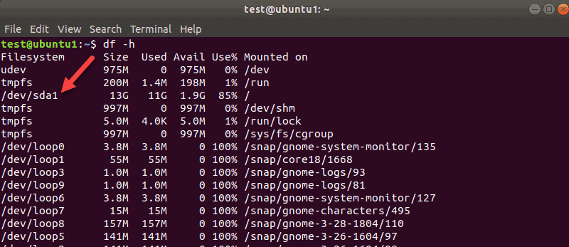

该工具可以打印系统上文件系统的使用情况。记下要使用**fsck**命令检查的磁盘。

例如，**要查看**第一个磁盘的**分区**，请使用以下命令：

```bash
sudo parted /dev/sda 'print'
```

**sda**是Linux指代第一个SCSI磁盘的方式。如果有两个，则第二个为**sdb**，依此类推。

在我们的示例中，由于该虚拟机上只有一个分区，因此得到了一个结果。如果有更多的分区，我们将获得更多的结果。

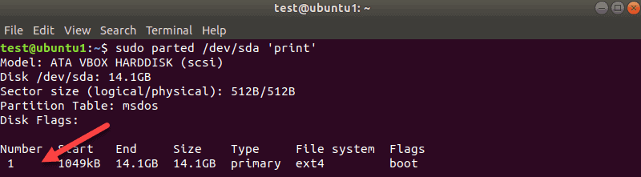

此处的磁盘名称为 **/dev/sda** ，然后在“_Number”_列中显示分区的_编号_。在我们的例子中是：**sda1。**

### 卸载磁盘

必须先卸载磁盘或分区，然后才能使用**fsck**进行磁盘检查。如果尝试在已安装的磁盘或分区上运行**fsck**，则会收到警告：
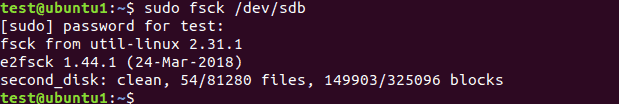

确保运行**unmount**命令：

```bash
sudo umount /dev/sdb
```

替换_/dev/sdb_为要卸载的设备。

---

**注意：** 我们不能卸载根文件系统。因此，现在**fsck**不能在正在运行的计算机上使用。

---

### 运行fsck检查错误

现在已经卸载了磁盘，就可以运行了**fsck**。要检查第二个磁盘，请输入：

```bash
sudo fsck /dev/sdb
```

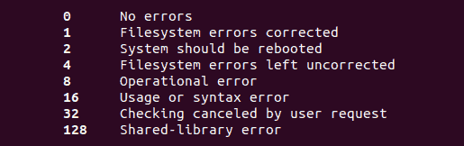

上面的示例显示了正常磁盘的输出。如果磁盘上有多个问题，则每个错误都会出现一个提示，需要手动确认操作。

fsck实用工具返回的退出代码如下：

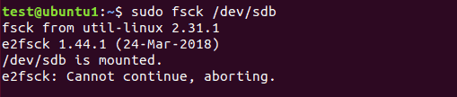

### 挂载磁盘

完成检查和修复设备后，请挂载磁盘，以便可以再次使用它。

在本例中，我们将重新安装**sdb**磁盘：

```bash
mount /dev/sdb
```

### 使用fsck进行试运行

在执行实时检查之前，可以使用fsck进行测试运行。将 **-N** 选项传递给**fsck**命令以执行测试：

```bash
sudo fsck -N /dev/sdb
```

输出显示将发生的情况，但不执行任何操作。

### 使用fsck自动修复检测到的错误

要尝试解决潜在问题而没有任何提示，请将 **-y**选项传递给**fsck**。

```bash
v
```

### 跳过修复，但在输出中显示fsck错误

如果要检查[文件系统](https://phoenixnap.com/kb/linux-file-system)上的潜在错误而不进行修复，请使用 **-n**选项。

```bash
sudo fsck -n /dev/sdb
```

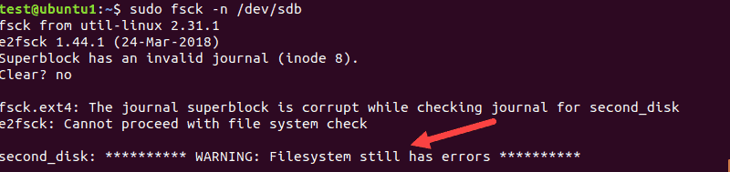

### 强制fsck执行文件系统检查")强制fsck执行文件系统检查

在正常的设备上执行fsck时，该工具会跳过文件系统检查。如果要强制检查文件系统，请使用该 **-f** 选项。

```bash
sudo fsck -f /dev/sdb
```

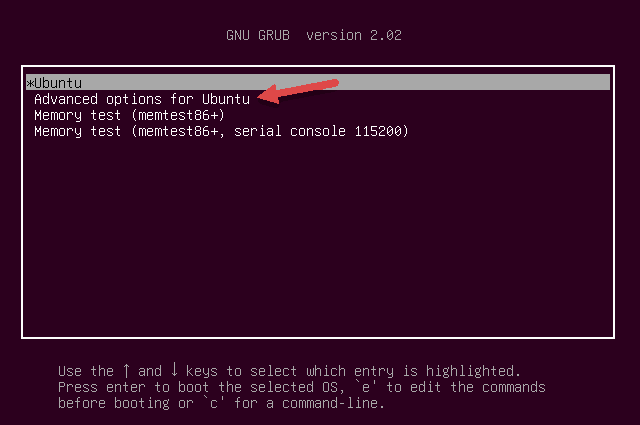

即使认为没有问题，也会执行扫描以搜索损坏。

### 一次在所有文件系统上运行fsck")一次在所有文件系统上运行fsck

如果要一次性检查所有使用fsck的文件系统，请传递该 **-A**标志。此选项将遍历_/etc/fstab_ 中所有的磁盘并执行检查。

由于无法在正在运行的计算机上卸载根文件系统，因此请添加 **-R** 选项以跳过它们：

```bash
fsck -AR
```

### 在特定文件系统上跳过fsck")在特定文件系统上跳过fsck

如果要fsck跳过检查文件系统，则需要在文件系统之前添加 **-t** 。

例如，要跳过_ext3_文件系统，请运行以下命令：

```bash
sudo fsck -AR -t noext3 -y
```

我们添加 **-y**了跳过提示。

### 在已挂载的文件系统上跳过fsck

为确保不在已挂载的文件系统上运行fsck，请添加该 **-M** 选项。该标志告诉fsck工具跳过任何已挂载的文件系统。

为了说明挂载前后的区别，我们将在**sdb**挂载时和卸载后分别执行fsck检查。

```bash
sudo fsck -M /dev/sdb
```

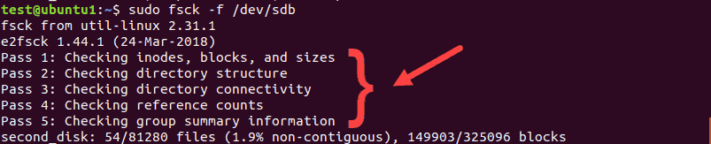

当**sdb**被挂载时，该工具退出而不运行检查。然后，我们卸载**sdb**并再次运行相同的命令。这次，**fsck**检查磁盘并将其报告为正常磁盘或有错误。

---

**注意：** 如果想要删除第一行标题“_fsck from util-linux 2.31.1_”，请使用 **-T**选项。

---

### 在Linux根分区上运行fsck")在Linux根分区上运行fsck

正如我们已经提到的，fsck无法检查正在运行的计算机上的根分区，因为它们已经挂载并正在使用中。但是，如果进入恢复模式并运行**fsck检查**，是可以检查Linux根分区的。

1.为此，请通过GUI或使用终端打开或重新启动计算机：

```bash
sudo reboot
```

2.在启动过程中按住**Shift**键。出现GNU GRUB菜单。

3.选择**Ubuntu的高级选项**。

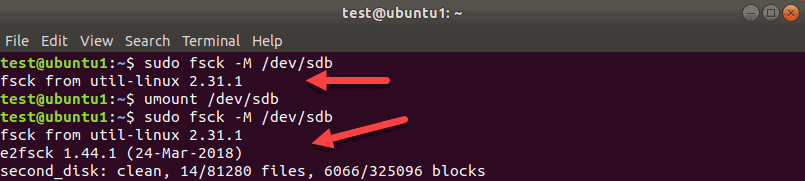

4.然后，选择末尾带有_（恢复模式）_的条目。让系统加载到“恢复菜单”中。

5.从菜单中选择**fsck**。

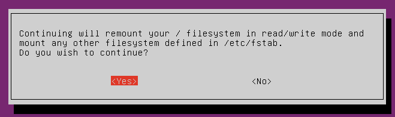

6.通过在提示符下选择 **&lt;是&gt;** 进行确认。

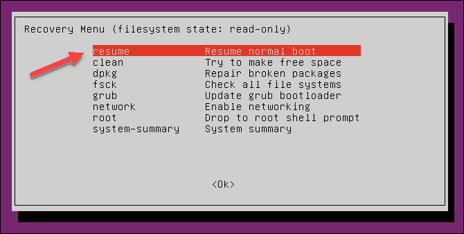

7.完成后，在恢复菜单中选择“**恢复**”以启动计算机。

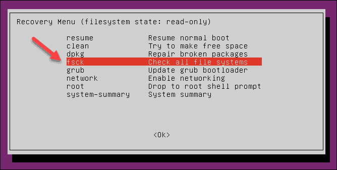

## 如果fsck被中断怎么办")如果fsck被中断怎么办

正常来说，**不应该打断**正在进行的fsck检查。但是，如果该过程被中断，fsck将完成正在进行的检查，然后停止。

如果该实用工具在检查过程中发现错误，则如果中断，它将不会尝试修复任何问题。可以在下次重新运行检查。

## fsck Linux命令选项列表

最后，下面是可与**fsck Linux实用工具**一起使用的选项列表。

|选项|描述|
| ------| --------------------------------------------------------------------------------------|
|-a|尝试自动修复文件系统错误。不会出现提示，因此请谨慎使用。|
|-A|检查/etc/fstab中列出的所有文件系统。|
|-C|显示检查ext2和ext3文件系统的进度。|
|-F|强制fsck检查文件系统。该工具甚至在文件系统看起来正常时也进行检查。|
|-l|锁定设备，以防止其他程序在扫描和修复期间使用该分区。|
|-M|不要检查已挂载的文件系统。挂载文件系统时，该工具返回退出代码0。|
|-N|做空试。输出显示fsck在不执行任何操作的情况下将执行的操作。警告或错误消息也将被打印。|
|-P|用于在多个文件系统上并行运行扫描。请谨慎使用。|
|-R|使用-A选项时，告诉fsck工具不要检查根文件系统。|
|-r|打印设备统计信息。|
|-t|指定要使用fsck检查的文件系统类型。请查阅手册页以获取详细信息。|
|-T|工具启动时隐藏标题。|
|-y|尝试在检查期间自动修复文件系统错误。|
|-V|详细输出。|

**结论**

现在我们知道了**如何使用fsck Linux命令来检查和修复文件系统**。该指南提供了该工具的功能和示例。

在运行列出的命令之前，请确保具有root权限。有关所有选项的详细说明，还可以查阅该工具的**手册文件**或访问[fsck Linux手册页](https://linux.die.net/man/8/fsck)。

‍
