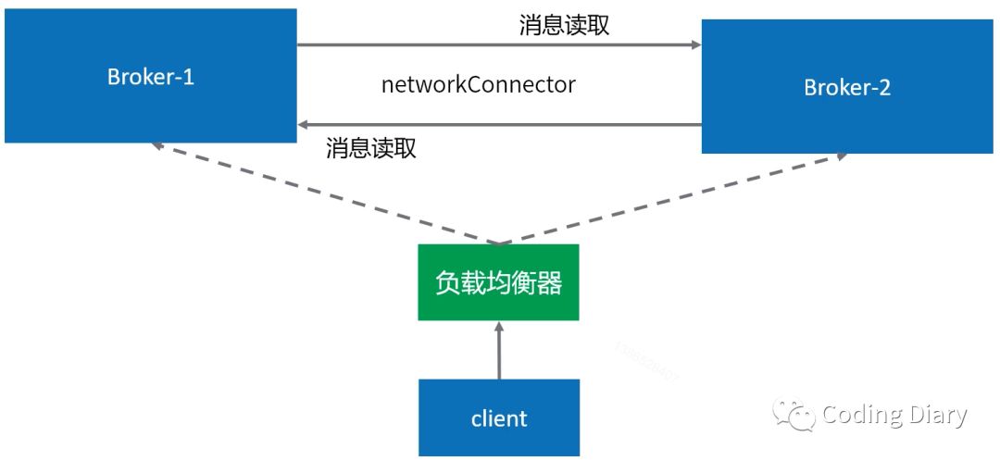

Broker-Cluster部署方式中，各个broker通过网络互相连接，并共享queue。当broker-A上面指定的queue-A中接收到一个message处于pending状态，而此时没有consumer连接broker-A时。如果cluster中的broker-B上面有一个consumer在消费queue-A的消息，那么broker-B会先通过内部网络获取到broker-A上面的message，并通知自己的consumer来消费。  
**优点是可以解决负载均衡和分布式的问题。但不支持高可用。**



## static Broker-Cluster

static 方式就是在broker的配置中，静态指定要连接到其它broker的地址，格式：

1. 修改192.168.0.10上的 ~/activemq/conf/activemq.xml，在`<broker></broker>`​标签中添加以下代码

```xml
 <broker xmlns="http://activemq.apache.org/schema/core" brokerName="activemq-cluster" dataDirectory="${activemq.data}">
		<networkConnectors>
		       <networkConnector name="group1" uri="static:(tcp://192.168.0.20:61616)"/>   
		</networkConnectors>

		<destinationPolicy>

<!-- Master-Slave与Broker-Cluster结合部署时，每组的broker要用name属性区分-->
```

2. 修改192.168.0.20上的 ~/activemq/conf/activemq.xml，在`<broker></broker>`​标签中添加以下代码

```xml
 <broker xmlns="http://activemq.apache.org/schema/core" brokerName="activemq-cluster" dataDirectory="${activemq.data}">
		<networkConnectors>
		       <networkConnector name="group1" uri="static:(tcp://192.168.0.10:61616)"/>   
		</networkConnectors>

		<destinationPolicy>
```

## Dynamic Broker-Cluster

ActiveMQ 通过组播方式将自己的信息发送出去，接收到的信息的机器再来连接这个发送源。默认情况下，ActiveMQ 发送的是机器名，可以通过配置修改成发送IP地址。**注意机器间的网络**。

1. 修改每台机器上的 ~/activemq/conf/activemq.xml，在<broker></broker>标签中添加以下代码

```xml
    <networkConnectors>  
        <networkConnector uri="multicast://default"/>  
    </networkConnectors>
```

2. 修改transportConnector，增加discoveryUri属性，并添加publishedAddressPolicy

```xml
    <transportConnector name="openwire" uri="tcp://0.0.0.0:61616?maximumConnections=1000&amp;wireFormat.maxFrameSize=104857600" discoveryUri="multicast://default">  
     <publishedAddressPolicy>  
         <publishedAddressPolicy publishedHostStrategy="IPADDRESS"></publishedAddressPolicy>  
     </publishedAddressPolicy>  
    </transportConnector>
```

## broker-cluster 配置属性

|属性名称|默认值|属性意义|
| -------------------------------------| --------| --------------------------------------------------------------------------------------------------------------------------|
|name|bridge|名称|
|dynamicOnly|false|如果为true, 持久订阅被激活时才创建对应的网路持久订阅。|
|decreaseNetworkConsumerPriority|false|如果为true，网络的消费者优先级降低为-5。如果为false，则默认跟本地消费者一样为0.|
|excludedDestinations|empty|不通过网络转发的destination|
|dynamicallyIncludedDestinations|empty|通过网络转发的destinations，注意空列表代表所有的都转发。|
|staticallyIncludedDestinations|empty|匹配的都将通过网络转发-即使没有对应的消费者，如果为默认的“empty”，那么说明所有都要被转发|
|prefetchSize|1000|设置网络消费者的prefetch size参数。如果设置成0，那么就像之前文章介绍过的那样：消费者会自己轮询消息。显然这是不被允许的。|
|suppressDuplicateQueueSubscriptions|false|如果为true, 重复的订阅关系一产生即被阻止（V5.3+ 的版本中可以使用）。|
|bridgeTempDestinations|true|是否广播advisory messages来创建临时destination。|
|alwaysSyncSend|false|如果为true，非持久化消息也将使用request/reply方式代替oneway方式发送到远程broker（V5.6+ 的版本中可以使用）。|
|staticBridge|false|如果为true，只有staticallyIncludedDestinations中配置的destination可以被处理（V5.6+ 的版本中可以使用）。|

以下这些属性，**只能在静态Network Connectors模式下使用**

|属性名称|默认值|属性意义|
| -----------------------| --------| ----------------------------------------------------------------------|
|initialReconnectDelay|1000|重连之前的等待的时间(ms) (如果useExponentialBackOff为false)|
|useExponentialBackOff|true|如果该属性为true，那么在每次重连失败到下次重连之前，都会增大等待时间|
|maxReconnectDelay|30000|重连之前等待的最大时间(ms)|
|backOffMultiplier|2|增大等待时间的系数|

## Master-Slave与Broker-Cluster结合部署

这里使用ZK搭建两组MASTER SLAVE，然后使用BROKER CLUSTER把两个“组”合并在一起

1. 搭建两组[3.ZooKeeper+Replicated LevelDB Store](#3.ZooKeeper+Replicated%20LevelDB%20Store)
2. 将两组结合[1.static Broker-Cluster](#1.static%20Broker-Cluster)，注意：每组的name属性不一样，同组的要一样。

    ```xml
    <networkConnector name="group1" uri="static:(tcp://host1:61616,tcp://host2:61616)"/>
    <networkConnector name="group2" uri="static:(tcp://host1:61616,tcp://host2:61616)"/>
    ```
