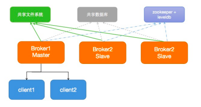
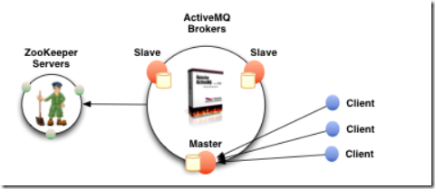

Master-Slave集群由至少3个节点组成，一个Master节点，其他为Slave节点。只有Master节点对外提供服务，Slave节点处于等待状态。当主节点宕机后，从节点会推举出一个节点出来成为新的Master节点，继续提供服务。  
**优点是可以解决多服务热备的高可用问题，缺点是无法解决负载均衡和分布式的问题。**



Master-Slave模式常用持久化方式：

|主从类型|必备条件|优点|缺点|
| -------------------------------------------------| --------------------------------| -------------------------------------------------------| -------------------------------------|
|Shared File System Master Slave（共享文件系统）|需要一个共享文件系统 例如：SAN|可按需运行多个从节点，并能从故障中自动恢复|需要一个SAN|
|JDBC Master Slave|需要个共享的数据库|可按需运行多个从节点， 并能从故障中自动恢复|需要一个共享数据库。 性能急剧下降。|
|Replicated LevelDB Store（复制的leveldb存储）|需要一个ZooKeeper服务|可按需运行多个从节点， 并能从故障中自动恢复。非常的快|需要一个zookeeper服务|

### shared filesystem Master-Slave

如果集群搭建在一台机器上需要改端口；如果搭建在多台服务器上，那么共享目录需要通过磁盘挂载的方式挂载到主从机器上。

​`vim conf/activemq.xml`​

```xml
<persistenceAdapter>
<kahaDB directory="${activemq.data}/kahadb"/>
</persistenceAdapter>
```

在启动时，master会获取broker file directory的独占文件锁 - 所有其他的brokers都是slave，并且处于等待独占锁的pause状态。  
**确保KahaDB正确使用**。不要在CIFS / SMB上运行共享存储，也不要将其保存在任何类型的基于NTFS的文件系统上。通过使用iSCSI协议和GFS2之类的多用户文件系统，可以获得最佳吞吐量。

客户端使用 failover 作为连接串

```java
ConnectionFactory connectionFactory = new ActiveMQConnectionFactory(
																	ActiveMQConnection.DEFAULT_USER, 
																	ActiveMQConnection.DEFAULT_PASSWORD, 
																	"failover:(tcp://192.168.0.200:61616,tcp://192.168.0.201:61616)");
```

### shared database Master-Slave

该方式与共享文件系统方式类似，只是共享的存储介质由文件系统改成了数据库。

配置文件的Beans标签中添加：

```xml
<!-- persistent=true-->  
<broker brokerName="localhost" persistent="true" xmlns="http://activemq.apache.org/schema/core">  
    <persistenceAdapter>  
       <!--配置数据源-->
       <!--注意：需要添加mysql-connector-java相关的jar包到avtivemq的lib包下-->
        <jdbcPersistenceAdapter dataSource="#mysql-ds" useDatabaseLock="false" transactionIsolation="4"/>  
    </persistenceAdapter>  
      ........  
</broker>  
<!-- MySql DataSource Sample Setup  根据需要，把数据库驱动放到activemq目录下 lib/extra-->  
<bean id="mysql-ds" class="org.apache.commons.dbcp2.BasicDataSource" destroy-method="close">  
    <property name="driverClassName" value="com.mysql.jdbc.Driver"/>  
    <property name="url" value="jdbc:mysql://192.168.0.200:3306/test_activemq?relaxAutoCommit=true"/>  
    <property name="username" value="activemq"/>  
    <property name="password" value="test123456"/>  
    <property name="poolPreparedStatements" value="true"/>  
</bean>

```

在每个ActiveMQ的lib目录下加入mysql的驱动包和数据库连接池Druid包。

### ZooKeeper+Replicated LevelDB Store

这种主备方式是ActiveMQ5.9以后才新增的特性，使用ZooKeeper协调选择一个node作为master。被选择的master broker node开启并接受客户端连接，类似于redis的哨兵模式。



==原理说明：==  
1）使用Zookeeper集群注册所有的ActiveMQ Broker，但只有其中一个Broker可以提供服务，它将被视为Master,其他的Broker处于待机状态被视为Slave。如果Master因故障而不能提供服务，Zookeeper会从Slave中选举出一个Broker充当Master。  
2）Slave连接Master并同步他们的存储状态，Slave不接受客户端连接。所有的存储操作都将被复制到连接至Maste的Slaves。
3）如果Master宕机得到了最新更新的Slave会变成Master。故障节点在恢复后会重新加入到集群中并连接Master进入Slave模式。
4）所有需要同步的消息操作都将等待存储状态被复制到其他法定节点的操作完成才能完成。所以，如给你配置了replicas=3，name法定大小是（3/2）+1 = 2。Master将会存储更新然后等待（2-1）=1个Slave存储和更新完成，才汇报success。有一个node要作为观察者存在。当一个新的Master被选中，你需要至少保障一个法定mode在线

|主机ip|zookeeper集群端口|AMQ集群bind端口|AMQ 消息tcp端口|AMQ 控制台端口|
| --------------| -------------------| -----------------| -----------------| ----------------|
|192.168.0.10|2181|0.0.0.0:63631|61616 默认|8161 默认|
|192.168.0.20|2181|0.0.0.0:63632|61616 默认|8161 默认|
|192.168.0.30|2181|0.0.0.0:63633|61616 默认|8161 默认|

#### 1. zookeeper集群

参考：[4、zookeeper集群环境搭建](../zookeeper/zookeeper%20概述.md#4、zookeeper集群环境搭建)

#### 2. activemq集群

主要修改 conf/activemq.xml 文件，持久化配置，三台activemq都修改  
注意：每个 ActiveMQ 的 BrokerName 必須相同，否則不能加入集群

```xml
<broker xmlns="http://activemq.apache.org/schema/core" brokerName="zookeeper" dataDirectory="${activemq.data}">
<persistenceAdapter>
   <!-- <kahaDB directory="${activemq.data}/kahadb"/> -->
   <replicatedLevelDB
        directory="${activemq.data}/leveldb"
        replicas="3"
        bind="tcp://0.0.0.0:63631"
        zkAddress="192.168.0.10:2181,192.168.0.20:2181,192.168.0.30:2181"
        hostname="192.168.0.10"
        zkPath="/activemq/leveldb-stores"
        sync="local_disk"
        />
</persistenceAdapter>

<!-- 配置参数说明 
## **下列参数，所有节点必须一致**：
directory： 存储数据的路径
replicas：集群中的节点数
zkAddress：是zk集群的地址，即每个zk的IP：port 使用逗号分隔
zkPassword：当连接到ZooKeeper服务器时用的密码，没有密码则不配置。
zkPah：zookeeper上存储主从信息的目录，启动服务后actimvemq会到zookeeper上注册生成此路径
securityToken：安全token，所有节点必须一致，用于互相访问
zkSessionTimeout：默认2s，zookeeper多长时间会认为一个节点失效，5.11之后加入
sync：在消息被消费完成前，同步信息所存贮的策略。如果有多种策略用逗号隔开，ActiveMQ会选择较强的策略。
而如果有local_mem, local_disk这两种策略的话，那么ActiveMQ则优先选择local_disk策略，存储在本地硬盘。

## **下面的配置是每个节点特殊的配置**
bind：当该节点成为主节点时，绑定的地址和端口，用于服务复制协议。还支持使用动态端口，只需配置tcp:/ / 0.0.0.0:0
hostname： ActiveMQ所在主机的IP
weight：权重 具有最高权重的最新更新的从节点将成为主节点。
-->

```

主要修改 conf/jetty.xml 文件，修改控制台host，三台activemq都修改

```bash
        <property name="host" value="0.0.0.0"/>
        <property name="port" value="8161"/>
```

#### 3. 启动集群

先启动zookeeper集群再启动activemq集群

```bash
# 三台机器启动zookeeper服务
/data/zookeeper/bin/zkServer.sh start
/data/zookeeper/bin/zkServer.sh status

# 三台机器启动activemq服务
/data/activemq/bin/activemq start
```

#### 4. 查看集群状态

登陆zookeeper

```bash
/data/zookeeper/bin/zkCli.sh -server 127.0.0.1:2181

[zk: 127.0.0.1:2181(CONNECTED) 6] ls /
[activemq, zookeeper]
[zk: 127.0.0.1:2181(CONNECTED) 7] ls /activemq
[leveldb-stores]
[zk: 127.0.0.1:2181(CONNECTED) 8] ls /activemq/leveldb-stores 
[00000000000, 00000000001, 00000000002]
[zk: 127.0.0.1:2181(CONNECTED) 9] ls /zookeeper 
[config, quota]
[zk: 127.0.0.1:2181(CONNECTED) 10] ls /zookeeper/config 
[]
[zk: 127.0.0.1:2181(CONNECTED) 11] ls /zookeeper/quota 
[]
[zk: 127.0.0.1:2181(CONNECTED) 12] ls /activemq/leveldb-stores/0000000000
00000000000   00000000001   00000000002   
[zk: 127.0.0.1:2181(CONNECTED) 12] get /activemq/leveldb-stores/00000000000
{"id":"zookeeper","container":null,"address":"tcp://192.168.0.10:63631","position":-1,"weight":1,"elected":"0000000000"}
[zk: 127.0.0.1:2181(CONNECTED) 13] get /activemq/leveldb-stores/00000000001
{"id":"zookeeper","container":null,"address":null,"position":-1,"weight":1,"elected":null}
[zk: 127.0.0.1:2181(CONNECTED) 14] get /activemq/leveldb-stores/00000000002
{"id":"zookeeper","container":null,"address":null,"position":-1,"weight":1,"elected":null}
[zk: 127.0.0.1:2181(CONNECTED) 15] 
```

#### 5. 测试故障切换

```bash
/data/activemq/bin/activemq stop

[zk: 127.0.0.1:2181(CONNECTED) 0] ls /
[activemq, zookeeper]
[zk: 127.0.0.1:2181(CONNECTED) 1] ls /activemq 
[leveldb-stores]
[zk: 127.0.0.1:2181(CONNECTED) 2] ls /activemq/leveldb-stores 
[00000000001, 00000000002]
[zk: 127.0.0.1:2181(CONNECTED) 3] ls /activemq/leveldb-stores/0000000000
00000000001   00000000002   
[zk: 127.0.0.1:2181(CONNECTED) 3] get /activemq/leveldb-stores/00000000001
{"id":"zookeeper","container":null,"address":"tcp://192.168.0.20:63632","position":-1,"weight":1,"elected":"0000000001"}
[zk: 127.0.0.1:2181(CONNECTED) 4] 
```

#### 6. client配置

```bash
# 在application.properties配置连接信息如下：
spring.activemq.broker-url=failover:(tcp://192.168.0.10:61616,tcp://192.168.0.20:61616,tcp://192.168.0.30:61616)

spring.activemq.user=admin
spring.activemq.password=admin
spring.activemq.pool.enabled=true
spring.activemq.pool.max-connections=50
```
