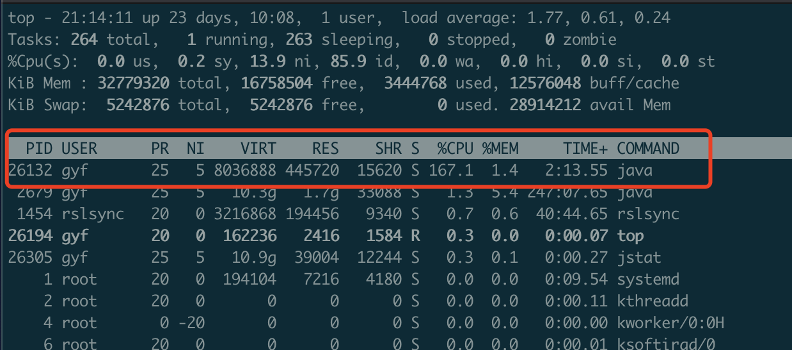
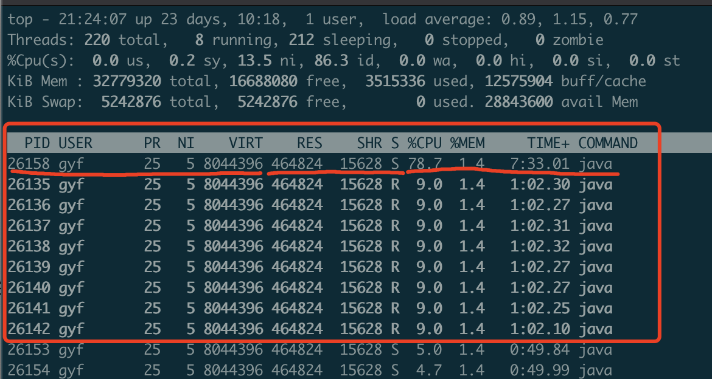
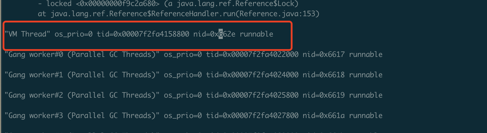
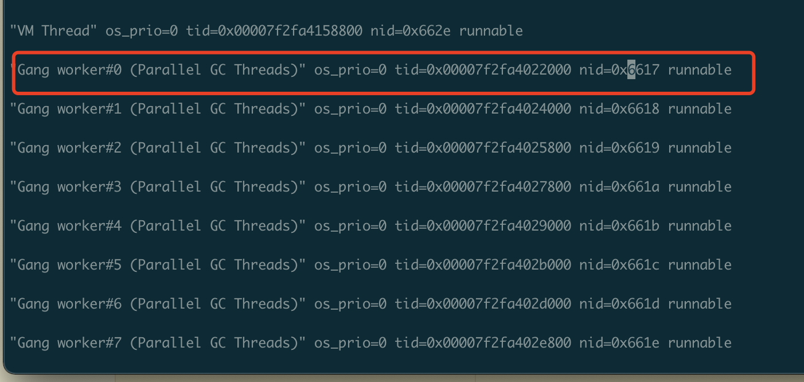
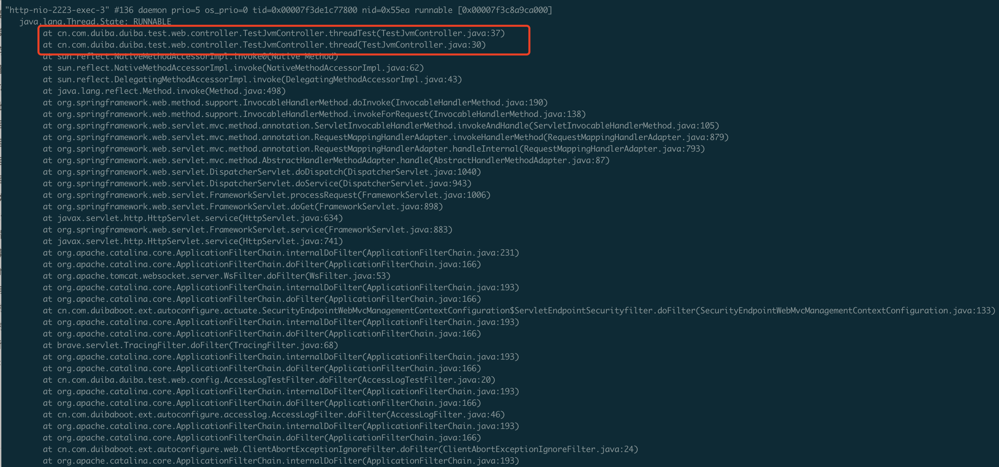

## 一、获取cpu高的Java进程 [#](https://journal.kazmodan.com/docs/%E7%BC%96%E7%A8%8B%E7%94%9F%E6%80%81/Java/JVM/Java%E5%BA%94%E7%94%A8CPU%E4%BD%BF%E7%94%A8%E7%8E%87%E9%AB%98%E4%B8%80%E8%88%AC%E6%8E%92%E6%9F%A5%E6%80%9D%E8%B7%AFcentos/#%e4%b8%80%e8%8e%b7%e5%8f%96cpu%e9%ab%98%e7%9a%84java%e8%bf%9b%e7%a8%8b)

登陆问题服务器，执行如下命令：

```shell
top
```

可以看到类似图示的结果



- 图中可知，CPU高的Java进程 PID \= 26132

## 二、获取Java进程中占cpu高的若干线程id [#](https://journal.kazmodan.com/docs/%E7%BC%96%E7%A8%8B%E7%94%9F%E6%80%81/Java/JVM/Java%E5%BA%94%E7%94%A8CPU%E4%BD%BF%E7%94%A8%E7%8E%87%E9%AB%98%E4%B8%80%E8%88%AC%E6%8E%92%E6%9F%A5%E6%80%9D%E8%B7%AFcentos/#%e4%ba%8c%e8%8e%b7%e5%8f%96java%e8%bf%9b%e7%a8%8b%e4%b8%ad%e5%8d%a0cpu%e9%ab%98%e7%9a%84%e8%8b%a5%e5%b9%b2%e7%ba%bf%e7%a8%8bid)

根据步骤一的结果 PID \= 26132 执行如下命令

```shell
top -H -p 26132
```

可以看到图示的结果



图中有1个线程CPU使用率最高78.7%，有8个线程cpu使用率次之，都为9%

## 三、找到线程对应的堆栈信息 [#](https://journal.kazmodan.com/docs/%E7%BC%96%E7%A8%8B%E7%94%9F%E6%80%81/Java/JVM/Java%E5%BA%94%E7%94%A8CPU%E4%BD%BF%E7%94%A8%E7%8E%87%E9%AB%98%E4%B8%80%E8%88%AC%E6%8E%92%E6%9F%A5%E6%80%9D%E8%B7%AFcentos/#%e4%b8%89%e6%89%be%e5%88%b0%e7%ba%bf%e7%a8%8b%e5%af%b9%e5%ba%94%e7%9a%84%e5%a0%86%e6%a0%88%e4%bf%a1%e6%81%af)

取步骤二中CPU使用率最高的线程的PID(十进制)

执行如下命令

```java
printf "%x\n" 26158
```

得到结果【662e】(PID的十六进制数)

此时我们已经知道了占用CPU最高的Java线程号为【662e】，然后我们需要将整个Java进程的瞬时线程堆栈dump下来，通过如下命令

```java
jstack 26132 > threaddump.txt
```

然后在文件 `threaddump.txt`​ 中搜索【662e】(上面查到的占CPU高的线程)，可以查到如下结果



可以看到，占CPU最高的线程为 “VM Thread”，VM Thread是JVM层面的一个线程，主要是负责对其他线程的创建，分配和对象的清理等工作的

从步骤二的图中，我们还可以看到，有其他8个线程，分别占了9%的使用率，取其中一个线程号进行相同操作



可以看到是名为 “Gang worker#0 (Parallel GC Threads)” 的线程，这个线程是JVM用于年轻代垃圾回收(minor gc)的线程

由此可以确认该Java进程存在GC问题，需要进行进一步的GC分析

## 四、根据堆栈信息确认下一步排查方向 [#](https://journal.kazmodan.com/docs/%E7%BC%96%E7%A8%8B%E7%94%9F%E6%80%81/Java/JVM/Java%E5%BA%94%E7%94%A8CPU%E4%BD%BF%E7%94%A8%E7%8E%87%E9%AB%98%E4%B8%80%E8%88%AC%E6%8E%92%E6%9F%A5%E6%80%9D%E8%B7%AFcentos/#%e5%9b%9b%e6%a0%b9%e6%8d%ae%e5%a0%86%e6%a0%88%e4%bf%a1%e6%81%af%e7%a1%ae%e8%ae%a4%e4%b8%8b%e4%b8%80%e6%ad%a5%e6%8e%92%e6%9f%a5%e6%96%b9%e5%90%91)

通常，经过上面三步的排查，可以确认找到问题线程

按照经验，问题线程可以分成以下三种：

- 1、JVM线程
- 2、包含业务代码堆栈的线程
- 3、框架代码的线程(不包含业务代码堆栈的线程)

### 1、JVM线程 [#](https://journal.kazmodan.com/docs/%E7%BC%96%E7%A8%8B%E7%94%9F%E6%80%81/Java/JVM/Java%E5%BA%94%E7%94%A8CPU%E4%BD%BF%E7%94%A8%E7%8E%87%E9%AB%98%E4%B8%80%E8%88%AC%E6%8E%92%E6%9F%A5%E6%80%9D%E8%B7%AFcentos/#1jvm%e7%ba%bf%e7%a8%8b)

#### JIT线程 [#](https://journal.kazmodan.com/docs/%E7%BC%96%E7%A8%8B%E7%94%9F%E6%80%81/Java/JVM/Java%E5%BA%94%E7%94%A8CPU%E4%BD%BF%E7%94%A8%E7%8E%87%E9%AB%98%E4%B8%80%E8%88%AC%E6%8E%92%E6%9F%A5%E6%80%9D%E8%B7%AFcentos/#jit%e7%ba%bf%e7%a8%8b)

名称中含有 `C1 CompilerThread`​ `C2 CompilerThread`​ 的线程为即时编译（JIT）线程，如果此类线程占用CPU较高，首先可以适当添加参数 `-XX:CompileThreshold`​ 的值，减少JIT频率，C2模式下该参数默认值是10000，C1模式下默认为1500。将JIT阈值设置为20000: -XX:CompileThreshold\=20000

#### GC线程 [#](https://journal.kazmodan.com/docs/%E7%BC%96%E7%A8%8B%E7%94%9F%E6%80%81/Java/JVM/Java%E5%BA%94%E7%94%A8CPU%E4%BD%BF%E7%94%A8%E7%8E%87%E9%AB%98%E4%B8%80%E8%88%AC%E6%8E%92%E6%9F%A5%E6%80%9D%E8%B7%AFcentos/#gc%e7%ba%bf%e7%a8%8b)

名称中含有 `Gang worker#0 (Parallel GC Threads)`​ `G1 Main Concurrent Mark GC ThreadGang worker#0 (G1 Parallel Marking Threads)`​ `G1 Concurrent Refinement Thread`​ 的线程为GC线程（此处以G1垃圾回收器举例，其他垃圾回收器线程名字有区别，详细可自行搜索）

GC线程CPU高的情况有单独的排查思路，移步 [GC分析优化](https://journal.kazmodan.com/docs/%E7%BC%96%E7%A8%8B%E7%94%9F%E6%80%81/Java/JVM/GC%E5%88%86%E6%9E%90%E4%BC%98%E5%8C%96/)

### 2、包含业务代码堆栈的线程 [#](https://journal.kazmodan.com/docs/%E7%BC%96%E7%A8%8B%E7%94%9F%E6%80%81/Java/JVM/Java%E5%BA%94%E7%94%A8CPU%E4%BD%BF%E7%94%A8%E7%8E%87%E9%AB%98%E4%B8%80%E8%88%AC%E6%8E%92%E6%9F%A5%E6%80%9D%E8%B7%AFcentos/#2%e5%8c%85%e5%90%ab%e4%b8%9a%e5%8a%a1%e4%bb%a3%e7%a0%81%e5%a0%86%e6%a0%88%e7%9a%84%e7%ba%bf%e7%a8%8b)

如果问题线程堆栈中包含了业务代码(假设该线程是我们排查出来的CPU使用率高的线程)，比如：



上述堆栈中包含了

```java
at cn.com.duiba.duiba.test.web.controller.TestJvmController.threadTest(TestJvmController.java:37)
at cn.com.duiba.duiba.test.web.controller.TestJvmController.thread(TestJvmController.java:30)
```

明确指向了我们应用中的代码位置，这时就可以断定问题就是这个地方，进行代码修复即可

### 3、框架代码的线程(不包含业务代码堆栈的线程) [#](https://journal.kazmodan.com/docs/%E7%BC%96%E7%A8%8B%E7%94%9F%E6%80%81/Java/JVM/Java%E5%BA%94%E7%94%A8CPU%E4%BD%BF%E7%94%A8%E7%8E%87%E9%AB%98%E4%B8%80%E8%88%AC%E6%8E%92%E6%9F%A5%E6%80%9D%E8%B7%AFcentos/#3%e6%a1%86%e6%9e%b6%e4%bb%a3%e7%a0%81%e7%9a%84%e7%ba%bf%e7%a8%8b%e4%b8%8d%e5%8c%85%e5%90%ab%e4%b8%9a%e5%8a%a1%e4%bb%a3%e7%a0%81%e5%a0%86%e6%a0%88%e7%9a%84%e7%ba%bf%e7%a8%8b)

这种情况一般比较麻烦，并且暂时没有比较通用的方法论对此问题进行覆盖

比如：问题堆栈指向lettuce框架内部的代码，这种情况一般需要先进行Google，看业界是否有其他人遇到类似的问题，如有，可以参考他们的解决方案。如没有，那么在确认自己使用方式没问题的情况下，在本地进行相关源码的debug，通过debug，对相关框架的源码进行熟悉，理解其原理，再通过其原理，推导出问题发生的原因
