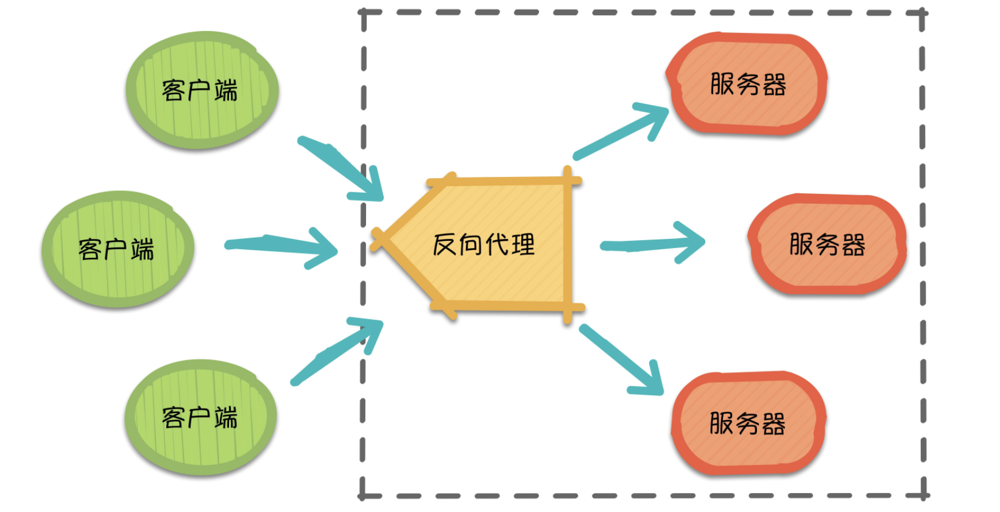
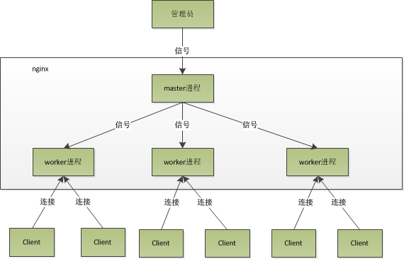
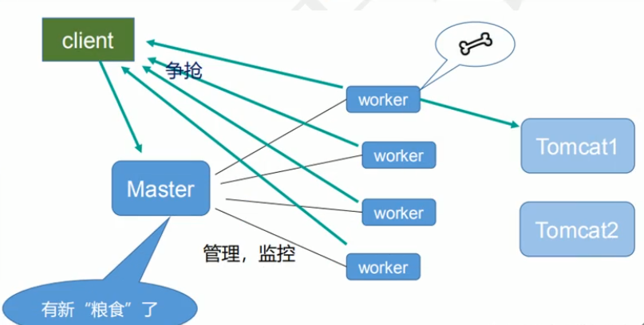
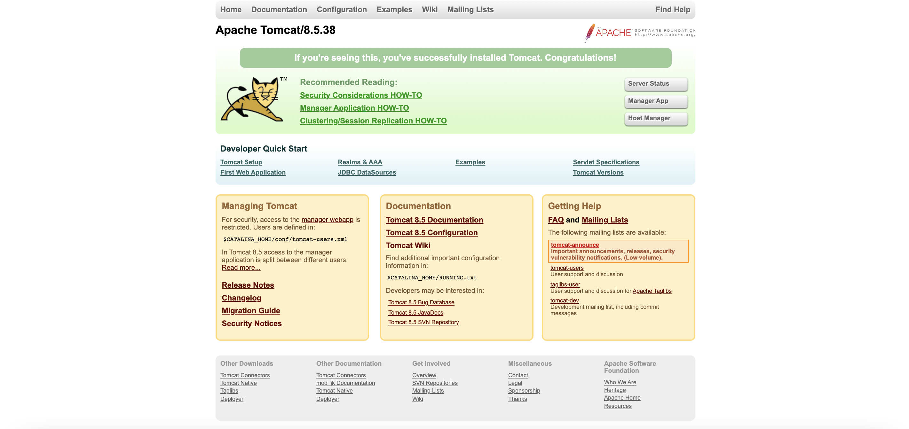
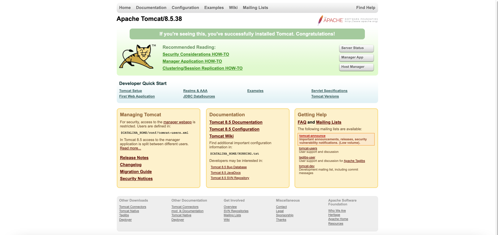
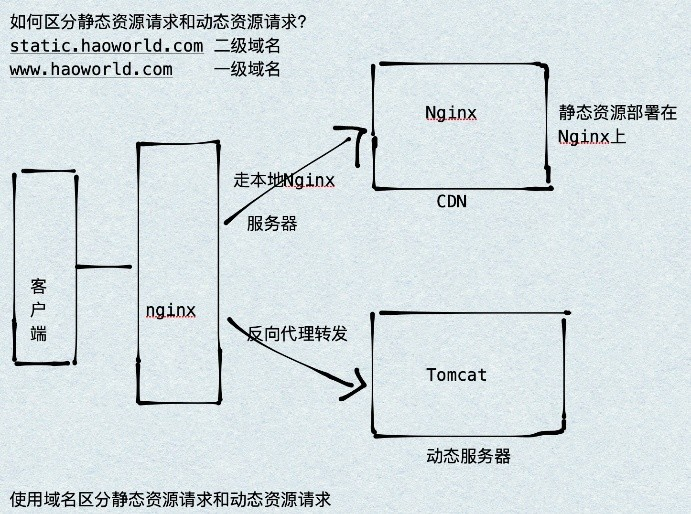

## 简介

Nginx ("engine x")是一个高性能的HTTP和反向代理[服务器](https://cloud.tencent.com/product/cvm?from_column=20065&from=20065)，特点是占有内存少，并发能力强，事实上nginx的并发能力确实在同类型的网页服务器中表现较好。Nginx专为性能优化而开发，性能是其最重要的考量，实现上非常注重效率，能经受高负载的考验，有报告表明能支持高达50000个并发连接数。

## 正向代理

正向代理（Forward Proxy）最大的特点是，客户端非常明确要访问的服务器地址，它代理客户端，替客户端发出请求。

假设客户端想要访问 Google，它明确知道待访问的服务器地址是[https://www.google.com/，但由于条件限制，它找来了一个能够访问到](https://cloud.tencent.com/developer/tools/blog-entry?target=https%3A%2F%2Fwww.google.com%2F%25EF%25BC%258C%25E4%25BD%2586%25E7%2594%25B1%25E4%25BA%258E%25E6%259D%25A1%25E4%25BB%25B6%25E9%2599%2590%25E5%2588%25B6%25EF%25BC%258C%25E5%25AE%2583%25E6%2589%25BE%25E6%259D%25A5%25E4%25BA%2586%25E4%25B8%2580%25E4%25B8%25AA%25E8%2583%25BD%25E5%25A4%259F%25E8%25AE%25BF%25E9%2597%25AE%25E5%2588%25B0)Google 的”朋友”：代理服务器。客户端把请求发给代理服务器，由代理服务器代替它请求 Google，最终再将响应返回给客户端。这便是一次正向代理的过程，该过程中服务器并不知道真正发出请求的是谁。

​

## 反向代理

反向代理（Reverse Proxy），反向代理隐藏了服务器的信息，它代理的是服务器端，代其接收请求。换句话说，反向代理的过程中，客户端并不知道具体是哪台服务器处理了自己的请求。如此一来，既提高了访问速度，又为安全性提供了保证。

在这之中，反向代理需要考虑的问题是，如何进行均衡分工，控制流量，避免出现局部节点负载过大的问题。通俗的讲，就是如何为每台服务器合理的分配请求，使其整体具有更高的工作效率和资源利用率。

​

## 负载均衡

单个服务器解决不了，我们增加服务器的数量，然后将请求分发到各个服务器上，将原先请求集中到单个服务器上的情况改为将请求分发到多个服务器上，将负载分发到不同的服务器，也就是我们所说的[负载均衡](https://cloud.tencent.com/product/clb?from_column=20065&from=20065)。

### IP 哈希（IP hash）

​`ip_hash`​依据发出请求的客户端 IP 的 hash 值来分配服务器，该算法可以保证同 IP 发出的请求映射到同一服务器，或者具有相同 hash 值的不同 IP 映射到同一服务器。

### 轮询 （round-robin）

轮询为负载均衡中较为基础也较为简单的算法，它不需要配置额外参数。假设配置文件中共有 $M$ 台服务器，该算法遍历服务器节点列表，并按节点次序每轮选择一台服务器处理请求。当所有节点均被调用过一次后，该算法将从第一个节点开始重新一轮遍历。

### 加权轮询

为了避免普通轮询带来的弊端，加权轮询应运而生。在加权轮询中，每个服务器会有各自的`weight`​。一般情况下，`weight`​的值越大意味着该服务器的性能越好，可以承载更多的请求。该算法中，客户端的请求按权值比例分配，当一个请求到达时，优先为其分配权值最大的服务器。

## 动静分离

为了加快网站的解析速度，可以把动态页面和静态页面由不同的服务器来解析，加快解析速度。降低原来单个服务器的压力。

```
nginx安装目录: /usr/local/Cellar/nginx
nginx配置文件目录: /usr/local/etc/nginx
config文件目录: /usr/local/etc/nginx/nginx.conf
```

## Nginx命令

```
常用的指令有：

nginx  #启动nginx
nginx start 启动Nginx
nginx restart 重启Nginx
nginx -s reopen 重启
nginx -s reload 重新加载配置
nginx -s quit  #快速停止nginx
nginx -s stop 停止
nginx -V #查看版本，以及配置文件地址
nginx -v #查看版本
nginx -s reload|reopen|stop|quit   #重新加载配置|重启|快速停止|安全关闭nginx
nginx -h #帮助
find /|grep nginx.conf 检查是否安装nginx及对应的目录
nginx -c filename 指定配置文件
sudo systemctl enable nginx # 设置开机自启
```

## Nginx原理

NGINX有一个主进程（master process）（执行特权操作，如读取配置、绑定端口）和一系列工作进程（worker process）和辅助进程（helper process）。

Nginx默认采用多进程工作方式，Nginx启动后，会运行一个master进程和多个worker进程。其中master充当整个进程组与用户的交互接口，同时对进程进行监护，管理worker进程来实现重启服务、平滑升级、更换日志文件、配置文件实时生效等功能。worker用来处理基本的网络事件，worker之间是平等的，他们共同竞争来处理来自客户端的请求。

nginx的进程模型如图所示：

​

worker如何进行工作的：

​

## 一个master和多个woker的好处

- 可以使用nginx -s reload热部署

首先，对于每个worker进程来说，独立的进程，不需要加锁，所以省掉了锁带来的开销，同时在编程以及问题查找时，也会方便很多。其次，采用独立的进程，可以让互相之间不会影响，一个进程退出后，其它进程还在工作，服务不会中断，master进程则很快启动新的worker进程。当然，worker进程的异常退出，肯定是程序有bug了，异常退出，会导致当前worker上的所有请求失败，不过不会影响到所有请求，所以降低了风险。

## 设置多少个woker合适

Nginx同redis类似都采用了io多路复用机制，每个worker都是一个独立的进程， 但每个进程里只有一个主线程，通过异步非阻塞的方式来处理请求，即使是成千上万个请求也不在话下。每个worker的线程可以把一个cpu的性能发挥到极致。所以worker数和服务器的cpu数相等是最为适宜的。设少了会浪费cpu，设多了会造成cpu频繁切换上下文带来的损耗。

```
# 设置worker数量
worker.processes 4 

# work绑定cpu(4work绑定4cpu)
worker_cpu_affinity 0001 0010 0100 1000

# work绑定cpu (4work绑定8cpu中的4个)
worker_cpu_affinity 0000001 00000010 00000100 00001000
```

## 连接数worker_ connection

这个值是表示每个`worker`​进程所能建立连接的最大值，所以，一个nginx 能建立的最大连接数，应该是`worker.connections * worker processes`​。当然，这里说的是最大连接数，对于HTTP 请求本地资源来说，能够支持的最大并发数量是`worker.connections * worker processes`​，如果是支持http1.1的浏览器每次访问要占两个连接，所以普通的静态访问最大并发数是: `worker.connections * worker.processes / 2`​, 而如果是HTTP作为反向代理来说，最大并发数量应该是`worker.connections * worker_proceses/4`​， 因为作为反向代理服务器，每个并发会建立与客户端的连接和与后端服务的连接，会占用两个连接。

## Nginx 配置

Nginx的配置文件是conf目录下的nginx.conf，默认配置的Nginx监听的端口为8080，如果8080端口被占用可以修改为未被占用的端口即可。

```
#user  nobody;
worker_processes  1;

#error_log  logs/error.log;
#error_log  logs/error.log  notice;
#error_log  logs/error.log  info;

#pid        logs/nginx.pid;


events {
    worker_connections  1024;
}


http {
    include       mime.types;
    default_type  application/octet-stream;

    #log_format  main  '$remote_addr - $remote_user [$time_local] "$request" '
    #                  '$status $body_bytes_sent "$http_referer" '
    #                  '"$http_user_agent" "$http_x_forwarded_for"';

    #access_log  logs/access.log  main;

    sendfile        on;
    #tcp_nopush     on;

    #keepalive_timeout  0;
    keepalive_timeout  65;

    #gzip  on;
  
    #自定义端口和映射本地网站路径
    server {
        listen       8080; #默认监听端口号为8080
        server_name  localhost; #请求地址为localhost

        #charset koi8-r;

        #access_log  logs/host.access.log  main;

        location / {
            root   html;
            index  index.html index.htm;
        }

        #error_page  404              /404.html;

        # redirect server error pages to the static page /50x.html
        #
        error_page   500 502 503 504  /50x.html;
        location = /50x.html {
            root   html;
        }

        # proxy the PHP scripts to Apache listening on 127.0.0.1:80
        #
        #location ~ \.php$ {
        #    proxy_pass   http://127.0.0.1;
        #}

        # pass the PHP scripts to FastCGI server listening on 127.0.0.1:9000
        #
        #location ~ \.php$ {
        #    root           html;
        #    fastcgi_pass   127.0.0.1:9000;
        #    fastcgi_index  index.php;
        #    fastcgi_param  SCRIPT_FILENAME  /scripts$fastcgi_script_name;
        #    include        fastcgi_params;
        #}

        # deny access to .htaccess files, if Apache's document root
        # concurs with nginx's one
        #
        #location ~ /\.ht {
        #    deny  all;
        #}
    }


    # another virtual host using mix of IP-, name-, and port-based configuration
    #
    #server {
    #    listen       8000;
    #    listen       somename:8080;
    #    server_name  somename  alias  another.alias;

    #    location / {
    #        root   html;
    #        index  index.html index.htm;
    #    }
    #}


    # HTTPS server
    #
    #server {
    #    listen       443 ssl;
    #    server_name  localhost;

    #    ssl_certificate      cert.pem;
    #    ssl_certificate_key  cert.key;

    #    ssl_session_cache    shared:SSL:1m;
    #    ssl_session_timeout  5m;

    #    ssl_ciphers  HIGH:!aNULL:!MD5;
    #    ssl_prefer_server_ciphers  on;

    #    location / {
    #        root   html;
    #        index  index.html index.htm;
    #    }
    #}
    include servers/*;
}
```

Nginx配置文件由三部分组成：全局块、event块、http块。

### 全局块

从配置文件开始到events块之间的内容，主要设置一些影响Nginx服务器整体运行的配置指令，主要包括配置运行Nginx服务器的用户（组）、允许生成的worker process数、进程PID存放路径、日志存放路径和类型以及配置文件的引入等。

```
#user  nobody;
worker_processes  1; // 这是Nginx服务器并发处理服务的关键配置，worker_processes值越大，可以支持的并发处理越多，但是会受硬件、软件等设备的制约

#error_log  logs/error.log;
#error_log  logs/error.log  notice;
#error_log  logs/error.log  info;

#pid        logs/nginx.pid;
```

### event块

涉及的指令主要影响Nginx服务器与用户网络连接，常用的设置包括是否开启多个worker_processes下的网络连接进行序列化，是否允许同时接收多个网络连接，选取那种事件驱动型来处理连接请求，每个worker_processes可以同时支持的最大连接数等。

```
events {
    worker_connections  1024;
}
```

### http块

包括http全局块、server块

- http全局块：配置的指令包括文件引入、MIME-TYPE定义、日志自定义、连接超时时间、单链接请求数上限等
- server块：和虚拟主机有密切关系，虚拟主机从用户角度看和一台独立的硬件主机完全一样的，该技术的产生是为了节省互联网服务硬件成本。

  - 全局server：

```
listen  8080;
server_name  localhost;

#charset koi8-r;

#access_log  logs/host.access.log  main;
```

```
location / {
    root   html;
    index  index.html index.htm;
}
```

## 配置实例

location指令说明：该指令用于匹配URL。

```
location [ = | ~ | ~* | ^~] uri {

}

1、=: 用于不含正则表达式的uri前，要求请求字符串与uri严格匹配，如果匹配成功，就停止继续向下搜索并立即处理该请求
2、~: 用于表示uri包含正则表达式，并且区分大小写
3、~*: 用于表示uri包含正则表达式，并且不区分大小写
4、^~: 用于不含正则表达式的uri前，要求Nginx服务器找到标识uri和请求字符串匹配度最高的location后，立即使用此location处理请求，而不再使用location块中的正则uri和请求字符串做匹配
注意: 如果uri包含正则表达式，则必须要有~或者~*标识。
```

### 反向代理-1

实现效果：打开浏览器，在浏览器中输入地址www.123.com，跳转到百度的主界面www.baidu.com。

步骤一：修改host文件

步骤二：修改nginx.config文件

```
listen  80;
server_name  127.0.0.1;

location / {
     root   html;
 proxy_pass   http://baidu.com;
     index  index.html index.htm;
}
```

步骤三：浏览器访问：www.123.com:80

### 反向代理-2

实现效果：

- 请求http://127.0.0.1:8000/edu/hello.html 访问到tomcat下的edu/hello.html
- 请求http://127.0.0.1:8000/vod/hello.html 访问到tomcat下的vod/hello.html

步骤一：启动Tomcat

```
切换到tomcat bin目录下  

启动：./startup.sh 
关闭：./shutdown.sh
```

访问：http://localhost:8080/



步骤二：将hello.html文件放入Tomcat内

```
webapp/edu
webapp/vod

验证：http://localhost:8080/edu/hello.html
```

步骤三：配置nginx.config文件

```
server {
     listen       8000;  //监听8000端口
     server_name  127.0.0.1;

     location ~/edu/ {
    proxy_pass   http://127.0.0.1:8080; //tomcat服务
            index  index.html index.htm;
        }
 location ~/vod/ {
    proxy_pass   http://127.0.0.1:8080; //tomcat服务
     }
}
```

配置结束，重启Nginx。

步骤四：访问

```
http://127.0.0.1:8000/edu/hello.html
http://127.0.0.1:8000/vod/hello.html
```

### 负载均衡

分配策略：

- 轮询（默认）：每个请求按时间顺序逐一分配到不 同的后端服务器，如果后端服务器down掉，能自动剔除
- weight：代表权重默认为1,权重越高被分配的客户端越多。指定轮询几率，weight和访问比率成正比，用于后端服务器性能不均的情况。

```
upstream server pool{
  server 192.168.5.21:80 weight=2
  server 192.168.5.22:80 weight=3
}
```

- ip_hash：每个请求按访问ip的hash结果分配, 这样每个访客固定访问一个后端服务器,可以解诀session的问题。

```
upstream server pool{
  ip_ hash
  server 192.168.5.21:80
  server 192.168.5.22:80
}
```

- fair (第三方)：按后端服务器的响应时间来分配请求，响应时间短的优先分配

```
upstream server_pool 
server 192.168.5.21:80;
server 192.168.5.22:80;
fair;
}
```

实现效果：启动两个本地Tomcat

- http://localhost:8080/
- http://localhost:8081/



请求http://127.0.0.1:80/edu/hello.html 分别代理到tomcat下的edu/hello.html页面。

- http:127.0.0.1:8080/edu/hello.html
- http:127.0.0.1:8081/edu/hello.html

```
Hello Nginx-8080-edu

Hello Nginx-8081-edu
```

步骤一：配置nginx.config文件

```
upstream myserver {
ip_hash;
server 127.0.0.1:8080;
server 127.0.0.1:8081;
#server baidu.com;  // 这里不能代理到baidu.com，报502，原因不明
#server weixin.qq.com; // 这里不能代理到weixin.qq.com，报502，原因不明
}
server {
    listen       80;
    server_name  127.0.0.1;

    location / {
        root   html; 
        index  index.html index.htm;
    proxy_pass  http://myserver;
}
}
```

步骤二：启动Tomcat 启动Nginx

```
Tomcat1：./startup.sh 
Tomcat2：./startup.sh 

Nginx：nginx
```

步骤三：访问

```
http://127.0.0.1/edu/hello.html

实现效果：
Hello Nginx-8080-edu
Hello Nginx-8081-edu
```

### 动静分离

通过location指定不同的后缀名实现不同的请求转发。通过expires参数设置，可以使浏览器缓存过期时间，减少与服务器之前的请求和流量。具体Expires定义: 是给一个资源设定一个过期时间，也就是说无需去服务端验证，直接通过浏览器自身确认是否过期即可，所以不会产生额外的流量。此种方法非常适合不经常变动的资源。(如果经常更新的文件，不建议使用Expires来缓存)，如果设置3d, 表示在这3天之内访问这个URL, 发送一个请求，比对服务器该文件最后更新时间没有变化，则不会从服务器抓取，返回状态码304,如果有修改，则直接从服务器重新下载，返回状态码200。

- 静态资源： 当用户多次访问这个资源，资源的源代码永远不会改变的资源。
- 动态资源：当用户多次访问这个资源，资源的源代码可能会发送改变。



实现效果：在data文件夹下新建www和image文件夹，根据[域名解析](https://cloud.tencent.com/product/cns?from_column=20065&from=20065)实现动静分离。

```
路径：/Users/xxx/Downloads/data
```


步骤一：修改nginx.config配置文件

```
# 动静分离 监听8090端口
server {
    listen   8090;
    server_name  127.0.0.1;

location /www/ {
    root /Users/xxx/Downloads/data/;
}
location /image/ {
    root /Users/xxx/Downloads/data/;
    autoindex on;
}
}
```

步骤二：访问

```
http://127.0.0.1:8090/www/hello.html

http://127.0.0.1:8090/image/
http://127.0.0.1:8090/image/42.jpeg
```


## 配置高可用

```
准备工作：
(1) 需要两台服务器192.168.17.129 和 192.168.17.1314
(2) 在两台服务器安装nginx
(3) 在两合服务器安装keepalived
```

步骤一：安装keepalived

```
yum install keepalived
rpm -q -a keepalived    #查看是否已经安装上

默认安装路径: /etc/keepalived
```

步骤二：高可用配置(主从机器配置)

- 修改keepalived的配置文件keepalived.conf

```
global_defs { # 全局定义
notification_email {
  acassen@firewall.loc
  failover@firewall.loc
  sysadmin@firewall.loc
}
notification_email_from Alexandre.Cassen@firewall.loc
smtp_ server 192.168.17.129
smtp_connect_timeout 30
router_id LVS_DEVEL# LVS_DEVEL这字段在/etc/hosts文件中看；通过它访问到主机
}

vrrp_script chk_http_ port {
script "/usr/local/src/nginx_check.sh"
interval 2   # (检测脚本执行的间隔)2s
weight 2  #权重，如果这个脚本检测为真，服务器权重+2
}

vrrp_instance VI_1 {
state BACKUP   # 备份服务器上将MASTER 改为BACKUP
interface ens33 //网卡名称 ipconfig查看
virtual_router_id 51 # 主、备机的virtual_router_id必须相同
priority 100   #主、备机取不同的优先级，主机值较大，备份机值较小
advert_int 1#每隔1s发送一次心跳
authentication {# 校验方式， 类型是密码，密码1111
        auth type PASS
        auth pass 1111
    }
virtual_ipaddress { # 虛拟ip
192.168.17.50 // VRRP H虛拟ip地址
}
}
```

- 在路径/usr/local/src/ 下新建检测脚本 nginx_check.sh

```
#! /bin/bash
A=`ps -C nginx -no-header | wc - 1`
if [ $A -eq 0];then
/usr/local/nginx/sbin/nginx #nginx的启动路径
sleep 2
if [`ps -C nginx --no-header| wc -1` -eq 0 ];then
killall keepalived
fi
fi
```

- 把两台服务器上nginx和keepalived启动

```
$ systemctl start keepalived.service#keepalived启动
$ ps -ef I grep keepalived#查看keepalived是否启动
```

步骤三：测试

```
在浏览器地址栏输入虚拟ip地址192.168.17.50

把主服务器(192.168.17.129) nginx和keealived停止，再输入192.168.17.50.
```
