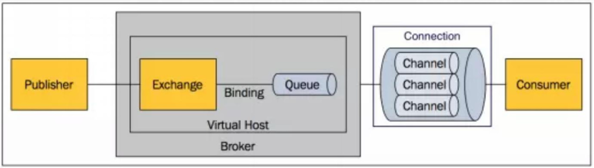
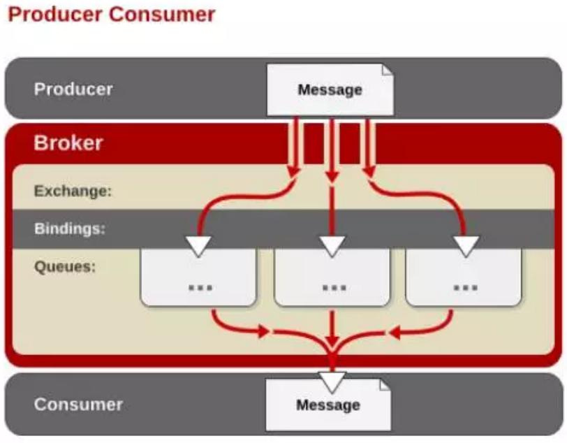

RabbitMQ 采用 Erlang 语言开发，Erlang 语言由 Ericson 设计，Erlang 在分布式编程和故障恢复方面表现出色，电信领域被广泛使用。

Erlang官方：[https://www.erlang.org/](https://www.erlang.org/)



**Broker**: 接收和分发消息的应用，RabbitMQ Server 就是 Message Broker。

**Virtual host**: 出于多租户和安全因素设计的，把 AMQP  的基本组件划分到一个虚拟的分组中，类似于网络中的 namespace 概念，当多个不同的用户使用同一个 RabbitMQ server  提供的服务时，可以划分出多个 vhost，每个用户在自己的 vhost 创建 exchange／queue 等。

**Connection**: publisher／consumer 和 broker 之间的 TCP 连接。

**Channel**: 如果每一次访问 RabbitMQ 都建立一个 Connection，在消息量大的时候  建立 TCP Connection 的开销将是巨大的，效率也较低。Channel 是在 connection  内部建立的逻辑连接，如果应用程序支持多线程，通常每个 thread 创建单独的 channel 进行通讯，AMQP method 包含了  channel id 帮助客户端和 message broker 识别 channel，所以 channel 之间是完全隔离的。Channel  作为轻量级的 Connectio极大减少了操作系统建立 TCP connection 的开销。

**Exchange**: message 到达 broker 的第一站，根据分发规则，匹配查询表中的  routing key，分发消息到 queue 中去。常用的类型有：direct (point-to-point), topic  (publish-subscribe) and fanout (multicast)。

**Queue**: 消息最终被送到这里等待 consumer 取走。

**Binding**: exchange 和 queue 之间的虚拟连接，binding 中可以包含 routing key。 Binding 信息被保存到 exchange 中的查询表中，用于 message 的分发依据。

**rabbitmq 优势**

```bash
基于 erlang 语言开发，具有高并发优点、支持分布式
具有消息确认机制、消息持久化机制，消息可靠性和集群可靠性高
简单易用、运行稳定、跨平台、多语言
开源
```

**Queue 的特性**

```bash
消息基于先进先出的原则进行顺序消费
消息可以持久化到磁盘节点服务器
消息可以缓存到内存节点服务器提高性能
```

## 2.2 RabbitMQ 中的生产者消费者示例



```bash
生产者发送消息到 broker server（RabbitMQ），在 Broker 内部，用户创建 Exchange／Queue，通过 Binding 规则将两者联系在一起，Exchange 分发消息，根据类型／binding 的不同分发策略有区别，消息最后来到 Queue 中，等待消费者取走。
```
