以下内容来自于腾讯CSIG工程师Ryetan.

现如今 Redis 变得越来越流行，几乎在很多项目中都要被用到，不知道你在使用 Redis 时，有没有思考过，Redis 到底是如何稳定、高性能地提供服务的？

- 我使用 Redis 的场景很简单，只使用单机版 Redis 会有什么问题吗？
- 我的 Redis 故障宕机了，数据丢失了怎么办？如何能保证我的业务应用不受影响？
- 为什么需要主从集群？它有什么优势？
- 什么是分片集群？我真的需要分片集群吗？
- ...

如果你对 Redis 已经有些了解，肯定也听说过「**数据持久化、主从复制、哨兵、分片集群**」这些概念，它们之间又有什么区别和联系呢？

如果你存在这样的疑惑，这篇文章，我会从 0 到 1，再从 1 到 N，带你一步步构建出一个稳定、高性能的 Redis 集群。

在这个过程中，你可以了解到 Redis 为了做到稳定、高性能，都采取了哪些优化方案，以及为什么要这么做？

掌握了这些原理，这样平时你在使用 Redis 时，就能够做到「游刃有余」。

首先，我们从最简单的场景开始。

假设现在你有一个业务应用，需要引入 Redis 来提高应用的性能，此时你可以选择部署一个单机版的 Redis 来使用，就像这样：

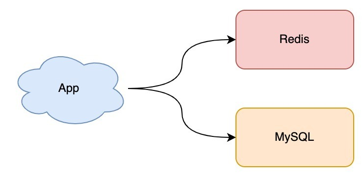

这个架构非常简单，你的业务应用可以把 Redis 当做缓存来使用，从 MySQL 中查询数据，然后写入到 Redis 中，之后业务应用再从 Redis 中读取这些数据，由于 Redis 的数据都存储在内存中，所以这个速度飞快。

如果你的业务体量并不大，那这样的架构模型基本可以满足你的需求。是不是很简单？

随着时间的推移，你的业务体量逐渐发展起来了，Redis 中存储的数据也越来越多，此时你的业务应用对 Redis 的依赖也越来越重。

突然有一天，你的 Redis 因为某些原因宕机了，这时你的所有业务流量，都会打到后端 MySQL 上，MySQL 压力剧增，严重的话甚至会压垮 MySQL。

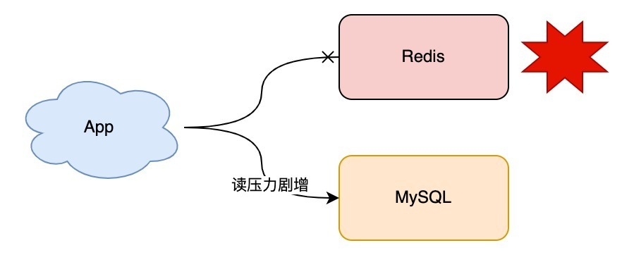

这时你应该怎么办？

我猜你的方案肯定是，赶紧重启 Redis，让它可以继续提供服务。

但是，因为之前 Redis 中的数据都在内存中，尽管你现在把 Redis 重启了，之前的数据也都丢失了（假设没开持久化）。重启后的 Redis 虽然可以正常工作，但是由于 Redis 中没有任何数据，业务流量还是都会打到后端 MySQL 上，MySQL 的压力还是很大。

有没有什么好的办法解决这个问题？

既然 Redis 只把数据存储在内存中，那是否可以把这些数据也写一份到磁盘上呢？

如果采用这种方式，当 Redis 重启时，我们把磁盘中的数据快速「**恢复**」到内存中，这样它就可以继续正常提供服务了。

是的，这是一个很好的解决方案，这个把内存数据写到磁盘上的过程，就是「数据持久化」。

## 数据持久化：有备无患

现在，你设想的 Redis 数据持久化是这样的：

但是，数据持久化具体应该怎么做呢？

我猜你最容易想到的一个方案是，Redis 每一次执行写操作，除了写内存之外，同时也写一份到磁盘上，就像这样：

没错，这是最简单直接的方案。

但仔细想一下，这个方案有个问题：**客户端的每次写操作，既需要写内存，又需要写磁盘，而写磁盘的耗时相比于写内存来说，肯定要慢很多！这势必会影响到 Redis 的性能。**

如何规避这个问题？

这时我们需要分析写磁盘的细节问题了。

我们都知道，要把内存数据写到磁盘，其实是分 2 步的：

1. 程序写文件的 PageCache（write）
2. 把 PageCache 刷到磁盘（fsync）

具体就是下图这样：

数据持久化最粗暴的思路就是上面提到的那样，写完 Redis 内存后，同步写 PageCache + fsync 磁盘，当然，这样肯定因为磁盘拖慢整个写入速度。

如何优化？也很简单，我们可以这样做：**Redis 写内存由主线程来做，写内存完成后就给客户端返回结果，然后 Redis 用「另一个线程」去写磁盘，这样就可以避免主线程写磁盘对性能的影响。**

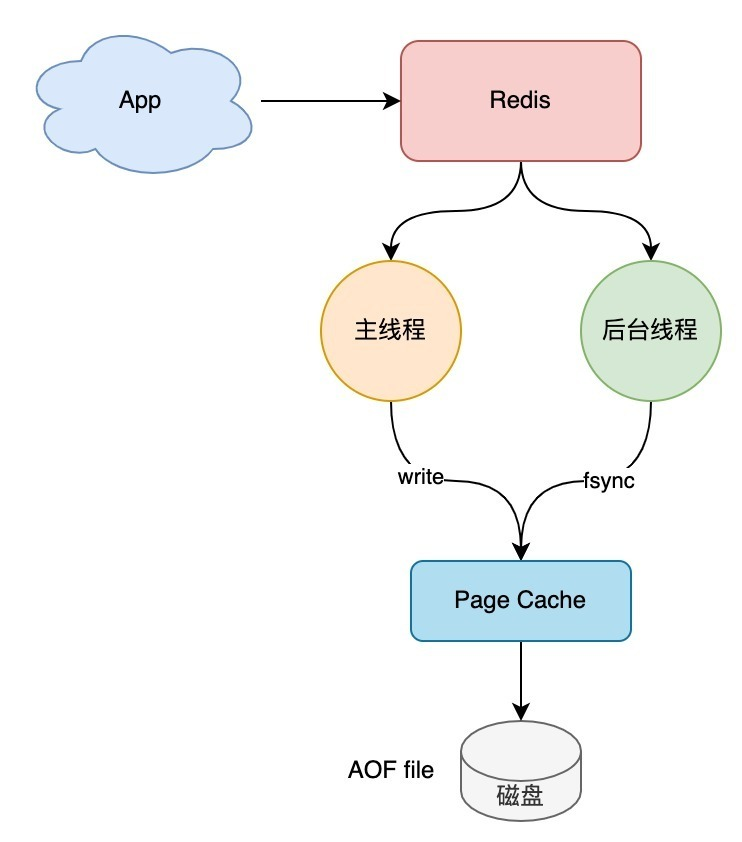

这种持久化方案，其实就是我们经常听到的 Redis AOF（Append Only File）。

Redis AOF 持久化提供了 3 种刷盘机制：

1. appendfsync always：主线程同步 fsync
2. appendfsync no：由 OS fsync
3. appendfsync everysec：后台线程每间隔1秒 fsync

解决了数据实时持久化，我们还会面临另一个问题，数据实时写入 AOF，随着时间的推移，AOF 文件会越来越大，那使用 AOF 恢复时变得非常慢，这该怎么办？

Redis 很贴心地提供了 AOF rewrite 方案，俗称 AOF 「瘦身」，顾名思义，就是压缩 AOF 的体积。

因为 AOF 里记录的都是每一次写命令，例如执行 set k1 v1，set k1 v2，其实我们只关心数据的最终版本 v2 就可以了。AOF rewrite 正是利用了这个特点，在 AOF 体积越来越大时（超过设定阈值），Redis 就会定期重写一份新的 AOF，这个新的 AOF 只记录数据的最终版本就可以了。

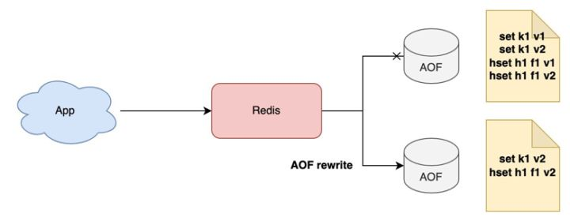

这样就可以压缩 AOF 体积。

除此之外，我们可以换个角度，思考一下还有什么方式可以持久化数据？

这时你就要结合 Redis 的使用场景来考虑了。

回忆一下，我们在使用 Redis 时，通常把它用作什么场景？

是的，缓存。

把 Redis 当做缓存来用，意味着尽管 Redis 中没有保存全量数据，对于不在缓存中的数据，我们的业务应用依旧可以通过查询后端数据库得到结果，只不过查询后端数据的速度会慢一点而已，但对业务结果其实是没有影响的。

基于这个特点，我们的 Redis 数据持久化还可以用「**数据快照**」的方式来做。

那什么是数据快照呢？

简单来讲，你可以这么理解：

1. 你把 Redis 想象成一个水杯，向 Redis 写入数据，就相当于往这个杯子里倒水
2. 此时你拿一个相机给这个水杯拍一张照片，拍照的这一瞬间，照片中记录到这个水杯中水的容量，就是水杯的数据快照

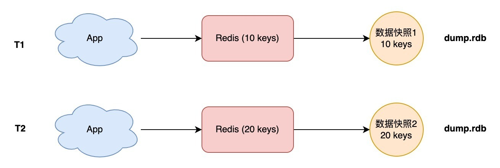

也就是说，Redis 的数据快照，是记录某一时刻下 Redis 中的数据，然后只需要把这个数据快照写到磁盘上就可以了。

它的优势在于，只在需要持久化时，把数据「**一次性**」写入磁盘，其它时间都不需要操作磁盘。

基于这个方案，我们可以「**定时**」给 Redis 做数据快照，把数据持久化到磁盘上。

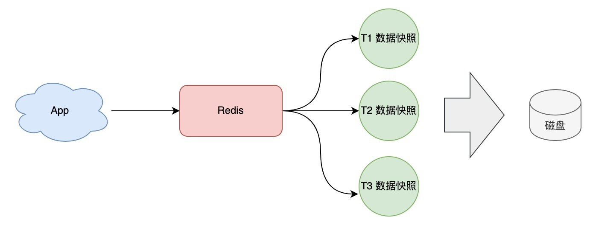

这种方案就是我们经常听到的 Redis RDB，RDB 采用「**定时快照**」的方式进行数据持久化，它的优点是：

1. 持久化文件体积小（二进制 + 压缩）
2. 写盘频率低（定时写入）

缺点也很明显，因为是定时持久化，数据肯定没有 AOF 实时持久化完整，如果你的 Redis 只当做缓存，对于丢失数据不敏感（可从后端的数据库查询），那这种持久化方式是非常合适的。

如果让你来选择持久化方案，你可以这样选择：

1. 业务对于数据丢失不敏感，选 RDB
2. 业务对数据完整性要求比较高，选 AOF

理解了 RDB 和 AOF，我们再进一步思考一下，有没有什么办法，**既可以保证数据完整性，还能让持久化文件体积更小，恢复更快呢？**

回顾一下我们前面讲到的，RDB 和 AOF 各自的特点：

1. RDB 以二进制 + 数据压缩方式存储，文件体积小
2. AOF 记录每一次写命令，数据最全

我们可否利用它们各自的优势呢？

当然可以，这就是 Redis 的「**混合持久化**」。

要想数据完整性更高，肯定就不能只用 RDB 了，重点还是要放在 AOF 优化上。

具体来说，当 AOF 在做 rewrite 时，**Redis 先以 RDB 格式在 AOF 文件中写入一个数据快照，再把在这期间产生的每一个写命令，追加到 AOF 文件中。**

因为 RDB 是二进制压缩写入的，这样 AOF 文件体积就变得更小了。

因为 AOF 体积进一步压缩，你在使用 AOF 恢复数据时，这个恢复时间就会更短了！

> Redis 4.0 以上版本才支持混合持久化。
> 注意：混合持久化是对 AOF rewrite 的优化，这意味着使用它必须基于 AOF + AOF rewrite。

这么一番优化，你的 Redis 再也不用担心实例宕机了，当发生宕机时，你就可以用持久化文件快速恢复 Redis 中的数据。

但这样就没问题了吗？

仔细想一下，虽然我们已经把持久化的文件优化到最小了，但在**恢复数据时依旧是需要时间**的，在这期间你的业务应用无法提供服务，这怎么办？

一个实例宕机，只能用恢复数据来解决，那我们是否可以部署多个 Redis 实例，然后让这些实例数据保持实时同步，这样当一个实例宕机时，我们在剩下的实例中选择一个继续提供服务就好了。

没错，这个方案就是接下来要讲的「主从复制：多副本」。

## 主从复制：多副本

你可以部署多个 Redis 实例，架构模型就变成了这样：

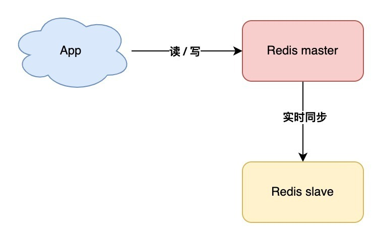

我们这里把实时读写的节点叫做 master，另一个实时同步数据的节点叫做 slave。

采用多副本的方案，它的优势是：

1. **缩短不可用时间**：master 发生宕机，我们可以手动把 slave 提升为 master 继续提供服务
2. **提升读性能**：让 slave 分担一部分读请求，提升应用的整体性能

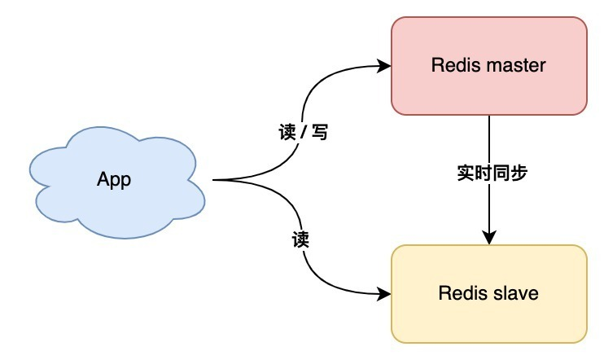

这个方案不错，不仅节省了数据恢复的时间，还能提升性能。

但它的问题在于：**当 master 宕机时，我们需要「手动」把 slave 提升为 master，这个过程也是需要花费时间的。**

虽然比恢复数据要快得多，但还是需要人工介入处理。一旦需要人工介入，就必须要算上人的反应时间、操作时间，所以，在这期间你的业务应用依旧会受到影响。

我们是否可以把这个切换的过程，变成自动化？

## 哨兵：故障自动切换

要想自动切换，肯定不能依赖人了。

现在，我们可以引入一个「观察者」，让这个观察者去实时监测 master 的健康状态，这个观察者就是「哨兵」。

具体如何做？

1. 哨兵每间隔一段时间，询问 master 是否正常
2. master 正常回复，表示状态正常，回复超时表示异常
3. 哨兵发现异常，发起主从切换

有了这个方案，就不需要人去介入处理了，一切就变得自动化了，是不是很爽？

但这里还有一个问题，如果 master 状态正常，但这个哨兵在询问 master 时，它们之间的网络发生了问题，那这个哨兵可能会「**误判**」。

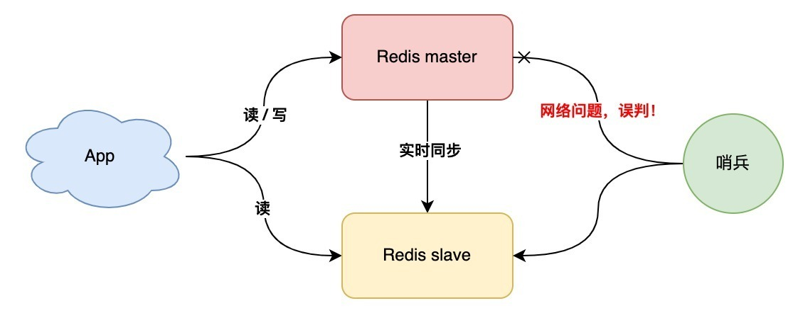

这个问题怎么解决？

既然一个哨兵会误判，那我们可以部署多个哨兵，让它们分布在不同的机器上，让它们一起监测 master 的状态，流程就变成了这样：

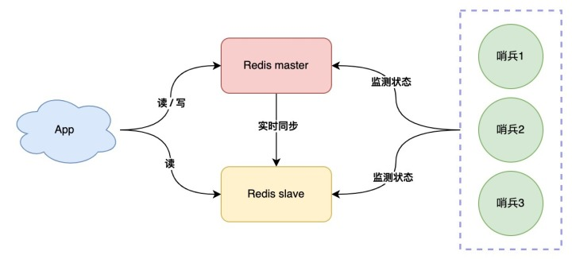

1. 多个哨兵每间隔一段时间，询问 master 是否正常
2. master 正常回复，表示状态正常，回复超时表示异常
3. 一旦有一个哨兵判定 master 异常（不管是否是网络问题），就询问其它哨兵，如果多个哨兵（设置一个阈值）都认为 master 异常了，这才判定 master 确实发生了故障
4. 多个哨兵经过协商后，判定 master 故障，则发起主从切换

所以，我们用多个哨兵互相协商来判定 master 的状态，这样，就可以大大降低误判的概率。

哨兵协商判定 master 异常后，这里还有一个问题：**由哪个哨兵来发起主从切换呢？**

答案是，选出一个哨兵「领导者」，由这个领导者进行主从切换。

问题又来了，这个领导者怎么选？

想象一下，在现实生活中，选举是怎么做的？

是的，投票。

在选举哨兵领导者时，我们可以制定这样一个选举规则：

1. 每个哨兵都询问其它哨兵，请求对方为自己投票
2. 每个哨兵只投票给第一个请求投票的哨兵，且只能投票一次
3. 首先拿到超过半数投票的哨兵，当选为领导者，发起主从切换

这个选举的过程就是我们经常听到的：分布式系统领域中的「**共识算法**」。

什么是共识算法？

我们在多个机器部署哨兵，它们需要共同协作完成一项任务，所以它们就组成了一个「分布式系统」。

在分布式系统领域，多个节点如何就一个问题达成共识的算法，就叫共识算法。

在这个场景下，多个哨兵共同协商，选举出一个都认可的领导者，就是使用共识算法完成的。

这个算法还规定节点的数量必须是奇数个，这样可以保证系统中即使有节点发生了故障，剩余超过「半数」的节点状态正常，依旧可以提供正确的结果，也就是说，这个算法还兼容了存在故障节点的情况。

> 共识算法在分布式系统领域有很多，例如 Paxos、Raft，哨兵选举领导者这个场景，使用的是 Raft 共识算法，因为它足够简单，且易于实现。

好，到这里我们先小结一下。

你的 Redis 从最简单的单机版，经过数据持久化、主从多副本、哨兵集群，这一路优化下来，你的 Redis 不管是性能还是稳定性，都越来越高，就算节点发生故障，也不用担心了。

Redis 以这样的架构模式部署，基本上就可以稳定运行很长时间了。

...

随着时间的发展，你的业务体量开始迎来了爆炸性增长，此时你的架构模型，还能够承担这么大的流量吗？

我们一起来分析一下：

1. **数据怕丢失**：持久化（RDB/AOF）
2. **恢复时间久**：主从副本（副本随时可切）
3. **手动切换时间长**：哨兵集群（自动切换）
4. **读存在压力**：扩容副本（读写分离）
5. **写存在压力**：**一个 mater 扛不住怎么办？**

可见，现在剩下的问题是，当写请求量越来越大时，一个 master 实例可能就无法承担这么大的写流量了。

要想完美解决这个问题，此时你就需要考虑使用「分片集群」了。

## 分片集群：横向扩展

什么是「分片集群」？

简单来讲，一个实例扛不住写压力，那我们是否可以部署多个实例，然后把这些实例按照一定规则组织起来，把它们当成一个整体，对外提供服务，这样不就可以解决集中写一个实例的瓶颈问题吗？

所以，现在的架构模型就变成了这样：

现在问题又来了，这么多实例如何组织呢？

我们制定规则如下：

1. 每个节点各自存储一部分数据，所有节点数据之和才是全量数据
2. 制定一个路由规则，对于不同的 key，把它路由到固定一个实例上进行读写

数据分多个实例存储，那寻找 key 的路由规则需要放在客户端来做，具体就是下面这样：

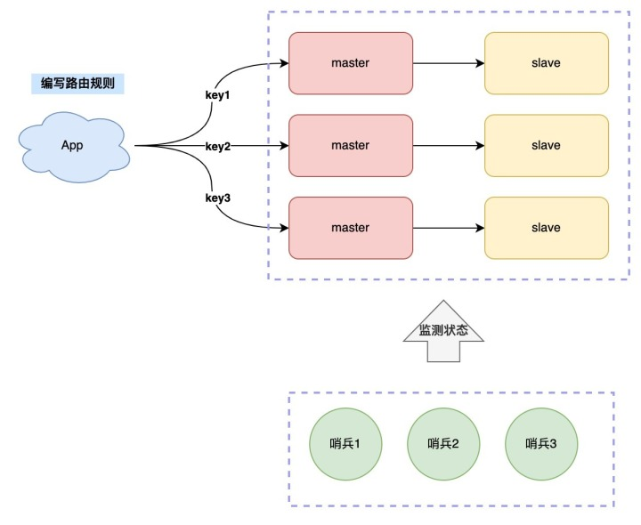

这种方案也叫做「客户端分片」，这个方案的缺点是，**客户端需要维护这个路由规则，也就是说，你需要把路由规则写到你的业务代码中。**

如何做到不把路由规则耦合在客户端业务代码中呢？

继续优化，我们可以在客户端和服务端之间增加一个「中间代理层」，这个代理就是我们经常听到的 Proxy，路由转发规则，放在这个 Proxy 层来维护。

这样，客户端就无需关心服务端有多少个 Redis 节点了，只需要和这个 Proxy 交互即可。

Proxy 会把你的请求根据路由规则，转发到对应的 Redis 节点上，而且，当集群实例不足以支撑更大的流量请求时，还可以横向扩容，添加新的 Redis 实例提升性能，这一切对于你的客户端来说，都是透明无感知的。

业界开源的 Redis 分片集群方案，例如 Twemproxy、Codis 就是采用的这种方案。

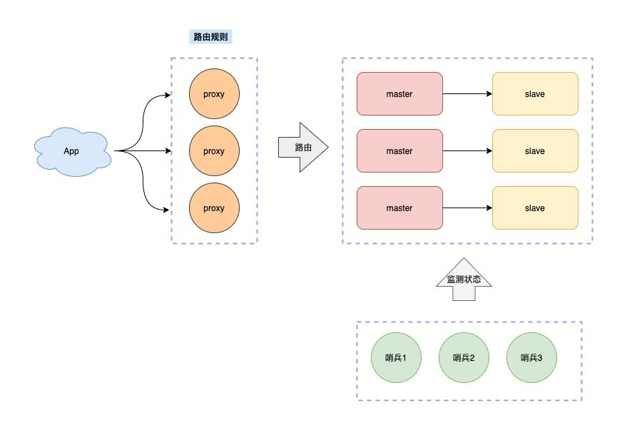

这种方案的优点在于，客户端无需关心数据转发规则，只需要和 Proxy 打交道，客户端像操作单机 Redis 那样去操作后面的集群，简单易用。

架构演进到目前为止，路由规则无论是客户端来做，还是 Proxy 来做，都是「社区」演进出来的分片解决方案，它们的特点是集群中的 Redis 节点，都不知道对方的存在，只有客户端或 Proxy 才会统筹数据写到哪里，从哪里读取，而且它们都依赖哨兵集群负责故障自动切换。

也就是说我们其实就是把多个孤立的 Redis 节点，自己组合起来使用。

Redis 在 3.0 其实就推出了「官方」的 Redis Cluster 分片方案，但由于推出初期不稳定，所以用的人很少，也因此业界涌现出了各种开源方案，上面讲到的 Twemproxy、Codis 分片方案就是在这种背景下诞生的。

但随着 Redis Cluster 方案的逐渐成熟，业界越来越多的公司开始采用官方方案（毕竟官方保证持续维护，Twemproxy、Codis 目前都逐渐放弃维护了），Redis Cluster 方案比上面讲到的分片方案更简单，它的架构如下。

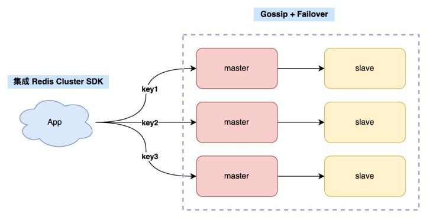

**Redis Cluster 无需部署哨兵集群，集群内 Redis 节点通过 Gossip 协议互相探测健康状态，在故障时可发起自动切换。**

另外，关于路由转发规则，也不需要客户端自己编写了，Redis Cluster 提供了「配套」的 SDK，只要客户端升级 SDK，就可以和 Redis Cluster 集成，SDK 会帮你找到 key 对应的 Redis 节点进行读写，还能自动适配 Redis 节点的增加和删除，业务侧无感知。

虽然省去了哨兵集群的部署，维护成本降低了不少，但对于客户端升级 SDK，对于新业务应用来说，可能成本不高，但对于老业务来讲，「升级成本」还是比较高的，这对于切换官方 Redis Cluster 方案有不少阻力。

于是，各个公司有开始自研针对 Redis Cluster 的 Proxy，降低客户端的升级成本，架构就变成了这样：

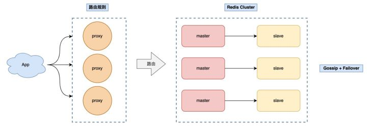

这样，客户端无需做任何变更，只需把连接地址切到 Proxy 上即可，由 Proxy 负责转发数据，以及应对后面集群增删节点带来的路由变更。

至此，业界主流的 Redis 分片架构已经成型，当你使用分片集群后，对于未来更大的流量压力，也都可以从容面对了！

## 总结

总结一下，我们是如何从 0 到 1，再从 1 到 N 构建一个稳定、高性能的 Redis 集群的，从这之中你可以清晰地看到 Redis 架构演进的整个过程。

1. **数据怕丢失** -> 持久化（RDB/AOF）
2. **恢复时间久** -> 主从副本（副本随时可切）
3. **故障手动切换慢** -> 哨兵集群（自动切换）
4. **读存在压力** -> 扩容副本（读写分离）
5. **写存在压力/容量瓶颈** -> 分片集群
6. **分片集群社区方案** -> Twemproxy、Codis（Redis 节点之间无通信，需要部署哨兵，可横向扩容）
7. **分片集群官方方案** -> Redis Cluster （Redis 节点之间 Gossip 协议，无需部署哨兵，可横向扩容）
8. **业务侧升级困难** -> Proxy + Redis Cluster（不侵入业务侧）

至此，我们的 Redis 集群才得以长期稳定、高性能的为我们的业务提供服务。

‍
