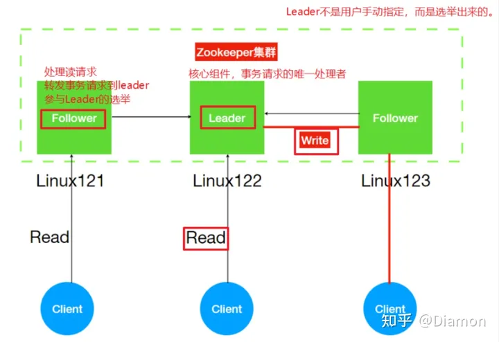
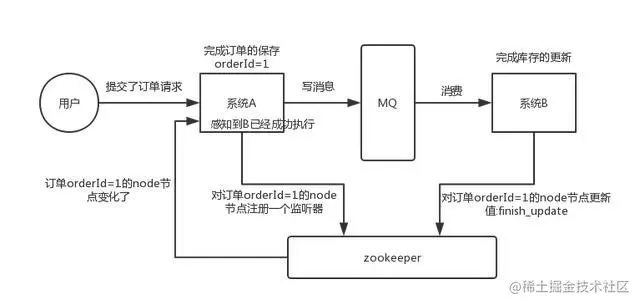
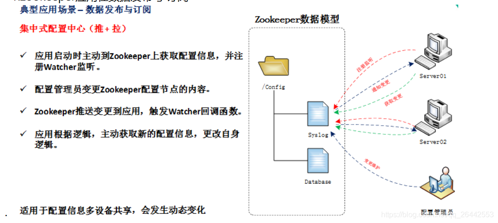
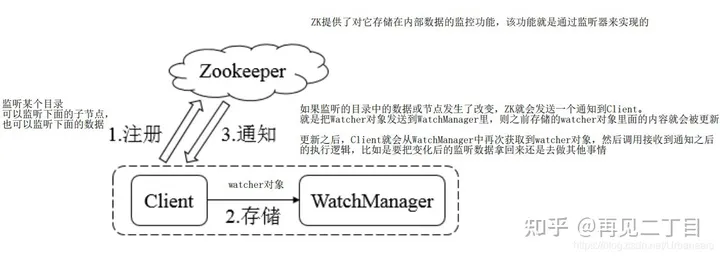
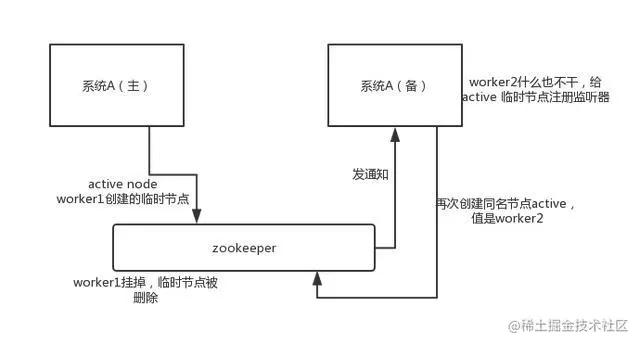

# zookeeper 概述

分布式协调技术 ---- 什么是分布式协调技术？其实分布式协调技术 主要用来**解决分布式环境当中多个进程之间的同步控制，让他们有序的去访问某种临界资源，防止造成** **&quot;脏数据&quot;的后果。**

# 一、Zookeeper的基础概念

## 1. 为什么需要有zookeeper

为了防止分布式系统中的多个进程之间相互干扰，我们需要一种分布式协调技术来对这些进程进行调度。而这个分布式协调技术的核心就是来实现这个分布式锁。

Zookeeper是一个开源的分布式协调服务框架，主要用来解决分布式集群中应用系统的一致性问题和数据管理问题。具体就是它提供了一项基本服务：分布式锁服务。由于ZooKeeper的开源特性，后来我们的开发者在分布式锁的基础上，摸索了出了其他的使用方法：配置维护、组服务、分布式消息队列、分布式通知/协调等。

## 2. zookeeper的原理

Zookeeper 是一个分布式协调服务的开源框架。 主要用来解决分布式集群中应用系统的一致性问题，例如怎样避免同时操作同一数据造成脏读的问题。分布式系统中数据存在一致性的问题！！

- ZooKeeper 本质上是一个**分布式的小文件存储系统**。 **提供基于类似于文件系统的目录树方式的数据存储**，并且可以对树中的节点进行有效管理。
- ZooKeeper **提供给客户端监控存储在zk内部数据的功能，从而可以达到基于数据的集群管理。** 诸如： 统一命名服务(dubbo)、分布式配置管理(solr的配置集中管理)、分布式消息队列（sub/pub）、分布式锁、分布式协调等功能。

简单来看Zookeeper=文件系统+通知机制。 Zookeeper本质上是一个分布式文件系统,适合存放小文件，也可以理解为一个数据库。主要提供两个功能：

- 管理(存储，读取)用户程序提交的数据；（不是业务数据，而是程序状态数据，很小，负载小）
- 并为用户程序提供数据节点监听服务；

上图左侧, Zookeeper中存储的其实是一个又一个Znode.

Znode是Zookeeper中的节点。Znode是有路径的,例如/data/host1,/data/host2,这个路径也可以理解为是Znode的Name。Znode也可以携带数据,例如说某个Znode的路径是/data/host1,其值是一个字符串"192.168.0.1"

正因为Znode的特性,所以Zookeeper可以对外提供出一个类似于文件系统的试图,可以通过操作文件系统的方式操作Zookeeper.

- 1.使用路径获取Znode
- 2.获取Znode携带的数据
- 3.修改Znode携带的数据
- 4.删除Znode
- 5.添加Znode

### 2.1 Watch监听机制

客户端能在znodes上设置watch，监听znode的变化，包括增删改查，通过stat path ，ls2 path get path皆可查看。  
触发watch事件的条件有4种，create，delete，change，child（子节点事件）

‍

## 3. zookeeper 的架构成员

‍

​​

ZooKeeper主要有领导者（Leader）、跟随者（Follower）和观察者（Observer）三种角色。

|角色|说明|
| --------------------| ------------------------------------------------------------------------------------------------------------------------------------------------------------------------------------|
|领导者（Leader）|为客户端提供读和写的服务，负责投票的发起和决议，更新系统状态。|
|跟随者（Follower）|为客户端提供读服务，如果是写服务则转发给Leader。在选举过程中参与投票。|
|观察者（Observer）|为客户端提供读服务器，如果是写服务则转发给Leader。不参与选举过程中的投票，也不参与“过半写成功”策略。在不影响写性能的情况下提升集群的读性能。此角色于zookeeper3.3系列新增的角色。|

‍

## 4. zookeeper的特性

1. 顺序一致性(Sequential Consistency)，保证客户端操作是按顺序生效的；
2. 原子性(Atomicity)，更新成功或失败。没有部分结果。
3. 单个系统映像，无论连接到哪个服务器，客户端都将看到相同的内容
4. 可靠性，数据的变更不会丢失，除非被客户端覆盖修改。
5. 及时性，保证系统的客户端当时读取到的数据是最新的。

# 二、Zookeeper的应用场景

‍

## 1. 分布式协调

这个其实是 zookeeper 很经典的一个用法，简单来说，就好比，你 A 系统发送个请求到 mq，然后 B 系统消息消费之后处理了。那 A 系统如何知道 B 系统的处理结果？用 zookeeper 就可以实现分布式系统之间的协调工作。A 系统发送请求之后可以在 zookeeper 上对某个节点的值注册个监听器，一旦 B 系统处理完了就修改 zookeeper 那个节点的值，A 系统立马就可以收到通知，完美解决。

​​

‍

## 2. 分布式锁

用于控制分布式系统之间同步访问共享资源的一种方式，可以保证不同系统访问一个或一组资源时的一致性，主要分为排它锁和共享锁。
排它锁又称为写锁或独占锁，若事务T1对数据对象O1加上了排它锁，那么在整个加锁期间，只允许事务T1对O1进行读取和更新操作，其他任何事务都不能再对这个数据对象进行任何类型的操作，直到T1释放了排它锁。

- **获取锁**，在需要获取排它锁时，所有客户端通过调用接口，在/exclusive_lock节点下创建临时子节点/exclusive_lock/lock。Zookeeper可以保证只有一个客户端能够创建成功，没有成功的客户端需要注册/exclusive_lock节点监听。
- **释放锁**，当获取锁的客户端宕机或者正常完成业务逻辑都会导致临时节点的删除，此时，所有在/exclusive_lock节点上注册监听的客户端都会收到通知，可以重新发起分布式锁获取。
- **共享锁**又称为读锁，若事务T1对数据对象O1加上共享锁，那么当前事务只能对O1进行读取操作，其他事务也只能对这个数据对象加共享锁，直到该数据对象上的所有共享锁都被释放。在需要获取共享锁时，所有客户端都会到/shared_lock下面创建一个临时顺序节点

> 惊群效应：当许多进程等待一个事件，事件发生后这些进程被唤醒，但只有一个进程能获得CPU执行权，其他进程又得被阻塞，这造成了严重的系统上下文切换代价.

## 3. 数据发布/订阅

需要发布者将数据发布到Zookeeper的节点上，供订阅者进行数据订阅，进而达到动态获取数据的目的，实现配置信息的集中式管理和数据的动态更新。

发布/订阅一般有两种设计模式：
推模式和拉模式，服务端主动将数据更新发送给所有订阅的客户端称为推模式；客户端主动请求获取最新数据称为拉模式.
Zookeeper采用了推拉相结合的模式，客户端向服务端注册自己需要关注的节点，一旦该节点数据发生变更，那么服务端就会向相应的客户端推送Watcher事件通知，客户端接收到此通知后，主动到服务端获取最新的数据。

**Watcher机制**

‍

## 4. 分布式队列

zookeeper分布式队列的实现完成以下几个要素：

1. 数据入队，在一个节点下创建有序子节点，节点中设置需要入队的数据，完成数据的入队操作。
2. 数据出队，取出该节点下的所有子节点，如果数量不为0，取出一个子节点，并将子节点删除。
3. 提供判断是否有数据等的api。

‍

## 5. HA高可用性

这个应该是很常见的，比如 hadoop、hdfs、yarn 等很多大数据系统，都选择基于 zookeeper 来开发 HA 高可用机制，就是一个重要进程一般会做主备两个，主进程挂了立马通过 zookeeper 感知到切换到备用进程。

​​
