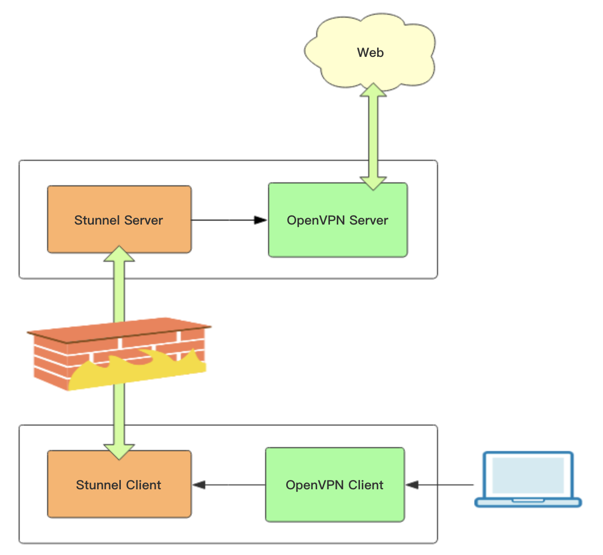

众所周知的原因，在海外直接搭建 OpenVPN根本无法使用（TCP 模式），或者用段时间就被墙了（UDP 模式）。本文主要介绍如何通过 Stunnel隐藏 OpenVPN 流量，使其看起来像普通的 SSL 协议传输，从而绕过 gfw。

Stunnel 分为客户端和服务端，客户端负责接收用户 OpenVPN 客户端流量并转化成 SSL 协议加密数据包，然后转发给 Stunnel 服务端，实现  SSL 协议数据传输，服务端然后将流量转化成 OpenVPN 流量传输给 OpenVPN 服务端。因此我们可以在国内搭 Stunnel  客户端，国外搭 Stunnel 服务端。OpenVPN + Stunnel 整体架构如下：

​

### 1. 搭建 OpenVPN 服务端

这里要说明的是，Stunnel 不支持 udp 流量转换，所以  OpenVPN 需要以 TCP 模式运行。

[openVPN](.md)

### 2. stunnel 服务端安装配置

生成证书（自签名）
```bash
mkdir -p /etc/stunnel/certs
cd /etc/stunnel/certs
openssl req -new -x509 -days 3650 -nodes -out stunnel.pem -keyout stunnel.pem
chmod 600 stunnel.pem

# req指令，用来创建和管理证书请求（Certificate Signing Request, CSR）以让第三方权威机构CA来签发我们需要的证书。也可以使用-x509参数来生成自签名证书。
# -new参数，表示新建证书（或证书请求）
# -x509参数，表示要生成x.509格式的证书而不是证书请求
# -days参数，表示生成的证书的有效时间
# -nodes参数，不要加密私钥（如果没有定义这个参数，执行openssl req命令时候会要求输入一个密码，来对要生成的私钥文件进行加密，然后后面stunnel或nginx这些服务器程序要使用这个私钥的时候就会被要求输入密码）
# -out参数，要生成的证书(certificate)文件名（如果没有定义-x509参数，生成的就是证书请求certificate request）
# -keyout参数，要生成的私钥(private key)文件名（上面使用了跟证书一样的文件名，并不会覆盖该文件，而是追加到一起）
```


# stunnel 服务端配置

```bash
# 安装 stunnel
# Ubuntu/Debian
apt update
apt install stunnel4

# CentOS/RHEL
yum install stunnel

# 创建配置文件 `/etc/stunnel/stunnel.conf`：
echo 'client = no
pid = /var/run/stunnel.pid
output = /var/log/stunnel.log
cert = /etc/stunnel/certs/stunnel.pem
key = /etc/stunnel/certs/stunnel.pem


; 服务配置
[openvpn]
accept = 25525
connect = 127.0.0.1:443
' >> /etc/stunnel/stunnel.conf


# 手动启动：
stunnel /etc/stunnel/stunnel.conf

# -----------------------------------------------------------------
# 使用 systemd 启动 Stunnel 服务端
echo '[Unit]
Description=Stunnel SSL Proxy
After=network.target

[Service]
Type=forking
ExecStart=/usr/bin/stunnel /etc/stunnel/stunnel.conf
ExecStop=/usr/bin/pkill stunnel
Restart=on-failure

[Install]
WantedBy=multi-user.target' >> /etc/systemd/system/stunnel.service

# 启动 Stunnel 服务端：
systemctl daemon-reload
systemctl start  stunnel.service
systemctl enable stunnel.service
```


### 3. stunnel 客户端安装配置

因为我会在 client的配置中开启了证书验证，就是对于对方发过来的证书文件，client需要去 CAfile中进行匹配，匹配到的证书才是受信证书，才允许建立连接。这样的话，我们就需要把server端的证书拷贝过来。我是直接打开 server端的 stunnel.pem，然后将里面CERITIFICATE拷贝到client端新建的`/etc/stunnel/stunnel-client.pem`文件中

```bash
mkdir /etc/stunnel/certs/ -p
cd certs/
vim /etc/stunnel/certs/stunnel-client.pem
chmod 600 /etc/stunnel/certs/stunnel-client.pem
```

![[企业建设/openVPN/assets/b415667351877489c242118522cc0847_MD5.png]]

```bash
# 安装 stunnel
# Ubuntu/Debian
apt update
apt install stunnel4

# CentOS/RHEL
yum install stunnel

# stunnel 客户端配置
# 创建配置文件 `/etc/stunnel/stunnel-client.conf`：
echo 'client = yes
pid = /var/run/stunnel-client.pid
output = /var/log/stunnel-client.log

; 连接到远程加密服务
[openvpn]
accept = 443
connect = server-ip:25525
CAfile = /etc/stunnel/certs/stunnel-client.pem
'>> /etc/stunnel/stunnel-client.conf


# 手动启动：
stunnel /etc/stunnel/stunnel-client.conf

# -----------------------------------------------------------------
# 使用 systemd 启动 Stunnel 服务端
echo '[Unit]
Description=Stunnel SSL Proxy
After=network.target

[Service]
Type=forking
ExecStart=/usr/bin/stunnel /etc/stunnel/stunnel-client.conf
ExecStop=/usr/bin/pkill stunnel
Restart=on-failure

[Install]
WantedBy=multi-user.target' >> /etc/systemd/system/stunnel-client.service

# 启动 Stunnel：
systemctl daemon-reload
systemctl start  stunnel-client.service
systemctl enable stunnel-client.service
```

Stunnel + OpenVPN 都配好后，就可以使用 OpenVPN 客户端了，需要注意的是 OpenVPN 客户端现在需要连接的是 Stunnel 客户端，不再是直接连接 OpenVPN 服务端。

### 4. stunnel server 配置文件详解

```ini
; 设置工作目录
chroot = /var/run/stunnel/

; 设置stunnel的pid文件路径（在chroot下）
pid = /stunnel.pid

; 设置stunnel工作的用户（组）
setuid = root
setgid = root

; 开启日志等级：emerg (0), alert (1), crit (2), err (3), warning (4), notice (5), info (6), or debug (7)
; 默认为5
debug = 7

; 日志文件路径（我的server的版本有个bug，这个文件也被放在chroot路径下了，client的版本则是独立的=。=#）
output = /stunnel.log

; 证书文件，就是在本文2.2中用openssl生成的自签名证书（server端必须设置这两项）
cert = /etc/stunnel/stunnel.pem

; 私钥文件
key = /etc/stunnel/stunnel.pem

; 设置stunnel服务，可以设置多个服务，监听同的端口，并发给不同的server。
; 自定义服务名 openvpn
[openvpn]

; 服务监听的端口，client要连接这个端口与server通信
accept = 25515

; 服务要连接的端口，连接到openvpn的 443端口，将数据发给openvpn
connect = 443

; **************************************************************************
; * 下面这些配置我都注释掉了，但也需要了解下 *
; **************************************************************************
; 设置是否对传输数据进行压缩，默认不开启。
; 这是跟openssl相关的，如果你的openssl没有zlib，开启这个设置会导致启动失败（failed to initialize compression method）
;compression = zlib

; 设置ssl版本,这个也是跟安装的openssl有关的
;sslVersion = TLSv1

; Authentication stuff needs to be configured to prevent MITM attacks
; It is important to understand that this option was solely designed for access control and not for authorization
; It is not enabled by default!
; 下面这些配置用来定义是否信任对方发过来的证书。就好比浏览器访问https的时候，浏览器默认会信任那些由权威CA机构签发的证书，
; 对于那些自签名证书，浏览器就会弹出对话框提醒用户这个证书可能不安全，是否要信任该证书。
; 这是有效防止中间人攻击的手段
; verify 等级2表示需要验证对方发过来的证书（默认0，不需要验证，都信任）
; 因为这个配置是server端的，我们不需要理会client的证书（client也不会没事发证书过来啦）
;verify = 2

; CAfile 表示受信的证书文件，即如果对方发过来的证书在这个CAfile里，那么就是受信任的证书；否则不信任该证书，断开连接。
;CAfile = /etc/stunnel/stunnel-client.pem
```


### 5. stunnel client 配置文件详解

```ini
; stunnel工作目录
chroot = /var/run/stunnel/

; stunnel工作的用户组
setuid = root
setgid = root

; stunnel工作时候的pid
pid = /stunnel.pid

; 日志等级
debug = 7

; 日志文件
output = /var/log/stunnel/stunnel.log

; 表示以client模式启动stunnel，默认client = no，即server模式
client = yes

; 定义一个服务
[openvpn]

; 监听8443端口，openvpn-client 连接到stunnel的8443端口
accept = 8443

; 要连接到的stunnel server的ip与端口
connect = xx.xx.xx.xx:25515

; 需要验证对方发过来的证书
verify = 2

; 用来进行证书验证的文件（里面有stunnel server的证书）
CAfile = /etc/stunnel/stunnel-server.pem

; 客户端不需要传递自己的证书，所以注释掉
;cert = /etc/stunnel/stunnel.pem
;key = /etc/stunnel/stunnel.key
```