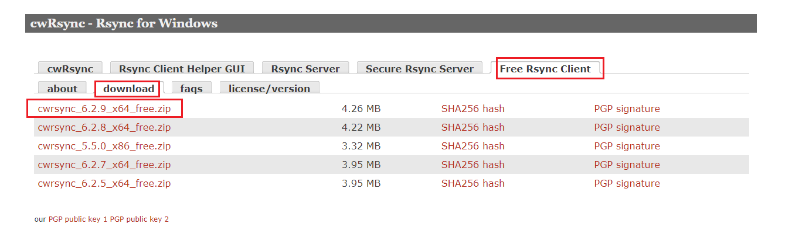

最近接到一个需求，要将centos服务器的一些文件，定时增量下载到本地的winserver中。

测试环境如下：

服务端（Centos 7.9）

客户端（window 10）

# 服务端配置

1. 服务器安装rsync

    ```bash
    yum install -y rsync
    ```
2. 修改配置文件(/etc/rsyncd.conf)

    没有这个文件就创建一个

    ```bash
    # /etc/rsyncd: configuration file for rsync daemon mode

    # See rsyncd.conf man page for more options.

    # configuration example:

    # uid = nobody
    # gid = nobody
    # use chroot = yes
    # max connections = 4
    # pid file = /var/run/rsyncd.pid
    # exclude = lost+found/
    # transfer logging = yes
    # timeout = 900
    # ignore nonreadable = yes
    # dont compress = *.gz *.tgz *.zip *.z *.Z *.rpm *.deb *.bz2
    port = 873 # 指定端口（默认873）

    [ftp]
    path = /home/backup # 需要同步的目录
    comment = ftp export area
    auth_users = test_rsync # 同步用户名（自定义）
    secretes file = /etc/rsync.passwd # 密码文件路径
    ```
3. 创建密码文件(/etc/rsync.passwd)

    文件内容如下，格式为（账号:密码）

    ```bash
    test_rsync:aaa123
    ```
4. 启动服务

    ```bash
    /usr/bin/rsync --daemon --config=/etc/rsyncd.conf
    ```

    –daemon：守护进程运行

    –config：指定配置文件

# 客户端配置

1. 下载[cwrsync](https://www.itefix.net/cwrsync)

    ​
2. 添加密码文件(rsync.passwd)

    文件内容和服务器的保持一致，我放在cwrsync的bin目录
3. 执行同步命令

    ```bash
    rsync --port=873 -avz --delete --password-file=rsync.password rsync_backup@remote_ip::ftp /cygdrive/e/download/backup
    ```
    –port：指定端口

    –delete：服务端删除的文件，客户端也会删除

    –password-file：指定密码文件

    /cygdrive/为本地磁盘默认开头，/cygdrive/e/download/backup表示E:\\download\\backup

    rsync\_backup@remote\_ip：（密码文件的用户名@服务器ip）

    ‍
4. 创建批处理文件和定时任务去执行上面的同步命令即可
