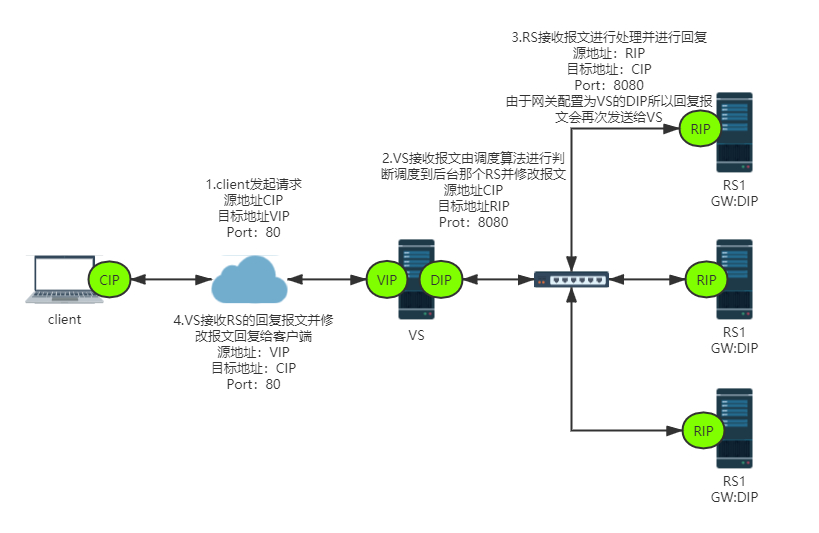
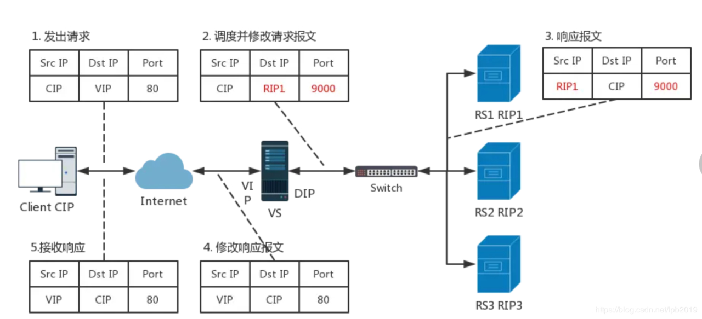
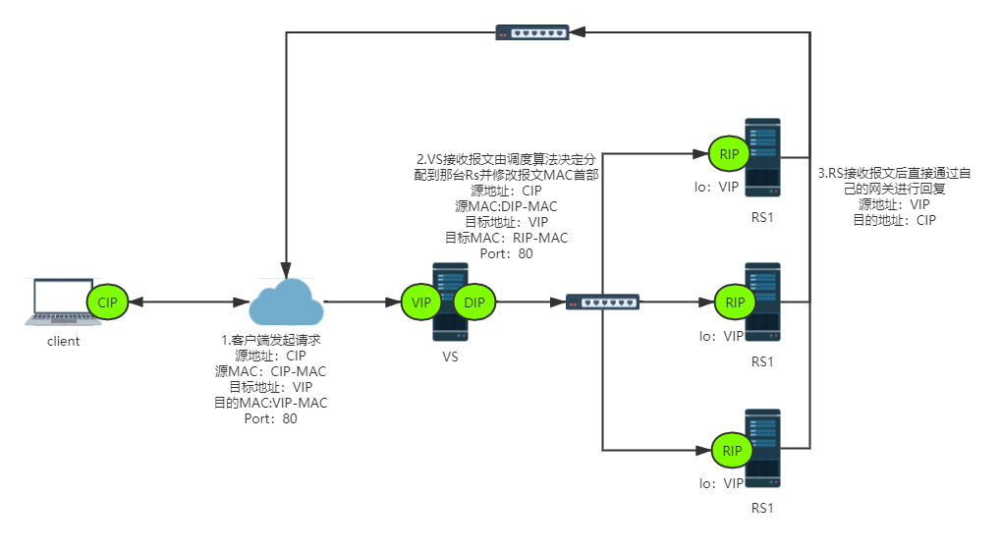
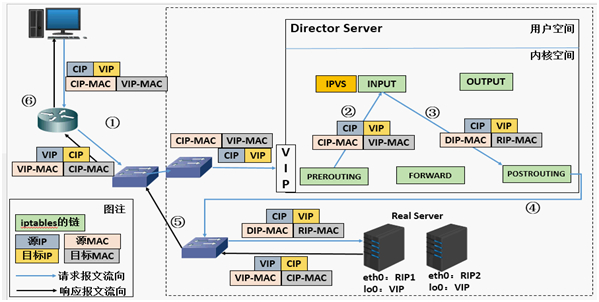
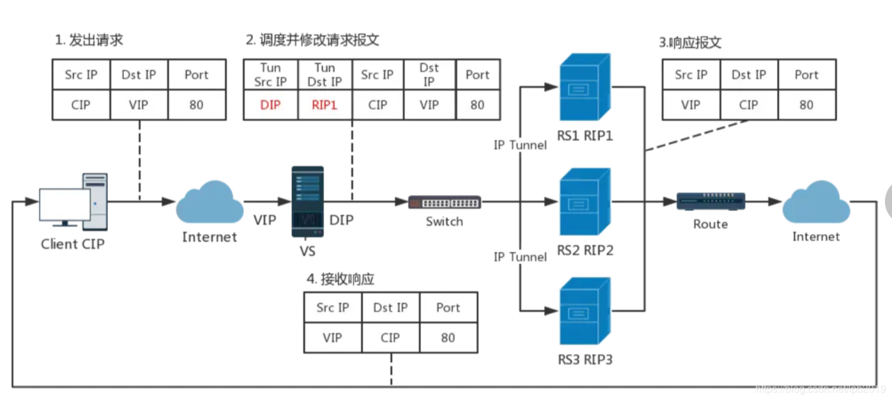
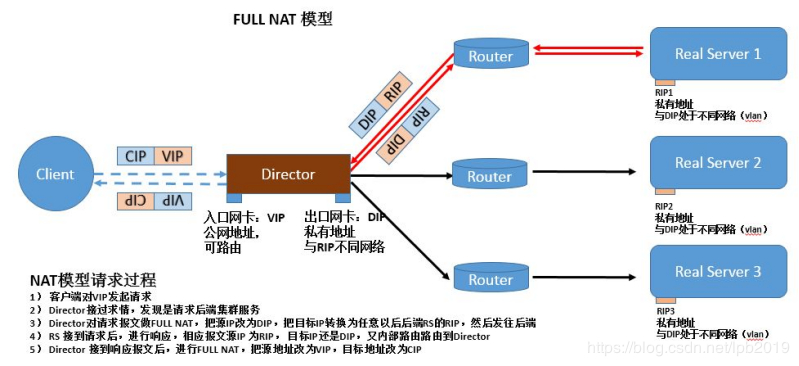
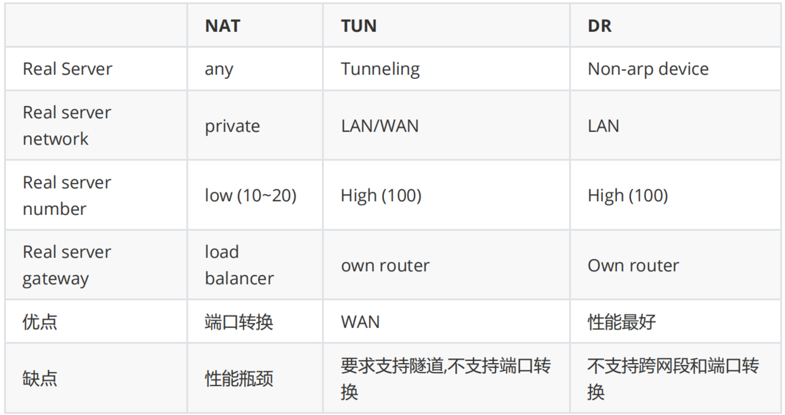

## 2.1 LVS集群的工作模式

lvs-nat：修改请求报文的目标IP,多目标IP的DNAT

lvs-dr：操纵封装新的MAC地址（默认的工作模式）

lvs-tun：在原请求IP报文之外新加一个IP首部

lvs-fullnat：修改请求报文的源和目标IP

### 2.1.1 LVS的NAT模式



vs-nat：本质是多目标IP的DNAT，通过将请求报文中的目标地址和目标端口修改为某挑出的RS的RIP和PORT实现转发

（1）RIP和DIP应在同一个IP网络，且应使用私网地址；**RS的网关要指向DIP**

 **（2）请求报文和响应报文都必须经由Director转发，Director易于成为系统瓶颈**

 **（3）支持端口映射，可修改请求报文的目标PORT**

（4）VS必须是Linux系统，RS可以是任意OS系统



### 2.1.2 LVS的DR模式

LVS-DR：Direct  Routing，直接路由，LVS默认模式,应用最广泛,通过为请求报文重新封装一个MAC首部进行转发，源MAC是DIP所在的接口的MAC，目标MAC是某挑选出的RS的RIP所在接口的MAC地址；源IP/PORT，以及目标IP/PORT均保持不变  
​

**DR模式的特点：**

- **Director和各RS都配置有VIP**
- 确保前端路由器将目标IP为VIP的请求报文发往Director

  - 在前端网关做静态绑定VIP和Director的MAC地址
  - **在RS上修改内核参数以限制arp通告及应答级别**
- RS的RIP可以使用私网地址，也可以是公网地址；RIP与DIP在同一IP网络；**RIP的网关不能指向DIP，以确保响应报文不会经由Director**
- **RS和Director要在同一个物理网络**
- **请求报文要经由Director，但响应报文不经由Director，而由RS直接发往Client**
- **不支持端口映射（端口不能修改）**
- 无需开启 ip\_forward
- RS可使用大多数OS系统  
  ​

### 2.1.3 LVS的TUN模式

转发方式：不修改请求报文的IP首部（源IP为CIP，目标IP为VIP），而在原IP报文之外再封装一个IP首部（源IP是DIP，目标IP是RIP），将报文发往挑选出的目标RS；RS直接响应给客户端（源IP是VIP，目标IP是CIP）  
​

**TUN模式特点：**

1. RIP和DIP可以不处于同一物理网络中，RS的网关一般不能指向DIP,且RIP可以和公网通信。也就是说集群节点可以跨互联网实现。DIP, VIP, RIP可以是公网地址
2. RealServer的tun接口上需要配置VIP地址，以便接收director转发过来的数据包，以及作为响应的报源IP
3. Director转发给RealServer时需要借助隧道，隧道外层的IP头部的源IP是DIP，目标IP是RIP，而RealServer响应给客户端的IP头部是根据隧道内层的IP头分析得到的，源IP是VIP，目标IP是CIP
4. 请求报文要经由Director，但响应不经由Director,响应由RealServer自己完成
5. 不支持端口映射
6. RS的OS须支持隧道功能

应用场景:

```bash
一般来说，TUN模式常会用来负载调度缓存服务器组，这些缓存服务器一般放置在不同的网络环境，可以就近折返给客户端。在请求对象不在Cache服务器本地命中的情况下，Cache服务器要向源服务器发送请求，将结果取回，最后将结果返回给用户。
LAN环境一般多采用DR模式，WAN环境虽然可以用TUN模式，但是一般在WAN环境下，请求转发更多的被haproxy/nginx/DNS等实现。因此，TUN模式实际应用的很少,跨机房的应用一般专线光纤连接或DNS调度
```

### 2.1.4 LVS的FULLNAT模式



通过同时修改请求报文的源IP地址和目标IP地址进行转发

CIP --\> DIP

VIP --\> RIP

**fullnat模式特点：**

- VIP是公网地址，RIP和DIP是私网地址，且通常不在同一IP网络；因此，RIP的网关一般不会指向DIP
- RS收到的请求报文源地址是DIP，因此，只需响应给DIP；但Director还要将其发往Client
- 请求和响应报文都经由Director
- 相对NAT模式，可以更好的实现LVS-RealServer间跨VLAN通讯
- 支持端口映射

**注意：此类型kernel默认不支持**

### 2.1.5 LVS工作模式总结和比较



**lvs-nat与lvs-fullnat：**

- 请求和响应报文都经由Director
- lvs-nat：RIP的网关要指向DIP
- lvs-fullnat：RIP和DIP未必在同一IP网络，但要能通信

**lvs-dr与lvs-tun：**

- 请求报文要经由Director，但响应报文由RS直接发往Client
- lvs-dr：通过封装新的MAC首部实现，通过MAC网络转发
- lvs-tun：通过在原IP报文外封装新IP头实现转发，支持远距离通信

## 2.2 LVS 调试算法

ipvs scheduler：根据其调度时是否考虑各RS当前的负载状态

分为两种：静态方法和动态方法

### 2.2.1 静态方法

仅根据算法本身进行调度

1. RR：roundrobin，轮询,较常用
2. WRR：Weighted RR，加权轮询,较常用
3. SH：Source Hashing，实现session sticky，源IP地址hash；将来自于同一个IP地址的请求始终发往第一次挑中的RS，从而实现会话绑定
4. DH：Destination Hashing；目标地址哈希，第一次轮询调度至RS，后续将发往同一个目标地址的请求始终转发至第一次挑中的RS，典型使用场景是正向代理缓存场景中的负载均衡,如: Web缓存

### 2.2.2 动态方法

主要根据每RS当前的负载状态及调度算法进行调度Overhead\=value 较小的RS将被调度

**activeconns活动的连接，inactiveconns非活动连接，weight权重**

1. LC：least connections 适用于长连接应用

```bash
Overhead=activeconns*256+inactiveconns
```

2. **WLC：Weighted LC，默认调度方法,较常用**

```bash
Overhead=(activeconns*256+inactiveconns)/weight
```

3. SED：Shortest Expection Delay，初始连接高权重优先,只检查活动连接,而不考虑非活动连接

```bash
Overhead=(activeconns+1)*256/weight
```

4. NQ：Never Queue，第一轮均匀分配，后续SED
5. LBLC：Locality-Based LC，动态的DH算法，使用场景：根据负载状态实现正向代理,实现WebCache等
6. LBLCR：LBLC with Replication，带复制功能的LBLC，解决LBLC负载不均衡问题，从负载重的复制到负载轻的RS,,实现Web Cache等

### 2.2.3 内核版本 4.15 版本后新增调度算法：FO和OVF

FO（Weighted Fail Over）调度算法,在此FO算法中，遍历虚拟服务所关联的真实服务器链表，找到还未过载（未设置IP\_VS\_DEST\_F\_OVERLOAD标志）的且权重最高的真实服务器，进行调度,属于静态算法

OVF（Overflow-connection）调度算法，基于真实服务器的活动连接数量和权重值实现。将新连接调度到权重值最高的真实服务器，直到其活动连接数量超过权重值，之后调度到下一个权重值最高的真实服务器,在此OVF算法中，遍历虚拟服务相关联的真实服务器链表，找到权重值最高的可用真实服务器。,属于动态算法

**一个可用的真实服务器需要同时满足以下条件：**

- 未过载（未设置IP\_VS\_DEST\_F\_OVERLOAD标志）
- 真实服务器当前的活动连接数量小于其权重值
- 其权重值不为零

## 2.3 LVS 相关软件

### 2.3.1 程序包：ipvsadm

Unit File: ipvsadm.service

主程序：/usr/sbin/ipvsadm

规则保存工具：/usr/sbin/ipvsadm-save

规则重载工具：/usr/sbin/ipvsadm-restore

配置文件：/etc/sysconfig/ipvsadm-config

ipvs调度规则文件：/etc/sysconfig/ipvsadm

### 2.3.2 ipvsadm 命令

**ipvsadm核心功能：**

- 集群服务管理：增、删、改
- 集群服务的RS管理：增、删、改
- 查看

**ipvsadm 工具用法：**

```bash
#管理集群服务
ipvsadm -A|E -t|u|f service-address [-s scheduler] [-p [timeout]] [-M netmask] [--pe persistence_engine] [-b sched-flags]
ipvsadm -D -t|u|f service-address #删除
ipvsadm –C  #清空
ipvsadm –R  #重载,相当于ipvsadm-restore
ipvsadm -S [-n] #保存,相当于ipvsadm-save

#管理集群中的RS
ipvsadm -a|e -t|u|f service-address -r server-address [-g|i|m] [-w weight]
ipvsadm -d -t|u|f service-address -r server-address
ipvsadm -L|l [options]
ipvsadm -Z [-t|u|f service-address]
```

#### 2.3.2.1 管理集群服务：增、改、删

**增、修改：**

```bash
ipvsadm -A|E -t|u|f service-address [-s scheduler] [-p [timeout]]
```

说明

```bash
service-address：
-t|u|f：
-t: TCP协议的端口，VIP:TCP_PORT 如: -t 10.0.0.100:80
-u: UDP协议的端口，VIP:UDP_PORT
-f：firewall MARK，标记，一个数字
[-s scheduler]：指定集群的调度算法，默认为wlc
```

范例:

```bash
ipvsadm -A -t 10.0.0.100:80 -s wrr
```

**删除：**

```bash
ipvsadm -D -t|u|f service-address
```

#### 2.3.2.2 管理集群上的RS：增、改、删

**增、改：**

```bash
ipvsadm -a|e -t|u|f service-address -r server-address [-g|i|m] [-w weight]
```

**删：**

```bash
ipvsadm -d -t|u|f service-address -r server-address
server-address：
rip[:port] 如省略port，不作端口映射
选项：
lvs类型：
-g: gateway, dr类型，默认
-i: ipip, tun类型
-m: masquerade, nat类型
-w weight：权重
```

范例:

```bash
ipvsadm -a -t 10.0.0.100:80 -r 10.0.0.8:8080 -m -w 3
```

#### 2.3.2.3 其他操作

**清空定义的所有内容：**

```bash
ipvsadm -C
```

**清空计数器：**

```bash
ipvsadm -Z [-t|u|f service-address]
```

**查看：**

```bash
ipvsadm -L|l [options]
--numeric, -n：以数字形式输出地址和端口号
--exact：扩展信息，精确值
--connection，-c：当前IPVS连接输出
--stats：统计信息
--rate ：输出速率信息
```

**ipvs规则：**

```bash
/proc/net/ip_vs
```

**ipvs连接：**

```bash
/proc/net/ip_vs_conn
```

**保存：建议保存至/etc/sysconfig/ipvsadm**

```bash
ipvsadm-save > /PATH/TO/IPVSADM_FILE
ipvsadm -S > /PATH/TO/IPVSADM_FILE
systemctl stop ipvsadm.service  #会自动保存规则至/etc/sysconfig/ipvsadm
```

**重载：**

```bash
ipvsadm-restore < /PATH/FROM/IPVSADM_FILE
systemctl  start ipvsadm.service  #会自动加载/etc/sysconfig/ipvsadm中规则
```

## 2.4 防火墙标记

FWM：FireWall Mark

MARK target 可用于给特定的报文打标记

--set-mark value

其中：value 可为0xffff格式，表示十六进制数字

借助于防火墙标记来分类报文，而后基于标记定义集群服务；可将多个不同的应用使用同一个集群服务进行调度

实现方法：

**在Director主机打标记：**

```bash
iptables -t mangle -A PREROUTING -d $vip -p $proto -m multiport --dports
$port1,$port2,… -j MARK --set-mark NUMBER
```

**在Director主机基于标记定义集群服务：**

```bash
ipvsadm -A -f NUMBER [options]
```

范例:

```bash
[15:54:04 root@lvs ~]#iptables -t mangle -A PREROUTING -d 192.168.10.100 -p tcp -m multiport --dports 80,443 -j MARK --set-mark 10
[15:54:24 root@lvs ~]#ipvsadm -C
[15:54:38 root@lvs ~]#ipvsadm -A -f 10 -s rr
[15:54:49 root@lvs ~]#ipvsadm -a -f 10 -r 192.168.10.71 -g
[15:55:04 root@lvs ~]#ipvsadm -a -f 10 -r 192.168.10.72 -g
[15:55:07 root@lvs ~]#ipvsadm -Ln
IP Virtual Server version 1.2.1 (size=4096)
Prot LocalAddress:Port Scheduler Flags
-> RemoteAddress:Port           Forward Weight ActiveConn InActConn
FWM  10 rr
-> 192.168.10.71:0              Route   1      0          0
-> 192.168.10.72:0              Route   1      0          0
```

## 2.5 LVS 持久连接

session 绑定：对共享同一组RS的多个集群服务，需要统一进行绑定，lvs sh算法无法实现持久连接（ lvs persistence ）模板：实现无论使用任何调度算法，在一段时间内（默认360s ），能够实现将来自同一个地址的请求始终发往同一个RS

```bash
ipvsadm -A|E -t|u|f service-address [-s scheduler] [-p [timeout]]
```

**持久连接实现方式：**

- 每端口持久（PPC）：每个端口定义为一个集群服务，每集群服务单独调度
- 每防火墙标记持久（PFWMC）：基于防火墙标记定义集群服务；可实现将多个端口上的应用统一调度，即所谓的port Affinity
- 每客户端持久（PCC）：基于0端口（表示所有服务）定义集群服务，即将客户端对所有应用的请求都调度至后端主机，必须定义为持久模式

**范例：**

```bash
[15:55:13 root@lvs ~]#ipvsadm -E -f 10 -p
[15:58:30 root@lvs ~]#ipvsadm -Ln
IP Virtual Server version 1.2.1 (size=4096)
Prot LocalAddress:Port Scheduler Flags
-> RemoteAddress:Port           Forward Weight ActiveConn InActConn
FWM  10 wlc persistent 360
-> 192.168.10.71:0              Route   1      0          0
-> 192.168.10.72:0              Route   1      0          0

[15:58:34 root@lvs ~]#ipvsadm -E -f 10 -p 3600
[15:59:42 root@lvs ~]#ipvsadm -Ln
IP Virtual Server version 1.2.1 (size=4096)
Prot LocalAddress:Port Scheduler Flags
-> RemoteAddress:Port           Forward Weight ActiveConn InActConn
FWM  10 wlc persistent 3600
-> 192.168.10.71:0              Route   1      0          6
-> 192.168.10.72:0              Route   1      0          6
[16:00:21 root@lvs ~]#cat /proc/net/ip_vs_conn
Pro FromIP   FPrt ToIP     TPrt DestIP   DPrt State       Expires PEName PEData
IP  C0A80A54 0000 0000000A 0000 C0A80A47 0000 NONE            277
TCP C0A80A54 962E C0A80A64 0050 C0A80A47 0050 FIN_WAIT         37
TCP C0A80A54 962A C0A80A64 0050 C0A80A47 0050 FIN_WAIT         37
TCP C0A80A54 9624 C0A80A64 0050 C0A80A47 0050 FIN_WAIT         35
TCP C0A80A54 962C C0A80A64 0050 C0A80A47 0050 FIN_WAIT         37
TCP C0A81E64 8EC6 C0A80A64 0050 C0A80A48 0050 FIN_WAIT         27
TCP C0A81E64 8EC2 C0A80A64 0050 C0A80A48 0050 FIN_WAIT         26
TCP C0A80A54 9626 C0A80A64 0050 C0A80A47 0050 FIN_WAIT         36
TCP C0A81E64 8EC0 C0A80A64 0050 C0A80A48 0050 FIN_WAIT         25
TCP C0A81E64 8EBE C0A80A64 0050 C0A80A48 0050 FIN_WAIT         25
TCP C0A81E64 8EC4 C0A80A64 0050 C0A80A48 0050 FIN_WAIT         26
TCP C0A81E64 8EBC C0A80A64 0050 C0A80A48 0050 FIN_WAIT         24
IP  C0A81E64 0000 0000000A 0000 C0A80A48 0000 NONE            267
TCP C0A80A54 9628 C0A80A64 0050 C0A80A47 0050 FIN_WAIT         36
[16:00:22 root@lvs ~]#ipvsadm -Lnc
IPVS connection entries
pro expire state       source             virtual            destination
IP  04:29  NONE        192.168.10.84:0    0.0.0.10:0         192.168.10.71:0
TCP 00:29  FIN_WAIT    192.168.10.84:38446 192.168.10.100:80  192.168.10.71:80
TCP 00:28  FIN_WAIT    192.168.10.84:38442 192.168.10.100:80  192.168.10.71:80
TCP 00:26  FIN_WAIT    192.168.10.84:38436 192.168.10.100:80  192.168.10.71:80
TCP 00:29  FIN_WAIT    192.168.10.84:38444 192.168.10.100:80  192.168.10.71:80
TCP 00:19  FIN_WAIT    192.168.30.100:36550 192.168.10.100:80  192.168.10.72:80
TCP 00:17  FIN_WAIT    192.168.30.100:36546 192.168.10.100:80  192.168.10.72:80
TCP 00:28  FIN_WAIT    192.168.10.84:38438 192.168.10.100:80  192.168.10.71:80
TCP 00:17  FIN_WAIT    192.168.30.100:36544 192.168.10.100:80  192.168.10.72:80
TCP 00:17  FIN_WAIT    192.168.30.100:36542 192.168.10.100:80  192.168.10.72:80
TCP 00:18  FIN_WAIT    192.168.30.100:36548 192.168.10.100:80  192.168.10.72:80
TCP 00:16  FIN_WAIT    192.168.30.100:36540 192.168.10.100:80  192.168.10.72:80
IP  04:19  NONE        192.168.30.100:0   0.0.0.10:0         192.168.10.72:0
TCP 00:28  FIN_WAIT    192.168.10.84:38440 192.168.10.100:80  192.168.10.71:80
```

‍
