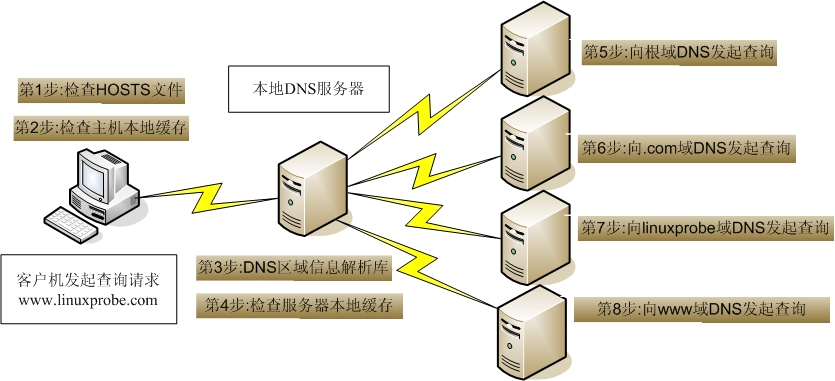

## DNS服务简介

DNS(Domain Name System–域名系统),是因特网的一项服务。它作为将域名和IP地址相互映射的一个分布式数据库，能够使人更方便地访问互联网。是一个应用层的协议DNS使用TCP和UDP端口53。

DNS是一个分布式数据库,命名系统采用层次的逻辑结构,如同一颗倒置的树,这个逻辑的树形结构称为域名空间,由于DNS划分了域名空间,所以各机构可以使用自己的域名空间创建DNS信息.

> 注:DNS域名空间中,树的最大深度不得超过127层,树中每个节点最长可以存储63个字符.

## DNS名词解释

### **1. 域和域名**

DNS树的每个节点代表一个域.通过这些节点,对整个域名空间进行划分,成为一个层次结构.

域名空间的每个域的名字,通过域名进行表示.

域名:通常由一个完全合格域名（FQDN）标识.FQDN能准确表示出其相对于DNS  域树根的位置,也就是节点到DNS  树根的完整表述方式,从节点到树根采用反向书写,并将每个节点用“.”分隔,对于DNS 域google   来说,其完全正式域名（FQDN）为google.com.

**例如：google为com域的子域,其表示方法为google.com，而www为google域中的子域,可以使用**​**[www.google.com表示](http://www.google.com表示)**

> 注意:通常,FQDN 有严格的命名限制,长度不能超过256 字节,只允许使用字符a-z,0-9,A-Z和减号（-）.点号（.）只允许在域名标志之间（例如“google.com”）或者FQDN 的结尾使用.

域名不区分大小.

由最顶层到下层,可以分成:根域、顶级域、二级域、子域.

Internet 域名空间的最顶层是根域（root）,其记录着Internet 的重要DNS 信息,由**Internet域名注册授权机构管理**,该机构把域名空间各部分的管理责任分配给连接到Internet 的各个组织.

 **“.”全球有13个根(root)服务器**

DNS 根域下面是顶级域,也由Internet 域名注册授权机构管理.共有3 种类型的顶级域.

**组织域**:**采用3 个字符的代号**,**表示DNS 域中所包含的组织的主要功能或活动**.比如com 为商业机构组织,edu 为教育机构组织,gov 为政府机构组织,mil 为军事机构组织,net 为网络机构组织,org 为非营利机构组织,int 为国际机构组织.

**地址域**:**采用两个字符的国家或地区代号**.如cn 为中国,kr 为韩国,us 为美国.

**反向域**:**这是个特殊域**,**名字为in-addr.arpa**,**用于将IP 地址映射到名字（反向查询）** .

对于顶级域的下级域,Internet 域名注册授权机构授权给Internet 的各种组织.当一个组织获得了对域名空间某一部分的授权后,该组织就负责命名所分配的域及其子域,包括域中的计算机和其他设备,并管理分配域中主机名与IP 地址的映射信息.

### 2、区（Zone）：

区是DNS 名称空间的一部分,其包含了一组存储在DNS 服务器上的资源记录.

使用区的概念,DNS 服务器回答关于自己区中主机的查询,每个区都有自己的授权服务器.

### 3.主域名服务器和辅助域名服务器：

当区的辅助服务器启动时,它与该区的主控服务器进行连接并启动一次区传输,区辅助服务器定期与区主控服务器通信,查看区数据是否改变.如果改变了,它就启动一次数据更新传输.每个区必须有主服务器,另外每个区至少要有一台辅助服务器,否则如果该区的主服务器崩溃了,就无法解析该区的名称.

辅助服务器的优点:

1. 容错能力  
    配置辅助服务器后,在该区主服务器崩溃的情况下,客户机仍能解析该区的名称.一般把区的主服务器和区的辅助服务器安装在不同子网上,这样如果到一个子网的连接中断,DNS 客户机还能直接查询另一个子网上的名称服务器.
2. 减少广域链路的通信量  
    如果某个区在远程有大量客户机,用户就可以在远程添加该区的辅助服务器,并把远程的客户机配置成先查询这些服务器,这样就能防止远程客户机通过慢速链路通信来进行DNS 查询.
3. 减轻主服务器的负载  
    辅助服务器能回答该区的查询,从而减少该区主服务器必须回答的查询数.

### 4.DNS相关概念：

- DNS服务器：  
  运行DNS 服务器程序的计算机,储存DNS 数据库信息.DNS 服务器会尝试解析客户机的查询请求.  
  在解答查询时,如果DNS 服务器能提供所请求的信息,就直接回应解析结果,如果该DNS 服务器没有相应的域名信息,则为客户机提供另一个能帮助解析查询的服务器地址,如果以上两种方法均失败,则回应客户机没有所请求的信息或请求的信息不存在.
- DNS缓存：  
  运行DNS 服务器程序的计算机,储存DNS 数据库信息.DNS 服务器会尝试解析客户机的查询请求.  
  在解答查询时,如果DNS 服务器能提供所请求的信息,就直接回应解析结果,如果该DNS 服务器没有相应的域名信息,则为客户机提供另一个能帮助解析查询的服务器地址,如果以上两种方法均失败,则回应客户机没有所请求的信息或请求的信息不存在.

### 5、DNS两种查询方式：

1. 递归查询：  
    递归查询是一种DNS 服务器的查询模式,在该模式下DNS 服务器接收到客户机请求,必须使用一个准确的查询结果回复客户机.如果DNS 服务器本地没有存储查询DNS 信息,那么该服务器会询问其他服务器,并将返回的查询结果提交给客户机.
2. 迭代查询：  
    DNS 服务器另外一种查询方式为迭代查询,当客户机发送查询请求时,DNS 服务器并不直接回复查询结果,而是告诉客户机另一台DNS 服务器地址,客户机再向这台DNS 服务器提交请求,依次循环直到返回查询的结果为止.

### 6、正向解析和方向解析：

- 正向解析：是指域名到IP地址的解析过程。
- 反向解析：是指IP地址到域名的解析过程。

### 7、DNS资源记录：

1. **SOA 资源记录(全区唯一)**   
    每个区在区的开始处都包含了一个起始授权记录（Start of Authority Record）,简称SOA 记录.  
    SOA 定义了域的全局参数,进行整个域的管理设置.一个区域文件只允许存在唯一的SOA 记录.
2. **NS 资源记录:**   
    NS（Name Server）记录是域名服务器记录,用来指定该域名由哪个DNS服务器来进行解析.每个区在区根处至少包含一个NS 记录.
3. **A 资源记录**  
    地址（A）资源记录把FQDN 映射到IP 地址. 因为有此记录,所以DNS服务器能解析FQDN域名对应的IP 地址.  
    A ：是IPv4地址。 AAAA是IPv6主机地址。
4. **PTR 资源记录**  
    相对于A 资源记录,指针（PTR）记录把IP地址映射到FQDN. 用于反向查询,通过IP地址,找到域名.
5. **CNAME 资源记录**  
    别名记录（CNAME）资源记录创建特定FQDN 的别名.用户可以使用CNAME 记录来隐藏用户网络的实现细节,使连接的客户机无法知道真正的域名.  
    例:ping百度时,解析到了百度的别名服务器.百度有个cname\=[www.a.shifen.com.的别名](http://www.a.shifen.com.的别名)
6. **MX 资源记录**  
    邮件交换（MX）资源记录,为DNS 域名指定邮件交换服务器.  
    邮件交换服务器是为DNS 域名处理或转发邮件的主机.处理邮件指把邮件投递到目的地或转交另一不同类型的邮件传送者.转发邮件指把邮件发送到最终目的服务器,用简单邮件传输协议SMTP 把邮件发送给离最终目的地最近的邮件交换服务器,或使邮件经过一定时间的排队.

## DNS工作原理：查询过程

假设[www.abc.com的主机要查询www.xyz.abc.com的服务器ip地址。](http://www.abc.com的主机要查询www.xyz.abc.com的服务器ip地址。)

### 递归查询：

第一步：在hosts静态文件、DNS解析器缓存中查找某主机的ip地址

> hosts文件：以静态映射的方式提供IP地址与主机名的对照表，类似ARP表
>
> 域：abc.com是一个域，它可以划分为多个区域，如abc.com和xyz.abc.com

第二步：上一步无法找到，去DNS本地服务器（即域服务器）查找，其本质是去区域服务器、服务器缓存中查找

第三步：本地DNS服务器查不到就根据‘根提示文件’向负责顶级域‘.com’的DNS服务器查询

第四步：‘根DNS服务器’根据查询域名中的‘xyz.com’，再向xyz.com的区域服务器查询

第五步：[www.xyz.abc.com的DNS服务器直接解析该域名，将查询到的ip再原路返回给请求查询的主机](http://www.xyz.abc.com的DNS服务器直接解析该域名，将查询到的ip再原路返回给请求查询的主机)

### 迭代查询

第一步：在hosts静态文件、DNS解析器缓存中查找某主机的ip地址

第二步：上一步无法找到，在DNS本地服务器（即域服务器）查找所有本层次的区域服务器

第三步：本地DNS服务器查不到就查询上一层次的所有区域服务器，以此类推直至根域名DNS服务器‘.’

第四步：到达根域名服务器后又向下查询，直至查到结果为止。

### 迭代查询与递归查询结合

递归查询需要经过逐层查询才能获得查询结果，当查询具有许多层次的DNS结构时效率很低，所以一般采用两者相结合的查询方式。

第一步：在hosts静态文件、DNS解析器缓存中查找某主机的ip地址

第二步：上一步无法找到，去DNS本地服务器（即域服务器）查找，其本质是去区域服务器、服务器缓存中查找

第三步：本地DNS服务器查不到就根据‘根提示文件’向负责顶级域‘.com’的根DNS服务器查询

第四步：根DNS服务器直接将其区域DNS服务器的ip地址返回给本地服务器，而不用再向xyz.com的区域服务器查询。

第五步：本地DNS服务器将结果返回给请求的主机

