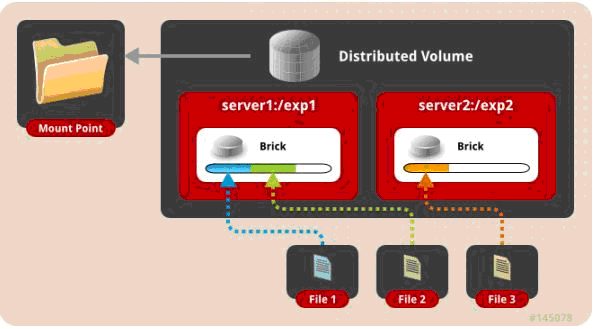
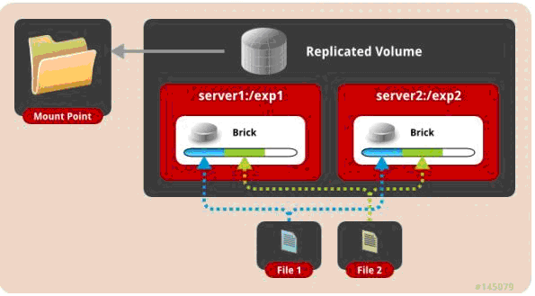
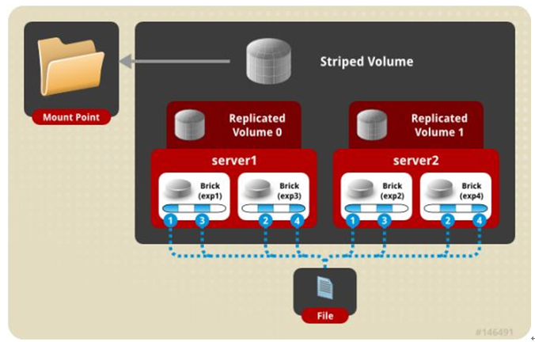

## 环境说明

3台机器安装 GlusterFS 组成一个集群

```bash
# 3台机器安装 GlusterFS 组成一个集群
# 服务器
10.6.0.140
10.6.0.192
10.6.0.196
# 客户端：
10.6.0.94 node-94
```

## 安装

### 安装glusterfs

在三个节点都执行

```bash
#配置 hosts
10.6.0.140 swarm-manager
10.6.0.192 swarm-node-1
10.6.0.196 swarm-node-2

yum install centos-release-gluster
yum install -y glusterfs glusterfs-server glusterfs-fuse glusterfs-rdma
```

### 配置 GlusterFS 集群

启动 glusterFS

```bash
systemctl start glusterd.service
systemctl enable glusterd.service
```

在 swarm-manager 节点上配置，将 节点 加入到 集群中。

```bash
[root@swarm-manager ~]#gluster peer probe swarm-manager
peer probe: success. Probe on localhost not needed

[root@swarm-manager ~]#gluster peer probe swarm-node-1
peer probe: success.

[root@swarm-manager ~]#gluster peer probe swarm-node-2
peer probe: success.
```

### **查看集群状态**

```bash
[root@swarm-manager ~]#gluster peer status
Number of Peers: 2

Hostname: swarm-node-1
Uuid: 41573e8b-eb00-4802-84f0-f923a2c7be79
State: Peer in Cluster (Connected)

Hostname: swarm-node-2
Uuid: da068e0b-eada-4a50-94ff-623f630986d7
State: Peer in Cluster (Connected)
```

### 创建数据存储目录

```bash
[root@swarm-manager ~]#mkdir -p /opt/gluster/data
[root@swarm-node-1 ~]# mkdir -p /opt/gluster/data
[root@swarm-node-2 ~]# mkdir -p /opt/gluster/data
```

### 查看volume 状态

```bash
[root@swarm-manager ~]#gluster volume info
No volumes present
```

### 创建GlusterFS磁盘：

```bash
[root@swarm-manager ~]#gluster volume create models replica 3 swarm-manager:/opt/gluster/data swarm-node-1:/opt/gluster/data swarm-node-2:/opt/gluster/data force
volume create: models: success: please start the volume to access data
```

## volume 模式说明

一、 **默认模式**，既DHT, 也叫 分布卷: 将文件已hash算法随机分布到 一台服务器节点中存储。

```bash
gluster volume create test-volume server1:/exp1 server2:/exp2
```



二、 **复制模式**，既AFR, 创建volume 时带 replica x 数量: 将文件复制到 replica x 个节点中。

```bash
gluster volume create test-volume replica 2 transport tcp server1:/exp1 server2:/exp2
```



三、 **条带模式**，既Striped, 创建volume 时带 stripe x 数量： 将文件切割成数据块，分别存储到 stripe x 个节点中 ( 类似raid 0 )。

```bash
gluster volume create test-volume stripe 2 transport tcp server1:/exp1 server2:/exp2
```


四、 **分布式条带模式（组合型）** ，最少需要4台服务器才能创建。 创建volume 时 stripe 2 server \= 4 个节点： 是DHT 与 Striped 的组合型。

```bash
gluster volume create test-volume stripe 2 transport tcp server1:/exp1 server2:/exp2 server3:/exp3 server4:/exp4
```


五、 **分布式复制模式（组合型）** , 最少需要4台服务器才能创建。 创建volume 时 replica 2 server \= 4 个节点：是DHT 与 AFR 的组合型。

```bash
gluster volume create test-volume replica 2 transport tcp server1:/exp1 server2:/exp2　server3:/exp3 server4:/exp4
```


六、 **条带复制卷模式（组合型）** , 最少需要4台服务器才能创建。 创建volume 时 stripe 2 replica 2 server \= 4 个节点： 是 Striped 与 AFR 的组合型。

```bash
gluster volume create test-volume stripe 2 replica 2 transport tcp server1:/exp1 server2:/exp2 server3:/exp3 server4:/exp4
```



七、 三种模式混合, 至少需要8台 服务器才能创建。 stripe 2 replica 2 , 每4个节点 组成一个 组。

```bash
gluster volume create test-volume stripe 2 replica 2 transport tcp server1:/exp1 server2:/exp2 server3:/exp3 server4:/exp4 server5:/exp5 server6:/exp6 server7:/exp7 server8:/exp8
```


### 查看 volume 状态

```bash
[root@swarm-manager ~]#gluster volume info

Volume Name: models
Type: Replicate
Volume ID: e539ff3b-2278-4f3f-a594-1f101eabbf1e
Status: Created
Number of Bricks: 1 x 3 = 3
Transport-type: tcp
Bricks:
Brick1: swarm-manager:/opt/gluster/data
Brick2: swarm-node-1:/opt/gluster/data
Brick3: swarm-node-2:/opt/gluster/data
Options Reconfigured:
performance.readdir-ahead: on
```

### 启动 models

```bash
[root@swarm-manager ~]#gluster volume start models
volume start: models: success
```

## gluster 性能调优

开启 指定 volume 的配额： (models 为 volume 名称)

```
gluster volume quota models enable
```

限制 models 中 / (既总目录) 最大使用 80GB 空间

```
gluster volume quota models limit-usage / 80GB
```

设置 cache 4GB

```
gluster volume set models performance.cache-size 4GB
```

开启 异步 ， 后台操作

```
gluster volume set models performance.flush-behind on
```

设置 io 线程 32

```
gluster volume set models performance.io-thread-count 32
```

设置 回写 (写数据时间，先写入缓存内，再写入硬盘)

```
gluster volume set models performance.write-behind on
```

## 部署GlusterFS客户端

mount GlusterFS文件系统 (客户端必须加入 glusterfs hosts 否则报错。)

```bash
[root@node-94 ~]#yum install -y glusterfs glusterfs-fuse
[root@node-94 ~]#mkdir -p /opt/gfsmnt
[root@node-94 ~]#mount -t glusterfs swarm-manager:models /opt/gfsmnt/

[root@node-94 ~]#df -h
文件系统 容量 已用 可用 已用% 挂载点
/dev/mapper/vg001-root 98G 1.2G 97G 2% /
devtmpfs 32G 0 32G 0% /dev
tmpfs 32G 0 32G 0% /dev/shm
tmpfs 32G 130M 32G 1% /run
tmpfs 32G 0 32G 0% /sys/fs/cgroup
/dev/mapper/vg001-opt 441G 71G 370G 17% /opt
/dev/sda2 497M 153M 344M 31% /boot
tmpfs 6.3G 0 6.3G 0% /run/user/0
swarm-manager:models 441G 18G 424G 4% /opt/gfsmnt
```

## 测试

### 单文件测试

​`测试方式：客户端创建一个 1G 的文件`​

**DHT模式**

```bash
time dd if=/dev/zero of=hello bs=1000M count=1

记录了1+0 的读入
记录了1+0 的写出
1048576000字节(1.0 GB)已复制，9.1093 秒，115 MB/秒

real 0m9.120s
user 0m0.000s
sys 0m1.134s
```

**AFR 模式**

```
time dd if=/dev/zero of=hello.txt bs=1024M count=1

录了1+0 的读入
记录了1+0 的写出
1073741824字节(1.1 GB)已复制，27.4566 秒，39.1 MB/秒

real 0m27.469s
user 0m0.000s
sys 0m1.065s
```

**Striped 模式**

```
time dd if=/dev/zero of=hello bs=1000M count=1

记录了1+0 的读入
记录了1+0 的写出
1048576000字节(1.0 GB)已复制，9.10669 秒，115 MB/秒

real 0m9.119s
user 0m0.001s
sys 0m0.953s
```

 **条带复制卷模式 (Number of Bricks: 1 x 2 x 2**  **=**  **4)**

```
[root@node-94 ~]#time dd if=/dev/zero of=hello bs=1000M count=1
记录了1+0 的读入
记录了1+0 的写出
1048576000字节(1.0 GB)已复制，17.965 秒，58.4 MB/秒

real 0m17.978s
user 0m0.000s
sys 0m0.970s
```

**分布式复制模式 (Number of Bricks: 2 x 2**  **=**  **4)**

```
[root@node-94 ~]#time dd if=/dev/zero of=haha bs=100M count=10
记录了10+0 的读入
记录了10+0 的写出
1048576000字节(1.0 GB)已复制，17.7697 秒，59.0 MB/秒

real 0m17.778s
user 0m0.001s
sys 0m0.886s
```

针对 分布式复制模式还做了如下测试：

### 4K随机测试

**写测试**

```bash
# 安装fio 
yum -y install libaio-devel

fio -ioengine=libaio -bs=4k -direct=1 -thread -rw=randwrite -size=10G -filename=1.txt -name="EBS 4KB randwrite test" -iodepth=32 -runtime=60

write: io=352204KB, bw=5869.9KB/s, iops=1467, runt= 60002msec
WRITE: io=352204KB, aggrb=5869KB/s, minb=5869KB/s, maxb=5869KB/s, mint=60002msec, maxt=60002msec
```

**读测试**

```bash
fio -ioengine=libaio -bs=4k -direct=1 -thread -rw=randread -size=10G -filename=1.txt -name="EBS 4KB randread test" -iodepth=8 -runtime=60

read: io=881524KB, bw=14692KB/s, iops=3672, runt= 60001msec
READ: io=881524KB, aggrb=14691KB/s, minb=14691KB/s, maxb=14691KB/s, mint=60001msec, maxt=60001msec
```

**512K顺序写测试**

```bash
fio -ioengine=libaio -bs=512k -direct=1 -thread -rw=write -size=10G -filename=512.txt -name="EBS 512KB seqwrite test" -iodepth=64 -runtime=60

write: io=3544.0MB, bw=60348KB/s, iops=117, runt= 60135msec
WRITE: io=3544.0MB, aggrb=60348KB/s, minb=60348KB/s, maxb=60348KB/s, mint=60135msec, maxt=60135msec
```

## 其他的维护命令：

**查看GlusterFS中所有的volume**

```bash
gluster volume list
```

**删除GlusterFS磁盘**

```bash
gluster volume stop models #停止名字为 models 的磁盘
gluster volume delete models #删除名字为 models 的磁盘
```

 注： 删除 磁盘 以后，必须删除 磁盘( /opt/gluster/data ) 中的 （ .glusterfs/ .trashcan/ ）目录。  
否则创建新 volume 相同的 磁盘 会出现文件 不分布，或者 类型 错乱 的问题。

**卸载某个节点GlusterFS磁盘**

```bash
gluster peer detach swarm-node-2
```

**设置访问限制,按照每个volume 来限制**

```bash
gluster volume set models auth.allow 10.6.0.*,10.7.0.
```

 **添加GlusterFS节点**

```bash
gluster peer probe swarm-node-3
gluster volume add-brick models swarm-node-3:/opt/gluster/data
```

注：如果是复制卷或者条带卷，则每次添加的Brick数必须是replica或者stripe的整数倍

**配置卷**

```bash
gluster volume set
```

**缩容volume**

```bash
#先将数据迁移到其它可用的Brick，迁移结束后才将该Brick移除：
gluster volume remove-brick models swarm-node-2:/opt/gluster/data swarm-node-3:/opt/gluster/data start

#在执行了start之后，可以使用status命令查看移除进度：
gluster volume remove-brick models swarm-node-2:/opt/gluster/data swarm-node-3:/opt/gluster/data status

#不进行数据迁移，直接删除该Brick：
gluster volume remove-brick models swarm-node-2:/opt/gluster/data swarm-node-3:/opt/gluster/data commit
```

注意，如果是复制卷或者条带卷，则每次移除的Brick数必须是replica或者stripe的整数倍。

**扩容**

```
gluster volume add-brick models swarm-node-2:/opt/gluster/data
```

**修复命令**

```
gluster volume replace-brick models swarm-node-2:/opt/gluster/data swarm-node-3:/opt/gluster/data commit -force
```

**迁移volume**

```bash
gluster volume replace-brick models swarm-node-2:/opt/gluster/data swarm-node-3:/opt/gluster/data start
#pause 为暂停迁移
gluster volume replace-brick models swarm-node-2:/opt/gluster/data swarm-node-3:/opt/gluster/data pause
#abort 为终止迁移
gluster volume replace-brick models swarm-node-2:/opt/gluster/data swarm-node-3:/opt/gluster/data abort
#status 查看迁移状态
gluster volume replace-brick models swarm-node-2:/opt/gluster/data swarm-node-3:/opt/gluster/data status
#迁移结束后使用commit 来生效
gluster volume replace-brick models swarm-node-2:/opt/gluster/data swarm-node-3:/opt/gluster/data commit
```

**均衡volume**

```bash
gluster volume models lay-outstart
gluster volume models start
gluster volume models startforce
gluster volume models status
gluster volume models stop
```
