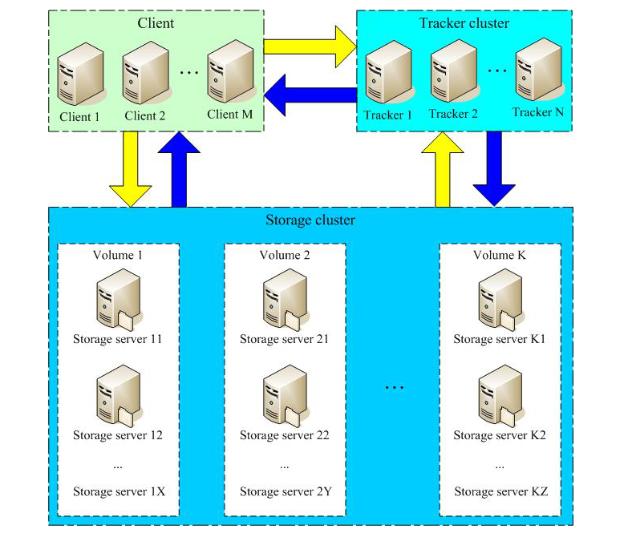

FastDFS是一个开源的轻量级分布式文件系统，它对文件进行管理，功能包括：文件存储、文件同步、文件访问（文件上传、文件下载）等，解决了大容量存储和负载均衡的问题。

FastDFS 系统有三个角色：跟踪服务器(Tracker Server)、存储服务器(Storage Server)和客户端(Client)。

> **Tracker Server**：跟踪服务器，主要做调度工作，起到均衡的作用；负责管理所有的 storage server和 group，每个 storage 在启动后会连接 Tracker，告知自己所属 group 等信息，并保持周期性心跳。

> **Storage Server**：存储服务器，主要提供容量和备份服务；以 group 为单位，每个 group 内可以有多台 storage server，数据互为备份。

> **Client**：客户端，上传下载数据的服务器，也就是我们自己的项目所部署在的服务器。




- 1.定时向tracker上传状态信息
- 2.client上传连接请求
- 3.tracker查询可用storage
- 4.tracker返回storage的ip和port
- 5.client上传文件
- 6.storage生成file\_id ，并将上传内容写入到磁盘
- 7.返回file\_id给client
- 8.client存储file\_id到本地

# 一、下载安装libfastcommon

**1.1 下载libfastcommon**

```bash
wget https://github.com/happyfish100/libfastcommon/archive/refs/tags/V1.0.52.tar.gz
```

**1.2 解压libfastcommon**

```bash
#解压
tar -xvf V1.0.52.tar.gz
#进入目录
cd libfastcommon-1.0.52/
```

**1.3 编译安装**

```bash
# 执行这步需要gcc依赖 yum install gcc gcc-c++
sudo ./make.sh
sudo ./make.sh install
```

**1.4 创建软连接**

```bash
# 注意：由于FastDFS程序引用usr/lib目录所以需要将/usr/lib64下的库文件拷贝至/usr/lib下
sudo ln -s /usr/lib64/libfastcommon.so /usr/local/lib/libfastcommon.so
sudo ln -s /usr/lib64/libfastcommon.so /usr/lib/libfastcommon.so
sudo ln -s /usr/lib64/libfdfsclient.so /usr/local/lib/libfdfsclient.so
sudo ln -s /usr/lib64/libfdfsclient.so /usr/lib/libfdfsclient.so
```

# 二、下载安装fastdfs

**2.1 下载FastDFS**

```bash
wget https://github.com/happyfish100/fastdfs/archive/refs/tags/V6.07.tar.gz
```

**2.2 解压FastDFS**

```bash
tar -xvf ./V6.07.tar.gz
cd fastdfs-6.07/
```

**2.3 编译安装**

```bash
sudo ./make.sh
sudo ./make.sh install
```

# 三、配置Tracker服务

安装成功后，在`/etc`目录下会有一个`fdfs`的目录。进入目录，可以看到示例配置文件：

```bash
[winbert@sd-vm-0004433 fastdfs-6.07]$ cd /etc/fdfs/

[winbert@sd-vm-0004433 fdfs]$ ll
total 32
-rw-r--r-- 1 root root  1909 Jul  3 10:05 client.conf.sample
-rw-r--r-- 1 root root 10246 Jul  3 10:05 storage.conf.sample
-rw-r--r-- 1 root root   620 Jul  3 10:04 storage_ids.conf.sample
-rw-r--r-- 1 root root  9138 Jul  3 10:04 tracker.conf.sample
```

复制一份`tracker.conf.sample`并重命名为`tracker.conf`:

```bash
cp ./tracker.conf.sample ./tracker.conf
```

编辑`tracker.conf`配置文件，主要配置项如下：

```bash
# false 启用  
# true  禁用
disabled=false

# 绑定网卡
bind_addr=

# tracker服务端口
port=22122

# 连接超时时间
connect_timeout=10

# 发送或接受数据时，网络超时时间
network_timeout=60

# 根路径
base_path=/data/fdfs/tracker
#$base_path/data: store data files  存储信息
#$base_path/logs: store log files   日志信息


# 服务时最大连接数
max_connections=1024

# 接受线程数
accept_threads=1

# 工作线程数 通常设置为CPU数量
work_threads=4

# min buff size
min_buff_size = 8KB

# max buff size
max_buff_size = 128KB

# 上传文件的方式
# 0: 轮询
# 1: 指定组
# 2: 负载均衡
store_lookup=2

# store_lookup=1时，指定的组名
store_group=group2

# 选择哪个storage server进行写入
# 0:轮询
# 1:根据ip地址进行排序
# 2:根据优先级排序
store_server=0

# 选择storage server中的哪个目录进行上传，storage server可以有多个存放文件的base_path
# 0: 轮流
# 2: 选择剩余空间最大的
store_path=0

# 选择哪个storage server作为下载服务器
# 0: 轮询 可以下载当前文件的任一storage server 
# 1: 开始上传到哪个storage server 就从哪个storage server下载
download_server=0

# 为系统和应用保留的存储空间
reserved_storage_space = 10%

# 日志级别
log_level=info

# 操作系统运行FastDFS的用户组 (不填就是当前用户组,哪个启动进程就是哪个)
run_by_group=

# 操作系统运行FastDFS的用户 (不填就是当前用户,哪个启动进程就是哪个)
run_by_user=

# 可以连接到此 tracker server 的ip范围（对所有类型的连接都有影响，包括客户端，storage server）
allow_hosts=*

#  同步或刷新日志信息到硬盘的时间间隔，单位为秒 
sync_log_buff_interval = 10

# 检测 storage server 存活的时间隔，单位为秒。
check_active_interval = 120

# # 线程栈的大小
thread_stack_size = 256KB

# 当存储server的ip变化时 集群是否自动调整
storage_ip_changed_auto_adjust = true

# 存储服务器之间同步文件的最大延迟时间，缺省为1天。
storage_sync_file_max_delay = 86400

# 存储服务器同步一个文件需要消耗的最大时间，5分钟。
storage_sync_file_max_time = 300

# 是否使用小文件合并存储特性
use_trunk_file = false 

# 是否定期轮转error log，目前仅支持一天轮转一次
rotate_error_log = false

# error log定期轮转的时间点
error_log_rotate_time=00:00

# 日志保留时间    0表示不删除
log_file_keep_days = 0

# #是否使用连接池
use_connection_pool = false

# 连接池链接的最大生存时间，单位秒
connection_pool_max_idle_time = 3600

# http服务端口号
http.server_port=8080

# 检查存储http长链接的存活时间
http.check_alive_interval=30

# 检查存储长链接的存在方式，当前配置为tcp方式  
http.check_alive_type=tcp

# 检查存储http利用什么标识进行检查  
http.check_alive_uri=/status.html


```

使用`ln -s`建立软链接：

```bash
sudo ln -s /usr/bin/fdfs_trackerd /usr/local/bin
sudo ln -s /usr/bin/stop.sh /usr/local/bin
sudo ln -s /usr/bin/restart.sh /usr/local/bin

```

启动服务：

```bash
# 创建tracker目录
mkdir -p /data/fdfs/tracker
service fdfs_trackerd start

```

启动成功后，在你配置的`base_path`下，会形成如下目录结构：

```bash
${base_path}
  |__data
  |   |__storage_groups.dat：存储分组信息
  |   |__storage_servers.dat：存储服务器列表
  |__logs
  |   |__trackerd.log： tracker server 日志文件 
```

# 四、配置Storage服务

进入`/etc/fdfs`目录，复制FastDFS存储器样例配置文件`storage.conf.sample`，并重命名为`storage.conf`：

```bash
cd /etc/fdfs/
sudo cp ./storage.conf.sample ./storage.conf

```

编辑`storage.conf`，主要编辑以下内容：

```bash
# false 生效
# true  禁用
disabled=false

# 这个storage服务器属于那个group
group_name=group1

# 绑定网卡
bind_addr=

# 连接其他服务器时是否绑定地址，bind_addr配置时本参数才有效
client_bind=true

# 同tracker.conf
port=23000
connect_timeout=10
network_timeout=60

# 主动向tracker发送心跳检测的时间间隔
heart_beat_interval=30

# 主动向tracker发送磁盘使用率的时间间隔
stat_report_interval=60

# 同tracker.conf
base_path=/data/fdfs/storage/
max_connections=1024
#接收/发送数据的buff大小，必须大于8KB
buff_size = 256KB
# 同tracker.conf
accept_threads=1
work_threads=4

# #磁盘IO是否读写分离
disk_rw_separated = true

#混合读写时的读写线程数
disk_reader_threads = 1
disk_writer_threads = 1

# 同步文件时如果binlog没有要同步的文件，则延迟多少毫秒后重新读取，0表示不延迟
sync_wait_msec=50

# 同步完一个文件后间隔多少毫秒同步下一个文件，0表示不休息直接同步
sync_interval=0

# 表示这段时间内同步文件
sync_start_time=00:00
sync_end_time=23:59

# 同步完多少文件后写mark标记
write_mark_file_freq=500

# storage在存储文件时支持多路径，默认只设置一个
store_path_count=1

# 配置多个store_path路径，从0开始，如果store_path0不存在，则base_path必须存在
store_path0=/data/fdfs/data/storage0
#store_path1=/data/fdfs/data/storage1

# FastDFS存储文件时，默认采用了两级目录。这里配置存放文件的目录个数
subdir_count_per_path=256

# tracker_server 的列表 要写端口号
tracker_server=192.168.10.135:22122
#tracker_server=192.168.10.136:22122
#tracker_server=192.168.10.137:22122


log_level=info

# 操作系统运行FastDFS的用户组
run_by_group=

# 操作系统运行FastDFS的用户
run_by_user=

# 允许连接本storage server的IP地址列表
allow_hosts=*

# 文件在data目录下分散存储策略
# 0: 轮流存放，在一个目录下存储设置的文件数后，使用下一个目录进行存储。
# 1: 随机存储，根据文件名对应的hash code来分散存储
file_distribute_path_mode=0

# 当上面的参数file_distribute_path_mode配置为0（轮流存放方式）时，本参数有效。
file_distribute_rotate_count=100

# 当写入大文件时，每写入N个字节，调用一次系统函数fsync将内容强行同步到硬盘。
# 0表示从不调用fsync
fsync_after_written_bytes=0

# 同步或刷新日志信息到硬盘的时间间隔，单位为秒
sync_log_buff_interval=10

# 同步binglog（更新操作日志）到硬盘的时间间隔，单位为秒
sync_binlog_buff_interval=10

# 把storage的stat文件同步到磁盘的时间间隔，单位为秒。
sync_stat_file_interval=300

# 线程栈的大小。FastDFS server端采用了线程方式。
thread_stack_size=512KB

# 本storage server作为源服务器，上传文件的优先级
# 可以为负数。值越小，优先级越高
# 这里就和 tracker.conf 中store_server= 2时的配置相对应了
upload_priority=10

# 网卡别名前缀 在linux上 你可以通过ifconfig -a 看到它
# 空值表示根据操作系统类型自动设置
if_alias_prefix=

# 是否检测上传文件已经存在。如果已经存在，则不存储文件内容
## 1:检测
## 0:不检测
check_file_duplicate=0

# 检查文件重复时，文件内容的签名方式
## hash: four 32 bits hash code
## md5: MD5 signature
file_signature_method=hash

# 存储文件符号连接的命名空间
key_namespace=FastDFS

# 与FastDHT servers 的连接方式 (是否为持久连接) 
# 默认是0（短连接方式）
keep_alive=0

# 你可以使用  "#include filename"指令（不包括双引号）来加载 FastDHT服务列表
# 文件名是一个相对路径 比如一个纯粹的文件名
# 主路径是当前配置文件的主路径
# 必须设置FastDHT服务列表 当此 check_file_duplicate 参数 是true / on
# 更多信息 参考FastDHT 的安装文件

# 是否将文件操作记录到access log
use_access_log = false

# 是否定期轮转access log，目前仅支持一天轮转一次
rotate_access_log = false

# access log定期轮转的时间点，只有当rotate_access_log设置为true时有效
access_log_rotate_time=00:00

# 是否定期轮转error log，目前仅支持一天轮转一次
rotate_error_log = false

# error log定期轮转的时间点，只有当rotate_error_log设置为true时有效
error_log_rotate_time=00:00

# 设置为0表示不按文件大小轮转，否则当access log达到该大小，就会轮转到新文件中
rotate_access_log_size = 0

# 设置为0表示不按文件大小轮转，否则当error log达到该大小，就会轮转到新文件中
rotate_error_log_size = 0

# 是否保留日志文件
# 0为不删除旧日志文件
log_file_keep_days = 0

# 文件同步的时候，是否忽略无效的binlog记录
file_sync_skip_invalid_record=false

# 是否使用连接池
use_connection_pool = false

# 关闭 闲置连接的 时间
connection_pool_max_idle_time = 3600

# 如果存储服务器域名是空的 则使用ip地址
# storage server上web server域名，通常仅针对单独部署的web server
# 这样URL中就可以通过域名方式来访问storage server上的文件了
# 这个参数为空就是IP地址的方式。
http.domain_name=

# 存储服务器 使用的web端口 
http.server_port=8888

```

使用`ln -s`建立软链接:

```bash
sudo ln -s /usr/bin/fdfs_storaged /usr/local/bin
```

启动`storage`服务，启动前请确保`Tracker`是启动的，初次启动成功，会在/data/fdfs/storage目录(你的路径可能不叫这个名字)下创建`data`、`logs`两个目录。

```bash
# 创建storage目录
mkdir -p /data/fdfs/storage
mkdir -p /data/fdfs/data

service fdfs_storaged start

```

查看Storage和Tracker是否在通信:

```bash
/usr/bin/fdfs_monitor /etc/fdfs/storage.conf
```

# 五、fdfs和nginx整合

1.安装fastdfs-nginx-module

```bash
tar -zxvf fastdfs-nginx-module_v1.16.tar.gz -C /usr/local
```

```bash
sudo ln -s /usr/lib64/libfdfsclient.so /usr/lib/libfdfsclient.so
sudo ln -s /usr/lib64/libfdfsclient.so /usr/locale/lib/libfdfsclient.so

cd /usr/local/fastdfs-nginx-module/src/
```

2.修改config文件，将文件中的所有 /usr/local/ 路径改为 /usr/


3.将`fastdfs-nginx-module/src/mod_fastdfs.conf`拷贝至`/etc/fdfs`

并修改 /etc/fdfs/mod\_fastdfs.conf

```bash
# #连接超时时间
connect_timeout=2

# 发送和接受数据超时时间
network_timeout=30

# 日志文件位置
base_path=/tmp

# 是否从tracket服务器读取信息
load_fdfs_parameters_from_tracker=true

# 当load_fdfs_parameters_from_tracker设置为false时,
# 本参数生效。同步文件最大延迟时间, 
# 与tracker.conf文件中参数相同, 默认是一天。
storage_sync_file_max_delay = 86400

# 当load_fdfs_parameters_from_tracker设置为false时, 
# 本参数生效。是否使用storage_id
use_storage_id = false

# 当load_fdfs_parameters_from_tracker设置为false时, 
# 本参数生效。指定storage ids filename的位置
storage_ids_filename = storage_ids.conf

# 配置一个或者多个tracker服务器, 从tracker服务器读取信息
# 当load_fdfs_parameters_from_tracker设置为true时, 本参数生效。
tracker_server=192.168.10.135:22122

# storage服务器端口号
storage_server_port=23000

# #卷/组名
group_name=group1

# url链接中是否包含组名
url_have_group_name = false

# 存储路径数量, 必须和storage.conf文件一致
store_path_count=1

# 存储路径地址、必须和storage.conf文件一致
store_path0=/data/fdfs/data/storage0
#store_path1=/data/fdfs/data/storage1

log_level=info

# 设置日志的名称, 为空则记录到 http服务的错误日志里
log_filename=

# 当文件在本地不存在时怎样回应
## proxy代理, 从其它存储服务器获取内容, 然后发送给客户
## redirect重定向原始存储服务器的http头
response_mode=proxy

# 多种别名用逗号分隔, 空值表示自动设置系统类型。
# 这个参数用于得到本机的所有ip
if_alias_prefix=

# use "#include" directive to include HTTP config file
# NOTE: #include is an include directive, do NOT remove the # before include
#include http.conf


# 是否支持flv文件,默认支持
flv_support = true

# flv文件的扩展名, 默认是flv
flv_extension = flv


#设置组的数量
#设置非0, 支持多个group组在这个存储服务器上
#设置0为只有一个组
#如果服务器上多个组, 组的设置, 就像这样: [group1], [group2]
#默认是0, 一组
group_count = 0

# 组1的设置
# 若本存储服务器支持多组, 取消下面的注释
# [group1]
# group_name=group1
# storage_server_port=23000
# store_path_count=1
# store_path0=/usr/local/fastdfs/storage01
# store_path1=/home/yuqing/fastdfs1


# group settings for group #2
# since v1.14
# when support multi-group, uncomment following section as neccessary
#[group2]
#group_name=group2
#storage_server_port=23000
#store_path_count=1
#store_path0=/home/yuqing/fastdfs


```
