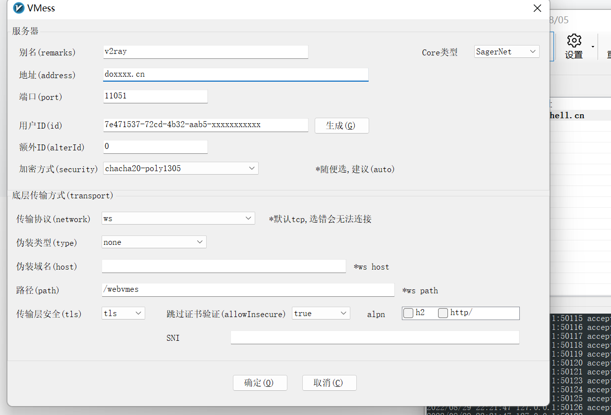

V2Rray 官网：[https://www.v2ray.com/](https://www.v2ray.com/)  
V2Rray 下载地址：[https://github.com/v2fly/v2ray-core/releases](https://github.com/v2fly/v2ray-core/releases)  
参考：[https://www.v2ray.com/awesome/tools.html](https://www.v2ray.com/awesome/tools.html)

v2ray(Project V) 相对于 Shadowsocks，v2ray 更像全能选手，拥有更多可选择的协议 / 传输载体 (Socks、HTTP、TLS、TCP、mKCP、WebSocket )，还有强大的路由功能，不仅仅于此，它亦包含 Shadowsocks 组件，你只需要安装 v2ray，你就可以使用所有的 v2ray 相关的特性包括使用 Shadowsocks，由于 v2ray 是使用 GO 语言所撰写的，天生的平台部署优势，下载即可使用，

# v2ray服务端部署

```bash
# 手动安装
# 下载V2Ray的发行版程序
wget https://github.com/v2fly/v2ray-core/releases/download/v4.45.2/v2ray-linux-64.zip

# 解压到/data
mkdir -p /data/v2ray
unzip -qd /data/v2ray/ 2ray-linux-64.zip

# 详细说明：V2Ray的程序目录文件详情情况：
/data/v2ray/
|-- config.json                #配置文件
|-- geoip.dat                  #数据文件
|-- geoip-only-cn-private.dat
|-- geosite.dat
|-- systemd
|   `-- system
|       |-- v2ray.service
|       `-- v2ray@.service
|-- v2ctl
|-- v2ray
|-- vpoint_socks_vmess.json
`-- vpoint_vmess_freedom.json

# 启动服务
/data/v2ray/v2ray -config /data/conf/config.json  &

# 生成uuid
cat /proc/sys/kernel/random/uuid
```

## 配置 vmess 协议

```json
{
  "log": {
        "access": "access.log",
        "error": "error.log",
        "loglevel": "warning"
    },
  "inbounds": [
    {
      "port": 8899,
      "protocol": "vmess",
      "settings": {
        "clients": [
          {
            "id": "7e4------------------xxxxxxxxxxx",
            "alterId": 0
          }
        ]
      }
    }
  ],
  "outbounds": [
    {
      "tag": "direct",
      "protocol": "freedom",
      "settings": {}
    }
  ]
}

```

‍

## 配置VLESS协议

```json
{
  "log": {
        "access": "access.log",
        "error": "error.log",
        "loglevel": "warning"
    },
  "inbounds": [
    {
      "tag": "VLESS-in",
      "port": 8901,
      "protocol": "VLESS",
      "settings": {
        "clients": [
          {
            "id": "67-----------------------------2a689",
            "alterId": 0
          }
        ],
        "decryption": "none"
      },
      "streamSettings": {
        "network": "ws",
        "wsSettings": {"path": "/xxxxxxxx"}
      }
    }
  ],
  "outbounds": [
    {
      "tag": "direct",
      "protocol": "freedom",
      "settings": {}
    }
  ]
}

```

‍

## 配置 WebSocket + TLS + Web

```json
{
  "log": {
        "access": "access.log",
        "error": "error.log",
        "loglevel": "warning"
    },
  "inbounds": [
    {
      "tag": "VMESS-in",
      "port": 8901,
      "protocol": "VMESS",
      "settings": {
        "clients": [
          {
            "id": "6730-4e9b-4f6e-9ed5-900200",
            "alterId": 0
          }
        ],
        "decryption": "none"
      },
      "streamSettings": {
        "network": "ws",
        "wsSettings": {"path": "/vvmess"}
      }
    }
  ],
  "outbounds": [
    {
      "protocol": "freedom",
      "settings": {},
      "tag": "direct"
    }
  ]
}
```

修改nginx配置

```nginx
    server {
        listen       11051 ssl;
        server_name  doshell.cn;
        #证书文件名称
        ssl_certificate /data/nginx/ssl/doshell.crt;
        #私钥文件名称
        ssl_certificate_key /data/nginx/ssl/doshell.key;
        ssl_session_timeout 5m;
        ssl_protocols TLSv1.2 TLSv1.3;
        ssl_ciphers ECDHE-RSA-AES128-GCM-SHA256:ECDHE-ECDSA-AES128-GCM-SHA256:ECDHE-RSA-AES256-GCM-SHA384:ECDHE-ECDSA-AES256-GCM-SHA384:DHE-RSA-AES128-GCM-SHA256:DHE-DSS-AES128-GCM-SHA256:kEDH+AESGCM:ECDHE-RSA-AES128-SHA256:ECDHE-ECDSA-AES128-SHA256:ECDHE-RSA-AES128-SHA:ECDHE-ECDSA-AES128-SHA:ECDHE-RSA-AES256-SHA384:ECDHE-ECDSA-AES256-SHA384:ECDHE-RSA-AES256-SHA:ECDHE-ECDSA-AES256-SHA:DHE-RSA-AES128-SHA256:DHE-RSA-AES128-SHA:DHE-DSS-AES128-SHA256:DHE-RSA-AES256-SHA256:DHE-DSS-AES256-SHA:DHE-RSA-AES256-SHA:!aNULL:!eNULL:!EXPORT:!DES:!RC4:!3DES:!MD5:!PSK;
        ssl_prefer_server_ciphers on;
        ssl_session_tickets off;
        ssl_stapling on;
        ssl_stapling_verify on;
        #access_log  logs/host.access.log  main;
# v2ray
        location /webvmes {
            proxy_redirect off;
            proxy_pass http://127.0.0.1:8899;
            proxy_http_version 1.1;
            proxy_set_header Upgrade $http_upgrade;
            proxy_set_header Connection "upgrade";
            proxy_set_header Host $http_host;
        }
```

# v2ray客户端部署

## windows

如果服务端的配置为 [vmess 协议](#vmess%20协议)


如果服务端的配置为 [WebSocket + TLS + Web](#WebSocket%20+%20TLS%20+%20Web)



## linux

linux环境下v2ray程序不区分客户端和服务端，客户端同样适用服务端的程序

```bash
# 手动安装
# 下载V2Ray的发行版程序
wget https://github.com/v2fly/v2ray-core/releases/download/v4.45.2/v2ray-linux-64.zip

# 解压到/data
mkdir -p /data/v2ray
unzip -qd /data/v2ray/ 2ray-linux-64.zip

# 启动服务
nohup ./v2ray -config ./config.json >> ./v2ray.log 2>&1 &

# 手动系统全局配置代理
# 配置`.bashrc`文件
----------------------------------
start_v2ray(){
# ### 配置curl、wget等命令使用代理
  export http_proxy='http://127.0.0.1:10808'
  export https_proxy='http://127.0.0.1:10808'
  echo "设置代理"
}
stop_v2ray_(){
 unset http_proxy
 unset https_proxy
 echo "取消代理"
}
-----------------------------------
source .bashrc

start_v2ray
```

配置文件参考

```json
{
  "log": {
    "access": "access.log",
    "error": "error.log",
    "loglevel": "warning"
  },
  "inbounds": [
    {
      "tag": "socks",
      "port": 10808,
      "listen": "0.0.0.0",
      "protocol": "socks",
      "sniffing": {
        "enabled": true,
        "destOverride": ["http","tls"],
        "routeOnly": false
      },
      "settings": {
        "auth": "noauth",
        "udp": true,
        "allowTransparent": false
      }
    },
    {
      "tag": "http",
      "port": 10809,
      "listen": "0.0.0.0",
      "protocol": "http",
      "sniffing": {
        "enabled": true,
        "destOverride": ["http","tls"],
        "routeOnly": false
      },
      "settings": {
        "auth": "noauth",
        "udp": true,
        "allowTransparent": false
      }
    }
  ],
  "outbounds": [
    {
      "tag": "proxy",
      "protocol": "VMESS",
      "settings": {
        "vnext": [
          {
            "address": "xxxx123456789.xyz",
            "port": 25510,
            "users": [
              {
                "id": "xxa5290-xe9b-xf6e-xed5-9xbe15xxxx89",
                "alterId": 0,
"encryption": "none"
              }
            ]
          }
        ]
      },
      "streamSettings": {
        "network": "ws",
        "security": "tls",
        "tlsSettings": {
          "allowInsecure": false,
          "show": false
        },
        "wsSettings": {
          "path": "/vvmess",
          "headers": {}
        }
      },
      "mux": {
        "enabled": false,
        "concurrency": -1
      }
    },
    {
      "tag": "direct",
      "protocol": "freedom",
      "settings": {}
    },
    {
      "tag": "block",
      "protocol": "blackhole",
      "settings": {
        "response": {
          "type": "http"
        }
      }
    }
  ],
"routing": {
  "domainStrategy": "IPIfNonMatch",
  "rules": [
    {
      "type": "field",
      "outboundTag": "direct",
      "domain": ["geosite:cn"]
    },
    {
      "type": "field",
      "outboundTag": "direct",
      "ip": ["geoip:cn", "geoip:private"]
    },
    {
      "type": "field",
      "outboundTag": "proxy",
      "network": "udp,tcp"
    }
  ]
}
}
```

‍

使用守护进程管理

```bash
useradd -M -s /sbin/nologin v2ray
chown -R v2ray:v2ray /data/application/v2ray/

echo '
[Unit]
Description=V2Ray Service
Documentation=https://www.v2fly.org/
After=network.target nss-lookup.target

[Service]
User=v2ray
CapabilityBoundingSet=CAP_NET_ADMIN CAP_NET_BIND_SERVICE
AmbientCapabilities=CAP_NET_ADMIN CAP_NET_BIND_SERVICE
NoNewPrivileges=true
WorkingDirectory=/data/application/v2ray
ExecStart=/data/application/v2ray/v2ray -config /data/application/v2ray/config.json
Restart=on-failure
RestartPreventExitStatus=23

[Install]
WantedBy=multi-user.target
' >> /etc/systemd/system/v2ray.service 

systemctl daemon-reload
systemctl enable v2ray
systemctl start v2ray

```

‍

### 配置文件详解

```json
{
  // ============================================
  // 日志配置
  // ============================================
  "log": {
    "access": "access.log",      // 访问日志文件
    "error": "error.log",        // 错误日志文件
    "loglevel": "warning"        // 日志级别：warning（只记录警告和错误）
  },
  
  // ============================================
  // 入站配置 - 本地代理服务入口
  // ============================================
  "inbounds": [
    {
      "tag": "socks",            // 入站标签，用于内部识别
      "port": 10808,             // 监听端口：SOCKS5代理端口
      "listen": "0.0.0.0",       // 监听地址：所有网络接口
      "protocol": "socks",       // 协议类型：SOCKS5
      "sniffing": {              // 流量嗅探配置
        "enabled": true,         // 启用嗅探
        "destOverride": [
          "http",                // 识别HTTP流量
          "tls"                  // 识别TLS/HTTPS流量
        ],
        "routeOnly": false       // 嗅探结果仅用于路由决策
      },
      "settings": {              // SOCKS5协议设置
        "auth": "noauth",        // 无需认证
        "udp": true,             // 支持UDP转发
        "allowTransparent": false // 不支持透明代理
      }
    },
    {
      "tag": "http",             // 第二个入站标签
      "port": 10809,             // HTTP代理端口
      "listen": "0.0.0.0",       // 监听所有网络接口
      "protocol": "http",        // 协议类型：HTTP代理
      "sniffing": {              // 嗅探配置（同上）
        "enabled": true,
        "destOverride": ["http", "tls"],
        "routeOnly": false
      },
      "settings": {              // HTTP协议设置
        "auth": "noauth",        // 无需认证
        "udp": true,             // 支持UDP
        "allowTransparent": false
      }
    }
  ],
  
  // ============================================
  // 出站配置 - 流量出口处理方式
  // ============================================
  "outbounds": [
    {
      "tag": "proxy",            // 出站标签：代理出口
      "protocol": "VMESS",       // 协议：VMess
      "settings": {              // VMess协议设置
        "vnext": [               // 服务器配置数组
          {
            "address": "doshell.xyz",  // 服务器地址
            "port": 25515,             // 服务器端口
            "users": [            // 用户认证信息
              {
                "id": "673a5290-4e9b-4f6e-9ed5-91be45d2a689", // UUID
                "alterId": 0,     // 额外ID（V2Ray旧版特性，通常为0）
                "encryption": "none" // 加密方式：无
              }
            ]
          }
        ]
      },
      "streamSettings": {        // 传输流设置
        "network": "ws",         // 传输协议：WebSocket
        "security": "tls",       // 传输层安全：TLS加密
        "tlsSettings": {         // TLS设置
          "allowInsecure": false, // 不允许不安全的TLS证书
          "show": false          // 不显示TLS连接信息
        },
        "wsSettings": {          // WebSocket设置
          "path": "/vvmess",     // WebSocket路径
          "headers": {}          // 自定义头部（空）
        }
      },
      "mux": {                   // 多路复用配置
        "enabled": false,        // 禁用多路复用
        "concurrency": -1        // 并发连接数（-1表示默认）
      }
    },
    {
      "tag": "direct",           // 出站标签：直连出口
      "protocol": "freedom",     // 协议：freedom（直连）
      "settings": {}             // 无需额外设置
    },
    {
      "tag": "block",            // 出站标签：拦截出口
      "protocol": "blackhole",   // 协议：blackhole（黑洞，丢弃流量）
      "settings": {              // 黑洞设置
        "response": {            // 响应设置
          "type": "http"         // 返回HTTP响应（模拟HTTP错误）
        }
      }
    }
  ],
  
  // ============================================
  // 路由配置 - 流量分流规则
  // ============================================
  "routing": {
    "domainStrategy": "IPIfNonMatch", // 域名策略：优先匹配域名，未匹配则用IP匹配
    
    "rules": [                   // 路由规则数组（按顺序执行）
      // 规则1：中国大陆域名直连
      {
        "type": "field",         // 规则类型：字段匹配
        "outboundTag": "direct", // 匹配时使用"direct"出站（直连）
        "domain": ["geosite:cn"] // 匹配条件：geosite数据库中所有中国域名
      },
      
      // 规则2：中国大陆IP和内网IP直连
      {
        "type": "field",
        "outboundTag": "direct",
        "ip": [
          "geoip:cn",           // 匹配条件：所有中国IP地址
          "geoip:private"       // 匹配条件：所有私有内网IP（10.x.x.x, 172.16-31.x.x, 192.168.x.x等）
        ]
      },
      
      // 规则3：其他所有流量走代理（兜底规则）
      {
        "type": "field",
        "outboundTag": "proxy",  // 匹配时使用"proxy"出站（代理）
        "network": "udp,tcp"     // 匹配所有TCP和UDP流量
      }
    ]
  }
}
```
