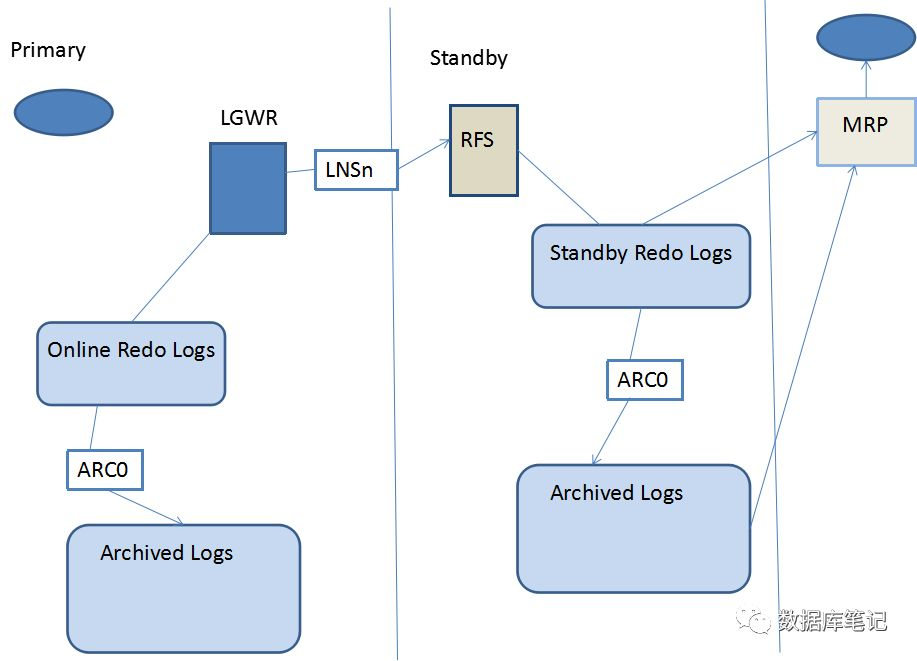

# Oracle DataGuard

# DataGuard 概述

Oracle DataGuard是Oracle自带的数据同步功能，基本原理是将日志文件从原数据库传输到目标数据库，然后在目标数据库上应用这些日志文件，从而使目标数据库与源数据库保持同步，是一种数据库级别的高可用性方案。可以提供Oracle数据库的冗灾、数据保护、故障恢复等，实现数据库快速切换与灾难性恢复。

Oracle DataGuard由一个primary数据库(生产数据库)及一个或多个standby数据库(最多9个)组成。组成Data Guard的数据库通过Oracle Net连接，并且有可以分布于不同地域。只要各库之间可以相互通信，它们的物理位置并没有什么限制，不受操作系统的限制。

- ==**1.Primary 数据库**==
  DataGuard包含一个primary数据库即被大部分应用访问的生产数据库，该库既可以是单实例数据库，也可以是RAC。
- ==**2.Standby 数据库**==
  Standby数据库是primary数据库的复制(事务上一致)。在同一个Data Guard中可以最多创建9个standby数据库。一旦创建完成，Data Guard通过应用primary数据库的redo自动维护每一个standby数据库。Standby数据库同样即可以是单实例数据库，也可以是RAC结构。

## 1. Standby数据库类型

Standby数据库通常分两类：**逻辑standby和物理standby**。

==**1.逻辑standby**==

同步模式：**将接收的REDO转换成SQL语句，然后在STANDBY上执行SQL语句。**
优点：可以以 read-write 模式打开， 可以在任何时候访问逻辑 standby 数据库。且此过程也保持与 Primary 同步。
缺点：一些数据类型不支持，DBA\_LOGSTDBY_UNSUPPORTED这个视图中便记录了物理standby不支持的数据类型。
注：进入11g后，由于物理 standby可以启动到read only模式。逻辑 standby模式的应用范围缩小了许多。

==**2.物理standby**==

同步模式： **通过直接应用Primary 数据库传送过来的REDO来保持与 Primary 数据库的一致，基于block-for-block的。**
优点：没有数据类型的限制，可以保证两个数据库完全一致。 效率高，因为是使用最底层的块级别上的复制。
缺点：在11g之前，Physical standby database只能启动到mount状态，这也意味着它不能够进行查询，无法完成读写分离。
但在oracle 11g中，**可以启动到 read only与READ WRITE模式下，但是有所限制**。
**read only**：可以对该Physical standby database进行查询， 但是只能对接收Primary 数据库传送过来的REDO，但是无法应用。如果需要的话，你可以在read only和mounted状态间转换，如先应用 REDO，然后将数据库置为 READ ONLY 状态，需要与 Primary 同步时再次执行 REDO 应用命令，
**READ WRITE**：不能接收日志并且，不能应用日志。意味着失去容灾的功能了。

## 2. 架构

### 使用ARCH进程


1、Primary Database不断的产生Redo Log，这些日志被LGWR进程写到联机日志
2、联机日志写满以后，发生日志切换，触发ARC0完成本地归档，归档位置采用LOG_ARCHIVE_DEST_1='LOCATION=/path'
3、完成本地归档以后，联机日志可以被覆盖重用
4、ARCH1进程通过Net把归档日志发送给Standby Database的RFS进程
5、Standby Database端的RFS进程把接收到的日志写入到归档日志
6、Standby Database端的MRP进程（Redo Apply）或者LSP进程（SQL Apply）在Standby Database上应用这些日志，进而同步数据

这种方式最大的问题是: `Primary Database`只有在发生归档时才会发送日志到`Standby Database`，如果`Primary Database`异常宕机，联机日志中的`Redo`内容会丢失，因此这种方式没法避免数据丢失的问题。
要想避免数据丢失，就必须使用`LGWR`，而使用`LGWR`又有`SYNC`和`ASYNC`两种方式。 缺省`Primary Database`使用的就是`ARCH`进程，不需要特别的指定

### 使用LGWR进程SYNC方式



1、Primary Database产生的Redo日志要同时写到日志文件和网络。也就是说LGWR进程把日志写到本地日志文件的同时还要发给本地的LNSn进程（Network Server Process），再由LNSn进程把日志通过网络发送到远程目的地，每个远程目的地对应一个LNS进程，多个LNS进程能够并行工作。
2、LGWR必须等待写入本地日志文件的操作和通过LNSn进程的网络传送都成功，Primary Database上的事务才能够提交，这也是SYNC的含义所在。
3、Standby Database的RFS进程把接收到的日志写入到Standby Redo Log日志中
4、Primary Database的日志切换也会触发Standby Database上的日志切换，即Standby Database对Standby Redo Log的归档，然后触发Standby Database的MRP或者LSP进程恢复归档日志

因为`Primary Database`的`Redo`是实时传送的，于是`Standby Database`端可以使用两种恢复方式：
实时恢复：只要`RFS`把日志写入`Standby Redo Log`就会立即进行恢复；
归档时恢复：在完成对`Standby Redo Log`归档才触发恢复

### 使用LGWR进程ASYNC方式


1、Primary Database一端产生Redo日志后，LGWR把日志同时提交给日志文件和本地LNS进程，但是LGWR进程只需要成功写入日志文件即可，不必等待LNSn进程的网络传送成功。
2、LNSn进程异步地把日志内容发送到Standby Database，多个LNSn进程可以并发发送
3、Primary Database的Online Redo Log写满后发生Log Switch，触发归档操作，也触发Standby Database对Standby Redo Log的归档，然后触发MRP或LSP进程恢复归档日志

因为`LGWR`进程不会等待`LNSn`进程的响应结果，所以配置`LGWR ASYNC`方式时不需要`NET_TIMEOUT`参数

## 3. DG相关的后台进程

```bash
ARCH (archiver)                   # 心跳检测，探测对方
LNS (log-write network-server)    # log传送
RFS (remote file server)          # 远程接数据
FAL (Fetch Archive Log )          # 解决Redo的间隔Gap
MRP (Managed Recovery Process)    # 日志被应用，恢复的过程
LSP (Logical Standby Process)     # 逻辑数据库的后台进程，SQL转换
```

### 1.日志接收（Redo Receive）

`Standby Database`的`RFS`进程接收到日志后，就把日志写到`Standby Redo Log`或者`Archived Log`文件中，具体写入哪种文件，取决于`Primary`的日志传送方式和`Standby Database`的配置。
如果是写到`Standby Redo Log`文件中，则当`Primary Database`发生日志切换时，也会触发`Standby Database`上的`Standby Redo Log`的日志切换，并把这个`Standby Redo Log`归档。

### 2.日志应用（Redo Apply）

日志应用服务，就是在`Standby Database`上重演`Primary Database`的日志，从而实现两个数据库的数据同步。`Redo Apply`发生的时间分为两种：

- 实时应用:
  这种方式必须使用`Standby Redo Log`。每当日志被写入到`Standby Redo Log`时，就会触发恢复，使用这种方式的好处在于可以减少数据库切换的时间（`Switchover`或`Failover`），因为切换时间主要用在剩余日志内容的恢复上。
- 归档应用:
  这种方式是在`Primary Database`发生日志切换，触发了`Standby Database`的归档操作，归档完成后会触发恢复，这也是缺省的恢复方式。

```bash
# 如果是Physical Standby，可以使用下面的命令启用Real-Time
 alter database recover managed standby database using current logfile;

# 如果是Logical Standby，可以使用下面的命令启用Real-Time
alter database start logical standby apply immediate;
```

## 3. 保护模式

|模式|数据丢失风险|传输|是否没有来⾃备⽤数据库的确认|redo归档进程|网络传输模式|控制日志传输服务是异步还是同步|standby redo是 否必须||
| --------| ------------------------| ----| ------------------------------------------------------| ------------| ---------------------------------------| ------------------------------| ---------------------| -|
|最大保护|零数据丢失，双重失败保护|同步|延迟主库，直到确认收到副本|LGWR|SYNC|AFFIRM|是||
|最大可用|零数据丢失，单失败保护|同步|延迟主库，直到确认收到副本、或者发生超时，然后继续处理|LGWR|SYNC|AFFIRM|是||
|最⼤性能|有少量数据丢失的可能|异步|主库不会等待备库的确认|LGWR或者ARCH|LGWR进程⽤SYNC或者ASYNC；ARCH进程⽤SYNC|AFFIRM或者 NOAFFIRM|不是，但推荐有||

# Data Guard 部署

## 1. 环境准备

### 1.1 关闭防火墙和SELinux

```bash
systemctl stop firewalld;
systemctl disable firewalld
sed -i 's/SELINUX=enforcing/SELINUX=disabled/g' /etc/selinux/config
setenforce 0
```

### 1.2 修改hosts

`vim /etc/hosts`

```txt
10.0.0.23  primary
10.0.0.24  standby
```

### 1.3 安装Orcle19c

db1部署数据库软件和实例，db2只部署数据库软件。

|操作系统|主机名|IP地址|数据库版本|实例名|DB_NAME|DB_UNIQUE_NAME|
| ----------| -------| ---------| ----------| ------| -------| --------------|
|CentOS 7.9|primary|10.0.0.23|Oracle 19c|orcl|orcl|primary|
|CentOS 7.9|standby|10.0.0.24|Oracle 19c|orcl|orcl|standby|

## 2. primary主库配置

### 2.1 主库启动force logging和日志归档

```sql
sqlplus / as sysdba

-- 打开强制写入日志
alter database force logging;
select force_logging from v$database;

-- 设置归档
-- 查看数据库是否运行在归档模式
archive log list;
alter system set log_archive_config='DG_CONFIG=(orcl,orcldg)' scope=both sid='*';
alter system set log_archive_dest_1='LOCATION=/data/arch VALID_FOR=(ALL_LOGFILES,ALL_ROLES) DB_UNIQUE_NAME=orcl' scope=spfile;
-- SERVICE=orcldg tns中设置的网络名
alter system set log_archive_dest_2='SERVICE=orcldg LGWR SYNC AFFIRM VALID_FOR=(ONLINE_LOGFILES,PRIMARY_ROLE) DB_UNIQUE_NAME=orcldg' scope=both sid='*';
shutdown immediate;
startup mount;
alter database archivelog;
-- 开启数据库
alter database open;
```

**LOGGING：** 当创建一个数据库对象时将记录日志信息到联机重做日志文件。LOGGING实际上是对象的一个属性，用来表示在创建对象时是否记录REDO日志，包括在做DML时是否记录REDO日志。

**FORCE LOGGING：** 简言之，强制记录日志，即对数据库中的所有操作都产生日志信息，并将该信息写入到联机重做日志文件。

**NOLOGGING：** 正好与LOGGING、FORCE LOGGING 相反，尽可能的记录最少日志信息到联机日志文件。一般表上不建议使用NOLOGGING,在创建索引或做大量数据导入时，可以使用NOLOGGING

### 2.2 主库添加 STANDBY 日志文件

```sql
# 查看当前redo日志
select group#,type,member from v$logfile;
# 这里添加4组redo日志
alter database add standby logfile group 4 ('/data/oradata/ORCL/redo04.log') size 200M;
alter database add standby logfile group 5 ('/data/oradata/ORCL/redo05.log') size 200M;
alter database add standby logfile group 6 ('/data/oradata/ORCL/redo06.log') size 200M;
alter database add standby logfile group 7 ('/data/oradata/ORCL/redo07.log') size 200M;
```

### 2.3 分别在主备库配置监听文件并启动

```txt
SID_LIST_LISTENER =
  (SID_LIST =
    (SID_DESC =
      (GLOBAL_DBNAME = orcl)
      (ORACLE_HOME = /u01/app/oracle/product/11.9.0/db_1)
      (SID_NAME = orcl)
    )
  )
LISTENER =
  (DESCRIPTION_LIST =
    (DESCRIPTION =
      (ADDRESS = (PROTOCOL = IPC)(KEY = EXTPROC1521))
      (ADDRESS = (PROTOCOL = TCP)(HOST = 10.0.0.23)(PORT = 1521))
    )
  )
ADR_BASE_LISTENER = /u01/app/oracle
```

重启监听

```bash
[oracle@primary admin]$ lsnrctl reload
LSNRCTL for Linux: Version 11.2.0.4.0 - Production on 11-JAN-2019 23:53:24
Copyright (c) 1991, 2013, Oracle.  All rights reserved.
Connecting to (DESCRIPTION=(ADDRESS=(PROTOCOL=IPC)(KEY=EXTPROC1521)))
The command completed successfully
```

### 2.4分别在主备库上配置tnsname.ora

```txt
primary =
  (DESCRIPTION =
    (ADDRESS = (PROTOCOL = TCP)(HOST = 10.0.0.23)(PORT = 1521))
    (CONNECT_DATA =
      (SERVER = DEDICATED)
      (SERVICE_NAME = orcl)
    )
 )
standby =
  (DESCRIPTION =
    (ADDRESS = (PROTOCOL = TCP)(HOST = 10.0.0.24)(PORT = 1521))
    (CONNECT_DATA =
      (SERVER = DEDICATED)
      (SERVICE_NAME = orcl)
      (UR = A)
    )
  )
```

### 2.5 验证监听和TNS配置

在主库上验证：

```bash
tnsping orcl
tnsping orcldg
sqlplus sys/Ninestar2022@orcl as sysdba
sqlplus sys/Ninestar2022@orcldg as sysdba

```

在备库上验证：

```bash
tnsping orcl
tnsping orcldg
sqlplus sys/Ninestar2022@orcl as sysdba
sqlplus sys/Ninestar2022@orcldg as sysdba
```

### 2.6 在主库上创建pfile文件并修改pfile内容

```bash
SQL> create pfile from spfile;
# pfile文件添加内容
vim initorcl.ora 
--------------------------------------------------------------
*.db_unique_name='primary'
*.log_archive_config='dg_config=(primary,standby)'
*.log_archive_dest_1='location=/data/arch valid_for=(all_logfiles,all_roles) db_unique_name=primary'
*.log_archive_dest_2='service=standby lgwr affirm sync valid_for=(online_logfiles,primary_role) db_unique_name=standby'
*.log_archive_dest_state_1=enabl
*.log_archive_dest_state_2=enable
*.standby_file_management='auto'
*.fal_server='standby'
*.log_file_name_convert='data/oradata/ORCL/','/data/oradata/ORCL/'
*.db_file_name_convert='data/oradata/ORCL/','/data/oradata/ORCL/'
--------------------------------------------------------------
# 使用新的参数重启数据库
SQL> create spfile from pfile;
File created.
SQL> startup
ORACLE instance started.
Total System Global Area  972898304 bytes
Fixed Size                  2259160 bytes
Variable Size             616564520 bytes
Database Buffers          348127232 bytes
Redo Buffers                5947392 bytes
Database mounted.
Database opened.
```

==**参数解析**==

```txt
log_archive_config：
	用于控制发送归档日志到远程位置、接收远程归档日志， 并指定Data Guard配置的惟一数据库名
	当主库与备库的db_unique_name相同时,log_archive_config就不需要配置了，直接将其置空。
	
LOG_ARCHIVE_DEST_1：
	设置一个从归档路径。所有的路径必须是本地的。VALID_FOR属性用来控制日志传输
	-  online_logfile: 表示归档联机重做日志
    -  standby_logfile:表示归档备用数据库的重做日志/接受来自主库的重做日志
    -  all_logfiles: online_logfile && standby_logfile
    -  primary_role: 仅当数据库角色为主库时候生效
    -  standby_role: 仅当数据库角色为备库时候生效
    -  all_role: 任意角色均生效

LOG_ARCHIVE_DEST_2：
	设置远程归档到standby端，同时设置Rode归档进程LGWR、网络传输模式SYNC、控制日志传输服务是异步还是同步AFFIRM

FAL_CLIENT & FAL_SERVER：
	解决归档间隙（GAP），当备库不能接受到一个或多个主库的归档日志文件时候，就发生了GAP
	fal_client会自动向fal_server传输间隙的存档日志，自动解决归档GAP


STANDBY_FILE_MANAGEMENT：
	-  AUTO：在主数据库上创建的任何新数据文件都会自动在物理备用数据库上创建。
	-  MANUAL：在将新数据文件添加到主数据库后，必须手动将其从主数据库复制到物理备用数据库。
	
db_file_name_convert & log_file_name_convert：
	当用主库的备份来恢复从库时，来完成转换dataguard的主库和从库数据文件和联机日志保存路径不同的问题

```

### 2.7 将主库的口令文件和参数文件复制到备库中

```bash
scp orapworcl oracle@standby:$ORACLE_HOME/dbs
scp initorcl.ora oracle@standby:$ORACLE_HOME/dbs
```

## 3. standby从库配置

### 3.1 修改备库参数文件

```sql
*.db_unique_name='standby'
*.log_archive_config='dg_config=(primary,standby)'
*.log_archive_dest_1='location=/data/archive/ valid_for=(all_logfiles,all_roles) db_unique_name=standby'
*.log_archive_dest_2='service=standby lgwr affirm sync valid_for=(online_logfiles,primary_role)
db_unique_name=primary'
*.log_archive_dest_state_1=enable
*.log_archive_dest_state_2=enable
*.standby_file_management='auto'
*.fal_server='primary'
*.log_file_name_convert='/data/oradata/ORCL/','/data/oradata/ORCL/'
*.db_file_name_convert='/data/oradata/ORCL/','/data/oradata/ORCL/'
```

创建所需目录
`mkdir -p /data/u01/app/oracle/admin/orcl/adump /data/arch /data/oradata/ORCL`
`chown -R oracle:oinstall /data/u01/app/oracle/admin/orcl/adump /data/arch/ /data/oradata/ORCL`

### 3.2 通过pfile文件生成spfile并将standby库启动到nomount状态

```bash
SQL> create spfile from pfile;
File created.
SQL> startup nomount;
ORACLE instance started.
Total System Global Area  972898304 bytes
Fixed Size                  2259160 bytes
Variable Size             616564520 bytes
Database Buffers          348127232 bytes
Redo Buffers                5947392 bytes
```

重启监听
`lsnrctl restart`

连接standby常见错误：

```
ERROR:
ORA-12528: TNS:listener: all appropriate instances are blocking new connections
```

举个粟子，使用duplicate 复制数据库时，目标实例只启动到nomount状态。此时，监听 中对应实例的状态就是“BLOCKED”. 解决方法是在TSN配置添加特殊标记(UR = A),示例 如下：

```bash
primary =
  (DESCRIPTION =
    (ADDRESS = (PROTOCOL = TCP)(HOST = 10.0.0.23)(PORT = 1521))
    (CONNECT_DATA =
      (SERVER = DEDICATED)
      (SERVICE_NAME = orcl)
    )
 )
standby =
  (DESCRIPTION =
    (ADDRESS = (PROTOCOL = TCP)(HOST = 10.0.0.24)(PORT = 1521))
    (CONNECT_DATA =
      (SERVER = DEDICATED)
      (SERVICE_NAME = orcl)
      (UR = A)
    )
  )

```

### 3.3 在主库上开始进行duplicate achive

```bash
[oracle@primary ~]$ rman target / auxiliary sys/oracle@standby
Recovery Manager: Release 11.2.0.4.0 - Production on Sun Jan 13 00:01:44 2019
Copyright (c) 1982, 2011, Oracle and/or its affiliates.  All rights reserved.
connected to target database: ORCL (DBID=1524649093)
connected to auxiliary database: ORCL (not mounted)

RMAN> duplicate target database for standby from active database nofilenamecheck dorecover;

# 如果⽬录结构⼀致需要nofilenamecheck参数 
```

### 3.4 打开备库并启动apply

```sql
-- 打开备库
sqlplus / as sysdba
select open_mode from v$database;
alter database open; 
--方式一：开启实时同步 
alter database recover managed standby database using current logfile disconnect from session; 
--方式二：开启同步（日志切换时才同步） 
alter database recover managed standby database disconnect from session;
-- 取消同步
alter database recover managed standby database cancel;
```

## 4. DataGuard 验证

```sql
-- 状态查看（主备都可查看）
select open_mode,      --数据库打开模式，如果实时同步，则为：read only with apply，异步同步则为：read only
       database_role,       --数据库角色，是主库还是备库
       protection_mode,     --保护模式
       protection_level     --保护级别
from   v$database;
--------------------------------------------------------------------------
OPEN_MODE            DATABASE_ROLE    PROTECTION_MODE      PROTECTION_LEVEL
-------------------- ---------------- -------------------- --------------------
-- 主库：READ WRITE           PRIMARY          MAXIMUM PERFORMANCE  MAXIMUM PERFORMANCE
-- 备库：READ ONLY WITH APPLY PHYSICAL STANDBY MAXIMUM PERFORMANCE  MAXIMUM PERFORMANCE
```

# 其他配置

## 1. 保护模式切换

```sql
-- 查询保护模式，默认最⼤性能模式（主库执行）
select protection_mode,protection_level from v$database;
-- 1.先切换最⼤可⽤模式（主库执行）
alter database set standby to maximize availability;
-- 若从最大性能模式直接切换到最大保护模式，需要先把备库重启到到mount，再把主库重启到到mount
shutdown immediate;
alter database mount;
-- 但是可⽤先切换到最⼤可⽤模式，再切换 到最⼤保护模式。
-- 如果直接从最⼤性能模式切换会报错。切换最⼤保护模式需要LGWR，SYNC⽀持。
-- 如果已配置lgwr sync就不需要执⾏这个命令
-- alter system set log_archive_dest_2='service=orcldg LGWR SYNC AFFIRM valid_for= (all_logfiles,primary_role) db_unique_name=orcldg;
-- 2.在切换⾄最⼤保护模式（主库执行）
alter database set standby database to maximize protection;
alter database open;
-- 注意：切换最⼤保护模式后，备库不让关闭的。如果你shutdown abort 强制关闭，则主库⽆法做操作 （DML,DDL）
```

## 2. 主备切换

DG的主备角色转换分为：Switchover和Failover。Switchover适用于某些场合，需要将备库转为主库，Failover则是在主库故障无法使用情况下，将备库提升为主库。

- switchover是有计划的，正常的切换，不会破坏数据库DG关系
- failover是非计划的，破坏性的切换，切换之后要重建DG

### 2.1 *修改server_name（sid不一样）

当切换至备库是使连接信息与主库⼀致，在备库进行如下操作

```sql
alter system set service_names='orcl';
```

`cd $ORACLE_HOME/network/admin/ ; vim listener.ora`

```txt
# listener.ora Network Configuration File: /data/u01/app/oracle/product/19.3.0/db_1network/admin/listener.ora
# Generated by Oracle configuration tools.

SID_LIST_LISTENER=
  (SID_LIST=
    (SID_DESC=
      (GLOBAL_DBNAME = orcl)   # 只修改GLOBAL_DBNAME
      (SID_NAME = orcldg)
      (ORACLE_HOME = /data/u01/app/oracle/product/19.3.0/db_1)
    )
  )

LISTENER=
  (DESCRIPTION=
    (ADDRESS_LIST=
      (ADDRESS=(PROTOCOL = tcp)(HOST = 10.0.0.24)(PORT = 1521))
    )
  )

ADR_BASE_LISTENER = /data/u01/app/oracle
```

`cd $ORACLE_HOME/network/admin/ ; vim tnsnames.ora`

```txt
orcl =
  (DESCRIPTION =
    (ADDRESS_LIST =
      (ADDRESS = (PROTOCOL = TCP)(HOST = 10.0.0.23)(PORT = 1521))
    )
    (CONNECT_DATA =
      (SERVICE_NAME = orcl)
      (SERVER = DEDICATED)
    )
  )


orcldg =
  (DESCRIPTION =
    (ADDRESS_LIST =
      (ADDRESS = (PROTOCOL = TCP)(HOST = 10.0.0.24)(PORT = 1521))
    )
    (CONNECT_DATA =
      (SERVICE_NAME = orcl)   # 只修改SERVICE_NAME
      (SERVER = DEDICATED)
    )
  )
```

### 2.2 Switchover

大致步骤为主库先转换为备库，在此阶段可能看到原先的主备皆为备库状态，然后再将原备库设置为主库。
==**主库操作**==

```sql
-- 1. 检查是否已经添加standby redo log；standby redo log数量应等于redo数量 +1 
select * from v$standby_log

-- 2. 检查主库状态
-- SWITCHOVER_STATUS转换状态：to standby和session active（有会话连接），这两种状态可以转换
select NAME,DATABASE_ROLE,SWITCHOVER_STATUS from v$database;

-- 3. 检查主备之间是否有GAP -- dest_id:1主库 2备库
select STATUS, GAP_STATUS from v$archive_dest_status t where DEST_ID = 2;

-- 4. swithover切换（主库执行完毕实例会自动关闭）
alter database commit to switchover to physical standby;
-- 当有会话连接的情况下，执行上面命令会失败，需要用这一条
-- alter database commit to switchover to physical standby with session shutdown;

-- 5. 启动数据库
startup;
-- 检查当前数据库状态，此时应看到已经是read only，且是PHYSICAL STANDBY状态
select NAME,DATABASE_ROLE,SWITCHOVER_STATUS from v$database;
-- 开启实时应用
alter database recover managed standby database using current logfile disconnect;
```

==**备库操作**==

```sql
-- 1. 检查状态，SWITCHOVER_STATUS是to primary或session active就可以切换
select NAME,DATABASE_ROLE,SWITCHOVER_STATUS from v$database;

-- 2. 执行切换（执行后为mounted状态）
alter database commit to switchover to primary with session shutdown;

-- 3. 启动
alter database open;
-- 再次查询 SWITCHOVER_STATUS是to standby
select NAME,DATABASE_ROLE,SWITCHOVER_STATUS from v$database;

```

==！注意事项==

- 生产环境切换时间会长，考虑执行alter system flush buffer_cache，将内存数据刷到磁盘
- 写检查点alter system checkpoint
- 考虑先关闭应用，无用户连接可以减少切换的时间

### 2.3 Failover

如果IDC机房⽹络出现问题、或者主机房服务器出现故障短时间内⽆法恢复，需要使⽤备库接管为 主库提供服务。备库如果接管为主库后，⽆法再回到备库（需要重新部署）。
*模拟先把主备数据库的Listener停⽌，或者停⽌备库接收⽇志。*

==**备库操作**==

```sql
-- 1. 查询是否有⽇志gap,若存在gap则执行2-6，若无gap则执行6
select thread#,low_sequence#,high_sequence# from v$archive_gap;

-- 2. 查询归档⽇志应⽤情况，根据归档号那些归档没有传输过来。
select sequence#,name,applied from v$archived_log order by sequence#;
-- 拷⻉redo ⽇志和归档⽇志到备库,如果有多个⽇志成员，每组拷⻉⼀个成员即可，
-- 归档⽇志可以进 ⾏归档号进⾏对⽐或者查询为应⽤的归档⽇志。

-- 3. 查询未应⽤的归档⽇志
select sequence#,name,applied from v$archived_log;

-- 4. 通过以下命令进⾏注册
alter database register physical logfile '/data/arch_orcldg/1_762_946467761.dbf';
alter database recover managed standby database disconnect from session;
...
...
...

-- 5. 再进⾏实例恢复，填⼊主库的redo⽇志
recover standby database;

-- 6. 切换为主库
select database_role from v$database;
alter database activate physical standby database;
alter database open;
```

以上步骤将备库切换为新主库，接下来恢复DataGuard高可用模式，搭建新备库。如果条件满⾜的情况 下建议使⽤duplicate⽅式恢复主备模式。或者使⽤RMAN备份集来进⾏恢复。
参考上面的步骤搭建新备库 [[#Data Guard 部署]]

### 2.4 使⽤快照技术激活备库

测试场景 备库需要作为测试环境使⽤时 DG是正常同步的情况下进⾏ 在切换成snapshot 测试场景，备库需要作为测试环境使⽤时。DG是正常同步的情况下进⾏。在切换成snapshot standby 时，主备数据库⽇志还是⾃动传输的，不会照成数据丢失。

==**备库操作**==

```sql
-- 1. 切换⾄snapshot standby database
startup mount;
alter database convert to snapshot standby;
-- ORA-38786: Recovery area is not enabled. #需要配置db_recover参数
-- 配置快速恢复⼤⼩和路径
-- alter system set db_recovery_file_dest_size=4G;
-- alter system set db_recovery_file_dest='/data/arch_orcldg';
-- alter database convert to snapshot standby;

-- 2. 查询数据库⻆⾊和打开模式
select database_role,open_mode from v$database;

-- 3. 启动
alter database open;
select database_role,open_mode from v$database;

-- 此时备库可以正常提交数据，同时主库也是可以正常读写
```

==**还原为physical standby（备库操作）**==

```sql
-- 1. 启动到mount阶段进⾏切换操作
shutdown immediate;
startup mount;
alter database convert to physical standby;
startup mount force;
select database_role,open_mode from v$database;
alter database open;
select database_role,open_mode from v$database;
alter database recover managed standby database using current logfile disconnect from session;
select database_role,open_mode from v$database;
```

### 2.5 DG Broker

DG Broker是一个分布式管理框架，可自动且集中创建、维护和监控 DG。

### 2.6 DG Broker

## 3.密码修改

在Oracle11g通过alter user sys identified by xxx 修改sys用户密码时，不会自动更新备库的密码文件。Oracle Dataguard环境的日志传输安全机制依靠Oracle生产库的密码文件，

```sql
-- 在主库执行
alter system archive log current ;

-- 关闭备库
shutdown immediate;

-- 在主库执行
alter user sys identified by newpasswd;

-- 将主库密码文件修改后复制到备库相应目录

-- 启动备库
startup mount
alter database open; 
alter database recover managed standby database using current logfile disconnect from session;

```

## 4.主备日志清理

==主库==

```bash
# 主库RMAN 配置

CONFIGURE RETENTION POLICY TO RECOVERY WINDOW OF 7 DAYS;
# 归档日志只有在备库应用后才可以删除！
CONFIGURE ARCHIVELOG DELETION POLICY TO APPLIED ON STANDBY;
```

==备库==

```bash
#!/bin/bash
source /home/oracle/.bash_profile
rman target / <<ORMF
run {
crosscheck archivelog all;
delete noprompt archivelog until time 'sysdate-7';
}
ORMF
```
