iDRAC又称为Integrated Dell Remote Access Controller，也就是集成戴尔远程控制卡，这是戴尔服务器的独有功能，iDRAC卡相当于是附加在服务器上的一计算机，可以实现一对一的服务器远程管理与监控，通过与服务器主板上的管理芯片BMC进行通信，监控与管理服务器的硬件状态信息。它拥有自己的系统和IP地址，与服务器上的OS无关。是管理员进行远程访问和管理的利器，戴尔服务器集成了iDRAC控制卡，我们就可以扔掉价格昂贵的KVM设备了。  

iDRAC分为 **Express和Enterprise** 两种版本.
iDRAC Express 默认是用服务器1号网口来连接，
iDRAC Enterprise默认使用专用网口连接。专用网口的位置可参考下图所示（不同机型存在差异）。
iDRAC的网口在服务器的背面，一般都标注iDRAC的字样(下面以DELL R730为例)  
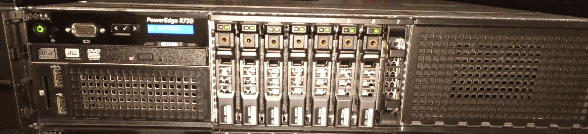
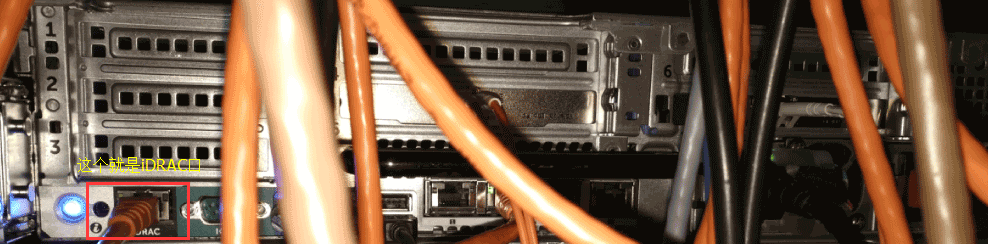

一般情况下，iDRAC功能默认都是关闭，需要在BIOS里面启用，首先我们先重启计算机，按F2然后进入BIOS。  
[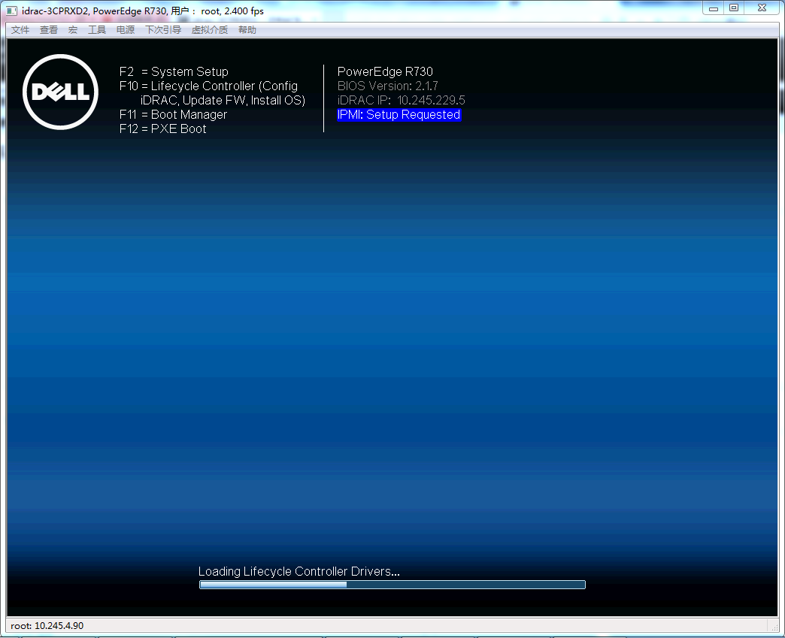](http://dbase.cc/img/2017/0523_dell_idrac_02.png)  
选择iDRAC Setting  
[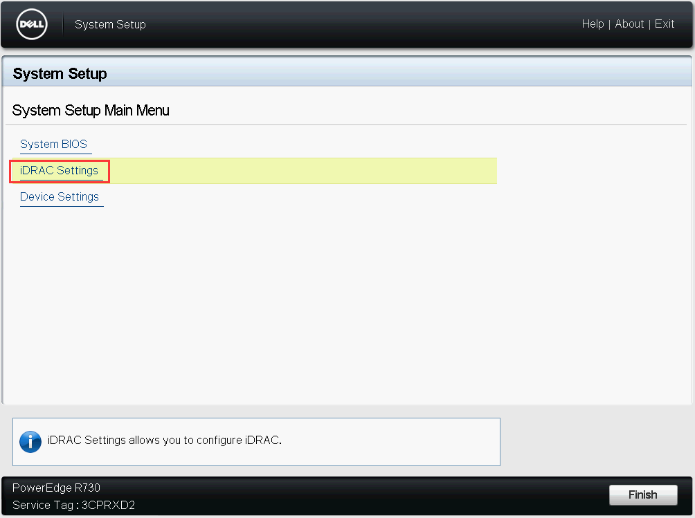](http://dbase.cc/img/2017/0523_dell_idrac_03.png)  
进入iDRAC Setting之后，可以看到很多详细的设置，一般情况下只要设置网络Network就可以了  
[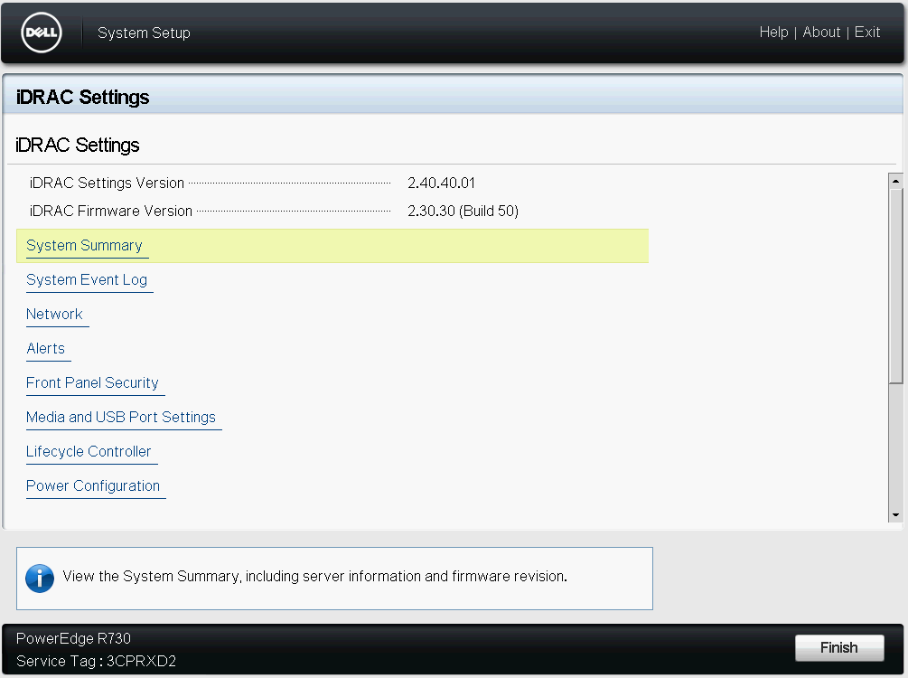](http://dbase.cc/img/2017/0523_dell_idrac_04.png)  
首先需要先启用iDRAC功能，在Enable NC选项中选择Enable，NC Selection选项中选择Dedicated，而Auto Negotiation中选择iDRAC网络接口的速率和全双工和半双工模式，一般情况下选择on，也就是自动设置  
[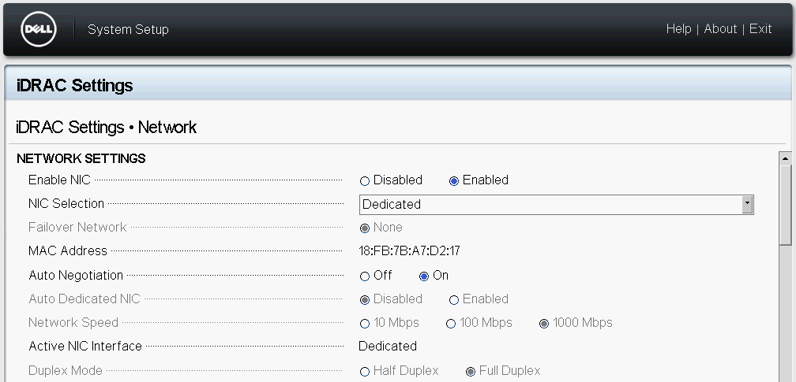](http://dbase.cc/img/2017/0523_dell_idrac_05.png)  
[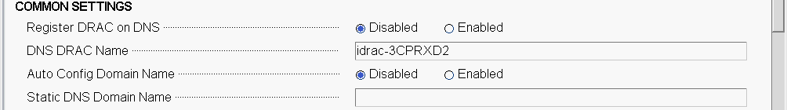](http://dbase.cc/img/2017/0523_dell_idrac_06.png)  
然后就该是iDRAC的网络参数设置了，选择IPV4 SETTINGS(当IPV6普及的时候我们就可以使用IPV6的地址了)。IP地址设置方式有DHCP和静态地址两种，为了方便维护和管理，建议选择静态固定IP的方式。把Enable DHCP给Disable掉，就可以设置IP地址了。如果是局域网控制的话就填写局域网的IP地址，如果是远程控制的话则需要输入已有的IP地址，并且还要设置默认网关和DNS地址，这样不仅可以实现远程控制，并且一旦出现问题(例如冗余电源罢工或者服务器被入侵)，iDRAC就会发送消息到预先设定的电子邮箱里面。  
[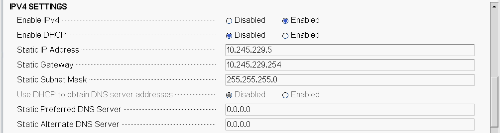](http://dbase.cc/img/2017/0523_dell_idrac_07.png)  
[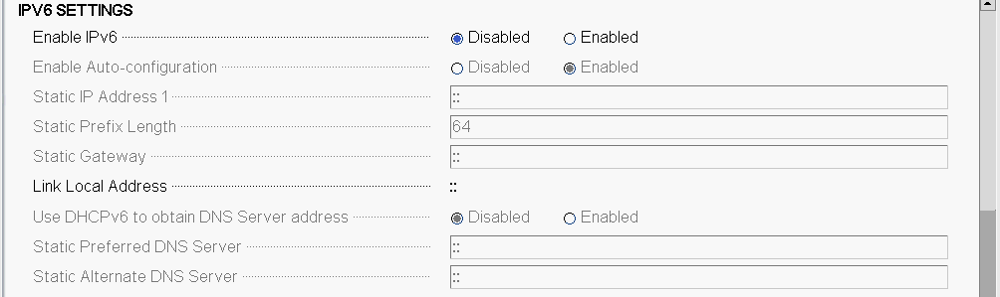](http://dbase.cc/img/2017/0523_dell_idrac_08.png)  
[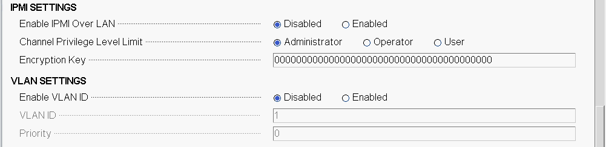](http://dbase.cc/img/2017/0523_dell_idrac_09.png)  
设置好iDRAC的网络参数后，我们就可以使用iDRAC来远程控制和维护远程的服务器了。在浏览器中输入上面设置好的IP地址，随后就出现了iDRAC的登录界面，默认的用户名是`root`和密码是`calvin`  
[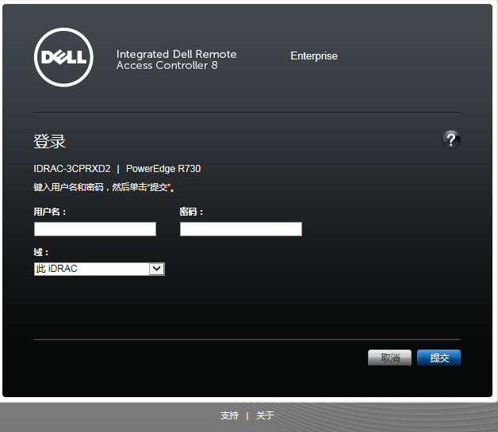](http://dbase.cc/img/2017/0523_dell_idrac_13.png)  
登陆后界面，在主界面上，我们就可以看到各个硬件组件的状态。在快速启动任务栏中，可以对系统电源进行操作，如开机、关机等。安装操作系统，在虚拟控制台预览处点击`>启动`  
[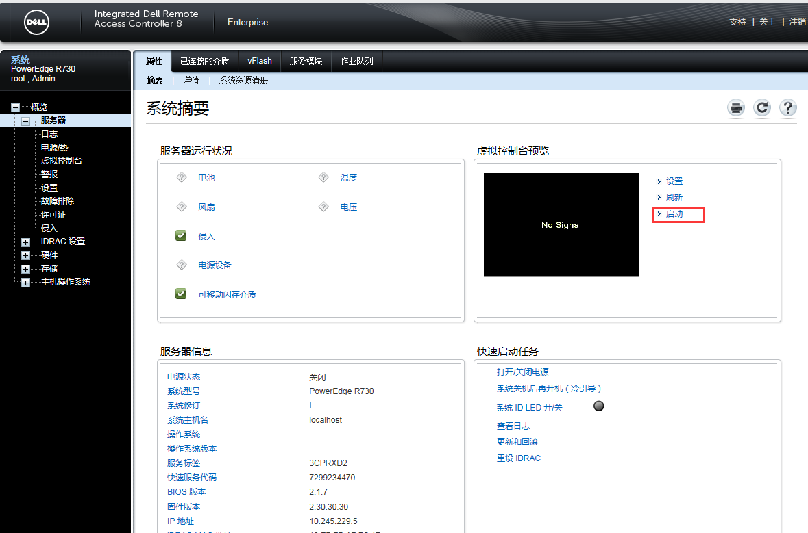](http://dbase.cc/img/2017/0523_dell_idrac_14.png)  
按照浏览器出现的提示确定安装控件等，最后点`运行`即可打开虚拟控制台  
[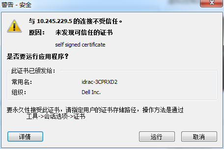](http://dbase.cc/img/2017/0523_dell_idrac_15.png)  
点虚拟介质->连接虚拟介质->映射CD/DVD  
[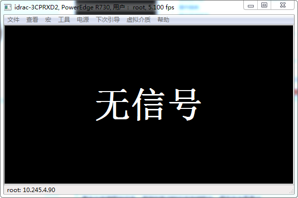](http://dbase.cc/img/2017/0523_dell_idrac_16.png)  
选择系统安装光盘映射设备  
[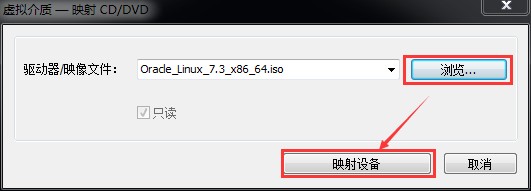](http://dbase.cc/img/2017/0523_dell_idrac_17.png)  
下次引导->虚拟CD/DVD/ISO，确定变更  
[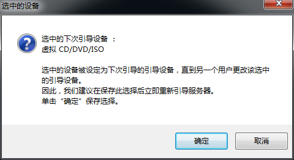](http://dbase.cc/img/2017/0523_dell_idrac_18.png)  
电源->打开系统电源->确定  
[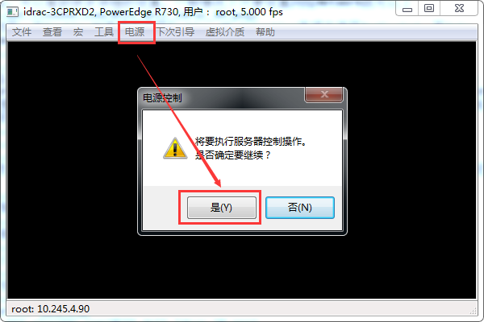](http://dbase.cc/img/2017/0523_dell_idrac_19.png)  
可以开始在虚拟控制台中安装OS了  
[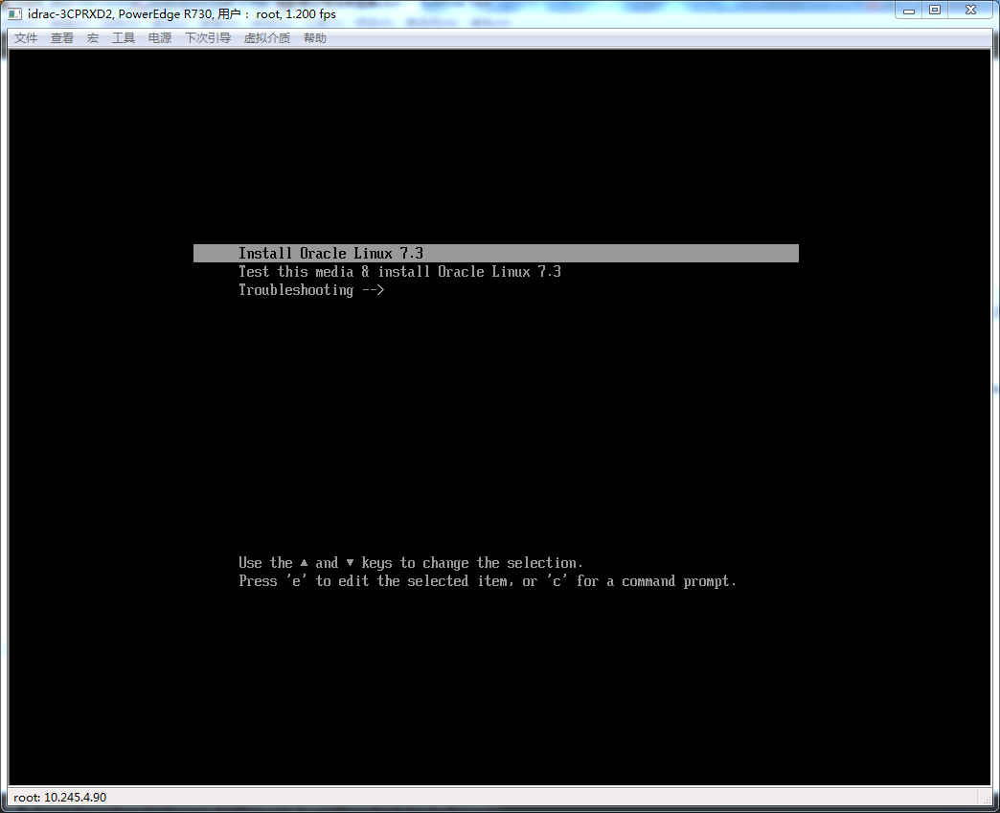](http://dbase.cc/img/2017/0523_dell_idrac_20.png)

好了，等待光盘加载完后就开始远程安装服务器操作系统吧 ^\_^