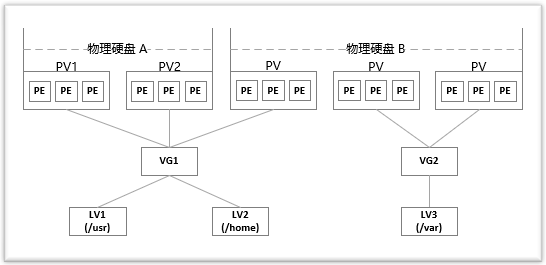

#server/storage

在对磁盘分区的大小进行规划时，往往不能确定这个分区要使用的空间的大小。而使用 fdisk、gdisk 等工具对磁盘分区后，每个分区的大小就固定了。如果分区设置的过大，就白白浪费了磁盘空间；如果分区设置的过小，就会导致空间不够用的情况出现。对于分区过小的问题，可以从新划分磁盘的分区，或者通过软连接的方式将此分区的目录链接到另外一个分区。这样虽然能够临时解决问题，但是给管理带来了麻烦。类似的问题可以通过 LVM 来解决。

LVM 是 Logical Volume Manager 的缩写，中文一般翻译为 "逻辑卷管理"，它是 Linux 下对磁盘分区进行管理的一种机制。LVM 是建立在磁盘分区和文件系统之间的一个逻辑层，系统管理员可以利用 LVM **在不重新对磁盘分区的情况下动态的调整分区的大小**。如果系统新增了一块硬盘，通过 LVM 就可以将新增的硬盘空间直接扩展到原来的磁盘分区上。

LVM 的优点如下：
-   文件系统可以跨多个磁盘，因此大小不再受物理磁盘的限制。
-   可以在系统运行状态下动态地扩展文件系统大小。
-   可以以镜像的方式冗余重要数据到多个物理磁盘上。
-   可以很方便地导出整个卷组，并导入到另外一台机器上。

LVM 也有一些缺点：
-   在从卷组中移除一个磁盘的时候必须使用 reducevg 命令(这个命令要求root权限，并且不允许在快照卷组中使用)。
-   当卷组中的一个磁盘损坏时，整个卷组都会受影响。
-   因为增加了一个逻辑层，存储的性能会受影响。

LVM 中的基本概念：
- 物理存储设备(Physical Media)：指系统的存储设备文件，比如 /dev/sda、/dev/sdb 等。  
- PV(物理卷 Physical Volume)：指硬盘分区或者从逻辑上看起来和硬盘分区类似的设备(比如 RAID 设备)。  
- VG(卷组 Volume Group)：类似于非 LVM 系统中的物理硬盘，一个 LVM 卷组由一个或者多个 PV(物理卷)组成。  
- LV(逻辑卷 Logical Volume)：类似于非 LVM 系统上的磁盘分区，LV 建立在 VG 上，可以在 LV 上建立文件系统。  
- PE(Physical Extent)：PV(物理卷)中可以分配的最小存储单元称为 PE，PE 的大小是可以指定的。  
- LE(Logical Extent)：LV(逻辑卷)中可以分配的最小存储单元称为 LE，在同一个卷组中，LE 的大小和 PE 的大小是一样的，并且一一对应。




## 一、创建lvm


```bash
# 查看磁盘信息
fdisk  -l

# 创建分区
fdisk /dev/sdc
欢迎使用 fdisk (util-linux 2.23.2)。

更改将停留在内存中，直到您决定将更改写入磁盘。
使用写入命令前请三思。


命令(输入 m 获取帮助)：n
Partition type:
   p   primary (0 primary, 0 extended, 4 free)
   e   extended
Select (default p): p
Using default response p
分区号 (1-4，默认 1)：
起始 扇区 (2048-10485759，默认为 2048)：
将使用默认值 2048
Last 扇区, +扇区 or +size{K,M,G} (2048-10485759，默认为 10485759)：
将使用默认值 10485759
分区 1 已设置为 Linux 类型，大小设为 5 GiB

命令(输入 m 获取帮助)：t
已选择分区 1
Hex 代码(输入 L 列出所有代码)：8e
已将分区“Linux”的类型更改为“Linux LVM”

命令(输入 m 获取帮助)：w
The partition table has been altered!

Calling ioctl() to re-read partition table.
正在同步磁盘。

# 2.创建pv
pvcreate /dev/sdc1

# 3.创建vg
vgcreate datavg /dev/sdc1

# 4.创建lv
# 方式1 -L 指定创建的LV 的大小
lvcreate -L 5G -n datalv  datavg  
# 方式2 -l 指定创建的LV 的PE 数量
lvcreate -l 100%free -n datalv  datavg  

# 5.格式化lv
mkfs.xfs /dev/datavg/datalv
# mkfs.ext4 /dev/datavg/datalv

# 6.挂载
mount /dev/datavg/datalv  /data

# 开机自动挂载
echo '/dev/datavg/datalv /data xfs defaults 0 0' >> /etc/fstab
mount -a
```


## 二、扩容lvm

```bash
fdisk /dev/sda       #进行分区
partprobe   #刷新分区
pvcreate /dev/sda3
vgdisplay
vgextend centos /dev/sda3
vgdisplay
pvscan
lvextend -l +100%FREE /dev/mapper/centos-root  

xfs_growfs /dev/mapper/centos-root     #xfs格式
resize2fs -f /dev/mapper/vfastvg-vfastlv      #ext4格式
```

## 三、缩小lv

```bash
umount /home  # 备份
# 删除/home所在的lv逻辑卷
lvremove /dev/mapper/cl-home
# 从新建立home逻辑卷
lvcreate -L 30G -n /dev/mapper/cl-home
# 建立文件系统
mkfs.xfs /dev/mapper/cl-home
# 挂载
mount /dev/mapper/cl-home  /home
# 查看vg剩余空间，扩容到其他lv
lvextend -L +10G /dev/mapper/cl-root
# 扩展/文件系统
xfs_growfs /dev/mapper/cl-root

```

## 四、lvm其他操作

```bash
# 查看pv信息
pvdisplay
# 查看vg信息
vgdisplay
# 查看lv信息
lvdisplay
# 删除lv 
lvremove /dev/datavg/datalv
# 删除vg
vgremove datavg
# 删除pv
pvremove /dev/sdc1
# lv扩容与收缩
lvextend -L +1G /dev/zq/mylv


```
