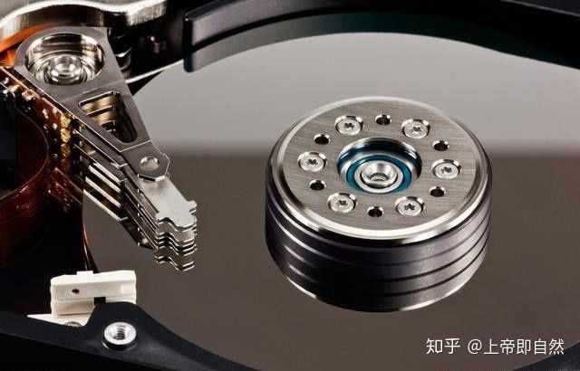
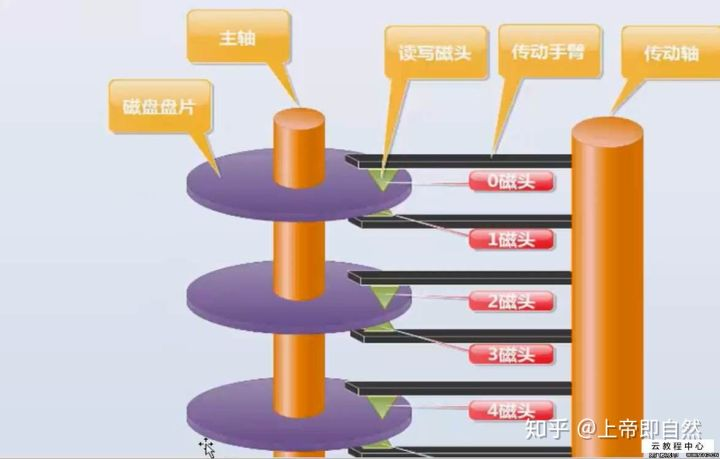
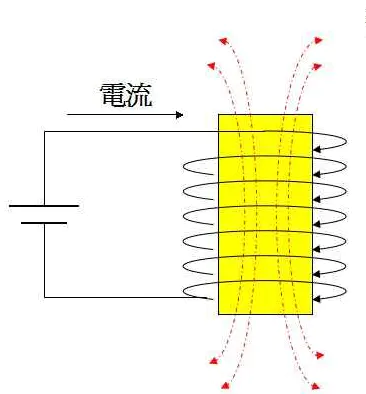
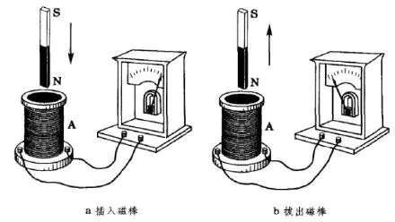
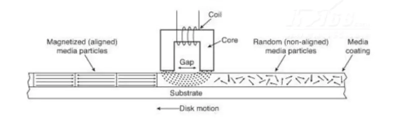
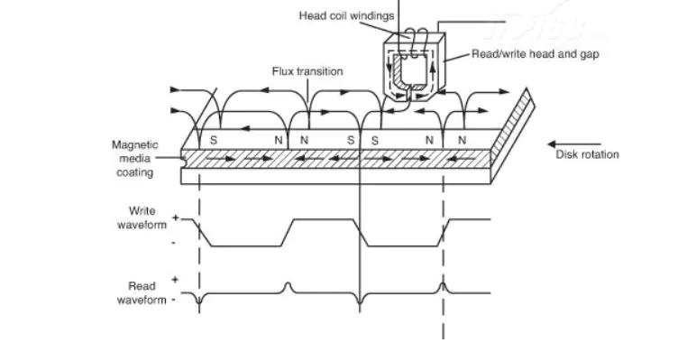
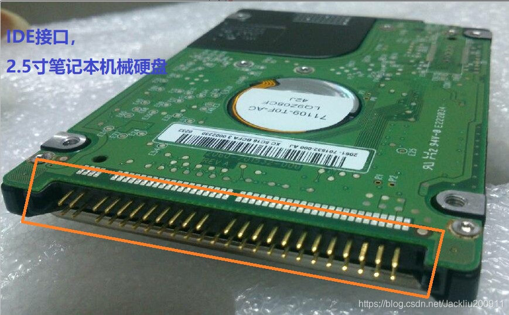
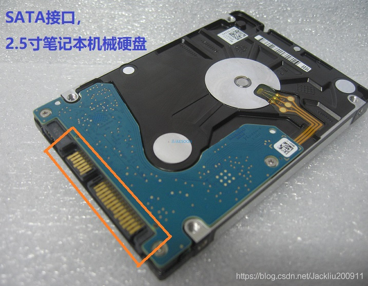
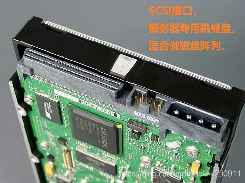
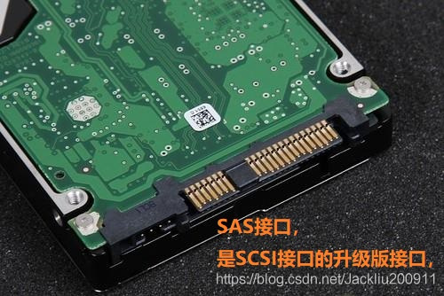

#server/storage

# 磁盘结构

可以看见，硬盘拆开后，里面存在多张磁盘和多个读写磁头，假如一张磁盘有8张磁盘，就会有16个盘面和16个读写磁头了，所有的盘面构成了磁盘组合。

磁盘组合由一个或多个圆盘组成，他们围绕一根中心主轴旋转，圆盘的上下表面涂抹了一层磁性材料，二进制位被存储在这些磁性材料上。其中，0和1在磁材料中表现位不同的模式。

**磁头（head）**

> 主要就是读取磁盘表面**磁方向**和改变其方向，每个盘面有一个磁头，它极其贴近地悬浮在盘面上，但是绝对不与盘面接触，否则会损坏磁头和盘面；

**磁道（track）**

> 磁道是单个盘面上的同心圆，当磁盘旋转时，磁头若保持在一个位置上，则每个磁头都会在磁盘表面划出一个圆形轨迹，这些圆形轨迹就叫做磁道，一个盘面上的磁道可以有成千上万个。相邻磁道之间并不是紧挨着的，这是因为磁化单元相隔太近时磁性会产生相互影响，同时也为磁头的读写带来困难。

**柱面（cylinder）**

> 在有多个盘片构成的盘组中，由不同盘片的面，但处于同一半径圆的多个磁道组成的一个圆柱面。

**扇区（sector）**

> 磁盘上的每个磁道被等分为若干个弧段，这些弧段便是硬盘的扇区（Sector）。硬盘的第一个扇区，叫做引导扇区。扇区是被间隙（gap）分割的圆的片段，间隙未被磁化成0或者1。注意，扇区是读写磁盘最基本的单位，如果一个扇区因为某种原因被破坏，那么整个扇区的数据都会受影响。

*   **磁盘容量的计算**

> Megatron747磁盘是一个典型的vintage-2008的大容量驱动器，它具有以下特性：8个圆盘，16个盘面，每个盘面有65536个磁道，每个磁道（平均）有256个扇区，每个扇区可以存储4096个字节（byte）

Ans：那整个磁盘容量的算法是：

16个盘面，乘以65536个磁道，乘以256个扇区，再乘以4096字节，即16*65536*256\*4096=2^40 byte，也就是1TB的容量。

# 磁盘的电磁原理

## 电磁效应

电流通过导体时，会在导体的周围会产生感应磁场。感应磁场的磁极随电流方向的改变而改变。

## 电磁感应

当闭合电路内的磁场发生变化（磁通量变化）时，闭合电路内会产生感应电动势。即闭合电路内磁场的变化会使电路内产生感应电流。 电流的方向与磁极方向有关。

## 磁头的结构

磁头是一个外面被线圈缠绕着的U型磁芯，可以看出当磁头通电时便会产生磁场，磁场的方向随电流方向的变化而变化。

## 磁盘的结构

磁盘的表面涂有一层磁性物质，在未没有外部磁场影响的情况下，磁盘表面的磁性粒子的磁极方向是不会改变的。一般从未受到外部干扰的磁性粒子磁极方向是随机的，于是出现互相抵消的情况，这时磁盘的表现出无磁极显现。

## 磁盘的写过程

写数据时磁头移到到磁盘要写入的位置，输入电流产生感应磁场。受磁场的影响，磁头下磁性粒子的磁极方向变为与磁场同向。如此通过给磁头不同的电流方向，使得磁盘局部产生不同的磁极，产生的磁极在未受到外部磁场干扰下是不会改变的。如此便将电信号持久化到磁盘上（当然并不是一个磁极方向代表1另一个代表0）.

## 磁盘的读取

读取磁盘信息时，不通电的磁头在写入数据的位置上移动，上面可知数据在磁盘上就是一些磁极方向不同的微小局部区域，由于各个域的磁极方向不完全同，所以磁头在通过这些不同方向的区域时会产生不同方向的感应电流，这些微弱正负脉冲经过驱动的去噪扩大成为内存中的二进制数据。

在硬盘读写时，读操作是远快于写操作的，而且读/写操作具有完全不同的特性，所以目前的硬盘一般都分离出读和写两个磁头，但原理还是不变的。

> 绝命毒师第五季第一季中，记录着老白制毒过程的笔记本电脑被警方获得并放到了物证室里。老白利用电磁效应，在物证室外弄了一个大‘磁铁’破坏了笔记本里面的数据，就是上面的原理。

## 磁盘读写耗时

**磁盘读写时耗 = 寻道时间 + 旋转延迟时间 + 操作时耗**

**寻道时间：** 读写数据时磁头首先要移到到指定磁道（柱面），这段时间称为寻道时间

**旋转延迟时间：** 当磁头移动到指定磁道后，需要等待要操作的扇区旋转到磁头的下方，这段时间称为转延迟时间

**操作时耗：** 磁头进行读写操作花费的时间

# 机械硬盘接口类型

## IDE接口

IDE（Integrated Drive Electronics，电子集成驱动器），包括PIO(Programming I/O)和DMA(Direct Memory Access) 两种传输模式。
ATA（Advanced Technology Attachment，高技术配置），ATA本身可以支持串行或并行。最快的并行ATA(即ATA/133)所能达到133MB/sec，现在市场上几乎没有IDE接口的硬盘了。 &#x20;
IDE接口的硬盘价格低廉、兼容性强、性价比高。但是，数据传输速度慢、线缆长度过短、连接设备少、不支持热插拔、接口速度的可升级性差。

## SATA接口

SATA（Serial ATA，串行ATA，Serial Advanced Technology Attachment），速度比IDE接口更快，SATA不依赖系统总线的带宽，而是内置时钟频率，支持热插拔。SATA 3.0最大的改进之处，就是将总线最大传输带宽提升到6Gbps，实际传输速度大约600MB/S（理论为6Gbps/8=768MB/S) &#x20;

现在市场上大部分机械硬盘接口几乎都是SATA。虽然SATA具备了热插拔的规范，但连接缆线多是设计给内接式硬盘使用，最大插拔次数仅约200次，超过此插拔数目，缆线接头便会劣化，甚至有可能造成硬盘的损坏。 &#x20;

SATA与并行ATA的不同并行ATA数据线由80根线组成，非常宽；SATA数据线仅有7根弦，较窄，不会影响机箱内部散热风流。SATA数据线最远传输距离可达1米，更有利于机箱内部走线，保障系统散热。

## SCSI接口

SCSI（Small Computer System Interface，小型计算机系统接口），使用50针接口，外观和普通硬盘接口有些相似。用在服务器上面比较多，速度快，稳定性很好，比较**适合做磁盘阵列**。          &#x20;

SCSI的进化型是SAS（Serial Attached SCSI，串行SCSI），而SCSI并不是专门为硬盘设计的接口，是一种广泛应用于小型机上的高速数据传输技术。SCSI接口具有应用范围广、多任务、带宽大、CPU占用率低，以及热插拔等优点。

## SAS

&#x20;SAS（Serial Attached SCSI，串行SCSI）是新一代的SCSI技术，和现在流行的Serial ATA(SATA)硬盘相同，都是采用串行技术以获得更高的传输速度，并通过缩短连结线改善内部空间等。SAS是并行SCSI接口之后开发出的全新接口，此接口的设计是为了改善存储系统的效能、可用性和扩充性，并且提供与SATA硬盘的兼容性。

参考：

<https://zhuanlan.zhihu.com/p/89505052>
