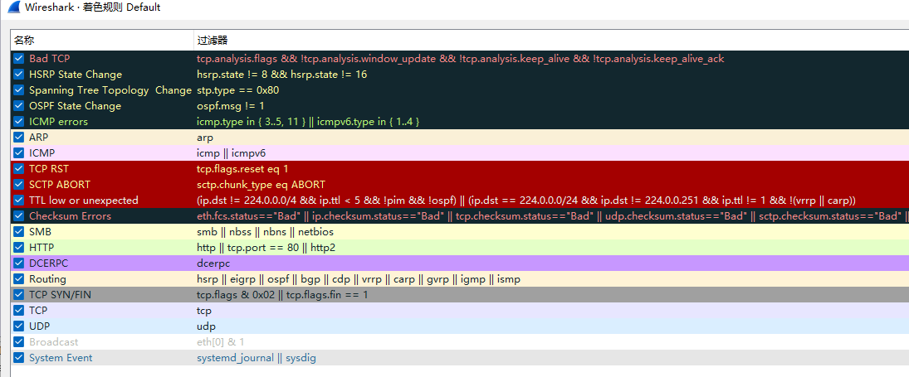

#network 

下载地址：https://www.wireshark.org/

## 过滤语法

wireshark进行过滤时，按照过滤的语法可分为协议过滤和内容过滤。

**wireshark有两种过滤器：**

捕捉过滤器（CaptureFilters）：用于决定将什么样的信息记录在捕捉结果中。  
显示过滤器（DisplayFilters）：用于在捕捉结果中进行详细查找。

### 1.捕捉过滤器

捕捉过滤器的语法与其它使用Lipcap（Linux）或者Winpcap（Windows）库开发的软件一样，比如著名的TCPdump。捕捉过滤器必须在开始捕捉前设置完毕，这一点跟显示过滤器是不同的。

| 语法： | protocol | direction | host | value         | logical operations |
| ------ | -------- | --------- | ---- | ------------- | ------------------ |
| 例子： | tcp      | dst       | host | 8.210.145.225 | and                | 

==protocol（协议）==
```txt
可能的值: ether, fddi, ip, arp, rarp, decnet, lat, sca, moprc, mopdl, tcp and udp.  
如果没有特别指明是什么协议， 则默认使用所有支持的协议。
```

==direction（方向）==
```txt
可能的值: src, dst, src and dst, src or dst  
如果没有特别指明来源或目的地， 则默认使用 "src or dst" 作为关键字。  
例如，"host 10.2.2.2"与"src or dst host 10.2.2.2"是一样的。
```


==host（s）==
```txt
可能的值： net, port, host, portrange.（net跟一个网段、port跟端口、host 跟 IP地址或域名、portrange端口范围，比如80-110端口）  
如果没有指定此值， 则默认使用"host"关键字。  
例如，"src 10.1.1.1"与"src host 10.1.1.1"相同。
```


==logical operation（逻辑运算）==
```txt
可能的值：not, and, or.  
否("not")具有最高的优先级。或("or")和与("and")具有相同的优先级，运算时从左至右进行。  
例如，  
"not tcp port 3128 and tcp port 23"与"(not tcp port 3128) and tcp port 23"相同。  

"not tcp port 3128 and tcp port 23"与"not (tcp port 3128 and tcp port 23)"不同。
```

**例子：**

```bash
# 显示目的TCP端口为3128的封包。
tcp dst port 3128

# 显示来源IP地址为10.1.1.1的封包。
ip src host 10.1.1.1

# 显示目的或来源IP地址为10.1.2.3的封包。
host 10.1.2.3

# 显示来源为UDP或TCP，并且端口号在2000至2500范围内的封包。
src portrange 2000-2500

# 显示除了icmp以外的所有封包。（icmp通常被ping工具使用）
not imcp

# 显示来源IP地址为10.7.2.12，但目的地不是10.200.0.0/16的封包。
src host 10.7.2.12 and not dst net 10.200.0.0/16

# 显示来源IP为10.4.1.12或者来源网络为10.6.0.0/16，目的地TCP端口号在200至10000之间，并且目的位于网络10.0.0.0/8内的所有封包。
(src host 10.4.1.12 or src net 10.6.0.0/16) and tcp dst portrange 200-10000 and dst net 10.0.0.0/8
```

### 2.显示过滤器

通常经过捕捉过滤器过滤后的数据还是很复杂。此时您可以使用显示过滤器进行更加细致的查找。  
它的功能比捕捉过滤器更为强大，而且在您想修改过滤器条件时，并不需要重新捕捉一次。

| 语法： | protocol | string1 | string2 | comparison operator | value    | logical operations |
| ------ | -------- | ------- | ------- | ------------------- | -------- | ------------------ |
| 例子： | ftp      | passive | ip      | ==                  | 10.2.3.4 | xor                | 


==Protocol（协议）==
您可以使用大量位于OSI模型第2至7层的协议。点击"Expression..."按钮后，您可以看到它们。  
比如：IP，TCP，DNS，SSH

==String1, String2== (可选项)：协议的子类。

==Comparison operators （比较运算符）==：可以使用6种比较运算符

| 英文写法 | C语言写法 | 含义     |
| -------- | --------- | -------- |
| eq       | ==        | 等于     |
| ne       | !=        | 不等于   |
| gt       | >         | 大于     |
| lt       | <         | 小于     |
| ge       | >=        | 大于等于 |
| le       | <=        | 小于等于 | 


==Logical expressions（逻辑运算符）==

| 英文写法 | C语言写法 | 含义     |
| -------- | --------- | -------- |
| and      | &&        | 逻辑与   |
| or       | \|\|      | 逻辑或   |
| xor      | ^^        | 逻辑异或 |
| not      | !         | 逻辑非   | 

**例子：**

```bash
# 显示来源或目的IP地址为10.1.1.1的封包。
ip.addr == 10.1.1.1

# 显示来源或目的TCP端口号为25的封包。
tcp.port == 25

# 显示包含TCP标志的封包。
tcp.flags

# 显示包含TCP SYN标志的封包。
tcp.flags.syn == 0x02
```

## 过滤器着色规则




Bad TCP：tcp.analysis.flags && !tcp.analysis.window_update
即TCP解析出错，通常重传，乱序，丢包，重复响应都在此条规则的范围内

HSRP State Change：hsrp.state != 8 && hsrp.state != 16
HSRP即热备份路由协议（Hot Standby Router Protocol），这条规则表示状态非active和standby。

Spanning Tree Topology  Change：stp.type == 0x80
生成树协议的状态标记为0x80，生成树拓扑发生变化。

OSPF State Change：ospf.msg != 1
OSPF（Open Shortest Path First，开放式最短路径优先协议）的msg类型不是hello。

ICMP errors：icmp.type eq 3 || icmp.type eq 4 || icmp.type eq 5 || icmp.type eq 11 || icmpv6.type eq 1 || icmpv6.type eq 2 || icmpv6.type eq 3 || icmpv6.type eq 4
ICMP协议错误，协议的type字段值错误

ARP：arp：即ARP协议

ICMP：icmp || icmpv6：即icmp协议

TCP RST：tcp.flags.reset eq 1：TCP流被RESET。

SCTP ABORT：sctp.chunk_type eq ABORT ：串流控制协议的chunk_type为ABORT（6）。

TTL low or unexpected：( ! ip.dst ：TTL异常。

Checksum Errors：eth.fcs_bad ：
条件中的各类协议的checksum异常，在PC上抓包时网卡的一些设置经常会使Wireshark显示此错误。


