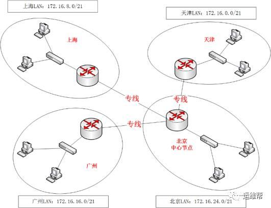
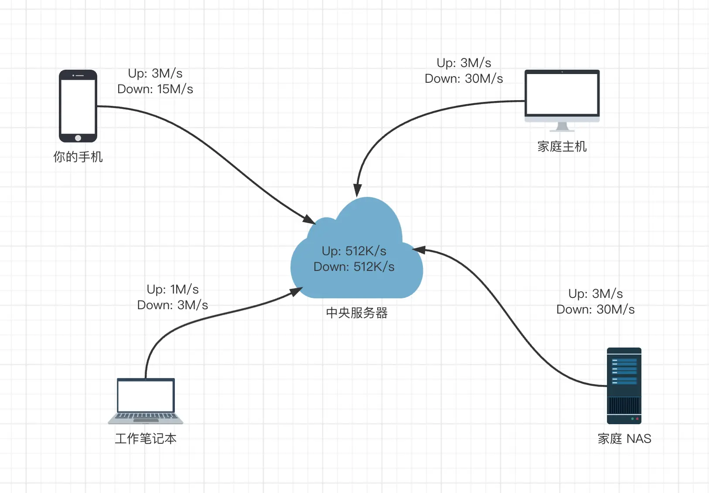
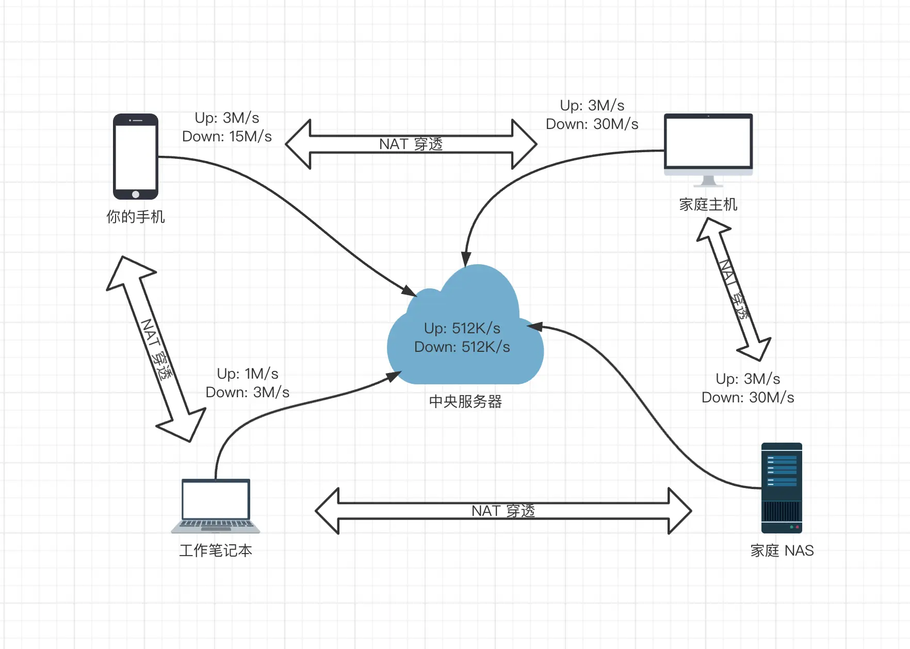

#network 

# 一、专线

“专线”顾名思义，就是搭建专属线路。如下方拓扑图所示，就需要租用3条专线，分别是从北京到天津、北京到广州、北京到上海的3条线路，从北京总部到3个分部使用路由器连接。

此种方式稳定可靠，但是可想而知，其价格也是异常昂贵，这相当于组建了一个跨地区的大型局域网，以上图所示的四地为例，一年10M的专线费用就超过三十万。

# 二、传统VPN组网

在图中，各单位都先连接到Internet，此时各部门机器都可以通过路由器访问Internet。如果要实现各分支机构互相访问，在路由器上配置“VPN路由”即可。

不过此种方式需要昂贵的网络设备支持，网管选择的传统的VPN组网设备，一台价格就要四千余元。价格高昂的同时，各个分厂还需要专业人员布置和维护网络。

参考：[openVPN](../开源项目/openVPN.md)

# 三、内网穿透（打洞）

传统VPN组网模式，流量都会经过中央服务器中转, 这时网络连接速度取决于中央服务器带宽和速度;
内网穿透可以实现P2P模式，在这种拓扑下, 两个设备之间的通讯速度已经不在取决于中央服务器, 而是直接取决于两端设备的带宽, 也就是说达到了设备网络带宽峰值. **当然 NAT 穿透也不是百分百能够成功的, 在复杂网络情况下有些防火墙不会按照预期工作或者说有更严格的限制;** 比如 IP、端口、协议限制等等, 所以为了保证可靠性可以让中央服务器中转做后备方案, 即尽量尝试 NAT 穿透, 如果不行走中央服务器中继.

打洞原理参考：[NAT 概述](NAT%20概述.md)

## frp 

参考：[frp](../开源项目/frp.md)

## headscale

参考：[headscale](../开源项目/headscale.md)

## openwrt

参考：[openWRT](../开源项目/openWRT.md)