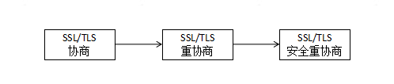
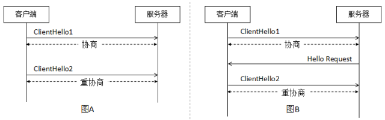
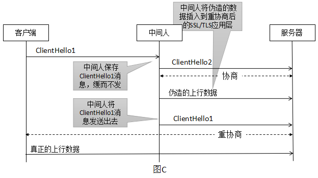
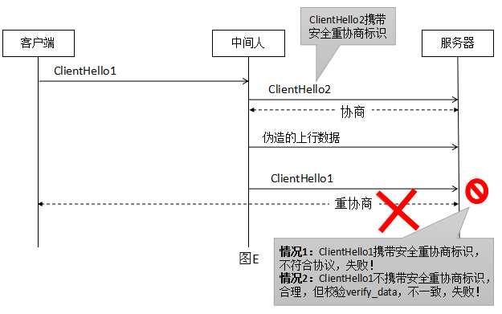

## SSL/TLS默认重协商漏洞

### 2.1 重协商介绍



在SSL/TLS协议中, 协商是指通信双方客户端和服务器, 选取相同算法、传递数字证书、互验对方身份、交换共享密钥等一系列的动作.  重协商是指在已经协商好的SSL/TLS TCP连接上重新协商, 用以更换算法、更换数字证书、重新验证对方身份、更新共享密钥等.  SSL/TLS协议本身支持重协商, 且RFC文档建议SSL/TLS实现(指OpenSSL等库)也应该默认支持重协商.

重协商包括两种方式, 分别如图A和B .



‍

- 图A是客户端主动发送分ClientHello2进行重协商.
- 图B是服务器通过发送Hello Request消息, 请求客户端发起重协商. 如果客户端同意重协商, 则才会发起ClientHello2.

　　不管是哪一方发起重协商, 如果接收方不同意的话, 都会通过SSL Alert响应以拒绝重协商.

‍

### 2.2 中间人介绍

所谓中间人, 通常可能有如下三种形式:

1. 伪造ARP消息, 对局域网内用户流量进行重定向, 令其所有流量都通过中间人中转, 从而中间人有机会对流量的内容进行监视或篡改.

2. 伪造DNS消息, 对互联网用户访问指定网站的流量重定向, 令其与该网站之间的流量都通过中间人中转, 从而中间人有机会对该网站相关的流量内容进行监视或篡改.

3. 企业网关、企业防火墙、电信运营商GGSN/PGW网关设备等, 用户的流量必须经过这些设备才能正常上网.

### 2.3 重协商安全漏洞原理



1. 客户端首先发出一个ClientHello1,，客户端期待进行首次协商。（注意：客户端认为ClientHello1是首次协商）。

2. 中间人收到ClientHello1之后，按理说它应该将其转发给服务器。但是中间人这时决定“作恶”，将ClientHello1缓存起来暂不转发。中间人自己构造一个ClientHello2,对其

　　服务器发起首次协商，协商好后中间人将精心伪造的数据发送给服务器。（注意：服务器认为ClientHello2是首次协商）

3. 服务器收到这些数据，会认为这是正常的数据。因为服务器的APP程序通常需要处理黏包，所以中间人如果了解APP协议（如HTTPS）的话，则会精心构造不完整的数据，

　　让服务器的APP程序认为发生黏包，将数据暂缓不处理，继续等到后续的数据上来。

4. 这时中间人调出暂缓的ClientHello1，将其在同一个SSL/TLS TCP连接中，发送给服务器。（注意：ClientHello1消息本身是加密的，因为其实在ClientHello2协商好后的加密

　　SSL/TLS连接中传输）。

5. 服务器收到ClientHello1后，认为这是一次重协商，协商好后，客户端发送真正的数据给服务器。

6. 服务器的APP程序，收到客户端的真正数据后，将其与之前缓存的中间人精心构造的数据粘合起来，进行业务处理。从而，中间人在不需要劫持、解密SSL/TLS连接情况下，成功地将自己伪造的数据插入到用户真正数据之前。这个安全漏洞可以做好多漏洞：比如伪造一个HTTP GET消息，然后用HTTP的IGNORE字段屏蔽掉真正数据的HTTP GET头，但是却保留了用户的Cookie信息，从而利用用户cookie去访问网站内容，比如可能利用此法删掉用户之前发的帖子等。

这个漏洞成因在于，客户端认为的首次协商却被服务器认为是重协商，以及首次协商和重协商直接缺少关联性。RFC 5746引入明确首次协商与重协商的方法，以及确认首次协商和重协商的关联校验，从而确保中间人的攻击行为可以被识别并拒绝，保证重协商安全。


1. 客户端发起ClientHello1.
2. 中间人缓存ClientHello1，精心构造ClientHello2，与服务器进行首次协商。这里假设中间人在ClientHello2中不携带安全重协商标识。
3. 中间人与服务器协商成功，发送伪造的数据给服务器。
4. 中间人将之前缓存的ClientHello1发送给服务器。
5. 如果服务器禁止重协商，则这时看到ClientHello1，会认为发生了重协商，不允许，所以中断连接。



1. 客户端发起Clienthello1.
2. 中间人缓存Clienthello1,精心构造ClientHello2，与服务器进行首次协商。这里假设中间人在ClientHello2中携带支持安全重协商标识。
3. 中间人与服务器协商成功，发起伪造的数据给服务器。在这时，因为双方都支持安全重协商，所以服务器会要求中间人将服务器发送的Fininsh消息找那个

　　的首次协商会话摘要信息记录下来，以便重协商时再带给服务器；当然，服务器自己也会将这个首次协商会话摘要信息记录到自己内存中。

4. 中间人将之前缓存的ClientHello1发送给服务器。

5. 如果服务器禁用不安全的重协商，但是允许安全的重协商，且如果ClientHello1中支持安全重协商。则按照RFC 5746是不合理的，只有首次协商ClientHello才允许

　　带有支持安全重协商标识，重协商阶段的ClientHello是不允许携带该标识的。所以，服务器认为可能是遇到攻击，中断连接。

6. 如果服务器禁止不安全的重协商、但允许安全的重协商，且如果ClientHello1中不携带支持安全重协商标识，则服务器会认为这是正常的重协商。然后，服务器会提取出前边第三步中记录的首次协商会话摘要信息，按照RFC 5746，ClientHello1中应该带有相同的这个首次协商会话摘要信息。但是，一方面客户端的ClientHello1是不可能带有这个信息的，所以服务器校验失败；另一方面，如果中间人将这个信息插入给ClientHello1，那么虽然服务器现在校验成功，但是后续服务器校验协商会话完整性时还是会失败。

‍

‍

## 检测服务器是否开启重协商功能（用于CVE-2011-1473漏洞检测）

```bash
openssl s_client -connect 172.31.0.22:443

-----
HEAD / HTTP/1.0
R
```

SSL握手完成后，输入HEAD / HTTP/1.0，然后回车，输入‘R’触发重协商，此时服务器报错并断开连接：说明服务器重协商功能被关闭。

‍

使用和上方所述相同的操作，发送‘R’触发重协商，可以看到重协商成功，连接正常，此时再次发送HEAD / HTTP/1.0 ，敲两次回车，得到服务器响应400。说明服务器重协商功能开启。

‍
