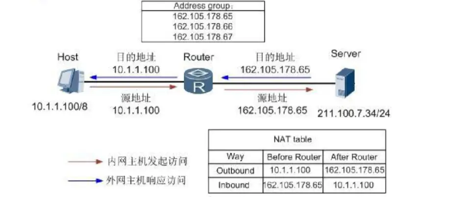

#network 

NAT  Network Address Translation，网络地址转换

众所周知，IPv4的公网IP地址已经枯竭，但是需要接入互联网的设备还在不断增加，这其中NAT就发挥了很大的作用（此处不讨论IPv6）。NAT服务器提供了一组私有的IP地址池（10.0.0.0/8、172.16.0.0/12、192.168.0.0/16），使得连接该NAT服务器的设备能够获得一个私有的IP地址（也称局域网IP/内网IP），当设备需要连接互联网的时候，NAT服务器将该设备的私有IP转换成可以在互联网上路由的公网IP（全球唯一）。NAT的实现方式有很多种，这里我们主要介绍三种：**静态NAT**、**动态NAT**和网络地址端口转换（**NAPT**）。

## 静态 NAT

静态NAT：LVS的官方文档中也称为(N-to-N mapping)  ，前面的 N 指的是局域网中需要联网的设备数量，后面的 N 指的是该 NAT 服务器所拥有的公网IP的数量。既然数量相等，那么就可以实现静态转换，即一个设备对应一个公网IP，这时候的NAT服务器只需要维护一张静态的NAT映射转换表。

## 动态 NAT

动态NAT：LVS的官方文档中也称为(M-to-N mapping)  ，注意这时候的 M>N，也就是说局域网中需要联网的设备数量多于 NAT 服务器拥有的公网IP数量，这时候就需要由NAT服务器来实现动态的转换，这样每个内网设备访问公网的时候使用的公网IP就不一定是同一个IP。

## NAPT 重载

通过使用PAT(NAT重载)，只需使用一个公网ip地址，就可将数千名用户连接到因特网。其核心之处就在于利用端口号实现公网和私网的转换。 

面对私网内部数量庞大的主机，如果NAT只进行IP地址的简单替换，就会产生一个问题：当有多个内部主机去访问同一个服务器时，从返回的信息不足以区分响应应该转发到哪个内部主机。此时，需要NAT设备根据传输层信息或其他上层协议去区分不同的会话，并且可能要对上层协议的标识进行转换，比如TCP或UDP端口号。这样NAT网关就可以将不同的内部连接访问映射到同一公网IP的不同传输层端口，通过这种方式实现公网IP的复用和解复用。这种方式也被称为端口转换PAT、NAPT或IP伪装，但更多时候直接被称为NAT，因为它是最典型的一种应用模式。

