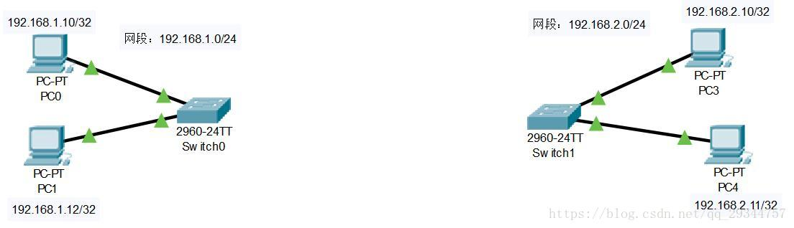
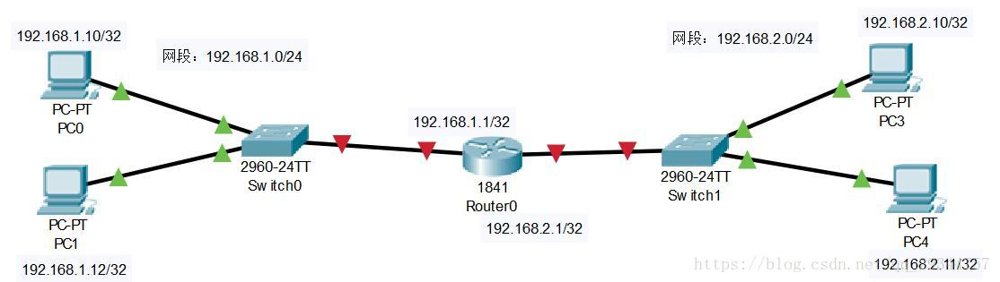
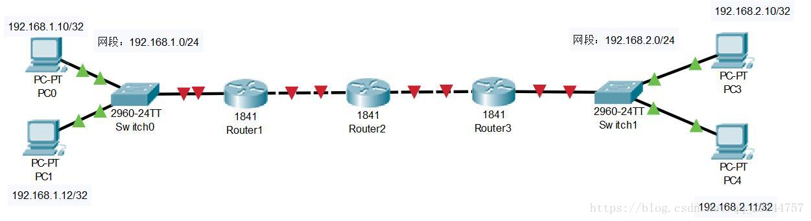

#network 


如下网络拓扑图，交换机0所在的网段为192.168.1.0/24，交换机1所在网段为192.168.2.0/24，且各自有2台主机。假设192.168.1.10/32的PC0要跟192.168.2.11/32的PC4通信，如何实现？



中间就需要一个**路由器**的东西。我们知道，PC0发出的数据包的目的地址是跨网段的，也就是需要出网关。**网关**是数据包进出所在网段的出口。网关地址一般是所在网段的前一两个地址，且网关一般都集成在路由器中，称为**下一跳**。子网中的每一台主机都需要配置好默认网关，即下一跳：PC0的默认网关为192.168.1.1/32、PC4的默认网关为192.168.2.1/32。这样子PC0要发给PC4的数据包会先抵达路由器的192.168.1.1/32地址的网卡，路由器拿到该数据包后，将其从192.168.2.1/32的网卡发送出去。也就是说，路由器在中间负责**中转**数据包。



在下面的拓扑图中，PC0还是要发数据包给PC4，当数据包抵达路由器1时，路由器1并不知道通往PC4的路径，于是需要在路由器1上的路由表上添加路由规则，使其知道应该将数据包发往192.168.2.0/24网段的地址，需要走往哪一个路由器，这里是路由器2。其他路由器同理，直至到目的主机PC4。

网络畅通的条件是有去有回，所以当数据包从PC4返回PC0时，沿途的所有路由器都需要数据包的转法路径，也就是配置好返回的路由，使其知道数据包发往192.168.1.0/24网段的地址需要走往哪一个路由器。

人为添加的路由称之为**静态路由**，但当路由器连接的网段太多时不方便配置静态路由，可以让路由器自行学习得到数据包的下一个中转地址，称之为**动态路由**。



## 路由类型

**主机路由**
主机路由是路由选择表中指向单个IP地址或主机名的路由记录。主机路由的Flags字段为H。例如，在下面的示例中，本地主机通过IP地址192.168.1.1的路由器到达IP地址为10.0.0.10的主机。

```bash
Destination    Gateway       Genmask        Flags     Metric    Ref    Use    Iface
-----------    -------       ---------------   -----     ---       ---    ---    ---   
10.0.0.10     192.168.1.1    255.255.255.255   UH         0         0      0     eth0

 ```

**网络路由**
网络路由是代表主机可以到达的网络。网络路由的Flags字段为N。例如，在下面的示例中，本地主机将发送到网络192.19.12的数据包转发到IP地址为192.168.1.1的路由器。

```bash
Destination    Gateway       Genmask          Flags    Metric    Ref     Use    Iface
-----------    ----------    -------------    -----    -----     ---     ---    ----  
192.19.12     192.168.1.1    255.255.255.0     UN       0         0       0     eth0
```

**默认路由**
当主机不能在路由表中查找到目标主机的IP地址或网络路由时，数据包就被发送到默认路由（默认网关）上。默认路由的Flags字段为G。例如，在下面的示例中，默认路由是IP地址为192.168.1.1的路由器。

```bash
Destination    Gateway       Genmask     Flags     Metric    Ref    Use    Iface
-----------   -----------    -------     -----     ------    ---    ---    -----
default       192.168.1.1    0.0.0.0      UG         0        0      0     eth0
```


# route命令

> route命令用于显示和操作IP路由表,要实现两个不同的子网之间的通信,需要一台连接两个网络的路由器,或者同时位于两个网络的网关来实现,在Linux系统中,设置路由通常是 为了解决以下问题,该Linux系统在一个局域网中,局域网中有一个网关,能够让机器访问Internet,那么就需要将这台机器的IP地址设置为 Linux机器的默认路由.

```bash
[root@192 ~]# route
Kernel IP routing table
Destination      Gateway         Genmask         Flags  Metric Ref   Use     Iface
default             192.168.130.2   0.0.0.0            UG     0         0       0       ens33
link-local           0.0.0.0         255.255.0.0         U       1002    0       0       ens33
192.168.130.0   0.0.0.0         255.255.255.0     U        0         0       0       ens33
192.168.140.0   0.0.0.0         255.255.255.0     U        0         0       0       ens33
-------------   ----------      -------------  ---   -----  --     ---     -----
目标网段或者主机  目标网段或者主机    网络掩码   标记  路由距离       该路由表项对应的输出接口
```

标记说明

| Flags | 说明                                                  |
| ----- | ----------------------------------------------------- |
| U     | 该路由是启动的                                        |
| H     | 目标是一部主机 (IP) 而非网域（ `主机路由` ）          |
| G     | 需要透过外部的主机 (gateway) 来转递封包（`网络路由`） |
| R     | 使用动态路由时，恢复路由资讯的旗标；                  |
| D     | 已经由服务或转 port 功能设定为动态路由                |
| M     | 路由已经被修改了                                      |
| ！    | 这个路由将不会被接受(用来抵挡不安全的网域！)          |
| A     |                                                       | 


## 1.路由增删改查

```bash
# 添加路由 
route add -net 0.0.0.0/24 gw 10.0.0.103 

#删除路由
route del -net 0.0.0.0/24 gw 10.0.0.103 
```

