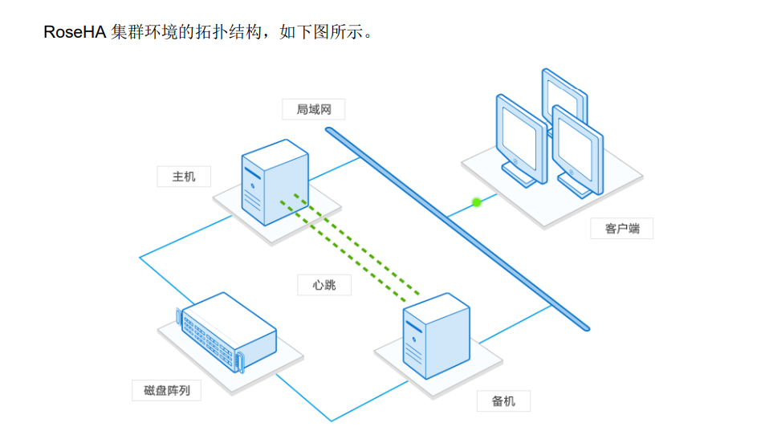

#cluster/RoseHA

RoseHA是基于共享存储的高可用集群产品，实时监测应用资源运行状态，资源发生故障时自动切换，解决软、硬件的单点故障，保障业务系统7*24不间断。



如上图所示，RoseHA 集群方案，硬件拓扑为两台硬件服务器 A、B，以及一台磁盘阵列。 硬件服务器 A、B 分别按照相同的方式部署相同版本的操作系统和应用服务。确认主服务器 A 和备 用服务器 B 上应用服务分别能够正常启动、停止、运行之后，然后在主、备服务器上部署配置 RoseHA 集群软件，以实现 RoseHA 保护应用服务连续工作。RoseHA 集群中，其中一台服务器运行应用服务， RoseHA 实时监控应用资源状态，如应用资源出现异常故障，另一台备用服务器将自动接管应用服务。

## 硬件和系统环境准备

==1. 操作系统配置准备==
1. 两台服务器安装部署完全相同版本的操作系统，RoseHA可以安装在Redhat7/8、CentOS7/8等发行版中。
2. 分别设置不同的主机名。（ha-01、ha-02）

==2. 网络配置==
1. 手动配置每台服务器网卡静态IP。

	| 服务器名 | 网卡1 (业务) | 网卡2 (心跳) |
	| ------- | ------ | ---------- |
	| ha-01 | 10.0.0.10 | 192.168.93.10 |
	| ha-02 | 10.0.0.20 | 192.168.93.20 |
TCP：7320;7330;9999;8443; 
UDP：心跳通信端口：（创建配置心跳时指定，默认为 UDP：3000,3001...） 
ICMP：开放所有网络接口的 ICMP（ping）数据包

==3. 集群磁盘列阵准备==

建议磁盘阵列创建 2 种类型的磁盘，其中 1 种磁盘作为存储应用数据的**共享磁盘**，另 1 种磁盘作为 集群的**仲裁磁盘**。
【注意】共享磁盘的“挂载点”未被其他分区挂载使用；取消操作系统启动时自动挂载应用数据共 享磁盘的设置。

## 应用服务部署
1. 在服务器A上将共享磁盘mount到指定目录，应用服务部署到共享磁盘中。
2. 在服务器A上，停止应用服务，关闭应用自动启动，再umount卸载共享磁盘。
3. 在服务器B上将共享磁盘mount到指定目录，启动应用服务，确认是否可以正常访问。

【注意】针对 Oracle 数据库，需要将数据文件、控制文件、归档日志文件等数据和配置类文件均存 放在共享存储中。


## RoseHA 安装
1. 以root账户登录系统，将RoseHA安装包上传至/opt，解压
2. 进入解压目录，执行install
3. 选择安装全部组件，选择3
4. 指定安装路径和配置信息
5. 安装完成会自动启动RoseHA服务
	```bash
	# 手动启动
	clusterd start ; rwebd start
	```
